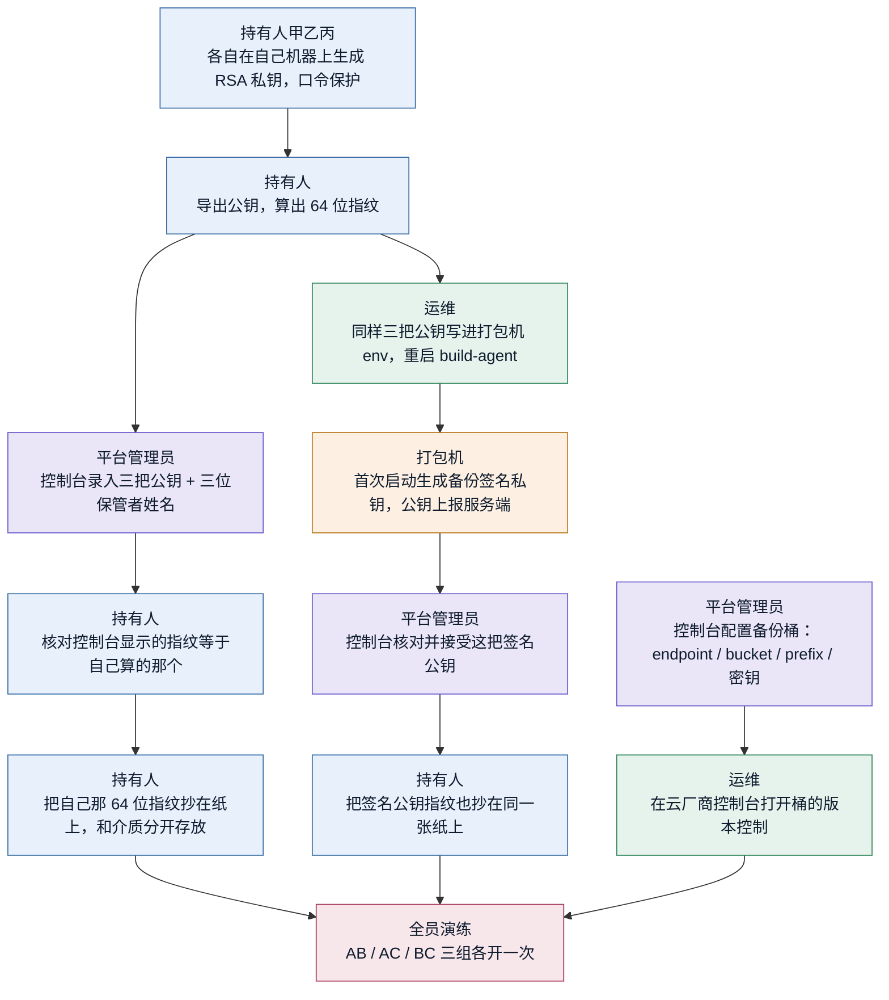
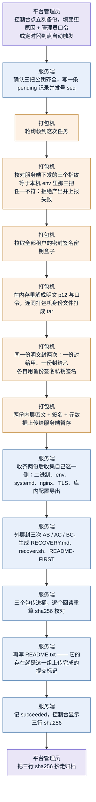
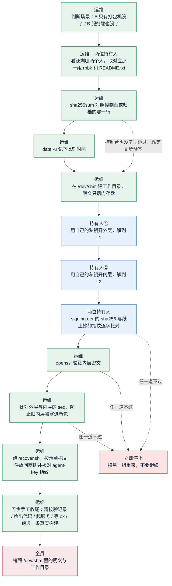

# 打包服务备份与恢复：全流程与分工

配套设计：[`docs/design/platform-backup-recovery-2026-09-15.md`](design/platform-backup-recovery-2026-09-15.md)。
设计文档说的是**为什么这么做**，这一份说的是**每一步谁做什么**，灾难当天照着走。

要防的只有一件事：**打包机硬盘坏了，数据库里每个租户的签名密钥都还在，但再也没有东西能解开它们**
——App 从此发不出能升级的新版本（换签名证书等于 Android 认作另一个 App）。

门限是 **2-of-3**：三个人各拿一把恢复私钥，任意两个人凑到一起能开，一个人单独拿到包什么都读不到。
没有降级模式——只剩一个人时打不开，这是设计选的，不是缺陷。

## 0. 六个角色

| 角色 | 是谁 | 在流程里负责 |
|---|---|---|
| **持有人甲 / 乙 / 丙** | 三个真人，各自保管一把恢复私钥 | 生成私钥、保管介质与口令、恢复当天到场开包 |
| **平台管理员** | 有控制台登录口令的人 | 在控制台录公钥、配桶、触发备份、归档 sha256 |
| **运维** | 有机器 shell 的人 | 写 env、开桶版本控制、恢复当天操作机器 |
| **服务端** | `rn-server` | 发号、外层封装、上传、回读校验、记账 |
| **打包机** | `build-agent` | 解开密钥盒子、内层封装、签名 |
| **云存储** | 对象存储桶 | 存三个包和三份 README |

**私钥从头到尾不经过任何一台服务器。** 服务端和打包机只见得到公钥。

## 1. 阶段一：配置（一次性，但它决定了灾难当天能不能恢复）

| # | 谁 | 做什么 | 不做会怎样 |
|---|---|---|---|
| 1 | 持有人甲乙丙 | 各自在**自己的**机器上 `openssl genpkey` 生成 RSA 私钥，设一个口令。私钥文件不交给任何人 | 私钥只要经过一台服务器，攻破那台机器的人就能开包，2-of-3 归零 |
| 2 | 持有人 | 导出公钥，算出指纹（DER SPKI 的 SHA-256，64 位小写 hex）。**只有公钥交出去** | — |
| 3 | 平台管理员 | 控制台「平台备份 → 恢复公钥槽位」逐个槽位粘贴公钥、填保管者姓名，保存 | 三把没齐，「立刻备份」直接被拒——不会产出一个开不了的包 |
| 4 | 持有人 | 核对控制台上显示的指纹和自己第 2 步算出来的**逐字一致** | 粘错一把公钥，那一组就封给了不存在的人，且只在灾难当天才发现 |
| 5 | 持有人 | 把自己那 64 位指纹**抄在纸上**，与介质分开存放 | 纸是唯一不在包里的东西。包里的一切（包括包里印的指纹）攻击者都能改，纸不能 |
| 6 | 运维 | 把**同样三把公钥**写进打包机的 `BACKUP_RECIPIENT_A/B/C`，重启 build-agent | 打包机不接受服务端下发的公钥本体，两边对不上就拒绝产出（见阶段二第 4 步） |
| 7 | 打包机 | 首次启动生成备份签名私钥，把公钥上报服务端（首次自动登记，之后换了要人工接受） | — |
| 8 | 平台管理员 | 控制台核对签名公钥指纹并接受 | 没登记，服务端拒绝封包——包里就没有「是我们产出的」这个证明 |
| 9 | 持有人 | 把签名公钥指纹也抄在同一张纸上 | 恢复当天没有基准可对，验签就成了自证 |
| 10 | 平台管理员 | 控制台配置备份桶（endpoint / bucket / prefix / AK / SK）。**编辑桶不需要管理员口令，只要填变更原因** | — |
| 11 | 运维 | 去云厂商控制台**打开桶的版本控制** | 代码只能检测、不能替你打开。没开版本控制，一次误删或覆盖就没有第二份 |
| 12 | 全员 | 配完**立刻演练一次**：AB、AC、BC 各开一遍，每个人各自独立取介质、独立输口令 | 只验一组的话，另外两个人的私钥可能从一开始就是错的，而你会在最需要它的那天才发现 |

## 2. 阶段二：备份（每次触发都走这条，全自动）

| # | 谁 | 做什么 | 为什么这一步在这 |
|---|---|---|---|
| 1 | 平台管理员 / 定时器 | 控制台侧边栏「立刻备份」，填**变更原因**和**管理员口令**；或按计划自动触发 | 产出物是全平台签名密钥，会话 cookie 之外再要一次口令 |
| 2 | 服务端 | 先查三把公钥齐不齐，再写 pending 并发 `seq`；同一时刻只允许一次在飞 | 公钥不齐就产出，等于产出一堆没人能开的字节 |
| 3 | 打包机 | 轮询领取。打包机只出不进，所以「立刻备份」必然是异步的 | 服务端连不上打包机，这是架构约束不是实现偷懒 |
| 4 | 打包机 | **逐个比对指纹**：服务端下发的三个 vs. 本机 env 里那三把。不一致就整次失败 | 这是防「服务端被攻破」的那一道：攻击者改不了密钥最终封给谁 |
| 5 | 打包机 | 取回全部租户的密封盒子（含孤儿与软删租户） | 少装一个租户的密钥，那个 App 就永远发不出新版本 |
| 6 | 打包机 | **只在内存里**解成明文 `.p12` + 口令，立刻打进 tar。任一租户解不开则整次失败 | 这是全链路唯一让全平台密钥同时明文存在的地方。一个静默少了某租户密钥的包比没有备份更危险——它看起来是成功的 |
| 7 | 打包机 | 同一份明文封两次（给甲、给乙），各自用备份签名私钥对密文签名 | 签名是「这是我们产出的」第二道锚。AB 与 AC 共用封给甲的那一份内层 |
| 8 | 打包机 | 上传两份内层密文 + 签名 + 元数据到服务端暂存 | 服务端从头到尾拿不到内层明文 |
| 9 | 服务端 | 收齐两份后收集自己这一侧：`rn-server` 二进制、`rn-foundation.env`、systemd、nginx、TLS，以及租户/域名/打包配置/图标/发布身份的导出 | 目标机器上没有 Go 工具链，所以收正在跑的那个二进制本身 |
| 10 | 服务端 | 外层封三次，生成 `RECOVERY.md`、`recover.sh`、`README-FIRST.txt` | 恢复说明跟着包走——控制台没了也知道怎么用 |
| 11 | 服务端 | 上传后**从桶里回读重算 sha256**，对不上整次失败 | 截断的上传会留下一个短对象，而库里记着完整包的哈希、控制台全绿，直到灾难当天才发现 |
| 12 | 服务端 | 顺序固定：先 `.rnbk` 后 `.README.txt` | README 的存在 = 这一组完整。只有半个包时不会有 README 骗人 |
| 13 | 服务端 | 记 `succeeded`，控制台列出三组的 sha256 与大小 | — |
| 14 | 平台管理员 | 把三行 sha256 抄进工单/密码库归档 | 这是灾难当天验真的第一道锚。服务端也没了时，它就是唯一的外部基准 |

## 3. 阶段三：恢复（灾难当天，两个人到场）

| # | 谁 | 做什么 | 说明 |
|---|---|---|---|
| 1 | 运维 | 判断场景：**A** 打包机没了、库和服务端还在（最常见）；**B** 服务端也没了，先立服务端再走 A | 数据库本身不在本方案范围内 |
| 2 | 运维 + 两位持有人 | 看还剩哪两个人，取对应那一组：甲乙→`AB`、甲丙→`AC`、乙丙→`BC`，连同同名 `.README.txt` | 三个包内容相同，只是锁的组合不同 |
| 3 | 运维 | `sha256sum` 对照控制台那一行或归档值 | 控制台也没了就跳过，靠第 9 步的签名验真 |
| 4 | 运维 | `date -u` 记下此刻时间 | 第 12 步要靠它判断校验记录是新写的还是灾难前的旧记录 |
| 5 | 运维 | 工作目录建在 `/dev/shm`（内存盘） | 解出来的是全平台签名密钥明文，SSD 上 `rm` 不等于擦除 |
| 6 | **持有人①** | 用自己的私钥 + 口令开**外层**，解到 `L1` | 谁是外层，`README-FIRST` 第二行和 `manifest.pair` 都写着 |
| 7 | **持有人②** | 用自己的私钥 + 口令开**内层**，解到 `L2` | 外层内层封给不同的人——**这一步必须换个人操作**，这就是「两个人才能开」在操作上的样子 |
| 8 | 两位持有人 | `signing.der` 的 sha256 与纸上抄的签名公钥指纹逐字比对 | 纸是唯一的外部基准。包里印的那份攻击者能改 |
| 9 | 运维 | `openssl pkeyutl -verify` 验内层密文的签名 | 只有拿到备份签名私钥的打包机能产出这个签名 |
| 10 | 运维 | 比对外层 manifest 与内层 meta 的 `seq` | 防拼接：内层 `seq` 在签名覆盖的密文里面，改不了。旧内层塞进新包时两层 MAC 都会通过，只有 `seq` 能看出来 |
| 11 | 运维 | 跑 `recover.sh <工作目录> <指纹>`。它按清单放回文件、`daemon-reload`、核对 `build-agent show-key` 的指纹 | 任一道校验不过脚本就 `die`，没有「仍然继续」这个选项 |
| 12 | 运维 | 脚本不替你做的五步：① `DELETE FROM app_configs WHERE config_key='build.keystore.check'` ② 按 `source-remote.txt` 检出 RN-App ③ `systemctl start rn-build-agent` ④ 等每个租户出现晚于第 4 步那个时刻的 `ok` ⑤ 跑通一条真实 APK 构建并入库 | 前两步要连数据库、要人判断；**做到第 ⑤ 步才算恢复完成** |
| 13 | 全员 | 销毁 `/dev/shm` 里的明文与整个工作目录 | 它不该在那台机器上多留一秒 |

### 场景 B 额外的前置（服务端也没了）

由运维在第 11 步的脚本里回答 `yes` 触发放回，随后：

1. 域名 DNS 指回来 → `systemctl start rn-foundation-server` → `nginx -t && systemctl reload nginx`
2. 验主密钥：`POST /v1/admin/release-storage/test` 期望 `{"ok":true}`
   ——**不要**用 `GET /ota/signing-key` 代替，它从不解密，钥匙错了照样 200
3. 验租户解析：带 `Host: <租户域名>` 请求 `/v1/mobile/bootstrap` 期望 200
4. 回到上表第 12 步

端口是 `13080`（应用只听 127.0.0.1，443 在 nginx），鉴权走 `x-admin-key`，403 先查 `ADMIN_API_ALLOWED_IPS`。
包里有 `ADMIN_PASSWORD_HASH` 但**没有明文口令**，那是有意的——别指望登录控制台来做这一步。

## 4. 三个包，谁和谁能开

| 对象 | 外层封给 | 内层封给 | 谁和谁一起开 |
|---|---|---|---|
| `<seq>-AB.rnbk` | 乙 | 甲 | 甲 + 乙 |
| `<seq>-AC.rnbk` | 丙 | 甲 | 甲 + 丙 |
| `<seq>-BC.rnbk` | 丙 | 乙 | 乙 + 丙 |

**这一组开不了就换一组**：某把私钥忘了口令、介质坏了，直接去开另外两组里还能凑齐的那个。
`README-FIRST.txt` 上印着另外两个包的名字，就是为了这一刻。

## 5. 最容易踩的三个坑

1. **别在 `agent-key` 放到位之前启动打包机。** 它找不到身份文件会**静默生成一把新的**，
   而 `recover.sh` 放文件时看到目标已存在会问要不要覆盖、默认不覆盖——真正那把就这样被跳过，
   机器带着新钥匙起来，库里每个租户的盒子永远打不开。**灾难由恢复流程自己制造出来**，日志里看不出区别。
   `BUILD_AGENT_STATE_DIR` 必须显式写死，默认值是从 workspace 推导的。

2. **纸上那两行指纹是整条链路唯一的外部基准。** 恢复公钥指纹（每人自己那行）和备份签名公钥指纹。
   包里印的一切都在攻击者的改写范围内。

3. **演练的判据是「每个人各自独立取出自己那份、独立输入口令成功」**，不是「包最后开了」。
   口令丢失会一直静默到真出事那天。每人两份介质、两个物理位置、两份口令不共用同一条密码库记录。

## 6. 真实路径以包里那份为准

`README-FIRST.txt` 和 `RECOVERY.md` 带的是**产出那一刻**的真实路径与文件清单。
本文档描述流程，包里那两份描述那一次的事实——冲突时以包里的为准。
