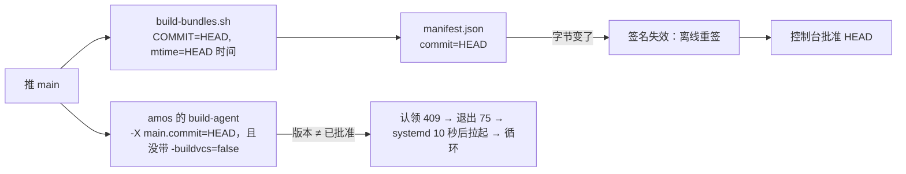

# 打包机版本只跟打包机的构建输入走：只改服务端不再重签（2026-09-25）

## 0. 结论

打包机程序的版本号（编进二进制的 `main.commit`、清单里的 `commit`、归档的 mtime）现在取 **HEAD**，于是每推一次
RN-Server——哪怕只改了一行服务端代码——安装包的字节都变，平台管理员就得离线签一次清单、再批准一次，期间
amos-builder 领不到任务。2026-09-25 一天签了 22、23、24 三次，三次里只有一次动了打包机相关的代码。

改成：**版本号取「打包机构建输入最后一次变化的提交」**（下称 agent 提交）。实测：09-24 05:34 的 `4280f1f`
之后打包机的构建输入一次都没变过，**序号 20–24 五次签名全都是白签**。只改服务端时 agent 提交不变，
build-bundles.sh 本来就可复现，于是清单逐字节相同、已有的签名继续有效、已批准的版本继续有效，amos-builder 不重启。
另外两件顺手的事：

- Linux 打包机收到「先升级」时**原地等待**，不再每 10 秒退出一次让 systemd 拉起（2026-09-25 从 08:25 到 09:17
  重启了 299 次，CI 却是绿的）。
- `internal/store` 的库测自己跑迁移，不再依赖 `internal/api` 的用例先把表建好。

## 1. 现状

- 安装包本身已经可复现：`-trimpath`、`-buildvcs=false`、tar 固定顺序/属主/mtime、`gzip -n`。同一提交、同一 Go 版本
  构建出的归档逐字节相同。**变的只有两个输入：提交号与 mtime，而它们都取 HEAD。**
- 服务端按「清单摘要」匹配签名（`bundleSignatureFor`）：库里按提交存，摘要对得上才用。
- CI 给 amos 单独编的那份 build-agent 没带 `-buildvcs=false`，Go 会把 HEAD 写进二进制，所以它每次都不一样，
  也和安装包里 `builder/bin/build-agent` 不是同一份字节。

## 2. 方案

### 2.1 agent 提交怎么算

新脚本 `deploy/setup/agent-commit.sh` 打印 agent 提交：

1. **Go 代码按依赖算，不手写清单**：对安装包里的每个程序在它实际编译的平台上跑 `go list -deps`（根 module 的
   `./cmd/build-agent`、`build-runner` 在 linux/amd64 与 darwin/arm64，`ios-upload`、`upgrade` 只在 darwin/arm64；
   signing module 的 `./cmd/signer`、`./cmd/signer-check` 在 linux/amd64），取仓库内的包。每个包只算**这一层**的
   `.go` 文件（`:(glob)<dir>/*.go`，不递归进子目录）加上它 go:embed 的文件（`signing/apk/axml/framework_attrs.txt`、
   `signing/policy/permissions.json`），整体排除 `_test.go`。删掉一个 `.go` 文件同样会被 `dir/*.go` 匹配到。
   go list 固定 `CGO_ENABLED=0 GOFLAGS='' GOWORK=off`，输出为空就失败。服务端独有的包（`internal/api` 等）不在里面。
2. **非 Go 的输入逐个文件写死**，对着 build-bundles.sh 的 cp / install：`go.mod`、`go.sum`、`signing/go.mod`、
   `signing/go.sum`（依赖版本与 Go 版本都在里面）、`deploy/setup/build-bundles.sh`、`deploy/setup/agent-commit.sh`、
   `deploy/signer/templates/`、`deploy/signer/README.md`、`internal/machinesetup/install.sh`、`deploy/build-agent/` 下
   拷进归档的四个文件、`deploy/build-agent-macos/` 下拷进归档的八个文件。**同目录的运维手册
   （MAC_SETUP_RUNBOOK.md、SIGNING_MATERIAL.md）不算**——第一版按目录收，把一次只改手册的提交（16cd092）当成了打包机改动。
3. 浅克隆直接拒绝；`git rev-list -1 HEAD -- <上面所有 pathspec> ':(exclude,glob)**/*_test.go'` 就是 agent 提交
   （rev-list 不受 log.showSignature 之类个人配置影响）。

签名闸（signer）与三组安装包共用一份清单、一个版本号：改签名闸的代码同样会换版本，Mac 打包机也要跟着升级、再批准一次。

### 2.2 用到它的地方

| 地方 | 现在 | 之后 |
|---|---|---|
| build-bundles.sh 的 `COMMIT` / 清单 `commit` | HEAD | agent 提交 |
| 归档 mtime（`EPOCH`） | HEAD 的提交时间 | agent 提交的提交时间 |
| CI 给 amos 编的 build-agent | `-X main.commit=HEAD`，没带 `-buildvcs=false` | `-X main.commit=<agent 提交>`，参数与安装包里那份完全相同；编完核对 sha256 等于清单里 `builder/bin/build-agent` 的 |
| `rn-foundation-apply bundles <参数>` | `$GITHUB_SHA` | agent 提交（apply 会核对清单 commit 等于参数，传 HEAD 必然失败） |
| 手工编译（`deploy/build-agent/README.md`） | `git rev-parse HEAD` | `deploy/setup/agent-commit.sh`（Linux 代理对不上时只等不退，写成 HEAD 会一直 409 却没有任何症状） |
| 工作区不干净 | `HEAD-dirty` | `<agent 提交>-dirty`（照旧只给本地试验） |

服务端、控制台、Mac 升级程序都**不用改**：它们只认清单里的 commit 与签名。

### 2.3 CI 部署时跳过没变的

- 安装包：amos 上 `current/manifest.json` 与新的逐字节相同 → 不传、不 apply（apply 本来也会发现相同而什么都不做，
  跳过只是省掉十几 MB 的传输）。
- amos 的 build-agent：已装的二进制 sha256 与新的相同 → 不传、不 apply。原来每次都 `restart`，手上有构建的话要等它做完。
- **守门**：新清单的 commit 与 amos 上的相同、字节却不同 → 安装包与打包机都不换，服务端照常发布
  （「安装包出问题不挡服务端发布」），job 在最后一步失败并说清楚。这说明 2.1 的输入清单漏了东西（或工具链变了），
  不能让一份内容不同的程序顶着已批准的版本号上线——对 Linux 打包机而言那等于绕过了批准。rn-foundation-apply 遇到
  「同提交不同字节」不会报错，而是另建 `<提交>-<时间戳>` 目录并切过去，所以这道门必须在 CI 里。
  **恢复**：把漏掉的输入补进 agent-commit.sh，那个提交改了脚本本身，agent 提交随之前进，下一次部署出新版本，照常签名、批准。

### 2.4 Linux 打包机原地等待

收到 409 `AGENT_UPGRADE_REQUIRED` 时：

- **有自升级程序的（macOS）**：照旧——写停机标记、以 75 退出，launchd 看到标记不再拉起，root 的升级程序换完删标记。
- **Linux**：没有升级程序，新版本只会由 CI（或手工）换上来。退出只会被 systemd 10 秒后拉起、再收到 409、再退出。
  改成**不退出**：记一次日志（状态不变时不重复说），照常按认领间隔继续问；批准之后下一次认领就恢复派活。
  控制台上那台机器照常显示在线，「批准打包机程序版本」卡片上的「N 台在用的构建机现在领不到任务」照常提示。

判据写在代理里（`runtime.GOOS == "darwin"` 才走自升级），测试可以两条路都覆盖。

### 2.5 store 库测自己迁移

`internal/store` 的 `openMigrationTestDB` 只连库不迁移，有的用例用的表（`app_configs` 等）是 `internal/api` 的用例
迁移出来的——新库上先跑 store 就报表不存在（2026-09-25 本地复现）。改成首次打开时跑一遍 `Migrate`（进程内一次，
`GET_LOCK` 串行、已应用的版本跳过），与 `internal/api` 的 `openTestDB` 同一个做法。CI 里两步的先后顺序就不再是约束。

## 3. 风险与守门

| 风险 | 后果 | 守门 |
|---|---|---|
| 2.1 漏了某个输入 | 打包机代码变了、版本号没变 | 2.3 的守门：同版本号不同字节 → 部署失败 |
| 工具链升级（Go 版本） | 同一 agent 提交编出不同字节 | 同上；Go 版本在 `go.mod` 里，改它本身就是输入变化 |
| 按目录偏宽 | 改了打包机包里的测试文件也要重签 | 可以接受：宁可多签一次 |
| Linux 代理不退出 | 真要换版本时它不会自己换 | 本来就不会：Linux 的新版本只由 CI / 手工换上来，换上来的时候 systemd 重启它 |

## 4. 验证

- 可复现：在同一台机器上，分别在 agent 提交与其后一个只改服务端的提交构建安装包，三个归档与 manifest.json 的 sha256 相同；
  CI 编的 amos build-agent 与 `builder/bin/build-agent` 的 sha256 相同。
- agent 提交：改一个只属于服务端的包（`internal/api`）不变；改 `cmd/build-agent` 或 `go.sum` 会变。
- 代理：Linux 路径收到 409 不退出、只说一次；darwin 路径照旧写标记、退 75。
- store：新库上单独跑 `go test ./internal/store/` 通过。
- 上线：这一版本身动了打包机代码（代理的等待逻辑）与 build-bundles.sh，要照常签一次、批准一次；之后再推只改服务端的
  提交，控制台应显示「摆着的这一版已经签过」，amos-builder 不重启。

## 5. 可行性评审（2026-09-25，独立评审代理，只读）

结论「有条件可行」：可复现前提成立（它在 amos 上 diff 了三份只改服务端的 CI 清单，变的只有 commit、归档摘要和
`bin/build-agent`；也在另外两个提交上把 COMMIT/EPOCH 固定后构建，字节相同），签名与升级链路没有任何检查会被破坏
（服务端按清单摘要选签名；Mac 升级程序的序号判断是 `<`，同一签名可复用；批准只要求等于已部署清单的 commit）。
要改的已全部改掉：

| 评审意见 | 处理 |
| --- | --- |
| 输入过宽：按目录收把运维手册、`_test.go`、子目录都算进来，省下的重签少一半 | 包只算本层 `.go` + embed 文件，排除 `_test.go`；非 Go 输入逐个文件列 |
| `apply bundles $GITHUB_SHA` 在 agent 提交 ≠ HEAD 时必然失败 | 传 agent 提交，比较那一步还核对清单 commit 等于它 |
| `deploy/build-agent/README.md` 手工编译用 HEAD，改成等待后会一直 409 而无症状 | 改成 agent-commit.sh，并加 `-buildvcs=false`；Mac 手册的两处说法同步 |
| 守门不该挡服务端发布，要写清怎么恢复 | 只挡安装包与打包机，最后一步失败；恢复办法写在 2.3 与 CI 报错里 |
| go list 环境要写死、空输出要失败、浅克隆要拒绝、用 rev-list | 都做了 |
| store 复用已有的迁移式连库辅助函数 | `openStoreTestDB` 统一两处，进程内迁移一次、复用连接池 |
| 写明签名闸改动同样换版本 | 见 2.1 末尾 |

评审没能确认、也不在这次范围的：GitHub runner 上 tar/gzip 以后会不会变、setup-go 是否一直按精确版本解析
`go 1.24.0`——两者都由 2.3 的守门兜住（变了会在部署时响亮地失败，而不是悄悄换字节）。

## 6. 实施与验证记录（2026-09-25）

- agent 提交：HEAD `7734b8d` 算出 `4280f1f`（它确实改了 `cmd/build-agent`）。在临时克隆里造了 8 种提交：只改服务端、
  只改打包机测试、只改 Mac 手册 → 不变；改打包机代码、改签名闸 embed 文件、删依赖包里的 `.go`、改 systemd unit、
  改 go.sum → 前进。
- 可复现：`4280f1f` 用它自己的 build-bundles.sh 构建，与 `7734b8d` 把版本固定为 `4280f1f` 构建，清单与三个归档、
  release-key.pub 五个文件逐字节相同；给 amos 编的 build-agent 与清单里 `builder/bin/build-agent` 的 sha256 相同。
- 代理：Linux 路径收到 409 不退出、只说一次、不写停机标记，批准后照常领活；darwin 路径照旧写标记退 75。
  把 Linux 分支去掉的变异会被新用例抓到。
- store：清空测试库后先单独跑 `internal/store` 通过。
- 全量：gofmt、go vet、shellcheck（含新脚本）、actionlint、根 module 全部测试（含两个库测包）与 signing module 测试通过。
- 这一版本身改了 build-bundles.sh、新增 agent-commit.sh、改了代理，上线时照常签一次、批准一次；之后只改服务端的
  推送，CI 会提示「打包机的构建输入没变，不用重签」，控制台显示「摆着的这一版已经签过」，amos-builder 不重启。
- 控制台（RN-Admin）在版本卡上加了一句：版本号取打包机相关代码最后一次改动的提交，可能早于最新一次推送。
