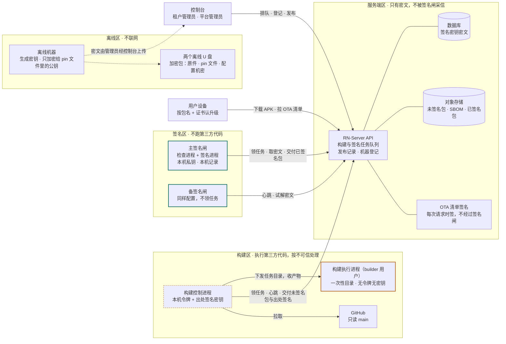
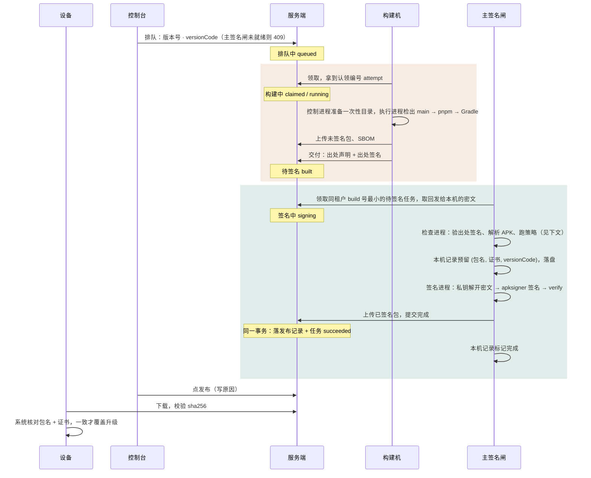

# 设计：Android 签名闸

状态：已实现，未发布（RN-Server / RN-Admin / RN-App 分支 `feat/signing-gate`）。设计过一轮三路对抗评审；实现后又过了三路对抗评审与本机端到端测试，实现中确认的偏离见文末「实现记录」。2026-09-16

取代：`platform-backup-recovery-2026-09-15.md`（整个备份方案移除）
相关：`build-service-2026-09-11.md`、`build-concurrency-2026-09-15.md`、ADR-0015、ADR-0016

一句话：**执行第三方代码的机器没有签名能力；有签名能力的机器不执行第三方代码，也不采信服务端和构建机说的话。** 签名密钥只以密文存进数据库，只有签名闸解得开。

## 已定事项

- 现有租户的签名密钥全部重置，不迁移；沿用原包名，用户卸载重装、用助记词恢复钱包。
- 签名闸一主一备：平时只有主签名闸签名，主挂了由人把备提升为主。开发阶段两台都部署在 amos 上，各用独立系统用户。
- 签名闸在本机记录里保存确认过的证书指纹、包内信任根、受信的构建机和签过的版本号，并据此拒签。新租户上线、换密钥、改信任根时，运维登上签名闸人工确认。
- 原备份方案整体移除：代码、配置、表、数据。对象存储桶里已产出的备份包由桶的所有者删除，并留删除记录。
- 签名密钥原件、`STORAGE_MASTER_KEY`、`DEVICE_IDENTITY_HMAC_KEY` 打成一个加密包：加密口令只放密码管理器，加密包只放两个离线 U 盘。
- 热更新不在签名闸保护范围内，风险如实写明；本期加一道限制：热更新包只能来自构建任务，管理端不能直接上传。
- RN-App 删除正式签名模式，仓库里的 release 构建一律出未签名包；开发自测用开发包名 `com.anyfun.foundation.dev` 加本地测试密钥。
- 管理端页面按 RN-Admin 已有实现和 `docs/ADMIN_ENGINEERING_STANDARD.md`、`docs/FEEDBACK_INTERACTION_STANDARD.md` 开发。

## 本设计保证什么，不保证什么

**保证**

- 签名密钥明文只出现在离线机器和签名闸内存里，构建机、服务端、数据库、控制台都拿不到。
- 签名闸只给「受信构建机交付、包名与证书对、版本号合理、包内信任根与本机确认值一致、权限与关键属性合规」的包签名，且同一个 (包名, 证书, versionCode) 终身只签一次。
- 服务端或控制台被攻破，改不了签名闸签给谁、用哪把密钥签、包里指向哪个服务端。

**不保证**

- **包里的代码可信。** 受信构建机被攻破时，它交付的包照样会被签名（见「每个角色被攻破会怎样」）。
- **设备上跑的 JS 可信。** 热更新由服务端在设备请求清单时用 OTA 私钥签名，不经过签名闸。服务端被攻破，就能给所有设备推 JS；钱包的 JS 能碰到助记词流程。本设计只把“管理端直接上传热更新包”这条路堵上，热更新签名闸另立设计。

## 为什么要改

今天在打包机上，Gradle 和 Metro 执行的第三方代码，与 `agent-key`、解开的 keystore、store 口令、`BUILD_AGENT_TOKEN` 处在同一个系统用户下（`cmd/build-agent/build.go:229-244`）。一个恶意依赖就能读到 `agent-key`，再经 `/v1/build-agent/backup-keystores` 或逐条领取任务拿到所有租户的密文，全部解开。直装分发下，签名密钥泄露没有补救办法。

把密钥换个地方存解决不了这件事：只要构建进程在签名那一刻能拿到明文，存在哪都一样。要改的是**谁能碰到签名能力**，以及**签名的那一方凭什么相信它签的东西**。

| 区 | 原则 | 说明 |
| --- | --- | --- |
| 构建区 | 无密钥 | 构建进程执行 pnpm、Gradle 和几千个依赖包的代码，按不可信处理。它碰不到签名密钥、机器令牌和出处签名密钥；每个任务在一次性目录里构建。 |
| 签名区 | 只签确认过的东西 | 签名闸不执行仓库或依赖里的代码，解析不可信 APK 的进程与持有私钥的进程分开。它只信本机记录：受信构建机、证书指纹、包内信任根、签过的版本号。 |
| 离线区 | 明文只在这里出现 | 签名密钥在离线机器上生成，只加密给离线 pin 文件里的签名闸公钥。原件加密后放离线 U 盘。 |

## 整体链路

实线是网络连接，箭头从发起连接的一方指出；虚线是人工搬运，不走网络。构建区和签名区都只向外连服务端，不开放入站端口；构建机和签名闸之间没有直接连接，产物经服务端交接，出处由构建机签名证明。

## 开发阶段的部署（amos 同机）

主、备签名闸都跑在 amos 上，和构建机、后端同机，各用独立系统用户（`rn-signer-a` 主、`rn-signer-b` 备），私钥和本机记录放在各自的状态目录里，权限 0700，其他用户读不到。真正的边界是文件权限，各 unit 上的 `InaccessiblePaths` 只是纵深防御。

这挡得住同机非 root 用户，挡不住 root。开发阶段在 amos 上拿到 root 的路径至少有：

- 构建时执行的第三方代码本地提权；
- CI 部署账号 `rndeploy`：它能以 root 执行 `rn-foundation-apply`，而脚本会以 root 运行 CI 传来的新 build-agent 二进制做冒烟（`deploy/amos/rn-foundation-apply:176-181`），所以**能推 RN-Server main 或拿到 `AMOS_SSH_KEY` 就等于 amos 的 root**；
- 运维账号的免密 sudo，以及持有这类账号的自动化会话。

这和 ADR-0015 接受“后端与打包机同机”是同一个取舍——**只适用于开发环境**。开发阶段同时做到：签名闸二进制只人工部署（见「部署与运维」）；关掉 CI 部署 build-agent 的开关；`rn-foundation-apply` 的冒烟改为以 `builder` 身份执行。上生产时签名闸挪到独立虚拟机，该虚拟机上没有免密 sudo 账号，不给任何自动化会话登录权限。

主备放在同一台机器上不提供可用性，amos 一挂两台一起停。这样部署是为了让“加密给两台”“两台各自确认”“提升备用”这些流程从第一天就跑起来。amos 上已有 JDK 17 与 Android build-tools 35/36。

## 一次安装包发布

## 签名闸

### 一主一备

- 两台各有一把本机私钥，密文同时加密给两台，两台都做过本机确认，所以备随时可以接手。
- **只有主签名闸领签名任务。** 角色写在本机记录里，服务端的登记只用来路由；服务端把任务派给备，备也不签。
- 这样同一个 (包名, 证书, versionCode) 只会在一台机器上被签一次。两台同时在线签名时，服务端被攻破可以让两台用同一个版本号各签一个不同的包，而两台的本机记录互相看不到。

**提升备用**（`signer promote`，登上备用机执行）：

1. 确认主已经停掉：停服务，并在控制台吊销主。
2. 导入主的签名记录：主的状态目录还在就直接复制 `signed.jsonl`，工具用主的公钥（在备的本机记录里 pin 着）验证每条记录的签名；主的目录也没了，就由运维逐个包名输入“已签过的最大 versionCode”，数值与离线发布记录或已安装设备上的版本核对，不取服务端的值。
3. 备改为主，控制台同步更新路由。之后再按「密钥生成与上传」补一台新的备。

### 进程与用户划分

| 进程 | 用户 | 能碰什么 | 不能碰什么 |
| --- | --- | --- | --- |
| 签名闸主进程 `signer run` | `rn-signer-a` | 本机令牌、状态目录、网络（只到 API） | 不解析 APK |
| 检查进程 `signer-check` | systemd `DynamicUser`，无网络，seccomp | 只读的输入包、出处声明 | 状态目录、私钥、令牌 |
| 签名步骤 | `rn-signer-a` | 私钥、密文、通过检查的输入包（按 sha256 取） | 不运行 aapt2 等解析工具 |

- 检查进程对不可信的 APK 做全部解析，只输出结论和它检查过的文件 sha256；签名步骤只对 sha256 一致的文件动手。**检查通过之前不解密。**
- 明文 keystore 与口令文件放在 `RuntimeDirectory`（tmpfs，0700），签完即删，进程启动时先清残留；不落持久盘。
- `apksigner` 用 `env -i` 加绝对路径调用 `$JAVA_HOME/bin/java -jar <build-tools>/lib/apksigner.jar`，不走会读 `PATH` 与 `JDK_JAVA_OPTIONS` 的包装脚本；口令用 `--ks-pass file:`、`--key-pass file:` 传。
- unit 硬化：`NoNewPrivileges`、`ProtectSystem=strict`、`ProtectHome`、`PrivateTmp`、`PrivateDevices`、`ProtectProc=invisible`、`ProcSubset=pid`、`CapabilityBoundingSet=`（空）、`RestrictAddressFamilies=AF_INET AF_INET6 AF_UNIX`、`IPAddressAllow` 只放 API、`SystemCallFilter=@system-service`、`LimitCORE=0`、`UMask=0077`，可写路径只有自己的状态目录与运行时目录。

### 签名前检查

签名闸不采信构建机和服务端上报的任何结论。APK 解析用纯 Go 实现（在现有 `internal/apkinspect` 基础上扩展成完整的二进制 XML 与资源解析），不在持有私钥的进程里跑原生解析器。

**来源**

1. 任务处于「待签名」，是同租户同平台在途任务中 build 号最小的那条，且本机从没为它签过。
2. 出处声明由本机信任的构建机签名（见「构建机」），声明里的 jobId、attempt、包名、versionCode、versionName、未签名包 sha256 与任务、下载到的文件逐项一致。
3. 下载到的未签名包 sha256 等于出处声明里的值。

**包结构**

4. 输入包没有任何签名（没有 APK Signing Block，没有 `META-INF/*.SF`、`*.RSA` 等）。未签名模式一旦失效会退回 debug 签名，这一条能当场发现。
5. ZIP 里没有重复条目，中央目录与本地文件头一致，只有一个 `AndroidManifest.xml`。
6. 对齐检查通过（规则等价 `zipalign -c -P 16 4`，在检查进程里用纯 Go 实现，不执行原生工具）。

**身份与版本**

7. 包名等于本机确认的包名；versionName 等于任务值。
8. 不允许出现 `versionCodeMajor`；versionCode 等于任务值，大于本机记录里该 (包名, 证书) 签过的最大值，跳号不超过 100，且不超过绝对上限 10,000,000。这三个数都只能在签名闸本机配置里改。该 (包名, 证书) 第一次签名时，versionCode 不超过确认时运维输入的首签上限。
9. 属性名与资源 ID 不一致的属性、重复属性，一律拒签。

**关键属性与权限**

10. `debuggable`、`testOnly` 不存在；`allowBackup=false`（App 现已设为 false）；不允许明文流量；不声明 `networkSecurityConfig`（需要时先在本机确认）；不声明 `sharedUserId`。
11. `minSdkVersion`、`targetSdkVersion` 不低于本机确认值。
12. 权限是**允许列表**：只允许签名闸内置列表里的权限（与 RN-App `ALLOWED_PERMISSIONS` 相同，按渠道区分，含按包名生成的 `<包名>.DYNAMIC_RECEIVER_NOT_EXPORTED_PERMISSION`）；`<permission>` 定义同样只允许列表内的。

**包内信任根**（与本机确认值逐项比对）

13. 内嵌 Expo 配置 `assets/app.config` 的 `extra.apiBaseUrl`、`extra.bootstrapSignerAddress`、`extra.applicationId`、`extra.distributionChannel`，以及 `updates.url`、`updates.enabled`。
14. manifest meta-data `expo.modules.updates.CODE_SIGNING_CERTIFICATE` 的证书 sha256（即内嵌的 OTA 证书）。
15. App Links 的 intent-filter host 集合与自定义 scheme。
16. 原生指纹以出处声明（构建控制进程签名）里的值为准，发布记录标注 `nativeFingerprintSource: builder-provenance`；包里若有 `assets/fingerprint`，必须与出处值一致。（实现时发现：包里没有 `assets/fingerprint`，`runtimeVersion` 走 appVersion 策略，签名闸无法从 APK 独立复核原生指纹。）

**签名与复核**

17. 解开的密文里的租户、包名、证书指纹与本机确认值一致；别名取密文里的，忽略服务端给的。
18. `apksigner sign --v1-signing-enabled false --v2-signing-enabled true --v3-signing-enabled true --v4-signing-enabled false --min-sdk-version <确认值>`，不带 lineage（minSdk 是 24，v2 足够，关掉 v1）。
19. `apksigner verify --print-certs` 结果恰好 1 个签名者，v2、v3 均通过，证书 sha256 等于本机确认值。

**拒签的三种结果**，服务端分开处理：

- **暂不能签**（本机未确认该租户、信任根刚改未重新确认、本机是备）：任务退回「待签名」，不计次数，控制台显示原因。
- **违规**（上面任何一条不过）：任务终态失败，原因写回服务端，控制台可见，同时写审计。
- **临时错误**（网络、服务端 5xx、`RELEASE_SEQUENCE_BUSY`）：原地重试；签名编号累计到 2 次后判失败。

### 本机记录

两个追加写的 JSONL 文件，每行带上一行的哈希，写入后 fsync，只有签名闸用户能读写。服务端写不到，这是它存在的意义。签名闸和离线工具在独立的 Go module 里，只依赖标准库与 `golang.org/x/crypto`，不引入 SQLite 这类大依赖。

| 文件 | 记什么 | 谁写 |
| --- | --- | --- |
| `trust.jsonl` | 本机角色（主/备）；受信构建机（id、Ed25519 公钥完整 sha256）；按 (包名, 证书指纹) 确认的租户：租户 slug、信任根（API origin、OTA 证书 sha256、bootstrap 签名地址、App Links host、scheme、渠道）、minSdk/targetSdk 下限、首签 versionCode 上限、确认人、确认时间；主签名闸公钥（备用机上） | 运维登上签名闸执行 `signer confirm`、`signer trust-builder`、`signer promote` |
| `signed.jsonl` | 两段：预留 (包名, 证书, versionCode, jobId, 未签名包 sha256) → 完成（已签名包 sha256、服务端返回的发布 id）。每条带本机私钥签名 | 签名闸 |

- 预留在解密前写入并落盘。同一个 jobId 加同一个未签名包 sha256 可以重签、重传（幂等）；同一个 versionCode 已被别的 jobId 或别的输入包预留，永久拒签。
- 某次预留确认从未交付出去（服务端没有对应发布记录，也没有下载记录），运维可以在本机执行 `signer abandon --job <id> --reason …` 释放它，这一步写进记录。

### 为什么这些东西要记在签名闸本机

服务端库里的东西，服务端被攻破时能一起改；服务端的排队与上传门禁照常检查，本机记录防的是服务端自己出问题。

- **证书指纹**：签名闸的公钥是公开的，谁都能加密一把密钥给它。服务端被攻破时，攻击者可以把密文和登记的指纹一起换成自己的，让签名闸用他的密钥给正式代码签名。
- **包内信任根**：租户管理员就能改 `apiBaseUrl`、换 OTA 签名密钥，服务端合成的 `tenant.json` 会照着编进包里。签名闸不比对，就会给一个指向攻击者服务端、只信攻击者 OTA 证书的包签名；这批设备在服务端清理干净之后仍然被控制。
- **受信构建机**：机器令牌存在服务端库里，能写库就能冒充构建机交付任意代码。出处签名密钥不在服务端，签名闸只信本机 pin 过的构建机。
- **版本号**：服务端被攻破时，攻击者可以排一个 versionCode 填到最大的任务，代码仍是 main，但装了这个包的手机再也收不到正常更新。

### `signer confirm`

确认要防的正是“服务端被攻破”，所以**不以控制台或服务端下发的任何值为依据**。

1. 必须在交互终端里运行，从 `/dev/tty` 读输入；stdin 不是 TTY 就拒绝。
2. 签名闸取回发给本机的密文，**用本机私钥解开，自己算出证书指纹**，读出密文里绑定的租户和包名。服务端下发的字符串（slug、包名、域名、指纹、地址）先按严格格式校验，不合格直接退出，不打印原文，防止终端控制字符伪造屏幕。
3. 运维**粘贴**密码管理器里、离线工具生成密钥时记下的完整证书指纹（64 个十六进制字符），由程序与本机算出值比对，不一致就退出。不接受输入 `yes` 了事。
4. 信任根逐项确认：API origin 由运维输入；OTA 证书 sha256、bootstrap 签名地址与离线记录核对后粘贴；App Links host、scheme、渠道、minSdk/targetSdk 下限、首签 versionCode 上限由运维输入。服务端给的值只作对照显示。
5. 写入 `trust.jsonl`。同一 (包名, 证书) 的新确认生效后，旧行保留作历史。

`signer trust-builder` 同理：运维在构建机上执行 `build-agent show-key` 拿到出处公钥的完整 sha256，到签名闸上粘贴核对后写入。

## 构建机

### 两个进程，两个用户

| 进程 | 用户 | 持有 |
| --- | --- | --- |
| 构建控制进程 `build-agent` | `rn-build-agent` | 本机令牌、Ed25519 出处签名密钥、仓库裸库、只读依赖缓存 |
| 构建执行进程 `build-runner` | `builder` | 只有当前任务的一次性目录 |

- 控制进程经一条收窄的 sudoers 规则启动执行进程：`rn-build-agent ALL=(builder) NOPASSWD: /opt/rn-build-agent/build-runner`，参数由 `build-runner` 自己校验。执行进程和控制进程不同 uid，读不到控制进程的 `/proc/<pid>/environ`、令牌和出处密钥。
- 控制进程负责 fetch 和 `git worktree add`（带 `-c core.hooksPath=/dev/null`），裸库归控制进程所有，执行进程只读。
- 控制进程给出处声明签名：jobId、attempt、租户 slug、包名、versionCode、versionName、commit、未签名包 sha256、SBOM sha256、原生指纹、构建机 id、时间。
- 服务端对每台构建机同时只派一条任务。收到 409 `BUILD_ATTEMPT_STALE` 立即中止并清理。

### 每个任务的隔离

- 每个任务一个新的 `GRADLE_USER_HOME`，用完删除；依赖从控制进程维护的只读缓存读取（Gradle 的 `GRADLE_RO_DEP_CACHE`），`init.d` 等可执行配置无处落脚。
- pnpm store 由控制进程维护，执行进程只读。只读 store 下 `pnpm install --frozen-lockfile --offline` 是否可行要在实施时验证；不可行就每个任务一个独立 store，接受构建变慢。
- Gradle 依赖校验在 release 构建里强制开启，删掉 `GRADLE_DEPENDENCY_VERIFICATION` 这个环境开关。
- 子进程环境是白名单：`PATH`、`HOME`、`LANG`、`JAVA_HOME`、`ANDROID_HOME`、`ANDROID_SDK_ROOT`、`GRADLE_USER_HOME`、`GRADLE_RO_DEP_CACHE`、`npm_config_store_dir` 与任务专用变量。白名单在 `prepareWorktree` 里统一构造，安装包与热更新两条链路共用，测试断言两边一致，否则原生指纹对不上。
- 检出固定 `refs/heads/main`，任务里的 `gitRef` 只用于核对。commit 是构建机自报，发布记录与控制台标注“构建机自报，未核验”。

即使这样，**执行进程被攻破时它交付的包仍会被签名**，攻击者在执行进程里能做的事以一个任务为界；控制进程或出处密钥被攻破，则此后这台构建机交付的一切都不可信，直到在签名闸上撤销对它的信任并重建机器。

## 密钥生成与上传

1. **签名闸登记**：主、备启动后各自生成本机 X25519 私钥，公钥登记到服务端。运维登上机器执行 `signer show-key`，把公钥与**完整 sha256（64 个十六进制字符）** 抄到离线机器上的 pin 文件，再在控制台接受。控制台接受只影响路由；**离线工具只认 pin 文件**，服务端登记了谁都不会让离线工具多加密一份。
2. **生成**：离线机器不联网，执行 `build-keystore create --pins <pin 文件> --tenant <slug> --package <包名> --alias <别名>`。工具只加密给 pin 文件里的签名闸，逐个打印收件人完整指纹。
3. **产出**：上传用的密文文件（v3 格式，见「签名密钥记录与密文格式」）；原件目录（`<别名>.p12` 与 0600 的口令文件，**口令不打印到屏幕**）；证书完整 sha256。证书指纹记进密码管理器，第 5 步核对的就是它。
4. **保管**：原件、pin 文件按「原件与配置机密的保管」打包，离线机器上的明文副本擦除。
5. **上传与确认**：管理员经控制台上传密文文件，同时登记证书指纹和包名，三者在同一个事务里写入（沿用 ADR-0016）。然后运维分别登上主、备执行 `signer confirm --tenant <slug>`。
6. **试签**：主签名闸试签一个测试包并复核指纹，控制台显示「主、备均已确认，主试签通过」，这把密钥才算上线。

新增一台签名闸时：先在离线机器上把它加进 pin 文件，再用 `build-keystore seal --pins <pin 文件> --p12 <原件>` 为每个租户重新加密上传。服务端对“缺某台签名闸的密文”只提示不拒收，对“收件人不在已登记签名闸里”的多余密文直接拒收。

签名闸换公钥必须用当前私钥签名证明；私钥丢了按新机器、新 id 处理，旧公钥与旧密文在新机器被接受之前保持有效。

## 原件与配置机密的保管

要离线保管的有：各租户签名密钥原件目录（`.p12`、口令文件、证书指纹）、签名闸 pin 文件、`STORAGE_MASTER_KEY`、`DEVICE_IDENTITY_HMAC_KEY`。保管人是平台负责人一人。

**做法**

1. 两个配置机密从 amos 取出时不落明文、不回显。在你自己的、没有任何自动化会话的终端里执行：`ssh amos "sudo grep -E '^(STORAGE_MASTER_KEY|DEVICE_IDENTITY_HMAC_KEY)=' /etc/rn-foundation.env" | gpg --symmetric --no-symkey-cache --cipher-algo AES256 -o config-secrets.gpg`。不要在 Claude Code 里用 `!` 前缀执行，它的输出会进对话记录。做完执行 `gpgconf --kill gpg-agent`。
2. 在离线机器上把原件目录、pin 文件、`config-secrets.gpg` 放进一个目录，打成加密包：`tar -c <目录> | gpg --symmetric --no-symkey-cache --cipher-algo AES256 -o rn-signing-vault-<日期>.tar.gpg`。加密口令用密码管理器生成。
3. 分开存放：
   - **密码管理器**：只存加密口令，以及各租户证书指纹、签名闸公钥指纹这类核对用的公开值；**不存加密包**。
   - **两个离线 U 盘**：只存加密包，**不存口令**，分开物理保管。
4. 验证：两个 U 盘各取一份，在离线机器上解开，核对每个租户的证书指纹与密码管理器里的离线记录一致、pin 文件与签名闸上 `signer show-key` 一致、两个配置机密的键都在。以离线记录为准，不以控制台为准。验证完擦除解开的明文，执行 `gpgconf --kill gpg-agent`。

**什么时候更新**：新增租户密钥、新增或更换签名闸、轮换这两个配置机密时，重新打包，替换两个 U 盘，再做一次第 4 步，旧加密包销毁。

**丢了会怎样**：签名闸私钥都在时，原件丢了不影响签名，尽快重打一份；原件和两台签名闸的私钥同时没了，只能再重置一次密钥。拿下密码管理器但拿不到 U 盘，或者反过来，都拿不到原件。

## 现有租户的签名密钥重置

已定：现有租户的签名密钥全部作废，每个租户重新生成，不做迁移。

原因是旧密钥无法证明没有泄露：它们每次构建都以明文出现在构建目录里，和第三方代码在同一个系统用户下；amos 上的 `agent-key` 也一样。重置之后信任从零开始，不需要在 amos 上解开旧密文，不需要清点旧原件在谁手里。

> **已经安装的 App 不能覆盖升级到新签名的包。** Android 按“包名 + 签名证书”认升级，证书一换，系统就认为这是另一个 App。沿用原包名，用户先卸载旧 App 再装新包，本机钱包数据随卸载清空，用助记词恢复。目前用户很少，不另做过渡方案。

**旧指纹永久拒绝**：各租户旧证书指纹写进服务端代码常量，与公开 debug 签名同级，上传门禁和登记接口永久拒绝。不提供“重新登记旧指纹”的回退：旧密钥可能已泄露，而一个带旧签名、versionCode 更高的包能让还没重装的老用户原地升级、保留钱包数据。

**作废的东西**

- 各租户旧的签名密钥与证书、服务端登记的旧指纹
- 数据库 `build.keystore` 里的旧密文、旧格式的 `build.keystore.check`、`build.agent.recipient`
- amos 上的 `agent-key`、`BUILD_KEYSTORE_PASSPHRASE`
- GitHub RN-App 仓库 `android-release` 环境里的 4 个 `ANDROID_RELEASE_*` secret（workflow 里已不再引用，只剩注释）
- 开发机上 anyfun 旧密钥的原件与 `.env.local` 里指向它的路径，新签名的包在设备上装通后销毁
- 模拟器上装的旧签名 anyfun 包，改装签名闸产出的新包

**跟着变的地方**

- 构建任务下发的 `tenant.json` 由服务端合成，`signerSha256` 取自登记的指纹，自动跟着变
- 仓库 `tenants/anyfun/tenant.json` 的 `signerSha256` 改成新值，只用于在本地 `android:verify` 核对签名闸产出的包
- `/.well-known/assetlinks.json` 由登记的指纹生成，自动切换
- 上传门禁按新登记的指纹比对，旧签名的包从此传不上去

## 热更新

热更新不经过签名闸：构建机打 JS 包，设备每次请求清单时由服务端用 OTA 私钥签名（`internal/api/ota.go` 清单接口）。所以签名闸都挂了，紧急修复也照样能发；热更新任务的状态流转不变，超时仍判失败、不自动重排。

**风险如实写明**：服务端或数据库被攻破、构建机被攻破，都能让恶意 JS 经热更新到达所有设备，签名闸拦不住。

**本期加的限制**：热更新修订只能由 `kind=ota` 的构建任务产出。删除管理端直接上传热更新包的接口 `POST /v1/admin/ota/artifacts/uploads`、`PUT /v1/admin/ota/artifacts/upload`、`POST /v1/admin/ota/releases`，以及 RN-Admin 发布管理页里的上传入口；发布、暂停、回滚等动作保留。现有“本地 `pnpm ota:build` 后经管理接口上传”的运维流程随之废止，改为在控制台排热更新构建任务。

热更新签名闸（OTA 私钥移出服务端、bundle 哈希在闸本机确认后才签清单）另立设计。

## 每个角色被攻破会怎样

| 角色 | 持有 | 被攻破后最坏能做什么 | 做不到什么 |
| --- | --- | --- | --- |
| 构建执行进程（恶意依赖） | 当前任务的一次性目录 | 往当前任务的安装包或热更新包里塞代码；安装包照样被签名 | 读令牌与出处密钥；跨任务潜伏；改包名、版本号、信任根、权限（被签名闸拦住） |
| 构建控制进程 / 令牌 + 出处密钥 | 本机令牌、出处密钥、裸库、只读缓存 | **此后这台构建机交付的任意代码都会被签名，跨租户**，直到在签名闸上撤销信任 | 拿到签名密钥；改包名、版本号、信任根 |
| 签名闸 | 本机令牌、本机私钥、本机记录 | **解开所有租户的签名密钥并带走，永久有效；签出去的包撤不回。这是剩下的最大风险** | 决定包里的代码（代码来自构建机） |
| 服务端 / 数据库 | 数据库口令、`STORAGE_MASTER_KEY`、OTA 私钥、签名密钥密文、机器令牌 sha256 | **用 OTA 私钥给所有设备推 JS**；让构建或签名停摆；冒充构建机交付（被出处签名挡住） | 解开签名密钥密文；让签名闸用别的密钥、别的信任根签；签版本号异常的包；让离线工具加密给别人 |
| 租户管理员账号 | 控制台会话 | 排构建、发布、回滚；改 `apiBaseUrl`、换 OTA 密钥（签名闸拒签直到本机重新确认）；借已发布的热更新回滚到旧修订 | 直接上传热更新包；让签名闸签改过信任根的包 |
| 平台管理员账号 | 控制台会话 | 新建机器、发令牌、在服务端接受公钥 | 让签名闸信任新构建机；让离线工具加密给新公钥（都只认本机记录与离线 pin 文件） |
| 能推 RN-Server main / CI 部署密钥 | `rndeploy` | 开发阶段在 amos 上以 root 执行，签名闸私钥保不住 | 生产环境独立签名闸虚拟机上什么都做不到（签名闸不经 CI 部署） |
| 密码管理器 | 加密口令、核对用指纹 | 单独拿到没有用 | 拿到原件（加密包在离线 U 盘） |
| 离线 U 盘 | 加密包 | 单独拿到没有用 | 解开（口令在密码管理器） |

## 机器挂了怎么办

| 情况 | 会怎样 | 怎么恢复 |
| --- | --- | --- |
| 一台构建机挂了 | 10 分钟没有心跳 | 服务端独立的回收定时器把任务退回排队，认领编号加一，最多重排 2 次，之后判失败；旧机器回来后的上报按过期编号拒绝，它收到 409 立即中止 |
| 签名中途主签名闸挂了 | 5 分钟没有心跳 | 任务退回「待签名」，签名编号加一；主恢复后本机记录里的预留让它对同一任务幂等续签。主起不来就提升备 |
| 主签名闸长期不可用 | 安装包停在「待签名」，不会丢；热更新照常 | `signer promote` 提升备（见「一主一备」），再补一台新的备 |
| 一个有毒的未签名包让检查进程崩溃 | 同一任务反复失败 | 签名编号到 2 次判失败，认领时跳过；检查进程是隔离的子进程，崩溃不影响签名闸主进程 |
| 签名闸状态目录丢了 | 这台的私钥和本机记录没了 | 按新机器处理：新 id、新公钥、加进 pin 文件、从原件重新加密上传、重新确认；是主就先提升备 |
| 两台都丢了 | 签不了安装包。开发阶段 amos 磁盘坏了就是这种情况 | 从 U 盘里的原件恢复；首签上限由运维按离线发布记录输入。原件也没了，只能再重置一次密钥 |
| 数据库丢了 | 密文、登记指纹、机器登记没了；签名闸本机记录不受影响 | 从原件重新加密上传、重新登记机器 |
| 服务端挂了 | 构建、签名、下载都停 | 恢复后继续；签名密钥不受影响 |
| 管理员想放弃一条卡住的任务 | — | 「待签名」可以取消；「签名中」可以带原因强制判失败，签名闸之后的迟到上报按签名编号拒绝 |

## 移除原备份方案

`platform-backup-recovery-2026-09-15.md` 对应的实现整体删除，不留开关。分两次发布：第一次删代码、配置与路由，不删表；确认稳定后第二次只发删表、删配置行的迁移。这样第一次发布失败回滚到旧二进制时，旧代码面对的表还在。

**桶里的备份包**：每个包里不只有旧签名密钥，还有整份 `/etc/rn-foundation.env`（`STORAGE_MASTER_KEY`、`DEVICE_IDENTITY_HMAC_KEY`、数据库口令、管理员凭据），可能还有 TLS 私钥、打包机 env 和部署 SSH 私钥。由桶的所有者删除 `backup.bucket` 配置所指的桶与前缀下的全部对象。删除前先从控制台备份记录导出对象清单，作为删除记录保存；这一步要在删代码之前做。

**RN-Server 代码**

- `internal/api/backup_*.go`、`internal/api/platform_backups.go`、`internal/backupbundle/`、`internal/backupcontainer/`、`internal/config/backup.go`、`cmd/server/backupbucket.go`，连同测试与 `internal/store/platform_backups_migration_test.go`
- `cmd/server/main.go` 的 `backup-bucket-test` 子命令与备份调度器；`cmd/server/config_dump.go` 的备份部分；`internal/config/config.go` 的备份字段
- `internal/api/server.go`：备份相关结构体字段；路由 `/v1/admin/platform/backup*`、`/v1/admin/platform/build-agent/keystore-checks/reset`，打包机的 `/backup-signing-key`、`/backup-requests/claim`、`/backup-requests/:id/payload`、`/backup-requests/:id/fail`、`/backup-keystores`；数据库超时中间件里的备份特例
- `internal/objectstore/s3.go` 里只为备份桶存在的 `BucketVersioning` 及其假实现
- **先挪再删**：要保留的 `internal/api/build_job_ref_gate_test.go` 用到定义在 `platform_backups_test.go` 里的 `backupServer`，删文件之前把这个辅助函数挪进保留的测试文件，否则编译失败
- 构建机：`cmd/build-agent/backup.go`、`backupkey.go`；`main.go` 里 show-key 的备份部分与备份公钥登记；`config.go` 的备份键；`showkey_readonly_test.go`、`backup_unseal_test.go`、`agent_test.go` 里的备份用例

**配置**（按代码 grep 出的全集删，不只 `BACKUP_*`）

- 服务端：全部 `BACKUP_*`，含 `BACKUP_SERVER_*_PATH`
- 构建机：`BUILD_AGENT_RECOVERY_RECIPIENT_A/B/C`、`BUILD_AGENT_ENV_PATH`、`BUILD_AGENT_UNIT_PATH`、`BUILD_AGENT_SSH_KEY_PATH`、`BUILD_AGENT_SSH_CONFIG_PATH`
- amos 上的 `/etc/rn-foundation.env`、`/etc/rn-build-agent.env`，仓库里的 `.env.example`、`deploy/amos/rn-foundation.env.example`、`deploy/build-agent/rn-build-agent.env.example`
- `rn-foundation-server.service` 里为备份加的 `LoadCredential` 撤回

**部署与文档**

- `deploy/amos/rotate-keystore-passphrase.sh` 删除
- `deploy/amos/README.md`（签名密钥与口令轮换一节）、`deploy/build-agent/README.md`（备份与 agent-key 相关各节）、`docs/CONFIGURATION.md` 的备份键、`README.md` 的备份入口
- `rn-foundation-apply` 与 sudoers 里“部署账号读不到口令”等失真的注释；`.github/workflows/deploy-amos.yml` 的相关注释
- `docs/design/platform-backup-recovery-2026-09-15.md`、`docs/BACKUP_RECOVERY_RUNBOOK.md`

**RN-Admin**：见「实现细节 → RN-Admin」。

**表与数据**（第二次发布）：`platform_backups` 表；`app_configs` 的 `backup.bucket`、`backup.recipients`、`build.agent.backup-sign`；打包机状态目录里的 `backup-signing.key`。迁移 53 留在列表里不动，新增一条迁移做删除。

### 移除之后，哪些东西没有备份

数据库不在 amos 上（amos 没有运行 MySQL，服务端连的是外部库），amos 磁盘坏了数据还在。真正只存在 amos 上的，是配置文件里的几项机密：

| 项 | 在哪 | 丢了会怎样 | 能不能重建 |
| --- | --- | --- | --- |
| `STORAGE_MASTER_KEY` | `/etc/rn-foundation.env` | 库里所有用它加密的字段都解不开：租户对象存储凭据、OTA 签名私钥、推送凭据、链 RPC 地址、bootstrap 签名密钥、签名密钥密文外层等 | 不能，已纳入离线加密包 |
| `DEVICE_IDENTITY_HMAC_KEY` | `/etc/rn-foundation.env` | 设备身份算出来全变，所有设备被当成新设备 | 不能，已纳入离线加密包 |
| `MYSQL_DSN` 口令、`ADMIN_*` | `/etc/rn-foundation.env` | 服务起不来 | 能，在数据库和控制台重新生成 |
| 机器令牌、出处密钥、签名闸私钥 | 各机器 env 与状态目录 | 机器连不上或签不了 | 能，按新机器重新登记；签名闸见「机器挂了」 |
| `APNS_PRIVATE_KEY`、`HMS_CLIENT_SECRET` | `/etc/rn-foundation.env` | iOS / 华为推送发不出去 | 能，在 Apple / 华为后台重新签发 |
| TLS 证书 | `/etc/nginx/ssl/` | 站点 HTTPS 不可用 | 能：Let’s Encrypt 重跑 `setup-tls.sh`；Cloudflare Origin CA 在 Cloudflare 后台重签 |

## 实现细节

### 复用映射表

按 RN-Server `AGENTS.md`「数据库表设计原则（先复用再建表）」逐项盘点：

| 拟新增 | 结论 | 理由 |
| --- | --- | --- |
| 机器登记（构建机、签名闸、令牌 sha256、公钥） | **复用** `app_configs` 平台级键 `build.machines`（`tenant_id=0`） | 平台级配置，条目少，只在新建、吊销、接受公钥、切换主备时变，自带 `version / updated_by / updated_at`。机器是否在干活看任务行心跳，不记高频写的“最近上线”。签名闸与离线工具**不采信**这份登记 |
| 构建认领编号、未签名包、SBOM、签名阶段的认领与心跳 | **合并**进 `build_jobs` 新列 | 同一实体（一个打包任务）的运行状态，写方明确 |
| 受信构建机、证书与信任根确认、签过的版本号 | **不进服务端库**，签名闸本机记录 | 它们要防的就是服务端被攻破 |
| 签名、拒签、确认状态变化的历史 | **复用** `audit_events`（`actor_id='system-signer'`） | 历史统一在这里 |
| 签名密钥密文 | **复用** `build.keystore`，结构改为多份 v3 密文 | 同一个事实，换存储结构 |
| 每台签名闸的试解、确认、试签状态 | **复用** `build.keystore.check`，改为按机器 id 分键，用 `JSON_SET` 更新单个键 | 两台并发写整行会互相覆盖 |
| 打包机单一公钥 `build.agent.recipient` | **取消** | 被 `build.machines` 取代 |
| `platform_backups` 表与备份相关配置 | **删除** | 备份方案移除 |

新列一律带 `COMMENT`（含义、取值、NULL 的含义）；同步更新 `docs/database/*_SCHEMA.md`；定稿后写 ADR（`docs/decisions/0019-*.md`）。

### 构建任务的状态与字段（`build_jobs`）

安装包任务：`queued → claimed → running → built（待签名）→ signing（签名中）→ succeeded`。进行中的状态都可以到 `failed`；可取消的状态是 `queued`、`claimed`、`built`；`signing` 允许带原因强制判失败。热更新任务不变。

**所有按状态判断的地方都要改**：`live_build_number` 生成列表达式（把 `built`、`signing` 算作活着，否则签名期间同一个 build 号能再排一条）、`buildFloorFor`、列表筛选白名单（`build_jobs.go:509`）、`markBuildJobFailed` 的状态集合（顺带去掉不存在的 `pending`）、`buildAgentJobScope`、取消、回收、`claimed_by` 搜索与视图字段。

新增列：

- 构建段：`attempt`、`claimed_machine_id`；`unsigned_object_key`、`unsigned_size`、`unsigned_sha256`；`sbom_object_key`、`sbom_size`、`sbom_sha256`；`native_fingerprint`（构建机上报，签名闸复核）；`provenance`（出处声明与签名，JSON）
- 签名段：`sign_attempt`、`signing_machine_id`、`signing_claimed_at`、`signing_heartbeat_at`、`sign_outcome`（最近一次拒签或暂不能签的原因）

规则：

- 回收是服务端独立定时器（每分钟），不挂在构建机认领上。`claimed/running` 10 分钟无心跳 → 安装包任务回到 `queued`、`attempt+1`，重排超过 2 次判失败；热更新任务判失败。`signing` 5 分钟无心跳 → 回到 `built`、`sign_attempt+1`。
- 所有上报都带编号，`WHERE attempt=?`（或 `sign_attempt=?` 与 `signing_machine_id=?`）不匹配一律 409 `BUILD_ATTEMPT_STALE`。未签名包与 SBOM 的对象键含 attempt，写键和校验编号在同一条 UPDATE 里。
- 签名认领只派同租户同平台在途任务里 build 号最小的那条，且只派给登记为主、且报告已就绪（本机确认过该租户当前密钥与信任根）的签名闸。
- 排队时要求主签名闸对该租户当前密钥版本报告过“已确认并试签通过”，否则 409 `SIGNER_NOT_READY`；租户改了 `apiBaseUrl` 或 OTA 密钥之后，在主签名闸重新确认之前同样 409。
- 手工上传 Android 发布记录（`POST /v1/admin/releases`）时，该租户有 `built` 或 `signing` 的在途任务就 409。

**完成是一个事务**：`POST /v1/signer/jobs/:id/complete` 在同一个事务里 `SELECT … FROM build_jobs … FOR UPDATE`，校验 `status='signing'`、`sign_attempt`、`signing_machine_id`，做版本递增与签名指纹校验，写 `app_releases`（发布元数据同时记未签名包 sha256、已签名包 sha256、SBOM、签名闸读出的原生指纹、“commit 为构建机自报”标记），再把任务改为 `succeeded` 并写 `release_id`。任务已是 `succeeded` 且已签名包 sha256 相同，按幂等成功返回。`createReleaseFromArtifact` 的校验逻辑抽成可在事务内调用的函数，手工上传与签名闸共用。

### 机器登记与鉴权（`build.machines`）

- 每台一项：id、角色（`builder` / `signer`）、签名闸主备（`primary` / `standby`，仅路由用）、名称、令牌 sha256、签名闸 X25519 公钥或构建机 Ed25519 出处公钥（均存完整 sha256）、状态（`pending_key` / `active` / `revoked`）、接受人、接受时间。
- 平台管理员在控制台新建机器，令牌只在新建成功后显示一次，由人放进那台机器的 env 文件。取代全局唯一的 `BUILD_AGENT_TOKEN`。
- 鉴权中间件按令牌 sha256 查机器、校验角色（构建机令牌调签名闸接口一律 403，反之亦然）、`revoked` 一律 401。每个请求按 `app_configs.version` 读一次（主键查询），版本没变用内存缓存，吊销立即生效。
- 公钥由机器自己登记，状态 `pending_key`，平台管理员接受后 `active`。已 `active` 的机器换公钥，请求必须用当前私钥签名；旧公钥在新公钥被接受之前保持有效。
- 所有指纹展示与比对用完整 sha256（64 个十六进制字符）（现有 `buildkeystore.Recipient.Fingerprint()` 只取前 16 个十六进制字符，即 64 比特，改掉）。
- 配置：服务端 env 删除 `BUILD_AGENT_TOKEN` 与全部备份键；构建机 env 删除 `BUILD_KEYSTORE_PASSPHRASE`，令牌换成本机令牌；签名闸新增一份 env。三处同步改 `internal/config`、`docs/CONFIGURATION.md` 与 env 示例（含 `.env.example`、`deploy/web4/compose.yaml`、`cmd/server/config_dump.go` 里的 `BUILD_AGENT_TOKEN`）。

### 签名密钥记录与密文格式

- `build.keystore` 改为：`boxes[]`（每项含收件人完整 sha256 与 v3 密文）、`keyAlias`、`certificateSha256`、`packageName`。外层仍用 `STORAGE_MASTER_KEY` 加密。
- **v3 密文**的明文是 `{purpose:"android-release-keystore", tenantSlug, packageName, certificateSha256, keyAlias, recipients:[sha256…], createdAt, p12Base64, storePassword, keyPassword}`；AEAD 的附加数据包含格式版本、purpose 与收件人 sha256。签名闸解开后逐项与本机确认值比对，忽略服务端给的 alias。
- `PUT /v1/admin/build-keystore` 接收离线工具产出的上传文件：收件人不在已登记签名闸里就拒收；缺某台签名闸只提示；`signerSha256`、`packageName`、`releaseIdentityExpectedVersion` 必填；新旧格式只收 v3。
- 删除 `POST /v1/admin/build-keystore/generate`；删除 v1 口令封装的全部读写点：`internal/buildkeystore/seal.go` 的 `Seal`/`Open` 与 `ValidateShape` 对 v1 的放行、`internal/api/build_keystore.go:165-171`、构建机 `build.go:345-352` 与 `keystore_check.go:64-71`。

### 接口

以 `internal/api/server.go` 现有路由为准：

| 接口 | 谁调 | 结论 | 说明 |
| --- | --- | --- | --- |
| `POST /v1/build-agent/claim` | 构建机 | 修改 | 返回 `attempt`；不再下发 `sealedKeystore`、`keyAlias`；每台机器同时只派一条 |
| `POST /v1/build-agent/jobs/:id/heartbeat` | 构建机 | 修改 | 带 `attempt` |
| `POST /v1/build-agent/jobs/:id/fail` | 构建机 | 修改 | 带 `attempt` |
| `GET /v1/build-agent/jobs/:id/icons/:name` | 构建机 | 保留 | |
| `PUT /v1/build-agent/jobs/:id/unsigned/upload` | 构建机 | 新增 | 流式上传未签名包，带 `attempt`；路径以 `/upload` 结尾，走数据库超时豁免 |
| `PUT /v1/build-agent/jobs/:id/sbom/upload` | 构建机 | 新增 | 流式上传 SBOM（现有 SBOM 约 2.3 MB，超过 1 MiB 的请求体上限，不能内联），带 `attempt` |
| `POST /v1/build-agent/jobs/:id/built` | 构建机 | 新增 | 交付出处声明与签名；安装包任务转「待签名」 |
| `POST /v1/build-agent/jobs/:id/artifact-uploads`、`PUT …/artifact`、`POST …/release`、`POST …/complete` | 构建机 | 安装包任务不再用 | 热更新任务继续用 `/complete`、`/ota-uploads`、`/ota-artifact`、`/ota-release`；这几条也加 `attempt` 校验 |
| `POST /v1/build-agent/public-key` | 构建机 | 修改 | 登记 Ed25519 出处公钥 |
| `GET / POST /v1/build-agent/keystore-checks` | 构建机 | 删除 | 挪到签名闸 |
| `POST /v1/signer/public-key` | 签名闸 | 新增 | 登记 X25519 公钥；换公钥要当前私钥签名 |
| `POST /v1/signer/claim` | 签名闸 | 新增 | 带本机就绪列表；返回任务参数、`sign_attempt`、出处声明、发给本机的密文 |
| `GET /v1/signer/jobs/:id/unsigned/download` | 签名闸 | 新增 | 流式下载未签名包 |
| `POST /v1/signer/jobs/:id/heartbeat` | 签名闸 | 新增 | 带 `sign_attempt` |
| `PUT /v1/signer/jobs/:id/signed/upload` | 签名闸 | 新增 | 流式上传已签名包 |
| `POST /v1/signer/jobs/:id/complete` | 签名闸 | 新增 | 单事务落发布记录并完成任务，幂等 |
| `POST /v1/signer/jobs/:id/release`、`…/reject` | 签名闸 | 新增 | 暂不能签（退回，不计次）/ 违规（终态失败） |
| `GET / POST /v1/signer/keystore-checks` | 签名闸 | 新增 | 只返回发给本机的密文；上报试解、确认、试签状态 |
| `/v1/admin/platform/build-agent/public-key*` | 控制台 | 删除 | 由 `/v1/admin/platform/machines*` 取代 |
| `/v1/admin/platform/build-agent/keystore-checks/reset` | 控制台 | 删除 | 处理函数在要删的 `backup_admin.go` |
| `/v1/admin/platform/machines*` | 控制台 | 新增 | 新建（发令牌）、吊销、接受公钥、切换主备路由 |
| `POST /v1/admin/builds/:id/cancel` | 控制台 | 修改 | 允许取消 `built` |
| `POST /v1/admin/builds/:id/force-fail` | 控制台 | 新增 | `signing` 状态带原因强制判失败 |
| `POST /v1/admin/build-keystore/generate` | 控制台 | 删除 | |
| `POST /v1/admin/ota/artifacts/uploads`、`PUT /v1/admin/ota/artifacts/upload`、`POST /v1/admin/ota/releases` | 控制台 | 删除 | 热更新只能来自构建任务 |
| `/v1/admin/platform/backup*`、`/v1/build-agent/backup-*` | — | 删除 | 见「移除原备份方案」 |

OpenAPI（`contracts/openapi.json`）与契约版本随接口变化同步更新，RN-Admin 做兼容检查。

### 签名闸与离线工具代码

- 放在 RN-Server 仓库里的独立 Go module `signing/`，只依赖标准库与 `golang.org/x/crypto`。`internal/buildkeystore` 与 `internal/apkinspect` 挪进这个 module，服务端通过 `replace` 引用，避免两份实现。
- `signing/cmd/signer`：子命令 `run`、`show-key`（只读）、`confirm`、`trust-builder`、`promote`、`abandon`、`list`。
- `signing/cmd/signer-check`：检查进程，只读输入，只输出结论与 sha256。
- `signing/cmd/build-keystore`：离线工具，见下一节。
- 权限允许列表以 `go:embed` 编进签名闸二进制；与 RN-App `ALLOWED_PERMISSIONS` 必须在同一次变更里一起改，变更记录里注明。
- 签名闸配置（`/etc/rn-signer-a.env`，只放启动项）：服务端地址、本机令牌、名称、状态目录、build-tools 与 JDK 路径、跳号上限、绝对上限。

### 构建机程序（`cmd/build-agent`）

- 拆出 `build-runner`，控制进程与执行进程分用户（见「构建机」）；新增出处密钥与 `show-key` 输出出处公钥完整 sha256。
- 删除：解密（`unsealKeystore`、`openSealedKeystore`）、X25519 `agentkey.go`、`keystore_check.go`、备份相关代码。
- 安装包任务出未签名包，产物按 `app-release-unsigned.apk` 查找（`build.go:255-256` 现按 `-release.apk` 找），交付走 `/unsigned/upload`、`/sbom/upload`、`/built`。
- SBOM 绑定的是未签名包的文件名与 sha256，在 SBOM 属性里注明；改掉 RN-App `app-quality.yml` 里“绑的是真正发出去的那个 APK”的注释。
- 心跳收到 409 立即中止；子进程环境白名单与每任务隔离见「构建机」。

### 离线工具（`build-keystore`）

现状（`cmd/build-keystore/main.go`）：参数是单个 `--agent-key`；产出 `<alias>.p12`；store 口令直接打印到终端；输出的是带 `expectedVersion`、`reason`、`confirm` 的管理接口请求体，并提示用带 `x-admin-key` 的 curl 上传。改为：

- `create --pins <pin 文件> --tenant --package --alias`：生成 `.p12`，口令写 0600 文件不打印；只加密给 pin 文件里的收件人；产出 v3 上传文件（不含管理接口的版本号、原因等字段，由控制台填）；打印证书与每个收件人的完整 sha256。
- `seal --pins <pin 文件> --p12 <原件> --password-file <口令文件>`：用已有原件为当前 pin 集合重新加密，用于新增或更换签名闸。
- pin 文件每项：机器名、角色、公钥 base64、完整 sha256；工具加载时逐项核对 sha256 与公钥一致。
- 删除提示 curl 与 `x-admin-key` 的输出，删除 `BUILD_KEYSTORE_PASSPHRASE` 相关文案。

### RN-App

- **删除正式签名模式**：`plugins/with-release-signing.js` 不再注入从环境变量读 keystore 的 signingConfig，并去掉模板 release buildType 里的 `signingConfig signingConfigs.debug`，release 一律未签名；删除 `scripts/generate-release-keystore.sh`、`package.json` 的 `android:keystore` 及对应测试；改写 `docs/RELEASE_SIGNING_ROLLOUT.md`、`docs/SAAS_TENANT_BUILD_RUNBOOK.md` §3 与 `CLAUDE.md` 里“用 `pnpm android:release` 出包自测”的要求。
- **未签名构建链路**：`scripts/build-android-release.mjs` 读 `app-release-unsigned.apk`，去掉对 `signerSha256` 与四个签名环境变量的前置要求；`scripts/lib/android-release-identity.js` 的 `inspectApk` 拆成“断言没有签名（`apksigner verify` 必须失败）”和包名、版本、权限、内嵌配置检查，作为早期反馈。改写 `build-android-release.test.js`、`with-release-signing.test.js`。
- **Gradle 依赖校验**在 release 构建里强制开启，删除 `GRADLE_DEPENDENCY_VERIFICATION` 开关。
- **开发自测**：新增只针对开发包名的本地出包命令，用 `com.anyfun.foundation.dev` 和每台开发机自己生成的测试密钥签名（放在仓库外，如 `~/.rn-test-keys/`）；applicationId 不是开发包名时脚本拒绝签名。开发包名不是任何租户的登记身份，上传门禁天然拒收。需要验证正式包行为（例如对正式基线的热更新）时，在控制台排构建任务，从签名闸产出的包下载安装。
- `tenants/anyfun/tenant.json` 的 `signerSha256` 改为新值，只用于本地 `android:verify` 核对签名闸产出的包。
- `ALLOWED_PERMISSIONS` 与签名闸内置列表同步（见上）。

### RN-Admin

按 RN-Admin 已有实现和 `docs/ADMIN_ENGINEERING_STANDARD.md`、`docs/FEEDBACK_INTERACTION_STANDARD.md`、`AGENTS.md` 开发。标准里写了 React Hook Form，但仓库并未引入（`package.json` 无此依赖，现有表单都是 `useState` + `useMutation`），**沿用现有写法，不新增依赖**。

**页面与位置**

| 页面 | 位置 | 做什么 |
| --- | --- | --- |
| 打包机与签名闸（新） | 「平台维护」插件（`adminPasswordPlugin`，`platformOnly`），替换导航里的「备份与恢复」 | 机器列表（角色、主备、状态、完整指纹、接受人）；新建机器；吊销；接受公钥；切换主备路由。复用备份页里现成的 `AcceptKeyPanel`（手抄指纹、填原因）与 `FingerprintValue`（带复制），挪过来而不是重写。页面文案写明：控制台接受只影响路由，签名闸与离线工具以本机记录和离线 pin 文件为准 |
| Android 打包与签名（改） | 配置中心 → 打包与签名 → 打包配置（`android-build-page` 的 `keystore-section`） | 删「服务端生成」与 `seal --keystore` 命令提示；上传离线工具产出的 v3 文件；只读展示签名闸完整指纹；每台签名闸一行状态：密文有无、试解、本机确认、试签；改了 `apiBaseUrl` 或 OTA 密钥后提示“需要在签名闸重新确认” |
| 打包任务（改） | 发布中心 → 打包任务（`release-management/builds-page.tsx`） | 见下 |
| 发布管理（改） | 发布中心 → 发布管理（`release-management/pages.tsx`） | 删除手工上传热更新包的入口与 `api.ts` 对应调用；发布记录显示未签名与已签名 sha256、“commit 为构建机自报” |
| 初始化引导（改） | `onboarding/onboarding-page.tsx` | 签名一步以“主、备签名闸均已确认且主试签通过”为完成条件（现在只看 `keystore.data.configured`），删掉“密钥可以直接在控制台生成”等文案 |
| 备份与恢复（删） | 平台维护 | 见下 |

**打包任务页的改动要列全**：`api.ts` 里 `buildJobSchema.status` 的严格枚举加 `built`、`signing` 与新字段（**服务端先发、控制台紧跟**，且必须在任何安装包任务进入 `built` 之前上线；见「落地顺序」）；`LIVE` 集合加新状态（否则待签名期间不自动刷新）；签名阶段用签名心跳判断陈旧；`build-status-legend.tsx` 的流转说明；`StatusPill` 状态映射与中英文案；打包机与签名闸两列；状态筛选；详情里的认领编号、签名编号、拒签原因；`built` 的取消与 `signing` 的强制判失败（确认弹层 + reason）。

**删除清单**：`platform-backup-page.tsx` 与 spec；`design-system/page-skeletons.tsx` 的 `PlatformBackupPageSkeleton`；`tokens.css` 里只给备份页用的样式（`.backup-*`、`.bucket-check*`、`.card-collapsed-summary`；`.fingerprint-value` 随组件挪走保留）；`api.ts` 里的备份接口与 schema、`buildAgentKey`、`acceptBuildAgentKey`、`acceptBackupSigningKey`、`generateBuildKeystore`、`generatedKeystoreSchema`；`admin-i18n.tsx` 里的备份文案与映射；`plugin.ts` 里的备份页注册。

**必须遵守的做法**

- 模块代码放 `src/modules/<module>`，经 `AdminPlugin` 接入；不跨模块深层导入
- 所有请求经 `src/core/api.ts`，响应用 Zod 严格校验；校验失败按 error 态展示原因，不丢字段、不补占位值
- 服务端数据用 TanStack Query；URL 保存二级状态与筛选
- loading / error / empty / content 分别表达；新页面用贴合真实结构的专属骨架（`role="status"`、`aria-busy`）
- 刷新、重新检查用 `AsyncActionButton`；保存、上传、吊销等结果用 `FeedbackNotice placement="viewport"`
- 表单校验用字段下方 `.field-error` + `FormValidationSummary` + `focusFirstInvalidField`；下拉用 `SelectField`
- 高风险动作（新建机器发令牌、吊销、接受公钥、切换主备、上传密文、强制判失败）：确认弹层写明影响，填 reason，服务端审计；前端禁用按钮不是安全边界
- 令牌只在新建成功后的弹层里显示一次，提供复制，关闭后不可再看；不进日志、测试夹具、截图
- 颜色、间距、状态样式用 `src/design-system/tokens.css`；文案中英同时加进 `admin-i18n.tsx`，删掉的页面把 key 一起删
- 接口变化与 RN-Server OpenAPI 同步
- 测试覆盖：各页四种状态、URL 恢复、pending 与重复点击、成功/失败反馈、高风险动作的 reason 与确认；交付前 `pnpm check`，未跑的项在交付说明里列明

### 部署与运维

- **签名闸与离线工具**只人工部署：从审阅过的 tag 用固定工具链构建，二进制 sha256 记进离线记录，root 手工安装；`rn-foundation-apply` 不加 signer 子命令，`rndeploy` 不得触及 `rn-signer-*` 的任何路径。
- 签名闸与 amos 同机期间，关掉 `AMOS_DEPLOY_BUILD_AGENT`，构建机手工部署；`rn-foundation-apply` 的冒烟改为 `setpriv --reuid builder … env -i "$src"`，不以 root 执行新二进制。
- 服务端、扫链、迁移三个 unit 也加 `InaccessiblePaths`，挡住签名闸状态目录与 env 文件（纵深防御）。
- 构建控制进程与执行进程的 unit、sudoers 规则、目录属主随「构建机」一节调整；`deploy/build-agent/README.md` 按新结构重写。

### 迁移（编号以落地时为准）

- 第一次（与删备份代码同发）：无破坏性变更
- `build_jobs`：状态枚举、生成列表达式、新增列（带 `COMMENT`）
- 第二次（稳定后单独发）：删除 `platform_backups` 表与备份相关三行 `app_configs`
- 切换完成后：删除 `build.agent.recipient` 与旧格式的 `build.keystore.check`；旧的 `build.keystore` 在各租户上传新密钥时被覆盖
- 机器登记不建表（见复用映射表）

### 测试

- **服务端**：状态转移表（每个非法转移 409）；所有按状态判断的函数覆盖新状态；过期编号上报 409；机器令牌角色隔离与吊销即时生效；构建机领取结果里没有任何密文字段；独立回收定时器与重排上限；生成列在 `built/signing` 时占住 build 号；签名认领只派最小 build 号与就绪的主签名闸；完成事务的原子性与幂等（崩溃点注入）；手工上传在途 409；`build-keystore` 多余收件人拒收、缺收件人提示；v1 密文拒收；旧指纹永久拒绝；热更新管理上传接口已删除；迁移测试；`build_job_ref_gate_test.go` 仍能编译运行
- **签名闸**：策略每一条都有拒签用例（出处签名不符、sha256 不符、输入已带签名、重复 ZIP 条目、`versionCodeMajor`、属性名与资源 ID 不一致、跳号超限、绝对上限、未确认指纹、信任根不一致、白名单外权限、`debuggable`、明文流量、`sharedUserId`、minSdk 下调、未对齐）；暂不能签与违规的区分；预留与幂等重签；本机记录哈希链与重启恢复；`confirm` 在非 TTY 下拒绝、对含控制字符的服务端字符串拒绝；`promote` 导入主记录；检查进程崩溃不影响主进程；运行时目录签后清空；口令不出现在进程参数里
- **构建机**：执行进程读不到控制进程环境与出处密钥；每任务 `GRADLE_USER_HOME` 被删除；裸库 hook 不执行；安装包与热更新两条链路环境一致
- **RN-App**：未签名构建产物路径、“没有签名”断言、开发包名自测命令拒绝正式包名、依赖校验强制开启
- **端到端（amos）**：构建机出未签名包 → 主签名闸签 → 服务端落「待发布」→ 模拟器卸载旧包、装新包、用助记词恢复钱包；再演练一次提升备用
- **负面演练**：以 `builder` 读签名闸状态目录与控制进程目录，应被拒；把库里的密文、登记指纹、`apiBaseUrl` 分别改掉，签名闸应拒签；在库里伪造一台构建机交付，签名闸应拒签

## 落地顺序

1. **准备**（不影响现有发布）：桶的所有者导出备份对象清单并删除备份对象；关掉 GitHub 变量 `AMOS_DEPLOY_BUILD_AGENT`；在 amos 上重跑 `setup-ci-deploy.sh`（`rn-foundation-apply` 已改）；离线机器、两个 U 盘、pin 文件模板就位；发布前确认没有排队中或构建中的安装包任务。
2. **删除备份代码 + 新签名链路上线**（同一次发布，只含迁移 54；**安装包冻结窗口开始**，热更新照常）：
   - 顺序：服务端 → 控制台紧跟（新控制台严格校验新字段，不能先于服务端；旧控制台遇到新服务端时打包任务页不受影响，但签名密钥区会显示错误，这个窗口应在几分钟内结束，且必须在任何任务进入 `built` 之前）→ 构建机人工部署（`build-agent`、`build-runner` 两个二进制，`rn-build-agent` 与 `builder` 两个用户，sudoers）。新服务端对旧构建机返回 426。
   - 人工部署主、备签名闸；平台管理员新建机器、发令牌；公钥写进 pin 文件并在控制台接受；两台签名闸 `trust-builder`。
   - 回滚：回到上一版二进制是安全的——备份表还在，迁移 54 只加列、放宽状态值。
   - 验证：`builder` 读不到签名闸与控制进程目录；伪造构建机交付被拒；控制台无备份入口。
3. **逐个租户重置密钥**：离线生成 → 打包保管 → 上传并登记 → 主、备 `signer confirm` → 主试签。验证：控制台「就绪」、不就绪原因为空，主、备均已确认、主试签通过。
4. **发布新签名的安装包**（**冻结窗口结束**），通知现有用户卸载重装、用助记词恢复。验证：模拟器上新包安装、钱包恢复、App Links 正常。
5. **第二次发布：迁移 55**（新链路稳定后单独发）：删 `platform_backups` 表与 `backup.bucket`、`backup.recipients`、`build.agent.backup-sign`、`build.agent.recipient`、旧格式 `build.keystore.check`。
6. **清理**：amos 的 `agent-key` 与口令、GitHub 旧 secret、开发机上的旧原件；RN-App 正式签名模式相关脚本与文档确认已删。

冻结窗口从第 2 步开始，到第 4 步第一个租户发出新包为止，期间出不了安装包。第 2 步可以回滚到上一版二进制；第 3 步之后不回退到旧密钥（旧指纹永久拒绝），出问题只修复向前。

## 评审记录

2026-09-16 对本设计做了三路只读对抗评审：服务端与构建链路正确性（15 条）、攻击者视角（15 条）、RN-App / 构建机 / RN-Admin 落地与删除清单完整性（13 条）。关键代码事实已逐条抽查属实。

### 采纳（已并入正文）

| 问题 | 严重度 | 改在哪 |
| --- | --- | --- |
| 机器登记在库里，能写库就能冒充构建机，让签名闸给任意代码签名 | P0 | 构建机出处签名，签名闸本机 pin 受信构建机 |
| 离线仪式的收件人公钥取自控制台，可被加进攻击者的公钥 | P0 | 离线 pin 文件为唯一依据；多余收件人拒收、缺收件人只提示 |
| 包内信任根（`apiBaseUrl`、OTA 证书、bootstrap 签名地址）由服务端或租户管理员决定，签名闸不核对 | P0 | 签名闸本机确认信任根并逐项比对 |
| CI 部署账号实际能拿到 amos 的 root | P0 | 签名闸人工部署；关 CI 部署构建机；冒烟非 root；同机取舍写明 |
| 构建机被攻破可经缓存、`init.d`、裸库 hook 长期潜伏；“最多污染一个版本”写得太轻 | P0 | 控制与执行分用户；每任务一次性环境；依赖校验强制；威胁表改写 |
| 热更新是服务端直达设备的代码通道 | P0（范围外） | 写明不保证范围；删除管理端直接上传热更新接口 |
| 签名闸检查弱于 RN-App 现有门禁（禁用列表 vs 白名单，不查内嵌配置与 OTA 证书） | P1 | 权限白名单、内嵌配置与 OTA 证书比对 |
| `versionCodeMajor` 绕过版本检查；`debuggable`、明文流量、`sharedUserId` 等属性不查；apksigner 参数未定 | P1 | 策略 8–12、18–19 |
| 解析不可信 APK 的进程与私钥同 uid | P1 | 检查进程与签名步骤分离，检查通过前不解密，明文放 tmpfs |
| 本机记录以服务端给的 slug 为键、基线来自服务端、两台不同步、先签后记 | P1 | 以 (包名, 证书) 为键；首签上限由运维输入；一主一备；预留在解密前落盘 |
| `signer confirm` 的屏幕可被终端控制字符伪造，`yes` 可脚本化 | P1 | 严格格式校验、只从 TTY 读、粘贴完整离线指纹由程序比对 |
| 未就绪的签名闸也会领任务并判终态失败；拒签语义不分 | P1 | 按就绪派发；暂不能签 / 违规 / 临时错误三分；排队前检查就绪 |
| 落发布记录与任务完成不在同一事务，崩溃后任务永久签不出 | P1 | 单事务完成、幂等；本机记录两段式 |
| SBOM 超过 1 MiB 请求体上限、票据会过期 | P1 | 独立流式上传接口，任务行记大小与 sha256 |
| 落地顺序：新服务端上线到密钥重置完成之间出不了安装包；控制台严格枚举会整页报错；回退说法不成立 | P1 | 冻结窗口写明；控制台先发；不回退旧密钥 |
| 原件保管：加密包与口令同在密码管理器；gpg 默认缓存对称口令；离线工具打印口令；验证以控制台为准 | P1 | 口令与加密包分开存放；`--no-symkey-cache`；工具不打印口令；以离线记录为准 |
| 签名闸二进制来源未定义，SQLite 大依赖进签名闸进程 | P1 | 独立 module，只依赖标准库与 x/crypto；JSONL 本机记录；人工部署 |
| 旧备份包里还有整份 `rn-foundation.env` 等机密，保留原样不安全 | P1 | 由桶的所有者删除并留记录 |
| RN-App 本地正式签名模式与设计原则矛盾，开发自测没有可装的包 | P1 | 删除正式签名模式；开发包名加本地测试密钥自测 |
| 两台签名闸交错或手工上传导致版本递增冲突 | P2 | 只签最小在途 build 号；手工上传在途 409 |
| 自动重排的编号防护漏洞（构建机不理会过期、回收无触发点、热更新无编号、对象键不含编号） | P2 | 409 即中止；独立回收定时器；热更新不重排且加编号校验；对象键含编号 |
| `built` 无法取消，`signing` 无法放弃 | P2 | 允许取消与强制判失败 |
| 签名阶段无重试上限，有毒包可让签名闸轮流崩溃 | P2 | 签名编号上限 2；检查进程隔离 |
| 新流式接口会被 10 秒数据库超时截断 | P2 | 路径以 `/upload`、`/download` 结尾 |
| 删表迁移与部署失败自动回滚冲突 | P2 | 删代码与删表分两次发布 |
| 偷到签名闸令牌即可换公钥让密文全部作废 | P2 | 换公钥要当前私钥签名；旧公钥保持有效 |
| 构建机自报的原生指纹、SBOM、commit 进入发布记录 | P2 | 原生指纹由签名闸复核；commit 标注自报 |
| “重新登记旧指纹即可回退”会让旧密钥重新可用 | P2 | 旧指纹写进代码常量永久拒绝 |
| 密文未绑定上下文；指纹只取 16 个十六进制字符 | P3 | v3 密文绑定租户、包名、证书、收件人；全部改用完整 sha256 |
| `build.keystore.check` 两台并发整行覆盖 | P3 | 按机器 id 分键、`JSON_SET` |
| 离线工具、未签名链路、删除清单、RN-Admin 状态逻辑、接口路径等与代码不符或漏列 | P2–P3 | 对应各小节已按代码改正、补全 |
| 同机隔离细节（unit 硬化不足、明文落持久盘、apksigner 包装脚本读 `PATH`） | P2 | 「进程与用户划分」 |

### 未采纳或部分采纳

| 建议 | 处理 | 理由 |
| --- | --- | --- |
| 签名前由两个互不共享缓存与机器的构建环境各自构建，产物规范化后比对一致才签 | 暂不采纳，列为后续 | 需要可复现构建与第二套构建环境，当前只有 amos 一台；本期以分用户、一次性环境、强制依赖校验、出处签名缩小面 |
| 签名闸对比上一个已签版本，列出 dex / so / bundle 变化要求本机确认 | 暂不采纳 | 每次发布都要人工审二进制差异，当前无法持续执行 |
| 服务端领取任务时查 GitHub main 的 SHA 写进任务行 | 暂不采纳 | 服务端没有也不应持有 GitHub 访问凭据；commit 标注“构建机自报，未核验” |
| 签名闸公钥接受要求机器端对服务端挑战签名 | 部分采纳 | 以离线 pin 文件作为信任根，服务端接受只影响路由，挑战签名不再必要；换公钥要求当前私钥签名 |
| 由离线仪式密钥签发确认书，`signer confirm` 只验签 | 部分采纳 | 会新增一把长期离线密钥；改为粘贴完整离线指纹、TTY 输入、严格格式校验 |
| `/proc` 全局挂载 `hidepid=2` | 部分采纳 | 全局改动可能影响同机其它服务；改用各 unit 的 `ProtectProc=invisible` |
| amos 运维账号去掉免密 sudo | 生产采纳，开发阶段不做 | 开发阶段同机取舍已接受；生产签名闸虚拟机上不设免密 sudo、不给自动化会话登录 |

### 评审中核实不成立的点

- `apksigner` 遇到重复 ZIP 条目直接报错，不会“看到不同的 manifest”；策略里仍保留重复条目检查，作为 Go 解析一侧的防线。
- `apksigner` 默认丢弃输入包里已有的签名；策略仍要求输入包无签名，用来发现未签名模式失效。
- 替换密文里未认证的 `kid` 无法把密文改投给别人，因为接收方公钥已进 HKDF 的 info；v3 仍把收件人放进附加数据，便于校验。
- workflow 里已经没有真正引用 `ANDROID_RELEASE_*` secret，只剩注释；作废清单里仍删除这几个 secret。

## 实现记录

2026-09-16 按本设计完成实现（未发布）。代码在三个仓库的 `feat/signing-gate` 分支；签名闸与离线工具在 RN-Server `signing/`，部署文件在 `deploy/signer/`、`deploy/build-agent/`；决定记录见 ADR-0019。

### 与设计的偏离

| 设计原文 | 实现 | 理由 |
| --- | --- | --- |
| 签名闸一把本机 X25519 私钥 | X25519（解密钥密文，pin 文件与收件人用它的 sha256）+ Ed25519（给本机记录签名、换公钥证明、备验证主的记录） | X25519 不能签名；接受公钥时两把指纹都要手抄核对 |
| `internal/apkinspect` 挪进 `signing/` | `internal/buildkeystore` 删除，换成 `signing/keystorebox`；`internal/apkinspect` 留在服务端 | `apkinspect` 依赖第三方库校验已签名包，而 `signing/` 只允许标准库；签名闸在 `signing/apk` 里另写纯 Go 解析器 |
| 检查进程 `DynamicUser` 子进程 | systemd socket 激活（`Accept=yes`，每次检查一个 `DynamicUser`、无网络的实例），主进程经 socket 送“策略输入 + APK 字节”；本地测试用显式配置的子进程模式 | 非 root 的签名闸进程无法自己拉起 `DynamicUser` 实例 |
| 策略第 6 条跑 `zipalign` | 纯 Go 实现等价规则 | 检查进程不执行原生解析工具 |
| 策略第 16 条从 `assets/fingerprint` 复核原生指纹 | 以出处声明为准，发布记录标注来源；包里有该文件时仍比对一致性 | 真实包里没有这个文件，签名闸无法独立复核 |
| 签名编号累计 2 次判失败 | `sign_attempt` 每次签名认领加一，只做编号防护；另加 `sign_failures` 计超时与临时错误，到 2 判失败；“暂不能签”不计数 | 编号防护与失败计数分开，语义清楚 |
| 编号随请求体 | 编号走请求头 `x-build-attempt` / `x-sign-attempt` | 热更新几条接口复用管理端处理函数，不改请求体 |
| 对象键含编号 | 对象键含编号加随机段，每次上传新键，事务里替换并删旧对象 | 评审发现迟到的上传会覆盖已被发布记录引用的对象 |
| 构建机控制进程 `git worktree add` | 控制进程为每个任务建一个只含单个提交的独立仓库（`core.hooksPath=/dev/null`，不读系统与全局 git 配置） | 执行进程要跑 git；worktree 的 `.git` 指回裸库，执行进程就得能读裸库 |
| pnpm 只读 store（不可行则每任务独立 store） | 每任务独立 store | 本机实测 pnpm 10 在只读 store 下仍要写 `projects/` 登记项 |
| Gradle 只读依赖缓存由控制进程维护 | 只做了透传与权限检查，维护流程写进 README 未实现 | 维护流程需要在 amos 上实测；真正的防线是 RN-App 强制开启的依赖校验 |
| 离线工具生成 `.p12` | 自己实现 PKCS#12（PBES2 + PBKDF2-HMAC-SHA256 + AES-256-CBC，SHA-256 MAC）；已有原件只接受这种格式 | `signing/` 不许第三方依赖，也不调用 keytool/openssl；老式 RC2/3DES 原件按 README 重新导出 |
| `signer promote` 用备本机 pin 着的主公钥验证 | `promote --import` 时粘贴旧主的 Ed25519 完整指纹；新增 `--first` 用于第一台主 | 主公钥在建备时不一定已知 |
| 落地顺序“控制台先发”、删备份与新链路分开发布 | 服务端先发、控制台紧跟；删备份代码与新链路同一次发布（只含迁移 54），删表迁移 55 单独第二次发布 | 新控制台严格校验新字段；回滚到旧二进制仍安全（见「落地顺序」） |
| 手工上传安装包沿用上传门禁 | 收紧：租户有 v3 密钥时，发布身份必须等于密钥证书；手工上传的包证书必须是主签名闸对当前密钥版本试解通过并本机确认过的那张 | 评审发现租户管理员可改登记证书后手工上传自签包，绕过签名闸 |
| 租户 `apiBaseUrl` 自由填写 | 写入时校验为规范 https 源（拒绝显式 `:443`、大写、IP、路径） | 服务端与签名闸、RN-App 对 App Links host 的推导必须只有一种写法 |
| 排队门禁只报 `SIGNER_NOT_READY` | 视图与 409 问题体带 `readinessProblems`（固定枚举） | 控制台能说清还差哪一步 |
| 构建机收到 `BUILDER_HAS_ACTIVE_JOB` | 立即把那条任务判失败，不等回收重排 | 重启后的构建机不知道那条任务做到哪一步 |
| RN-App release 构建强制依赖校验 | 只对非 development 渠道强制 | 开发包链接 expo-dev-client 一系，依赖坐标与清单不是同一套 |

### 实现中补上的防线（设计没写，评审或测试发现）

- 构建控制进程向检出目录写文件时不跟随符号链接（main 上的符号链接能覆盖出处私钥）；带令牌的 HTTP 请求不跟随重定向。
- 解析器对字符串池按偏移去重并设解码总量上限；先验出处签名与包的 sha256，再解析 APK；二进制 XML 字符串拒绝 NUL 与控制字符（多行 PEM 需要的 TAB/LF/CR 除外）；manifest 子元素与 expo-updates meta-data 走允许列表。
- 签名闸 `complete` 在事务里重读发布身份与密钥记录；幂等重放只认同一台签名闸、同一签名编号。
- 机器上报的自由文本入库前去掉控制字符与双向覆盖字符；装机密的结构体用白名单实现格式化输出。
- 本机记录的截断与整目录回滚无法由哈希链发现，靠离线抄录行数与末行哈希核对（`deploy/signer/README.md` 第 8 节），这是运维硬性步骤。

### 验证

- 门禁：RN-Server `gofmt`、`go vet`、`go test -race`（带测试库与不带各一遍）、`signing/` 模块测试与 fuzz；RN-Admin `lint`、`typecheck`、`test`、`build`、`format:check`；RN-App `pnpm check`。CI 加了 MySQL 服务，签名闸的数据库测试不再在 CI 上跳过。
- 集成：真实 anyfun 发布包剥掉签名后通过签名前检查第 2–16 条；apksigner 35.0.0 真签名并复核。
- 本机端到端：假 S3 + 本地 MySQL + 服务端 + 构建控制进程（真执行进程，假 pnpm/node）+ 主备两台签名闸 + 离线工具，签出 10 个包并逐个复核证书；29 项负面演练（改库里的密文、证书、信任根，伪造构建机，冒充服务端，12 种违规包，吊销，提升备用，签名中途杀进程等）。
- 未验证：amos 上的真实 Gradle/Expo 构建、`builder` 用户隔离与 systemd 硬化下的 JVM、模拟器安装与钱包恢复、热更新任务端到端。
