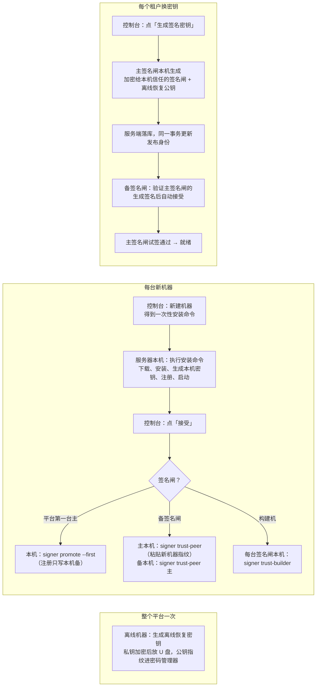

# 设计：签名闸部署与换密钥自动化（半自动）

状态：草案。2026-09-16

基于：`android-signing-gate-2026-09-16.md`（下称“原设计”）、ADR-0019、`deploy/amos/SIGNING_GATE_ROLLOUT.md`

一句话：**装机器和换密钥改成自动化，只保留会让“服务端被攻破”变成“能签恶意包”或“能偷走密钥”的那几步人工确认，并且这几步都在机器本机上做。**

## 为什么要改

第一次在 amos 上线，每一步都要人工操作：
- **每台新机器**：
  - 手工传部署包、跑安装脚本；
  - 手抄令牌；
  - 控制台手抄两个指纹；
  - `promote`、`trust-builder`。
- **每个租户换密钥**：
  - 离线机器上生成；
  - gpg 打包，放进两个 U 盘；
  - 带回上传文件到控制台；
  - 两台签名闸各 `confirm` 一次、逐项输入信任根。

运维成本太高，而且前提是能从本地 ssh 到服务器，实际并不具备。

## 已定事项

- **自动化程度选“半自动”**：
  - 新机器：在服务器本机执行一条命令，再在控制台点一次“接受”。
  - 新租户或换密钥：在控制台点一次“生成签名密钥”。
- **仍在签名闸本机人工确认**（低频，一年一两次）：
  - 信任新的构建机（`trust-builder`）；
  - 信任新的签名闸（`trust-peer`）；
  - 已有租户改了 API 地址、scheme 或 OTA 证书后重新确认信任根（`confirm`）。
- **全平台只做一次离线操作**：生成离线恢复密钥。签名密钥原件不再逐租户进 U 盘。
- **本次上线暂停**，先完成自动化，再用新流程给 AnyFun、Predict 生成新密钥。

## 本设计保证什么，不保证什么

与原设计相比：

| 服务端或数据库被攻破后，攻击者能不能… | 原设计 | 本设计 | 为什么 |
| --- | --- | --- | --- |
| 解开或偷走已有租户的签名密钥 | 不能 | 不能 | 密钥只加密给签名闸本机信任的签名闸与离线恢复公钥；新增收件人要在签名闸本机确认；被取代的旧主随 `promote` 从本机信任里撤销 |
| 让签名闸改用别的密钥签已有租户 | 不能 | 不能 | 本机记录按包名记着证书；新证书只接受本机或本机信任的签名闸生成的，本机是主时只接受自己生成的 |
| 让签名闸签指向攻击者服务端的包（已有租户） | 不能 | 不能 | 信任根变化要在签名闸本机重新确认 |
| 让签名闸签伪造构建机交付的包 | 不能 | 不能 | 构建机信任仍在签名闸本机确认 |
| 版本号乱签、同一 versionCode 签两个包 | 不能 | 不能 | 本机记录，不变 |
| 让新机器的本机记录直接成为主签名闸 | 不适用 | 不能 | 注册一律写本机备；主只由本机 `promote --first`/`--import` 产生（本轮收紧，见「实现记录与偏离」） |
| 让某台签名闸信任攻击者指定的签名闸或恢复公钥 | 不适用 | 不能 | `trust-peer`/`trust-recovery` 都要在本机粘贴指纹比对；注册不再自动信任服务端给的主（本轮收紧） |
| 冒充“服务端导出的密文文件”让运维恢复出攻击者的密钥 | 不适用 | 不能 | `build-keystore recover` 必须给 `--expect-certificate-sha256`，取值来自 RN-App 仓库 `tenants/<slug>/tenant.json` 或已发布 APK（本轮收紧） |
| **新租户第一次生成密钥时，写入错误的信任根** | 不能 | **能** | 租户在签名闸本机从没确认过时，信任根直接取服务端的值（首次信任）；已确认过的租户换包名会被拒 |
| **让签名闸无意义地换一把新密钥（老用户升不上去）** | 不能 | **能** | 控制台一键换密钥；新密钥仍由签名闸生成、攻击者拿不到，后果是拒绝服务 |
| **把 `publishedMaxBuildNumber` 抬高，让新证书首签就逼近版本号上限** | 不适用 | **能** | 首签上限取服务端的值，后果是此后发不了新版本（拒绝服务） |
| **扣住或乱序下发生成结果，让新备签名闸停在旧证书上** | 不适用 | **能** | 新备只按收到的第一份生成首次信任；现象是备与主证书不一致，要人工 `signer confirm`（拒绝服务） |
| **在新机器安装时下发篡改过的程序** | 不适用 | **能** | 安装包从服务端下载；只影响此后新装的机器，已在运行的签名闸不受影响 |

## 总体流程



## 1. 离线恢复密钥（整个平台一次）

取代原设计里“每个租户的密钥原件打包进两个 U 盘”。

- **生成**：离线工具新增 `build-keystore recovery-key create --out <目录>`：
  - 生成 X25519 密钥对。
  - 私钥用 scrypt 派生的口令加密，写成 `recovery-private.key`（0600）；口令手输两遍、不回显。
  - 同时写出 `recovery-public.json`（公钥与完整 sha256），并打印完整 sha256。
- **保管**：
  - 口令只放密码管理器；公钥指纹也记进密码管理器。
  - `recovery-private.key` 放两个离线 U 盘。
  - `STORAGE_MASTER_KEY` 的加密包（原设计「原件与配置机密的保管」第 1 步）仍然一起放进这两个 U 盘。
- **登记**：
  - 平台管理员在控制台「平台维护 → 签名闸恢复密钥」粘贴 `recovery-public.json` 的内容。
  - 服务端存进 `app_configs` 平台级键 `build.recovery.recipients`（公钥与完整 sha256，可多把）。
- **签名闸本机信任**：安装命令带 `--recovery-sha256 <指纹>`，由运维从密码管理器粘贴，不取控制台的值。签名闸从服务端取公钥，核对 sha256 一致后写进本机记录。以后要新增或更换恢复公钥，在签名闸本机执行 `signer trust-recovery`。
- **恢复**：离线工具新增 `build-keystore recover --recovery-key <文件> --upload <服务端导出的密文文件> --expect-certificate-sha256 <64hex>`，解开发给恢复公钥的那份密文，得到 `.p12` 与口令文件。之后按原设计 `seal` 流程重新加密给新签名闸。控制台提供“导出密文文件”，导出的文件**只含发给未吊销恢复公钥的那几份密文**（签名闸那几份不导出：吊销但没擦盘的签名闸私钥加上一次导出就能解开密钥）。
  - `--expect-certificate-sha256` 必填：恢复公钥是公开的，攻击者也能用它封装自己的密钥冒充导出文件。取值来自 **RN-App 仓库 `tenants/<slug>/tenant.json` 的 `signerSha256`**（git 历史里的值，不取控制台显示的值），或从已安装设备、已发布 APK 用 `apksigner verify --print-certs` 读。
  - 首次生成密钥后更新 `tenant.json` 时，证书 sha256 取**主签名闸本机** `signer list` 的输出，不取控制台。

## 2. 新机器：一条命令 + 控制台接受

### 控制台新建机器

- 新建机器不再显示长期令牌，改为显示**一次性安装命令**：
  ```
  curl -fsSL https://api.anyfun.win/v1/machine-setup/install.sh | sudo bash -s -- --code rne_…  [--recovery-sha256 <从密码管理器粘贴>]
  ```
- 签名闸必须带 `--recovery-sha256`；平台还没登记恢复公钥时，控制台不允许新建签名闸。
- 注册码：
  - 格式为 `rne_` 加 32 字节随机数的 base64url；服务端只存 sha256。
  - 有效期 60 分钟，只能使用一次，过期可以在控制台重发。
- 机器状态：`pending_enrollment` → 注册成功后 `pending_key` → 接受后 `active`。

### 服务器本机：`install.sh`

由服务端 `GET /v1/machine-setup/install.sh` 下发（`go:embed` 进服务端二进制，源文件放在 `deploy/setup/install.sh`），以 root 执行：

1. **检查前提**：
   - systemd、sudo、git、tmpfs 的 `/run`；
   - 签名闸需要 JDK 17；
   - 构建机需要 JDK 17、Android SDK、Node 22、pnpm、syft、zip。
   
   缺什么就列出来并退出，不自动装 SDK。
2. **查询注册码**：`POST /v1/machine-setup/describe {code}`（不消耗注册码），返回机器名、角色、主备、安装包清单（文件名、大小、sha256）。
3. **下载安装包**：下载 `GET /v1/machine-setup/bundle/<role>.tar.gz`，逐个核对 sha256。
4. **安装**：按角色安装。逻辑取自现在的 `1-install.sh`，但按机器名实例化：
   - **签名闸**：
     - 系统用户 `rn-signer-<实例>`（实例取机器名，例如 `amos-signer-a`）；
     - `/opt/rn-signer`、root 自有的 apksigner 副本；
     - 由模板渲染出 `rn-signer-<实例>.service`、`rn-signer-<实例>-check.socket`、`rn-signer-<实例>-check@.service`。
   - **构建机**：`rn-build-agent`、`builder` 两个用户，目录、sudoers、unit。从旧结构迁移的逻辑沿用 `1-install.sh`。
5. **注册**：执行 `signer enroll --server <API> --env-file /etc/rn-signer-<实例>.env [--recovery-sha256 …]`，注册码经环境变量 `RN_ENROLLMENT_CODE` 传入（`--code` 仍兼容，但会出现在 `ps` 里）；构建机是 `build-agent enroll …`。程序做这几件事：
   - 生成本机密钥；
   - 调 `POST /v1/machine-setup/enroll {code, 公钥…}`，拿到长期机器令牌，**直接写进 env 文件**，不经屏幕；
   - 写入本机初始角色，**一律是备**（只在全新机器上生效，已有记录时拒绝）。控制台登记为主的机器，要在本机停服务后 `signer promote --first`（平台第一台主）或 `--import`（替换旧主）再启动；describe 里的 `signerRole`、`primarySigner` 只用于提示；
   - 签名闸额外核对恢复公钥 sha256，并写进本机记录。
6. **启动服务**：打印机器名、完整指纹，以及下一步提示：去控制台接受；签名闸或构建机还要在已有签名闸上执行 `trust-peer` 或 `trust-builder`。

安装脚本可以重复执行：已经装过、注册过的步骤跳过。注册码只在第 5 步真正消耗。

### 控制台接受

- 机器卡片显示待接受的完整指纹，旁边是「接受」按钮，不再手抄。确认弹层里显示指纹和原因输入框。
- `accept-key` 请求体不变（仍然带指纹），由控制台从视图填入。
- 接受只影响服务端路由，这一点不变。

### 签名闸之间的信任：`signer trust-peer`

- 主签名闸生成密钥时，只加密给**本机信任的签名闸**，外加本机信任的恢复公钥。
- 本机默认信任自己。
- 新增一台签名闸时，运维登上**主签名闸**执行：
  ```
  signer trust-peer --peer <机器名>
  ```
  程序从服务端取这台签名闸已接受的公钥；运维粘贴新机器安装输出里的完整 X25519 与 Ed25519 指纹，比对一致后才写进本机记录、也才显示指纹（不让人照着屏幕抄）。
- 备签名闸信任主签名闸（用来验证生成签名）的方式：**在备本机执行 `signer trust-peer --peer <主机器名>`**，指纹取主签名闸本机 `signer show-key`（或它的安装输出）。
  注册**不会**自动信任服务端给的主：只改数据库的攻击者，本来可以在备注册那一刻把「主」换成自己的公钥，此后备会自动接受它签的生成（本轮收紧，见「实现记录与偏离」）。
- 换主签名闸时：新主本机 `promote --import`（会自动撤销对旧主的本机信任），其余备执行 `trust-peer --revoke` 撤销旧主、`trust-peer` 信任新主。
- 两台签名闸在同一台机器上（开发阶段 amos）时，两个实例分别执行 `trust-peer`（一条命令处理两个实例没有实现）。

### 构建机信任：`signer trust-builder`

保持原样，要在每台签名闸本机粘贴构建机安装输出里的出处公钥指纹。新增的简化：`--builder-id` 可以换成 `--builder <机器名>`，由程序从服务端取机器 id 与公钥来显示，指纹仍然要粘贴比对。

## 3. 换密钥：控制台一键

### 控制台

- 租户「配置中心 → 打包与签名 → 打包配置」签名密钥区新增主按钮「生成签名密钥」。
- 确认弹层写明：
  - 包名；
  - 已有密钥时：会换证书、老用户不能覆盖升级；
  - 需填写原因。
- 原来的“上传离线工具产出的文件”降级为“导入已有密钥（高级）”，用于恢复或迁移。

### 服务端

- 发起请求：`POST /v1/admin/build-keystore/generate`
  - 请求体 `{packageName, expectedVersion, releaseIdentityExpectedVersion, reason, confirm}`。
  - 包名必须等于租户 App 身份的 `androidPackage`。
  - 服务端写入租户级 `app_configs` 键 `build.keystore.request`：`{requestId, packageName, alias, requestedBy, requestedAt, keystoreVersion, releaseIdentityVersion, status: pending|done|failed, error}`，并写审计。
  - 已有未完成的请求时回 409 `KEYSTORE_GENERATION_IN_PROGRESS`。
- 签名闸取请求：`GET /v1/signer/keystore-checks` 的每个租户项增加 `generationRequest`，只下发给路由主签名闸。
- 签名闸交回：`POST /v1/signer/keystore-generations/:requestId`，请求体 `{upload: Upload, generator: {machineId, ed25519PublicKeySha256}, signature}`，服务端在同一事务里：
  - 请求仍是 `pending`，且 `keystoreVersion`、`releaseIdentityVersion` 没变（否则 409 并把请求标 failed）；
  - 上传文件按 `PUT /build-keystore` 的全部规则校验：格式、slug、包名、旧指纹、收件人；
  - **收件人范围放宽**：可以是已登记的签名闸，也可以是 `build.recovery.recipients` 里的恢复公钥；**必须至少包含一把恢复公钥**；
  - 生成者必须是路由主签名闸，用它登记的 Ed25519 公钥验证 `signature`；
  - 写 `build.keystore`，更新发布身份（沿用 ADR-0016 的同事务），请求标 `done`，写审计 `build_keystore_generated`。
- 生成签名：Ed25519 签在 `"rn-keystore-generation/v1\n" + requestId + "\n" + sha256(规范化的 Upload JSON)` 上。

### 主签名闸

- 在 `run` 循环里处理 `generationRequest`，只有本机角色是主时处理。
- 生成：
  - 用 `releasekey.Generate` 生成 RSA 4096 证书和 PKCS#12；明文只在内存里。
  - 按**租户**首次信任信任根：本机对这个租户（不只是这个包名）从没有过确认记录时，用服务端 `trustRoots` 写入确认记录，确认人记为 `auto:first-generation`，minSdk/targetSdk 下限取 24/28；首签 versionCode 上限：本机对这个包名有签名历史时取历史最大 versionCode 加 100，没有历史时取服务端该平台已发布的最大 build 号加 100（首次信任，服务端可借此造成拒绝服务）；
  - 本机对这个租户确认过别的包名时，不走首次信任，回报 `TRUST_ROOTS_CHANGED`；
  - 本机对这个包名已有确认记录、而服务端的信任根摘要与记录不同时，不生成，回报 `TRUST_ROOTS_CHANGED`，要求先在本机 `confirm`；
  - 已有确认记录且摘要相同时，沿用原有信任根，只把证书换成新生成的，确认记录注明 `auto:regenerated`。
- 加密：用 v3 box 加密给本机信任的所有签名闸（含本机），以及本机信任的全部恢复公钥。本机没有信任任何恢复公钥时不生成，回报 `RECOVERY_KEY_NOT_PINNED`。
- 签名并交回：签生成签名后调接口，成功后确认记录生效。

### 备签名闸

在 `keystore-checks` 里拿到新密文时：
1. 服务端下发 `generator`、`generationSignature`、`generationRequestId` 与完整 `upload`（存在 `build.keystore` 记录里）；缺任何一项都不自动接受；
2. 生成者必须是本机 `trust-peer` 过的签名闸，且生成签名有效；**本机是主时只接受自己签的生成**，别人签的退回人工 `confirm`；
3. 解开 box，核对证书与上传文件一致；
4. 确认参数取**密文里绑定的** `generation`（信任根摘要、minSdk/targetSdk、首签上限、被取代的证书），不取服务端下发的值：
   - 本机已有确认：被取代的证书必须等于本机当前证书（服务端不能重放更早的一次生成）；
   - 本机没有确认：服务端下发的信任根摘要必须等于绑定的摘要（服务端不能给新备另一套信任根），且本机对这个租户没有确认过别的包名；
   - 写入前逐字段复核计划参数，其间有任何写入就重算；
   - 确认人记为 `auto:peer-generated:<主签名闸机器名>`。

已知限制：新备只按收到的**第一份**生成首次信任。备离线期间主连换两把、或服务端扣住中间那把时，备停在旧证书上，要人工 `signer confirm`。服务端侧的缓解：当前密钥的收件人里还有 active 签名闸没确认这一版时，发起换密钥返回 409 `KEYSTORE_SIGNERS_NOT_IN_SYNC`，控制台要明确勾选「仍然生成」才继续。

没有生成签名的密文（离线导入的）仍然走原来的 `signer confirm`。

## 4. 就绪与控制台展示

- 新增就绪问题码（追加在枚举末尾）：
  - `RECOVERY_KEY_NOT_CONFIGURED`：平台没有登记恢复公钥。
  - `KEYSTORE_GENERATION_PENDING`：已发起生成，主签名闸还没交回。
  - `KEYSTORE_GENERATION_FAILED`：生成失败，附签名闸报回的原因（例如 `TRUST_ROOTS_CHANGED`、`RECOVERY_KEY_NOT_PINNED`、`PEER_NOT_TRUSTED`）。
- 机器视图新增 `reportedTrust`：由签名闸在 `keystore-checks` 里上报，内容是本机信任的签名闸、构建机、恢复公钥的 sha256 列表。控制台据此提示：
  - “主签名闸还没信任备签名闸，新密钥不会加密给它”；
  - “签名闸还没信任构建机”；
  - “签名闸没有信任恢复公钥”。
  
  这只是显示，签名闸不采信服务端。

## 5. 安装包的来源

- **打包**：CI 部署服务端时，同时构建安装包：
  - 签名闸包：`signer`、`signer-check`、unit 模板、`install.sh`；
  - 构建机包：`build-agent`、`build-runner`、unit、sudoers。
  
  由 `rn-foundation-apply` 放到 `/opt/rn-foundation/machine-bundles/<提交>/`，服务端从这里提供下载，清单里带 sha256。
- **残余风险**：服务端被攻破时，可以下发篡改过的安装包给**新装**的机器。已经在运行的机器不从服务端自动升级。
- **生产要求**：签名闸的安装包 sha256 要和 CI 构建日志核对后再安装；安装命令支持 `--expect-sha256 <清单 sha256>`。

## 6. amos 现有部署的迁移

amos 上已经按手工流程装好 `amos-signer-a`、`amos-signer-b`、`amos-builder`，不重装，只补齐：

1. 升级两台签名闸与构建机的二进制（新版本兼容现有本机记录）。
2. 离线生成恢复密钥，在控制台登记。
3. 两台签名闸本机执行：
   - `signer trust-recovery`（粘贴恢复公钥指纹）；
   - `signer trust-peer`（互相信任，同机时一次完成）。
4. 控制台对 AnyFun、Predict 各点一次「生成签名密钥」。
5. 排第一个新签名的安装包，按上线手册第 9 步验证并发布。

`/etc/rn-signer-a.env` 等现有文件、unit 名不改。新装机器使用按机器名实例化的 unit 名，两种命名并存。

## 7. 删除与保留

| 项 | 处理 |
| --- | --- |
| 离线工具 `create`（离线生成原件） | 保留，作为高级导入路径 |
| 离线工具 `seal` | 保留，用于从恢复密钥解出原件后重新加密给新签名闸 |
| `PUT /v1/admin/build-keystore`（上传文件） | 保留，界面降级为“导入已有密钥” |
| 控制台显示长期令牌 | 删除，改为一次性安装命令 |
| 控制台手抄指纹接受公钥 | 删除，改为显示指纹 + 点击接受 |
| `deploy/amos/signing-gate-rollout/0–3` 脚本 | 被 `install.sh` 取代，保留到 amos 迁移完成后删除 |
| `SIGNING_GATE_ROLLOUT.md` | 改写为“新机器 = 一条命令、换密钥 = 一键”的版本，并附 amos 迁移步骤 |

## 8. 复用映射表

| 拟新增 | 结论 | 理由 |
| --- | --- | --- |
| 注册码（sha256、有效期、是否已用） | 合并进 `build.machines` 机器项的 `enrollment` 字段 | 同一实体的一次性状态，写方只有服务端 |
| 恢复公钥 | 复用 `app_configs` 平台级键 `build.recovery.recipients` | 平台级配置，条目少 |
| 生成请求 | 复用 `app_configs` 租户级键 `build.keystore.request` | 每个租户同时最多一个，写方明确 |
| 生成者与签名 | 合并进 `build.keystore` 记录 | 属于这份密文的元数据 |
| 签名闸上报的本机信任列表 | 合并进 `build.machines` 机器项的 `reportedTrust`，只在变化时写 | 同 `reportedLocalRole` |
| 安装包 | 不进库，放在服务器文件系统 | 属于部署产物 |

## 9. 测试

- **服务端**：
  - 注册码一次性、过期、重发；
  - enroll 竞态（同一注册码并发两次，只成功一次）；
  - 生成请求的状态机与版本冲突；
  - 收件人必须含恢复公钥；
  - 生成签名必须来自路由主签名闸；
  - 就绪新问题码。
- **签名闸**：
  - `enroll` 写 env 不回显令牌、拒绝对已有记录重复初始化；
  - 主签名闸生成：首次信任、沿用信任根、摘要变化拒绝；
  - 只加密给本机信任的签名闸与恢复公钥（服务端登记了多余的签名闸也不加密给它）；
  - 备签名闸只接受本机信任的生成者；
  - `trust-peer`、`trust-recovery` 的 TTY 与粘贴比对。
- **离线工具**：恢复密钥生成与 `recover` 往返（生成 → 用签名闸流程加密 → 用恢复私钥解开 → 证书一致）。
- **install.sh**：
  - 在干净容器（或 systemd-nspawn）里分别装签名闸与构建机；
  - 重复执行幂等；
  - sha256 不符时拒绝；
  - 缺前提时列出并退出。
- **本机端到端**：沿用 `/tmp/rn-e2e` 环境，从“控制台新建机器 → 本机一条命令 → 控制台接受 → trust-peer / trust-builder → 一键生成密钥 → 排包 → 签名成功”走一遍，再验证服务端被攻破时的几条负面场景：
  - 登记多余签名闸，新密钥不会加密给它；
  - 伪造生成签名，备签名闸拒绝；
  - 改信任根，主签名闸拒绝生成。

## 实现记录与偏离

2026-09-17 按实现与对抗评审补记。接口以 `contracts/openapi.json`（2026.09.25）为准，决策与理由见 ADR-0020。

### 服务端

- **就绪问题码的范围**：第 4 节新增的 `RECOVERY_KEY_NOT_CONFIGURED`、`KEYSTORE_GENERATION_PENDING`、`KEYSTORE_GENERATION_FAILED` 只在租户**还没有可用的 v3 密钥**时出现。已有可用密钥的租户换密钥期间照常用旧密钥签；生成中、生成失败只在「签名密钥」一节的生成状态里显示，不算不就绪（否则一次没成功的换密钥会把正在出包的租户卡死，而且没有取消入口）。
- **包名**：第 3 节说包名必须等于 App 身份的 `androidPackage`。实际比的是 `release.android` 的包名；还没有发布身份的新租户生成时包名取请求里的，不受 `androidPackage` 约束，交回时与证书一起写进 `release.android`。但包名不能是别的租户 `release.android` 或 `build.keystore` 在用的：发起生成与导入都 409 `ANDROID_PACKAGE_IN_USE`（不说是哪个租户）。签名闸本机按包名把关本来也会拒绝，这里是提前报错、免得白白生成。
- **重发注册码**：对已吊销的机器 409 `MACHINE_REVOKED`（已注册的仍是 `MACHINE_ALREADY_ENROLLED`）；重发签名闸的注册码与新建一样要求平台有未吊销的恢复公钥（409 `RECOVERY_KEY_NOT_CONFIGURED`，旧码不作废）。
- **待生成请求 30 分钟超时**：只按版本号推导失败时，主签名闸离线或信任根算不出来（不下发）的请求会永远 `pending`、再点生成永远 409。现在 `pending` 超过 30 分钟（服务端时钟）读的时候就推导为 `failed` + `KEYSTORE_GENERATION_TIMED_OUT`，可以重新发起；下发、就绪、控制台、再次发起、交回与失败报告走同一个判断，超时之后才到的交回与失败报告 409 `KEYSTORE_GENERATION_STALE` 并把超时写回库。
- **交回必须包含主签名闸自己的密文**：收件人里没有生成者当前接受的 X25519 公钥 → 422 `KEYSTORE_PRIMARY_RECIPIENT_MISSING`。否则交回成功后发布身份换成新证书，主签名闸却解不开这个租户，就绪永远 `PRIMARY_SIGNER_NOT_RECIPIENT`。
- **导出只含恢复收件人的密文**：第 1 节「恢复」只说"控制台提供导出密文文件"。导出文件只保留发给未吊销恢复公钥的 box（没有 → 409 `BUILD_KEYSTORE_EXPORT_NO_RECOVERY_RECIPIENT`），发给签名闸的不带：租户管理员都能导出，带上的话一台被吊销但没擦盘的签名闸私钥加上任何一次导出就能解开密钥。`build-keystore recover` 只解发给恢复公钥的那份、核对明文与外层字段，不校验生成签名，不受影响。导出与审计同一个事务，审计写不进去就不导出。恢复路径仍是 导出 → `recover` → `seal` → 导入。
- **吊销恢复公钥后的视图**：`GET /v1/admin/build-keystore` 的 `recoveryRecipients` 仍含已吊销的恢复公钥，另加 `revokedRecoveryRecipients`（其中已吊销的子集）；全部吊销时控制台提示这把密钥已没有可用的离线恢复。
- **`trust` 可以缺**：第 4 节的 `reportedTrust` 由签名闸每轮上报。迁移时 CI 先把服务端推上线、签名闸二进制人工升级，中间几个小时里旧签名闸不带 `trust`：上报照常收下（本机角色与检查结论照常更新），`reportedTrust` 记成 null，控制台显示为未上报。
- **panic 日志**：服务端不再用 `gin.Recovery()`（debug 模式下会把 `x-enrollment-code`、`x-machine-token` 等请求头原样打进日志），panic 只记 panic 值、路由模板、request id 与堆栈。

### 签名闸与安装（已知偏离）

- **生成确认参数绑进密文**：主签名闸把本机确认的信任根摘要、minSdk/targetSdk 下限、首签 versionCode 上限与被替换的证书（`keystorebox.Generation`）写进密文明文，被生成签名覆盖。备签名闸按它核对，而不是像第 3 节写的"按主签名闸同样的规则"自己再算一遍：服务端既不能给备签名闸另一套信任根，也不能把更早的一次生成重放回来。代价：备签名闸离线期间主签名闸**连续换了两次密钥**时，第二次替换的证书不是备签名闸本机当前的证书，备签名闸不会自动接受，要在它本机人工 `signer confirm`。
- **`trust-peer` / `trust-builder`**：第 2 节写"程序从服务端取公钥显示出来，运维粘贴指纹比对"。实际上程序先只显示机器信息（名称、机器 id、服务端登记的主备），不先显示指纹；运维粘贴从那台机器安装输出（或它本机 `signer show-key`）抄来的完整指纹，与服务端已接受的一致才写入，写入之后才把指纹打出来——免得运维照着屏幕上服务端给的值抄一遍当作核对。
- **unit 模板不写死 `IPAddressDeny`**：API 地址因机器而异，模板里只写注释，上线后用 drop-in 收紧到 API 与 DNS 解析器地址（amos 现有的 a/b unit 仍写死 localhost）。
- **安装脚本位置与前提**：第 2 节写源文件放在 `deploy/setup/install.sh`，实际在 `internal/machinesetup/install.sh`（`go:embed` 进服务端）。比第 2 节多了两处：签名闸可选 `--apksigner-jar <路径>`（指定 Android build-tools 35.0.0 的 `apksigner.jar`，按 sha256 核对；不指定时在常见 SDK 位置找）；前提检查多了 `python3`（脚本用它按形状校验、解析服务端的 describe 回答与 problem code，不把服务端给的字符串交给 shell）。
- **本机角色与首次信任收紧**（对抗评审后改的，第 2 节正文已同步）：`enroll` 一律写本机备、忽略 describe 里的 `signerRole`；主只由本机 `promote --first`/`--import` 产生，且 `--first` 拒绝已经接受过别的签名闸生成密钥的机器。备**不再**在注册时自动信任服务端给的主，要在本机 `trust-peer`。`promote --import` 会自动撤销对被取代的旧主的本机信任（旧主若要重用，按新机器重装再 `trust-peer`）。修复前开发版写下的这两类记录（注册即为主、`enroll-first-trust`）新版签名闸回放时直接拒绝。
- **`recover` 必须核对证书**：见第 1 节。攻击者可以用公开的恢复公钥封装自己的密钥冒充导出文件，`recover` 自己验证不了来源，锚点放在 RN-App 仓库与已发布 APK 上。
- **换密钥的同步闸**：当前密钥的收件人里还有 active 签名闸没确认这一版时，`POST /v1/admin/build-keystore/generate` 返回 409 `KEYSTORE_SIGNERS_NOT_IN_SYNC`；控制台勾选「仍然生成」（`allowUnconfirmedSigners=true`）才继续，勾选项写明没跟上的签名闸之后要人工 `signer confirm`。本地端到端实测：备签名闸在线，但一轮检查里连换两把密钥，它此后每一把都会拒绝。
- **上报的信任列表始终是数组**：空列表曾被存成 `null`，控制台按数组校验，整份机器列表读不出来。上报时归一化成 `[]`，视图层对旧数据兜底。
- **注册码经环境变量**：`RN_ENROLLMENT_CODE`（`--code` 仍兼容）。`curl … | sudo bash -s -- --code …` 这一层挡不住，本机其他用户能从 `ps` 与 sudo 日志读到；后果是这次注册被抢注失败（控制台仍要人工比对指纹后接受），重发注册码即可。手册写明要在没有其他不受信本机用户的机器上执行。
- **旧结构迁移重建仓库镜像与 `~/.ssh`**：旧结构里 `/var/lib/rn-build-agent` 是 `builder` 的家目录，仓库镜像与 `~/.ssh` 都曾归它可写，而控制进程 `git fetch` 会读仓库本地配置（`core.sshCommand`、`remote.*.uploadpack`、`include.path` 等都能执行命令）与 `~/.ssh/config`。迁移时旧镜像整个留存、以 `rn-build-agent` 重新克隆，`~/.ssh` 只保留 deploy key 并用脚本固定的 GitHub 主机公钥重写 `known_hosts`；控制进程另外固定 `GIT_SSH_COMMAND`（`-F /dev/null` + 固定 `known_hosts`），并在 fetch 前按白名单核对镜像配置与结构，不符就让任务失败。deploy key 私钥曾对 `builder` 可读，建议在 GitHub 上换一把。
- **install.sh 以 root 运行时的隔离**：`python3` 一律 `-I`（隔离模式，当前目录与 `PYTHON*` 环境变量都不进 `sys.path`），脚本开头固定工作目录、`umask` 与 `PATH`；否则运维在 `/tmp` 里执行安装时，本机任何用户预先放一个 `json.py` 就能以 root 执行。
- **`build-agent enroll` 建出处密钥**：用 `os.OpenRoot` 在状态目录内创建，不跟随路径前缀上的符号链接（否则 `rn-build-agent` 若已被攻陷，可让 root 把密钥文件建进任意 root-only 目录）。
