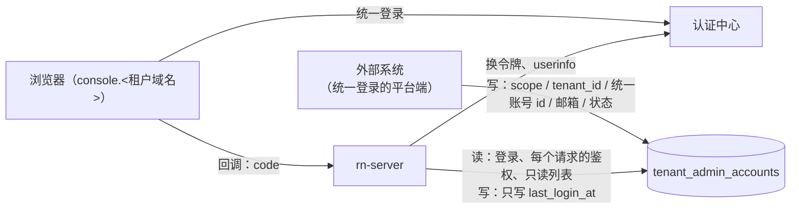

# 控制台账号由外部系统维护，RN 只按自己的规则鉴别（2026-09-27）

> 状态：设计已定（用户 2026-09-27 确认），已实施（本地提交，待推送与合并），实施记录见第 9 节。
> 取代 [platform-accounts-and-console-login-2026-09-27.md](platform-accounts-and-console-login-2026-09-27.md)（下称「平台账号设计」）与 [tenant-console-accounts-and-sso-2026-09-25.md](tenant-console-accounts-and-sso-2026-09-25.md)（下称「账号设计」）里所有「RN 自己建号、发初始口令、本人绑定、在控制台停用与重置」的部分。两份设计里的会话隔离、Origin 检查、统一登录接入方式、邮箱二次验证、控制台里的登录页照旧有效。

## 1. 用户的决定（2026-09-27）

1. **不要本地口令，也不要本地账号**。账号由统一登录的平台端分配，直接写进 `tenant_admin_accounts`。
2. **账号是平台管理员还是租户成员，由别的系统管理维护**。RN 不管这些数据在哪里维护，只按自己的规则鉴别。
3. **用 `tenant_admin_accounts.scope` 区分平台管理员与租户管理员**。
4. **成员不能升级为平台管理员**，是平台管理员还是租户成员，只在最初分配时决定。
5. **同一个统一账号可以是多个租户的成员**，每个租户一条记录，登录时只看当前控制台域名所属租户的那一条。
6. **同一个统一账号既有平台记录又有租户记录**，按第 4 条不会出现。万一外部系统写错了，RN **拒绝登录并记日志**，不去猜用哪个身份。
7. **控制台保留只读列表**：平台管理员能看到有哪些成员和平台管理员，以及各自的状态和最近登录时间，但不能改。
8. **环境变量账号（`ADMIN_USERNAME`）的删除时间不变**：等外部系统写好第一条平台管理员记录，并用统一登录验证能进平台维护之后，再做平台账号设计里的「发布 2」。

## 2. 分工



| | 谁负责 |
| --- | --- |
| 分配、停用、换人、删除账号 | 外部系统（写 `tenant_admin_accounts`） |
| 统一账号的口令、找回 | 认证中心 |
| 登录时认人、每个请求校验会话、二次验证、租户隔离 | RN |
| 账号变更的审计 | 外部系统自己记。RN 只审计自己做的事（二次验证、配置改动等） |

## 3. 表的契约（外部系统照这个写）

`tenant_admin_accounts`，迁移 64 之后：

| 列 | 外部系统写不写 | 规则 |
| --- | --- | --- |
| `id` | 不写（自增） | 会话与审计里的账号 id |
| `scope` | 写 | `platform`=平台管理员；`tenant`=租户成员 |
| `tenant_id` | 写 | 租户成员填 `tenants.id`；平台管理员填 NULL。CHECK `ck_tenant_admin_scope` 保证与 `scope` 一致 |
| `tenant_key` | 不写（生成列） | `IFNULL(tenant_id,0)`，唯一键用 |
| `idp` | 可不写 | 默认 `chainup-cid` |
| `idp_subject` | 写 | 认证中心的账号 id（userinfo 的 `username`），**小写 uuid**。CHECK `ck_tenant_admin_subject` 挡住大写和非 uuid |
| `email` | 写 | **二次验证码发到这个邮箱**，必须是本人能收信的邮箱。CHECK `ck_tenant_admin_email` 只做最粗的格式检查 |
| `display_name` | 写 | 界面上显示的名字，可以为空串 |
| `status` | 写 | `active` / `disabled`，默认 `active`。CHECK `ck_tenant_admin_status` |
| `created_by` | 可写 | 谁分配的（外部系统自己的操作人），默认空串，只用于显示 |
| `created_at` / `updated_at` | 可不写 | 数据库默认当前时间，`updated_at` 行被改时自动更新 |
| `last_login_at` | 不写 | RN 登录成功时写（写的时候不动 `updated_at`） |

唯一键 `uq_tenant_admin_idp (tenant_key, idp, idp_subject)`：同一个统一账号在一个租户里最多一条，平台管理员里最多一条。索引 `ix_tenant_admin_subject (idp, idp_subject)`：登录时按统一账号查出它的所有记录。

外部系统改了什么，RN 什么时候知道：

| 外部系统的操作 | RN 的反应 |
| --- | --- |
| 新增一行 | 这个人下次统一登录就能进 |
| `status` 改成 `disabled`，或删掉这一行 | 这个账号的会话在下一个请求就失效 |
| 改 `idp_subject`（换人） | 旧会话在下一个请求失效（会话记着登录时的统一账号 id，对不上就当没登录），新的人下次登录能进 |
| 改 `scope` / `tenant_id` | 旧会话在下一个请求失效（按会话的类型回表查不到），按新身份重新登录 |
| 改 `email` | 下一次发二次验证码就发到新邮箱；已经发出的码作废 |
| 给已有平台记录的统一账号再加一条租户记录（写错） | 这个人下次登录被拒（第 4.1 节）；已经登录的平台会话到期前不受影响 |

**外部系统的数据库账号**：只给这张表的读写，外加读租户 id 与域名的对照。建议由管理这台 MySQL 的人执行（RN 这边不代建）：

```sql
CREATE USER '<外部系统>'@'<来源地址>' IDENTIFIED BY '<口令另行交付>';
GRANT SELECT, INSERT, UPDATE, DELETE ON <rn 库>.tenant_admin_accounts TO '<外部系统>'@'<来源地址>';
GRANT SELECT (id, slug, status, deleted) ON <rn 库>.tenants TO '<外部系统>'@'<来源地址>';
GRANT SELECT (tenant_id, domain, status, deleted) ON <rn 库>.tenant_domain TO '<外部系统>'@'<来源地址>';
```

## 4. RN 的鉴别规则

### 4.1 统一登录回调

回调拿到统一账号 id（小写）后，查出 `idp='chainup-cid' AND idp_subject=?` 的全部记录，然后：

| 记录 | 结果 |
| --- | --- |
| 有平台记录，同时还有任何一条租户记录 | 拒绝，`cidError=identity_conflict`；日志记下统一账号 id 与这几行的 id |
| 只有平台记录 | `active` → 平台会话（在任何控制台域名上都有效）；`disabled` → `cidError=disabled` |
| 有当前域名所属租户的记录 | `active` → 这个租户的会话；`disabled` → `cidError=disabled` |
| 其余（没有记录，或只有别的租户的记录） | `cidError=no_access`。不自动开户 |

登录成功时写 `last_login_at`，会话里记下账号 id 与登录时的统一账号 id（`admin_sessions.idp_subject`，迁移 64 新加）。

### 4.2 每个请求

沿用账号设计 §3.3 与平台账号设计 §3.2，外加两条：

- 账号必须是 `active`。以前只拦 `disabled`，现在不是 `active` 的一律不认；
- 账号当前的 `idp_subject` 必须等于会话里记的那个。

平台会话按 `scope='platform'` 回表，租户会话按 `tenant_id=会话租户` 回表，并且只在这个租户的域名上有效。

### 4.3 二次验证

不变（ADR-0023、平台账号设计 §3.5）：验证码发到这一行的 `email`。

平台管理员做平台维护的写操作要验；租户成员做敏感操作要验。有可用的平台管理员时，不能删发信配置。

## 5. 删掉的东西

| 删掉 | 原来在哪 |
| --- | --- |
| 账号的初始口令登录；`pending_bind` 状态与 403 `BIND_REQUIRED` | `admin_session.go` |
| 绑定流程：`cid/start?mode=bind`、回调里的绑定分支、`GET /auth/cid/bind`、`POST /auth/cid/bind/code`、`POST /auth/cid/bind/confirm`、绑定验证码与绑定通知邮件 | `cid_login.go`、`cid_bind_code.go` |
| 控制台里的建号、停用、解绑重置（租户成员与平台管理员）；「不能动自己」「不能停用最后一个平台管理员」 | `tenant_accounts.go`、`server.go` |
| 建号命令 `rn-server admin platform-account create\|reset` | `cmd/server` |
| 登录名：`login_name` 列、两边互不重名的检查 | 表、`tenant_accounts.go` |
| 表里的 `password_hash`、`password_expires_at`、`idp_email`、`bound_at` | 表 |
| RN-Admin：绑定确认页、成员页与平台管理员页的添加、停用、重置、初始口令弹框 | RN-Admin |

保留：

- `POST /v1/admin/auth/login`：只剩环境变量账号能用，发布 2 删掉。`GET /v1/admin/auth/methods` 的 `password` 改成「配了环境变量账号才是 true」，发布 2 之后自然变成 false，登录页就不再显示口令表单。
- 只读列表：`GET /v1/admin/tenant-accounts`（当前域名的租户）与 `GET /v1/admin/platform/accounts`，都只给平台管理员。
- 邮箱二次验证的验证码存法与限流（原来和绑定验证码共用一套，现在只剩二次验证在用，挪进 `second_factor.go`）。

## 6. 迁移 64

每一步都能重复执行：

1. 删掉过不了新约束的行，连同这些账号的会话：`idp_subject` 为 NULL（从没绑定过）、不是小写 uuid、邮箱不像邮箱、状态不是 `active` / `disabled`。这些行在新规则下登不进来或收不到二次验证码，不删的话第 4 步加 CHECK 会失败。线上 2026-09-27 只读核对过：只有一个租户成员 fuyu（已绑定、`active`），没有平台账号，所以这一步在线上什么都不删。
2. 删索引 `uq_tenant_admin_login`、`ix_tenant_admin_login_name`，删列 `login_name`、`password_hash`、`password_expires_at`、`idp_email`、`bound_at`。
3. `idp` 改成 NOT NULL，默认 `chainup-cid`；`idp_subject` 改成 NOT NULL；`display_name` 与 `created_by` 默认空串；`status` 默认 `active`；`created_at`、`updated_at` 默认当前时间，`updated_at` 自动更新。
4. 加 CHECK：`ck_tenant_admin_status`、`ck_tenant_admin_subject`（`REGEXP_LIKE(idp_subject, '^[0-9a-f]{8}-…$', 'c')`，区分大小写）、`ck_tenant_admin_email`（`email LIKE '_%@_%._%'`）。在本机 MySQL 8.0.46 上试过，大写 uuid、`fuyu` 这样的登录名、没有 @ 的邮箱都会被拒。
5. `admin_sessions` 加 `idp_subject`，并把现有账号会话回填成账号当前的统一账号 id：这些会话本来就是这个人登出来的，不用让人重新登录。
6. 更新表与列的注释：写明由外部系统写入，RN 只读。

## 7. 上线

| 步骤 | 内容 | 谁做 |
| --- | --- | --- |
| 1 | 合并 RN-Server 与 RN-Admin 的 PR，迁移 64 随部署执行 | 我写，用户合并 |
| 2 | 给外部系统开数据库账号（第 3 节的 GRANT） | 管这台 MySQL 的人 |
| 3 | 外部系统写第一条平台管理员记录（用户自己的统一账号）。外部系统还没接好时，可以由有库权限的人手工 INSERT 一行（写线上库，先问） | 外部系统 / 用户 |
| 4 | 用这个统一账号在控制台登录，过二次验证，进平台维护做一次写操作，验收 | 用户 |
| 5 | 发布 2：删掉环境变量账号的代码；从 `/etc/rn-foundation.env` 删掉 `ADMIN_USERNAME`、`ADMIN_PASSWORD_HASH` | 我写代码；amos 上的删除由用户以 root 执行 |

不改 `go.mod`，不碰打包机的构建输入，**打包机不用重签**。

## 8. 残留风险

- **能写这张表的人，就能给任何统一账号开平台管理员**，而且连二次验证用的邮箱也是他写的，二次验证挡不住他。这张表的写权限等同于平台最高权限：外部系统的数据库账号只给这张表，口令只放在外部系统里。
- 身份冲突只在登录时检查（第 3 节最后一行）。已经登录的平台会话要到会话过期才会失效；需要立刻踢人时，把那一行改成 `disabled`。
- 认证中心停摆时，账号都登不进控制台（平台账号设计 §3.7 的代价不变）。外部系统停摆不影响登录，RN 只读本地这张表。
- RN 不再审计账号变更。事后要查「谁在什么时候给谁开了权限」，得去外部系统查。

## 9. 实施记录（2026-09-27）

RN-Server 与 RN-Admin 的分支都叫 `feat/external-accounts`，都从各自的 origin/main 开。

**与上面设计不一样、或设计里没提的地方**：

| 设计里写的 | 实现 | 理由 |
| --- | --- | --- |
| 没提 | 平台管理员账号改 app-config 的钱包段也要二次验证 | 发布 1 留下的漏洞：这里的判断写的是「平台会话就不用验」，平台管理员账号也是平台会话，于是不用验就能改所有用户的链端点。平台账号设计 §3.5 要求平台账号的敏感操作都要验。改成与其它敏感路由一样按「有没有账号」判断；新加的用例在旧写法上会失败（200），新写法 403 |
| 迁移只删没绑定过的行 | 过不了新约束的行都删：账号 id 不是小写 uuid、邮箱不像邮箱的也删 | 不删的话加 CHECK 会失败。线上只有 fuyu 一行，已核对合规 |
| 二次验证码的存法与限流沿用绑定验证码 | 挪进 `second_factor.go`，改名 `emailCodeStore`；RN-Admin 的文案键 `bindCode*` 同样改成 `emailCode*` | 绑定没了，只剩二次验证在用 |
| 登录页 | 口令表单只在 `methods.password` 为 true 时显示（配了环境变量账号） | 发布 2 删掉环境变量账号之后，登录页只剩「统一登录」，不用再改控制台 |
| 删发信配置的保护看「存在平台账号」 | 改成看「存在可用的平台账号」 | 停用的平台管理员登不进来，不需要二次验证 |

**验证**：

- RN-Server：`gofmt`、`go vet ./...` 通过；不连库的包 `go test -race` 全过；`internal/api`、`internal/store` 在新建的独立测试库上 `go test -race -p 1` 全过（包括全部库测）。
- 迁移 64 在旧数据上跑过：用 origin/main 的代码建库到迁移 63，造了待绑定、已绑定、账号 id 不合规的租户成员、已绑定的平台管理员和它们的会话，再用新代码升级。结果：该删的行连同会话都删了；保留的行，会话的 `idp_subject` 已回填；环境变量账号的会话没动。
- 新的库测：`TestDBTenantAccountsAndUnifiedLogin`（外部系统写行后统一登录、没有记录 `no_access`、多租户按域名选、换人、停用、改租户、删行后会话失效、`last_login_at` 不动 `updated_at`、数据库挡住写错的行）、`TestDBPlatformAccounts`（平台会话在任何域名有效、二次验证、只读列表、身份冲突拒绝登录、停用、发信配置保护）；另有 `TestAccountForLogin` 覆盖回调规则的每种组合。
- RN-Admin：`pnpm check` 全过（58 个测试文件、696 项）。`pnpm layout:audit` 没跑：它要真实浏览器和能登录的环境。列表只是去掉操作列、加了一列统一账号 ID，上线后再在真实环境跑一次。
- 不改 `go.mod`，不碰打包机的构建输入，打包机不用重签。

**合并顺序**：先合 RN-Admin，再合 RN-Server。新控制台遇到旧服务端：会话照常能解析（多出来的字段忽略），只是两个只读列表会报「读不到」，等服务端部署完就好。反过来，旧控制台遇到新服务端会话时会校验失败（新服务端不再返回 `bindRequired`），整个控制台打不开，直到新控制台部署完。

