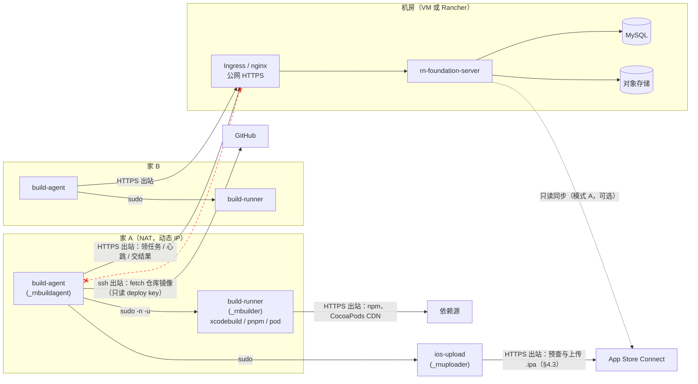
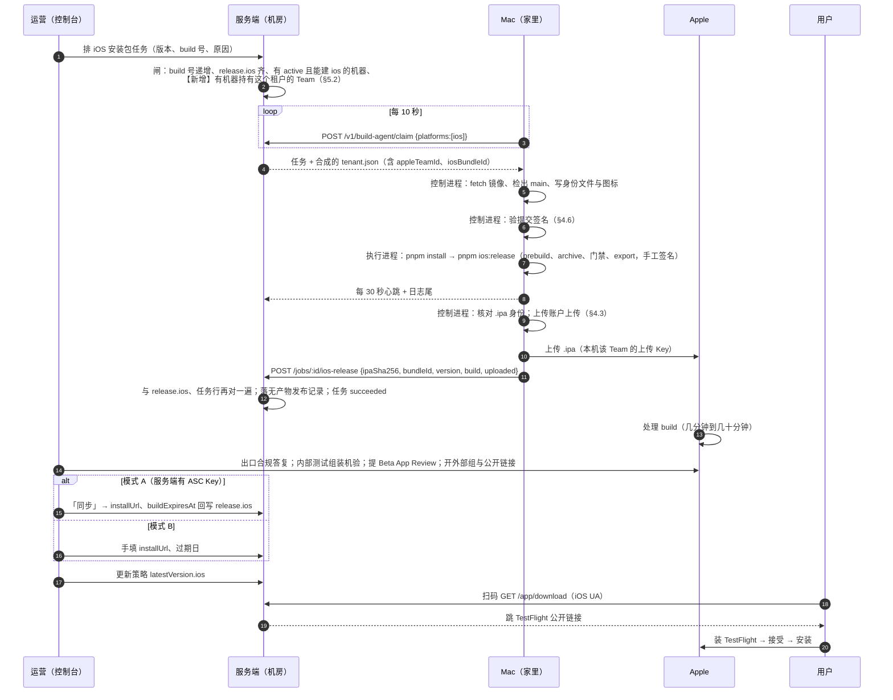

# 设计：家用网络里的 Mac 打包机与机房里的管理端怎么配合出 iOS 包

状态：设计（2026-09-18）。同日经三路对抗评审（安全、macOS/Apple 与运维、代码一致性）修订，评审记录见 §11。在 `ios-testflight-distribution-2026-09-17.md` 已实现的阶段 0–1 之上，回答它 §4.8 末尾与 §6 第 13 条留下的问题：**服务端跑在机房（虚拟机或 Rancher），Mac 打包机是家里的电脑、没有公网地址、可能有好几台**，两边怎么配合把 iOS 包打出来、发出去。

不改动已定的安全论证（`build-service-2026-09-11.md`：服务端不下发命令、签名材料不经服务端、任务只带参数）。本文引用的代码以 `origin/main` 2026-09-18 为准。

## 0. 一句话结论

**现有的打包机模型就是为这种网络写的。** 打包机「只出不进」：本机令牌 + 轮询认领，服务端从不连它（`cmd/build-agent/main.go` 包注释、`agent.serve`）。家用 NAT、动态 IP、没有端口映射都不构成障碍——Mac 只需要能出站到服务端的 HTTPS 源、GitHub、npm/CocoaPods 与 Apple。**不需要 VPN，不需要固定 IP，不需要在路由器上开任何东西。**

真正要补的是六件事，全在「多台」「家用」「macOS」这三个词上：

| # | 缺什么 | 为什么现在不够 | 见 |
| --- | --- | --- | --- |
| 1 | **Mac 池：每台都持有全部租户的签名材料，缺了要看得见** | 已定每台 Mac 能打任意租户的包。认领只按平台求交集（`build_agent.go` `claimBuildJob`），一台还没装齐某个 Team 材料的 Mac 会领走那个租户的任务、失败、退回、再领走——正是 §4.8 说的那个自愈不了的循环，只是换成了租户维度。同时 Apple 每个 Team 只给 3 张 Distribution 证书，Mac 多于 3 台就不能各自申请 | §4.4、§5.2 |
| 2 | **Mac 的账户、钥匙串与 ASC 密钥布局** | 执行进程的 `HOME` 被换成任务目录（`jobspec.jobPathEnv`），而 codesign 找钥匙串、xcodebuild 找 Xcode 账号、altool 找 `.p8` 全靠 `HOME`。原文 §10.3 已预判会撞；这里把修法定下来：**执行进程一把 ASC Key 都不拿**（手工签名），上传由单独的账户做 | §4 |
| 2b | **iOS 没有签名闸，`main` 上的代码就是全部 Mac 上的代码** | 控制进程每次取 `origin/main` 最新提交（`checkout.go` `checkoutMain`），不校验任何东西。Android 有签名闸兜底，iOS 的产物直接进 App Store Connect。要在 Mac 上验提交签名 | §4.6 |
| 3 | **macOS 的安装与常驻** | `install.sh` 只认 x86_64 + systemd，安装包只编 linux/amd64（`build-bundles.sh`），unit、sudoers、用户都是 Linux 的 | §4.5、§8 |
| 4 | **机器在线状态** | 登记里没有「最近一次心跳」。排队闸 `hasLiveBuilderFor` 只看 `active`，注释自己写着「一台 active 但已经关机的机器同样领不到，那件事这里看不出来」。家里的电脑会休眠、断电、断网，这个盲区在机房里可以忍，在家里不行 | §5.4 |
| 5 | **家用网络的失效路径** | 心跳断 10 分钟任务被回收重排（`build_reaper.go`），最多认领 3 次（`maxBuildAttempts`）；重排后用**同一个 build 号**再传一次 App Store Connect 会被 Apple 拒；45 分钟默认超时对「archive + 家用上行传几百 MB」偏紧；FileVault 与无人值守重启互斥 | §6 |

## 1. 场景与约束

| | 服务端 | Mac 打包机 |
| --- | --- | --- |
| 在哪 | 机房：虚拟机，或 Rancher 里的 Pod | 家里：Mac mini / MacBook，家用宽带 |
| 网络 | 有公网 HTTPS 源（`https://api.<租户域名>`） | NAT 后面，动态出口 IP，可能是运营商级 NAT；没有入站 |
| 台数 | 1 个部署（Rancher 可多副本） | **最少 1 台，动态增减**；由平台运维放置，无人值守，不属于第三方 |
| 可用性 | 常开 | 会休眠、关机、断电、换网络 |
| 持有 | 数据库、对象存储、租户配置、机器登记 | 源码检出、Xcode、**签名身份**、ASC 密钥、本机令牌 |
| 不能持有 | 任何签名材料（既定原则） | 服务端配置、其它 Mac 的身份 |

租户可能不止一个，每个租户一个 Apple Team、一个 bundle id（原文 §4.3「多租户隔离」）。**已定：Mac 是一个池子，任何一台都能打任何租户的包。** 含义是每台 Mac 都要持有全部 Team 的签名材料，新加一个租户就要把它的材料装到每一台上（§4.4）；换来的是调度上完全对称——任务落到哪台都一样，坏一台不影响任何租户。池子最少 1 台。**Mac 下线时队列不停**：任务照常排进去、等它回来再领（已定）；§5.4 的在线状态只用来告警和解释「为什么还没人领」，不用来拒绝排队。Mac 由平台运维放置、无人值守，「主人」就是运维自己；§7 里要防的是**机器被偷、被物理接触**，不是主人不可信。

## 2. 拓扑与网络

### 2.1 谁连谁



红色虚线是**不存在**的方向：服务端没有任何路径能连到 Mac。这不是限制，是设计（`build-service-2026-09-11.md`「不做什么」）。

### 2.2 Mac 需要的出站清单

| 目的地 | 谁发起 | 协议 | 干什么 | 断了会怎样 |
| --- | --- | --- | --- | --- |
| 服务端 API 源 | 控制进程 | HTTPS 443 | 登记公钥、认领（每 10 秒，`PollEvery`）、心跳（每 30 秒）、取图标、交 `/ios-release` | 领不到任务；构建中断 10 分钟没心跳被回收 |
| `github.com` | 控制进程 | ssh 22 | fetch 仓库镜像（deploy key + 固定 known_hosts，`checkout.go` `gitEnv`） | 任务在检出那一步失败 |
| npm registry、CocoaPods CDN | 执行进程 | HTTPS | `pnpm install`、`pod install`（prebuild 里） | 任务失败 |
| ~~`developerservices2.apple.com`~~ | —— | —— | 手工签名后（§4.3）执行进程**不需要**连 Apple 开发者服务；证书与描述文件随归档分发 | —— |
| App Store Connect 上传端点与 API | **上传账户**（§4.3） | HTTPS | 预查 build、传 `.ipa` | 包出来了但没上去；任务按失败上报 |
| Apple NTP | 系统 | UDP 123 | ASC 的 JWT 对时钟敏感（`exp` ≤ 20 分钟） | 上传与同步报鉴权错 |

家用宽带上 22 端口出站偶尔被运营商拦；被拦时 GitHub 支持 `ssh://git@ssh.github.com:443`，镜像的 `remote.origin.url` 与固定 known_hosts 里的主机条目要一起改成那个（`checkMirror` 只核对配置键名，不核对 URL 值）。

### 2.3 服务端侧要满足的

| 要求 | 为什么 | VM（nginx） | Rancher（Ingress） |
| --- | --- | --- | --- |
| 打包机路径直接 200，**不重定向** | 客户端拒绝一切 3xx（`client.go` `refuseRedirects`）：跟随重定向会把令牌带到别处 | 别在 `/v1/build-agent/*`、`/v1/machine-setup/*` 上做 `www`/尾斜杠/http→https 之外的跳转 | 同左；`nginx.ingress.kubernetes.io/ssl-redirect` 对 https 直连无影响 |
| 透传 `x-machine-token`、`x-build-attempt`、`x-enrollment-code` 头 | 鉴权全靠它们 | 默认透传 | 默认透传；别配 header 白名单 |
| 读超时 ≥ 60 秒 | 单次请求 30 秒超时（`defaultHTTPRequestTimeout`） | 默认够 | `proxy-read-timeout` 默认 60 |
| 请求体上限 | iOS 任务**不上传产物**，最大的是 `logTail` JSON；Android 那侧的未签名包上传（PUT，30 分钟）仍要 ≥ 2 GiB | 已有 | `proxy-body-size` 要放大——这条是 Android 的，iOS 不需要 |
| `TRUSTED_PROXIES` 指向反代 | `machine-setup` 三条接口按 `ClientIP` 限速 20/分钟（计数在进程内存里，多副本各算一份）；`externalOrigin` 在 `Environment=production` 下恒为 https，与它无关 | `127.0.0.1` | Ingress Pod 网段。不配的话所有 Mac 的注册请求都算同一个 IP，20/分钟共用 |
| 安装包目录 | `describe`/`bundle` 从 `/opt/rn-foundation/machine-bundles/current` 读（`defaultMachineBundleDir`，**不是配置项**） | `rn-foundation-apply bundles` 已经放好 | 要挂成卷，或在镜像构建时放进去；否则新 Mac 的 `describe` 回 503 `MACHINE_BUNDLE_UNAVAILABLE` |
| 多副本 | 认领用 MySQL 命名锁 + `FOR UPDATE SKIP LOCKED`（`claimBuildJob`），回收器按 `attempt` 守护（`build_reaper.go`） | 单实例 | 多副本安全，无需选主；回收器每副本各跑一轮是幂等的 |
| 出站到 `api.appstoreconnect.apple.com` | 只有模式 A 的只读同步要（`ios_asc.go` `syncIOSTestFlight`） | 确认出站策略 | NetworkPolicy 放行 |

**不需要做的**：给 Mac 的出口 IP 加白名单（做不到，也不该依赖）；给服务端加 mTLS（令牌 + TLS 已够，而且证书轮换会变成每台 Mac 的运维负担）；打 VPN。运维要远程维护 Mac 可以自己用 Tailscale / 屏幕共享，那与打包链路无关。

## 3. 一次 iOS 发布的完整动线



三点分工，写清楚免得混：

- **服务端只决定「给谁、出什么版本」**：它合成 `tenant.json`（`tenant_manifest.go`，`appleTeamId` 来自 `release.ios`），下发的是参数，不是命令。
- **Mac 决定「能不能签、要不要传」**：签名身份和 ASC 密钥都在 Mac 上；上传开关 `BUILD_AGENT_IOS_UPLOAD` 是机器级配置，由装机器的人打开（原文 §4.9）。
- **人决定「对外可见的事」**：提审、开公开链接、改测试员，平台不自动做（原文 §4.6.6）。

## 4. Mac 打包机的账户、钥匙串与密钥

### 4.1 三进程三用户，换成 macOS 的写法

Linux 上是两进程两用户。评审指出上传这一步要解析一个由第三方代码产出的 `.ipa`（zip + plist），不该由持有机器令牌、出处私钥、deploy key 的控制进程亲自做，所以 macOS 上多一个只持上传 Key 的账户。

| Linux（现状） | macOS（本稿） | 持有 | 碰不到 |
| --- | --- | --- | --- |
| `rn-build-agent` | `_rnbuildagent`（`sysadminctl -addUser … -roleAccount`，隐藏服务账户） | 机器令牌、出处密钥、仓库镜像、提交签名允许列表（只读） | 签名钥匙串、任何 ASC Key |
| `builder` | `_rnbuilder`（同上，home `/var/empty`，shell `/usr/bin/false`） | 签名钥匙串（证书私钥）与描述文件 | **任何 ASC Key**、令牌、镜像 |
| —— | `_rnuploader`（新增，同上） | 每 Team 一把**上传用** ASC Key | 钥匙串、令牌、镜像、源码 |
| `rn-build-jobs` 组 | `_rnbuildjobs`（`dseditgroup`），三个账户都在组里 | 任务根目录 setgid（APFS 支持） | |
| `/etc/sudoers.d/rn-build-agent` | 同路径，两条规则：`_rnbuildagent ALL=(_rnbuilder) NOPASSWD:NOSETENV: /opt/rn-build-agent/build-runner` 与 `_rnbuildagent ALL=(_rnuploader) NOPASSWD:NOSETENV: /opt/rn-build-agent/ios-upload` | | |

常驻方式。launchd 与 systemd 有两处不同，评审指出初稿在这两处自相矛盾，这里改正：

- **launchd 在 exec 之前就切到 `UserName`**，没有「PID 1 以 root 读 env 文件再降权」这一步。所以 env 文件不能是 root 0600：放 `/var/rn-build-agent/env`，`_rnbuildagent:_rnbuildagent 0600`——真正要守的边界是「`_rnbuilder` 与 `_rnuploader` 读不到令牌」，这条守住了；root 本来就读得到一切。`build-agent enroll` 以 root 运行时写出的 env 文件要 `chown` 给 `_rnbuildagent`（装机脚本做）。
- **包装脚本**（`/opt/rn-build-agent/run-agent`，`root:wheel 0755`，可读不可写）只做一件事：`set -a; . /var/rn-build-agent/env; set +a; exec /opt/rn-build-agent/build-agent`。`exec` 之后 SIGTERM 直达控制进程，排空语义与 Linux 一致。
- **退出码不翻译**，改用标记文件：`build-agent` 在以 77（吊销）或 75（等待升级，§5.6）退出之前，先写 `/var/rn-build-agent/state/halt`（内容是原因）。plist 用 `KeepAlive = { PathState = { "/var/rn-build-agent/state/halt" = false } }`：标记在，launchd 就不再拉起；升级脚本换完程序删标记，吊销后重新注册的运维手工删标记。Linux 上也顺带写这个文件，无害。
- `ExitTimeOut` 设成 `BUILD_AGENT_TIMEOUT_MINUTES` 加 5 分钟（launchd 默认 20 秒就 SIGKILL，与「排空」直接冲突）；`StandardErrorPath` 指到 `/var/log/rn-build-agent.log`，配 `newsyslog.d` 轮转。

| Linux 路径 | macOS 路径 | 属主与模式 |
| --- | --- | --- |
| `/var/lib/rn-build-agent` | `/var/rn-build-agent`（`env`、`state/`、`repos/`、`.ssh/`） | `_rnbuildagent` 0700 |
| —— | `/var/rn-build-signing`（钥匙串、口令、描述文件） | `_rnbuilder` 0700 |
| —— | `/var/rn-build-upload/<TEAMID>/AuthKey_<KEYID>.p8` + `key.json` | `_rnuploader` 0700 |
| `/var/lib/rn-build-jobs` | `/var/rn-build-jobs` | `_rnbuildagent:_rnbuildjobs` 2750 |
| `/opt/rn-build-agent/{build-agent,build-runner,ios-upload,run-agent}` | 同 | `root:wheel` 0755（`checkRunner` 要求执行进程二进制 root 所有、不可组/他写） |
| `/opt/rn-build-agent/github_known_hosts` | 同 | root 0644 |
| —— | `/opt/rn-build-agent/allowed_signers`（§4.6）、`release-key.pub`（§5.6） | root 0644，装机时人工核对指纹 |
| systemd 沙箱选项 | 无对应物 | 边界靠 uid 与文件权限（Linux 手册末段也是这么说的） |

`build-runner` 有两处 Linux 假设要在真机验：`reap` 清 `/tmp`、`/var/tmp`、`/dev/shm`（`dirs.go`）——macOS 没有 `/dev/shm`，而 Xcode 与 Metro 的临时文件在 `$(getconf DARWIN_USER_TEMP_DIR)` 与 `DARWIN_USER_CACHE_DIR`（每用户的 `/var/folders/…`），它们**不吃 `TMPDIR`**，现在的 `reap` 扫不到，会长期积累；以及 `kill(-1)` 的语义。前者要加 darwin 分支，后者多半没问题，都以真机为准。

### 4.2 钥匙串：固定路径 + 每任务重设搜索列表

问题（原文 §10.3 已预判）：执行进程的 `HOME` 是本任务的 `work/home`，而 macOS 把钥匙串搜索列表存在 `~/Library/Preferences/com.apple.security.plist`，登录钥匙串在 `~/Library/Keychains`。`HOME` 一换，`codesign` 什么证书都找不到。

做法：**钥匙串放固定路径，每个任务开始时在任务 HOME 里把它设成搜索列表并解锁，同时把钥匙串路径显式传给 xcodebuild**（`OTHER_CODE_SIGN_FLAGS=--keychain <路径>`，CI 惯用写法，不赌搜索列表这一条能不能被 `$HOME` 带过去——评审认为 Foundation 尊重 `$HOME`、理论可行，但标「需真机验证」）。缓存隔离（pnpm、DerivedData 都在任务 HOME 下、用完即删）不受影响，签名材料也不在任务目录里。

```text
/var/rn-build-signing/                          _rnbuilder 0700   ← 机器装好时准备，不随任务删
  rn-signing.keychain-db                        0600  各 Team 的 Apple Distribution 证书 + 私钥
  rn-signing.password                           0600  钥匙串口令（随机生成，只有 _rnbuilder 读得到）
  profiles/<TEAMID>/<bundleId>.mobileprovision  0600  各 App 的 App Store 描述文件（§4.3）
```

执行进程在 `buildIPA` 里、跑 `pnpm ios:release` 之前（Go 侧，不放进 RN-App 脚本，脚本要能在开发者自己的 Mac 上手工跑）：

```bash
K=/var/rn-build-signing/rn-signing.keychain-db
security list-keychains -d user -s "$K"                     # 写进任务 HOME 的 prefs
security unlock-keychain -p "$(cat /var/rn-build-signing/rn-signing.password)" "$K"
security set-keychain-settings "$K"                          # 不自动上锁
# 描述文件复制进任务 HOME（Xcode 16 起读 ~/Library/Developer/Xcode/UserData/Provisioning Profiles，旧版读 ~/Library/MobileDevice/Provisioning Profiles，两处都放）
```

装机时对每把导入的私钥做一次 `security set-key-partition-list -S apple-tool:,apple: -s -k "$(cat rn-signing.password)" "$K"`，否则 codesign 第一次用会弹 UI 授权——而这台机器没有 GUI 会话。

**要说清楚的一条**：`_rnbuilder` 跑的是 pnpm、CocoaPods、几千个依赖的代码，而它能解开这个钥匙串。也就是说**第三方构建代码能拿到全部 Team 的 Distribution 证书私钥**。这是原文 §4.2 承认的 iOS 不对称——签名与构建分不开——本稿不假装解决了它。§4.3 做的是让这把私钥**在这台机器上没有出口**：能签，但没有任何一把 Key 能把签好的东西传出去，也不能建 Ad Hoc 描述文件把它装到设备上。

### 4.3 手工签名；执行进程没有 ASC Key；上传交给独立账户

初稿给执行进程留了一把 Developer 角色的 ASC Key 用于 `-allowProvisioningUpdates` 自动申请描述文件。评审（安全 P0-1）指出这把 Key 本身就能上传 build，还能注册设备、建 Ad Hoc 描述文件——「执行进程只能签不能传」因此不成立。修正：**执行进程一把 Key 都不拿，改手工签名。**

| 用途 | 谁持有 | 材料 | 为什么 |
| --- | --- | --- | --- |
| 签名 | `_rnbuilder`（执行进程） | 每 Team 一张 Apple Distribution 证书 + 每 App 一份 App Store 描述文件（§4.4 分发） | 没有 Key 就申请不了新描述文件、注册不了设备、传不了 build。能做的只剩「签一个装不到任何设备上的 App Store 包」 |
| 上传 `.ipa` | `_rnuploader`（上传账户） | 每 Team 一把 **Team Key，角色 Developer**（2026-09-19 改，原为每 Mac 一把）；`key.json{issuerId,keyId}` + `.p8` | 上传是对外可见、撤不回的动作，由不执行第三方代码、也不持令牌的账户做。Developer 是能上传 build 的最低角色（§4.3a） |
| 只读同步（模式 A） | 服务端（`ios.asc`） | App Manager | 已实现，不变 |

#### 4.3a 角色与 Key 类型（已按 Apple 文档核实，2026-09-18）

| 断言 | 结论 | 来源 |
| --- | --- | --- |
| Developer 角色能上传 build | **能**。「Upload builds」的 Required role 是 Account Holder、Admin、App Manager 或 Developer；角色矩阵里 Developer 有「Upload builds」「Manage TestFlight builds」「Manage internal TestFlight groups and add builds」 | App Store Connect Help「Upload builds」；developer.apple.com/support/roles |
| Developer 角色**不能**做的 | 建 Distribution 证书、建 App Store 描述文件、管理外部测试组、提审、建 App 记录（这些是 App Manager / Admin 的） | 同上 |
| Team Key 能否限制到指定 App | **不能**。「Team API keys are applied across all apps, so app access can't be limited for an API key.」Team Key 只有角色，没有 App 范围；Account Holder / Admin 才能生成，数量不限 | App Store Connect Help「App Store Connect API」 |
| 什么 Key 能限制到 App | **Individual Key**：由一个 ASC 用户生成，继承该用户的角色与「Selected Apps」限制；**每个用户同时只能有一把**；不能用 Provisioning 端点、销售财务、notarytool（上传 build 不受影响） | 同上；Appcircle / aso.dev 文档 |

所以原文 §4.6.1「ASC 支持把 Key 的访问范围限制到指定 App」只对 Individual Key 成立，服务端那把 App Manager 团队密钥限制不了 App，那一句要改。

**上传 Key 的选型**：每个 Team 一把 **Team Key，角色 Developer**（本文初稿写的是每台 Mac 一把，2026-09-19 实现时改成每 Team 一把、所有 Mac 共用；理由见 `ios-signing-material-distribution-2026-09-19.md` §5——证书本来就全机共用，按机器分省不下丢机时的全平台停机，却要求租户知道平台有几台打包机）。它能做的事只有上传 build 与管内部测试组；租户一个 Team 就是一个租户，「看得到同 Team 其它 App」只在租户把多个产品放在同一个 Team 时才有意义（anyfun 的 Team 有 5 个 App）。本文初稿还留了一条「更严一档」——为每台 Mac 在租户的 ASC 里建专用用户、用该用户的 Individual Key——**2026-09-19 去掉了**：Individual Key 天生按用户（也就是按机器）走，与「每 Team 一把」冲突，而且它要求租户按平台的机器数准备邮箱与邀请，那正是这次要拿掉的东西。

#### 4.3b 手工签名怎么落到 Expo prebuild 的工程（已核实）

命令行全局覆盖 `PROVISIONING_PROFILE_SPECIFIER` 会作用到 **Pods 的每个 target**，Xcode 14 起资源 bundle 不再默认关签名，于是报「`ExpoLocalization does not support provisioning profiles, but provisioning profile … has been manually specified`」（expo/expo#29526，SDK 51 起可复现）。**不要走命令行全局覆盖**。正确做法是 EAS 自己用的那一套，三步：

1. **只给 App target 写手工签名**：prebuild 之后调用 `IOSConfig.ProvisioningProfile.setProvisioningProfileForPbxproj(projectRoot, { targetName, profileName, appleTeamId, buildConfiguration: "Release", codeSignIdentity: "Apple Distribution" })`——它只改指定 target 的 Release 配置，写 `CODE_SIGN_STYLE=Manual`、`PROVISIONING_PROFILE_SPECIFIER`、`DEVELOPMENT_TEAM`、`CODE_SIGN_IDENTITY`。**从 `expo/config-plugins` 引入**（已在 RN-App 的 node_modules 里验证可解析，`@expo/config-plugins` 57.0.9），不要直接依赖 `@expo/config-plugins`——pnpm 严格模式下它不是直接依赖、解析不到。`codeSignIdentity` 默认值是旧的 `iPhone Distribution`，要显式传 `Apple Distribution`。
2. **Pods 关签名**：Podfile `post_install` 里对 `installer.pods_project.targets` 设 `CODE_SIGNING_ALLOWED=NO`、`CODE_SIGNING_REQUIRED=NO`、`EXPANDED_CODE_SIGN_IDENTITY=""`。**必须加**（已核实，2026-09-18）：`expo-template-bare-minimum@sdk-57` 的 Podfile 只调 `react_native_post_install`，而它的 `turn_off_resource_bundle_react_core` 只对 **React-Core 一个 pod** 的资源 bundle 关签名（`react-native/scripts/cocoapods/utils.rb`），`ExpoLocalization` 这类 Expo 模块的资源 bundle 不在内，正是 expo#29526 报的那个错。用仓库已有的本地 config plugin 形式（`plugins/with-ios-pods-unsigned.js`，`withDangerousMod` 追加 Podfile 的 `post_install`）加进 `app.config.ts`，只在 `EXPO_OS=ios` 的 release 构建生效。
3. **export 用 manual**：`ExportOptions.plist` 的 `signingStyle=manual`，`provisioningProfiles` 字典 bundle id → 描述文件名（`ios-release-identity.js` 的 `exportOptionsPlist` 改）。Xcode 在 export 时只有 manual 才认这个字典。

命令行只剩 `OTHER_CODE_SIGN_FLAGS=--keychain <路径>`（对 Pods 无害，它们不签名）和 `DEVELOPMENT_TEAM`；**去掉 `-allowProvisioningUpdates`**。描述文件按 §4.2 复制进任务 HOME 的两个目录。

上传步骤（控制进程 `deliverIPA`）：

1. 控制进程用 Go 的 `archive/zip` 从 `.ipa` 里只取 `Payload/*.app/Info.plist`，用纯 Go 的 plist 解析读 bundle id / 版本 / build 号，与任务行比对。**不对不可信文件调 `unzip`、`plutil`。**
2. 通过：`sudo -n -u _rnuploader /opt/rn-build-agent/ios-upload --team <TEAMID> --ipa <路径> --expect-bundle-id … --expect-build …`。`ios-upload` 是同仓的小程序：查 `/var/rn-build-upload/<TEAMID>/key.json`，先按 §6.3 查 ASC 上有没有同号 build，再调上传，把结果以一行 JSON 写到 stdout。
3. 上传实现（已核实，2026-09-18）：**首选 App Store Connect API 的 Build Uploads**（WWDC25 新增：`POST /v1/buildUploads` 建上传 → `buildUploadFiles` 报文件 → 按返回的 URL 与头分块 PUT → 标记完成 → 处理完成有 webhook），纯 HTTPS，用 `internal/ascapi` 已有的 JWT 与 HTTP 骨架在 Go 里实现，**不依赖 Xcode 的 altool**，分块上传也解决了家用上行「不可续传、失败整个重传」的问题。备选 Transporter 的 `iTMSTransporter -m upload -assetFile <ipa> -apiKey <KEYID> -apiIssuer <ISSUER>`（`.p8` 放 `~/.appstoreconnect/private_keys/AuthKey_<KEYID>.p8`，Transporter 要从 Mac App Store 装）。**不用 altool**：Apple 的 TN3147 只弃用了它的公证功能，上传仍在 Apple 支持列表里，但 Xcode 26 的 altool `--upload-app` 路径有已知回归（打不开包、失败不返回非零），fastlane 靠 `--use-old-altool` 绕。Build Uploads API 的端点文档没有写权限要求（`POST /v1/buildUploads` 的 JSON 文档只列了 401/403 等错误码）。**处置方式定为：只实现这一条自动化路径，用只读探测提前发现权限不够，不做第二套自动上传。**

   - `ios-upload --probe --team <TEAMID>`：用该 Team 的上传 Key 调 `GET /v1/apps/{appId}/buildUploads?limit=1`（只读）。200 → Key 能用这套端点；403 → 把这个 Team 的 Key **换成 App Manager 角色的 Team Key**，§7 上传账户那一行的后果按 App Manager 重写。探测结果进 §5.2 的材料盘点（`uploadProbe: ok | forbidden | error`），控制台在机器卡片上标出来，**在第一次构建之前**就知道。
   - iTMSTransporter 不进自动化路径：Transporter 要从 Mac App Store 装，App Store 需要一个登录的 Apple ID，与无人值守的 role account 机器不搭。它只作为「包已经在 Mac 上、由人手工传」的备用手段写进手册。
   - 为什么不并存两套：两个上传实现就是两倍的错误处理、两套「同号已存在」判定和两处要跟 Apple 变化的地方；Developer 与 App Manager 的差别（能否管外部组、提审）已经由 Apple 的处理与审核兜住，用角色升一级换一条代码路径，划得来。
4. `uploadedToAppStoreConnect` 以上传程序的真实结果为准。

配套：`build-ios-release.mjs` 的 `--upload` 只留给开发者手工路径；`jobspec.machineEnvKeys` 里的 `ASC_KEY_ID` / `ASC_ISSUER_ID` 删掉；`BUILD_AGENT_IOS_UPLOAD` 语义不变（开着才调上传账户）；控制进程新增配置 `BUILD_AGENT_IOS_UPLOAD_KEYS=/var/rn-build-upload`（只给控制进程看、不进执行进程白名单）。

### 4.4 签名材料怎么到每台 Mac

Mac 是池子，每台都要有每个 Team 的材料。手工签名之后材料只有两类，都**不经服务端**：

| 材料 | 每 Team 几份 | 从哪来 | 有效期 | 怎么到 Mac |
| --- | --- | --- | --- | --- |
| Apple Distribution 证书 + 私钥（`.p12`） | **1 份，全部 Mac 共用** | **CSR 流程**：平台在离线 Mac 上生成私钥与 CSR，交给租户的 Account Holder / Admin 在 developer.apple.com 签发（Distribution 证书只有这两个角色能建，App Manager 要额外勾「Access to Certificates, Identifiers & Profiles」），拿回 `.cer` 合成 `.p12`。**私钥从不离开平台** | 1 年 | 加密归档 + 口令进密码管理器，运维导入每台 Mac 的钥匙串（§4.2） |
| App Store 描述文件（每 App 一份） | 1 份，全部 Mac 共用 | 租户 Admin / App Manager 在 developer.apple.com 选这张证书 + App ID 生成、下载后交给平台 | 1 年 | 随归档一起放到 `/var/rn-build-signing/profiles/<TEAMID>/`；不是机密，但和证书一起换 |
| 上传 Key（`.p8`） | **每 Team 一把**（2026-09-19 改，原为每 Mac 一把） | ASC 后台生成，只能下载一次 | 不过期，可吊销 | 控制台上传密文、每台 Mac 自己装；兜底仍可直接放到 `/var/rn-build-upload/<TEAMID>/` |

**为什么证书不能每台 Mac 自己申请**：Apple 帮助原文是「Distribution certificates belong to the team and only one type of each distribution certificate … is allowed per team」，社区资料对 Apple Distribution 类型的上限说法在 1 到 3 张之间（旧的 iOS Distribution 是 3）。**别在代码里写死**，按最紧的理解做：一个 Team 一张。多台各申请一张会把名额用光、再也加不了机器；而且建证书本来就要租户的 Admin 到场，不是自动化能做的事。所以一个 Team 一张证书，私钥分发。原文 §4.3「不手工搬 `.p12`」是在只有一台 Mac 时说的，池子模型下这条收回。手工签名还有一个副产品：执行进程没有 Key，Xcode **不可能**偷偷新建证书，初稿担心的名额消耗不再存在。

**代理的自检**：领到任务后先查钥匙串里有没有该 Team 的 Distribution 证书、`profiles/<TEAMID>/` 下有没有该 bundle id 的描述文件且未过期（`security cms -D -i` 读 `ExpirationDate`），缺一样就拒收（§5.2）。

**加一个租户**：申请证书（该 Team 首次）、生成描述文件、导出归档 → 每台 Mac 导入证书、放描述文件、生成并放那台的上传 Key → 重启代理（材料盘点在启动时做）→ 控制台看到每台都报了这个 Team 才排任务。

**年度续期**：证书与描述文件到期前一个月在归档里加新的一套，每台 Mac 导入；新旧并存期间钥匙串里两张证书都在，`PROVISIONING_PROFILE_SPECIFIER` 指向新描述文件。到期日进控制台提醒（心跳表自报 `expiresAt`，§5.4）。手册（§10 第 5 条）写具体步骤。

### 4.5 装机清单（`install-macos.sh`，服务端下发）

复用 `install.sh` 的骨架与协议（describe → 下载核对安装包 → 安装 → enroll → 启动），但按角色只做构建机、按平台只做 macOS。**首次装机是一次对服务端的信任**（评审 P1-8）：脚本本身、安装包、两把要钉死的公钥都来自服务端。所以三样东西要从带外渠道（密码管理器、CI 日志）核对，脚本缺参数就拒绝：

```bash
curl -fsSLo install-macos.sh <API>/v1/machine-setup/install-macos.sh
shasum -a 256 install-macos.sh          # 与 CI 日志「Build machine bundles」一步的值比
sudo bash install-macos.sh --server <API> --code rne_… \
     --expect-sha256 <CI 日志里 builder-darwin-arm64.tar.gz 的 sha256> \
     --release-key-sha256 <密码管理器里发布公钥的 sha256> \
     --allowed-signers-sha256 <密码管理器里 allowed_signers 文件的 sha256>
```

步骤：

1. **前提**：Apple Silicon（安装包先只编 arm64）；Xcode **用 xip 安装、不走 App Store**（App Store 会静默升级，破坏 §5.3 的同版本要求），`xcode-select` 指过去，`sudo xcodebuild -license accept`、`-runFirstLaunch` 已做；git ≥ 2.30、Node 22、pnpm、CocoaPods 在 `/usr/local/bin:/opt/homebrew/bin:/usr/bin:/bin` 里（这条 PATH 就是交给执行进程的那一条）；`LANG=en_US.UTF-8`（CocoaPods 在非 UTF-8 locale 下 Ruby 编码报错）；磁盘空闲 ≥ 60 GB。缺什么列全再退，注册码不消耗。
2. **系统设置**：`pmset -c sleep 0 disksleep 0`，MacBook 加 `disablesleep 1`；`systemsetup -setrestartpowerfailure on`；**关掉 macOS 自动安装更新**（`softwareupdate --schedule off` 与系统设置里的自动更新），更新由人排期；关自动登录；Spotlight 排除 `/var/rn-build-jobs`（`mdutil -i off` 或隐私列表）；`systemsetup -getusingnetworktime` 必须是 On。
3. **FileVault（已定要开，见下）**：`fdesetup enable`，恢复密钥进密码管理器。
4. **用户与目录**：§4.1 那两张表。
5. **程序**：`builder-darwin-arm64.tar.gz`（§8 S4），逐文件核对；`release-key.pub`、`allowed_signers` 从安装包里取出后**与命令行给的 sha256 比对**，不符即停。冒烟同 Linux：空环境跑 `build-agent` 必须以 2 退出；`build-runner` 以 `_rnbuilder` 身份 `self-check`（它拒绝以 root 运行）。
6. **签名区与上传区**：建 `/var/rn-build-signing`（生成钥匙串与随机口令）与 `/var/rn-build-upload`，打印「放什么、什么权限」。**证书、描述文件、上传 Key 由人放**，脚本只核对权限。
7. **注册**：`build-agent enroll`（现有），注册码经 `RN_ENROLLMENT_CODE`；写出的 env 文件 `chown _rnbuildagent`。
8. **仓库镜像**：生成 deploy key → 打印公钥 → 人加到 GitHub → 重跑同一条命令克隆镜像。每台 Mac 一把 deploy key。
9. **常驻**：装 plist（§4.1），`launchctl bootstrap system`，等 `runner-mode.json` 出现后打印 `show-key`。

**FileVault 与无人值守的矛盾**（评审 P0-2）：开 FileVault 的 Mac 冷启动停在预启动解锁屏，LaunchDaemons 不起，断电或系统更新重启后**要有人到机器前输口令**；不开 FileVault，则任何拿到机器的人从恢复模式重置口令就能读走钥匙串、口令文件、上传 Key、令牌、deploy key——对一台持有全部租户签名材料的机器，这是不能接受的。**本稿选开 FileVault**，代价写进 §6.1：计划内重启用 `fdesetup authrestart`（一次性把解锁凭据交给下一次启动，不用人到场）；断电靠 UPS 顶过短时停电，长时停电后由人到场解锁，期间队列等待（§1 已定队列不停）。Apple Silicon 没有固件口令，防「换系统盘启动」靠 FileVault 本身与恢复模式的口令。

`env` 文件示例（`rn-build-agent-macos.env.example`）：

```bash
BUILD_AGENT_SERVER=https://api.anyfun.win
BUILD_AGENT_MACHINE_TOKEN=            # enroll 写入
BUILD_AGENT_REPO=/var/rn-build-agent/repos/rn-app.git
BUILD_AGENT_WORKSPACE=/var/rn-build-jobs
BUILD_AGENT_STATE_DIR=/var/rn-build-agent/state
BUILD_AGENT_PLATFORMS=ios
BUILD_AGENT_TIMEOUT_MINUTES=120       # §6.2
BUILD_AGENT_RUNNER=/opt/rn-build-agent/build-runner
BUILD_AGENT_RUNNER_USER=_rnbuilder
BUILD_AGENT_IOS_UPLOAD=true           # 装机器的人决定
BUILD_AGENT_IOS_UPLOADER=/opt/rn-build-agent/ios-upload
BUILD_AGENT_IOS_UPLOAD_USER=_rnuploader
BUILD_AGENT_IOS_UPLOAD_KEYS=/var/rn-build-upload
BUILD_AGENT_ALLOWED_SIGNERS=/opt/rn-build-agent/allowed_signers   # §4.6
BUILD_AGENT_MIN_FREE_GB=40            # §6.2
RN_IOS_SIGNING_DIR=/var/rn-build-signing    # 交给执行进程（§4.2）
LANG=en_US.UTF-8
```

### 4.6 提交签名校验：`main` 不再是可信输入

Android 侧，构建机被喂了恶意代码，产物还要过签名闸——签名闸不采信构建机，也不采信服务端。iOS 侧没有这一环：`.ipa` 在 Mac 上签完直接进 App Store Connect。于是**谁能往 RN-App 的 `main` 推代码，谁就能在全部 Mac 上以 `_rnbuilder` 身份执行代码、拿到全部 Team 的证书私钥**（安全评审 P0-2）。控制进程 `checkoutMain` 每次取 `origin/main` 最新提交，不校验任何东西。

补一道闸，放在控制进程、检出之后、交给执行进程之前：

```bash
git -c gpg.format=ssh -c gpg.ssh.allowedSignersFile=/opt/rn-build-agent/allowed_signers \
    verify-commit <sha>
```

- `allowed_signers` 是 root 所有、装机时人工核对指纹的文件（§4.5），内容是允许给 `main` 出包的人的 SSH 签名公钥。**不从服务端取、不随任务下发**。轮换等于重新分发文件，与证书归档同一条运维路径。
- GitHub 仓库 `main` 开分支保护「要求签名提交」；合并方式限 rebase / fast-forward，让落到 `main` 上的每个提交都是开发者本地签的。**已定（2026-09-18）不接受 GitHub 网页合并**：GitHub web-flow 的签名公钥不进允许列表，网页上点出来的合并提交在 Mac 上验签失败、任务失败。
- 验签失败：任务失败，原因写「commit … 未由允许的签名者签名」。这条对 Android 构建机同样有价值，但本稿只要求 iOS 机器（`BUILD_AGENT_ALLOWED_SIGNERS` 配了才启用，不配则 iOS 平台启动失败）。
- 它挡的是「未经允许的人改了 `main`」，挡不住「允许的人被钓鱼」和「依赖投毒」（后者进入 `_rnbuilder`，§4.2 已如实写明）。

## 5. 多台 Mac

### 5.1 一台 Mac 就是一台机器

每台 Mac 独立登记：自己的注册码、令牌、出处密钥、deploy key、上传 Key。**没有「Mac 池共用一个身份」这种东西**——吊销要能按台做。

出处密钥对 iOS 没有消费者（原文 §10.1 第 2 条），但注册与认领流程仍然要它：`enroll` 用它换令牌，`ensureKeyAccepted` 在控制台接受之前不领任务。所以控制台「接受」这一步对 Mac 照做，只是**不需要**在签名闸上 `trust-builder`——签名闸只签 Android，不认识 iOS 构建机。`DEPLOYMENT.md` §3.2 第 5 步对 iOS 机器跳过。

### 5.2 路由：池子模型下靠自报盘点，不靠登记

既然每台 Mac 都应该能打任何租户，登记里就不需要「这台能打哪些 Team」这一列——它的正确值永远是「全部」，维护它只会引入一个能与实际不一致的地方。真正要回答的问题是：**哪台 Mac 现在缺哪个 Team 的材料**。这个事实只有 Mac 自己知道，由它自报：

| 位置 | 规则 |
| --- | --- |
| 代理启动与每次认领前 | 盘点：钥匙串里有哪些 Team 的 Apple Distribution 证书（`security find-identity -v -p codesigning`）、`profiles/<TEAMID>/` 下每份描述文件的 bundle id 与到期日、`/var/rn-build-upload/<TEAMID>/` 是否齐；启动时另跑一次 `ios-upload --probe`（只读，§4.3 第 3 条）。得到本机「材料齐全的 (Team, bundleId) 列表」、最早到期日与上传探测结果 |
| 认领 `POST /claim` | 请求体新增 `appleTeams: [{teamId, bundleIds, expiresAt}]`（自报，**只能收窄**）。服务端 iOS 任务多一个条件：任务租户的 `release.ios.appleTeamId` 与 `bundleId` 在列表里。`release.ios` 在 `app_configs`，用子查询而不是 JOIN——`FOR UPDATE SKIP LOCKED` 不能把 `app_configs` 的行一起锁上 |
| 排队 `createBuildJob` | 看心跳表里每台 active 构建机**最近一次自报**（不看它现在在不在线）：没有任何一台报过该租户的 Team → 409 `NO_BUILDER_FOR_TEAM`（材料没装，排进去永远没人领）；有报过但都不在线 → **照常排队**，响应带 `warnings:["no_ios_builder_online"]`，控制台提示「当前没有 iOS 打包机在线，任务会等待」 |
| 心跳表（§5.4） | `apple_teams JSON`、`signing_expires_at` 两列，认领时随 `agentCommit`/`os` 一起写 |
| 控制台 | 机器卡片列出自报的 Team；拿全部租户的 `release.ios.appleTeamId` 求差集，缺的标黄「缺 <租户> 的签名材料」；到期 30 天内标黄。这是「池子」这个不变量的监视器 |
| 代理领到任务后 | `prepareWorktree` 再核一次（盘点与认领之间可能有人动了钥匙串），不在就 `refused` |

自报的另一面（评审 P2-10）：持有机器令牌的人可以报全部 Team，领走任一租户的任务再让它失败，3 次之后任务终结、烧掉一个 build 号，并让缺口监视器全绿。这不是新增面——持有令牌本来就能认领并失败任意任务——但要写明：自报是**运维仪表**，不是安全边界。

### 5.3 并发与公平

- **一机一活**：`claimBuildJob` 对每台机器同时只派一条（409 `BUILDER_HAS_ACTIVE_JOB`）。两台 Mac 就是两条并发的 iOS 构建。
- **同租户同平台只允许一条在途**（新增，评审 P1-6b）：iOS 记录入库要过 `RELEASE_VERSION_NOT_INCREASING`（版本与 build 号都要大于上一条）。同租户排两条被两台 Mac 并行领走，高号先落库、低号 `/ios-release` 被拒——而它的 `.ipa` 已经传进 ASC，撤不回。认领 SQL 加条件：同 `tenant_id`、同 `platform` 没有 claimed/running 的安装包任务。Android 那侧有签名闸的 versionCode 记录兜着，这里没有。
- **FIFO 跨租户**：`ORDER BY created_at`。iOS 与 Android 在同一张表里，Mac 只领 `platform='ios'`。
- **不做亲和**：iOS 没有增量缓存可复用（每任务新 HOME），亲和买不到东西。
- **Xcode 版本**：几台 Mac 装同一个 Xcode（xip 安装、手工升级，§4.5）。`build-ios-release.mjs` 打印 `xcodebuild -version`，`result.json` 加 `toolchain`（`jobspec.Result` 是严格解析，字段要先加进去），服务端记进 `file_metadata`。
- **排队时检出的是认领时的 `main`**：任务等了几天，打的是几天后的代码，不是排任务那天的。Android 今天也是这样（`checkoutMain`），不是 iOS 新引入的；写明，运营排任务时知道这一点。想固定提交要另立设计（服务端 pin commit 与 §4.6 的签名校验是同一件事的两半）。

### 5.4 在线状态：加一张心跳表

`build.machines` 是 `app_configs` 里一份带版本号的 JSON 文档，写入走乐观锁（`writeMachineRegistry`）。N 台机器每 10 秒认领一次，把「最近在线」写回它会互相冲突。**另开一张表**：

```sql
CREATE TABLE build_machine_liveness (
  machine_id         VARCHAR(64) PRIMARY KEY,
  last_seen_at       DATETIME(3) NOT NULL,
  agent_commit       VARCHAR(48),
  os                 VARCHAR(16),          -- darwin / linux
  platforms          JSON,
  apple_teams        JSON,                 -- §5.2 自报
  signing_expires_at DATETIME(3),          -- 最早到期的证书或描述文件
  updated_at         DATETIME(3) NOT NULL
);
```

- 写入点：`claim`（在 `GET_LOCK` 与事务**之外**、在「队列空回 204」提前返回**之前**）与 `heartbeat`（现在是一条无事务的 UPDATE，旁边再加一条）。`INSERT … ON DUPLICATE KEY UPDATE last_seen_at = IF(last_seen_at < NOW(3) - INTERVAL 60 SECOND, VALUES(last_seen_at), last_seen_at), …`，用 `IF()` 做 60 秒节流（`ON DUPLICATE KEY UPDATE` 没有 WHERE）。不进审计。
- `hasLiveBuilderFor` **不变**（仍只看登记是否 active）：Mac 掉线时任务要能排进去等它回来（已定）。在线与否只进 `createBuildJob` 响应的 `warnings` 与控制台提示。
- 控制台：机器卡片显示「最近在线 x 分钟前」，超过 30 分钟标黄；打包任务列表顶部在「有 iOS 任务排着、没有一台 ios 机器在线」时提示，并显示每条任务的排队时长（`build-concurrency-2026-09-15.md` §3.4 那一列）；**排队超过 6 小时的 iOS 任务发一条告警**（评审 P1-6c：等待期间 `release.ios.appleTeamId` 被改了，任务会永远没人领而不回收——回收器只管 claimed/running）。排队的任务随时可以 `cancel`。
- 代理侧：`claim` 请求体带 `agentCommit`、`os`、`appleTeams`。服务端 `decode` 是 `DisallowUnknownFields`，**服务端要先于新代理上线**（§8 部署顺序）。

### 5.5 上一台、下一台

**上**：控制台新建构建机（勾 ios，选 macOS）→ 把一次性安装命令（60 分钟有效、一次性）与三个带外核对值（安装包 sha256、发布公钥 sha256、允许签名者文件 sha256）交给装机的运维 → 按 §4.5 执行 → 加 deploy key、重跑 → 控制台接受出处公钥 → 导入证书归档、放描述文件、为这台 Mac 在每个 Team 的 ASC 后台生成上传 Key 放好 → 重启代理 → 控制台机器卡片上每个租户的 Team 都不标黄 → 排一条测试任务。

**下**（顺序）：等它手上的任务结束 → 控制台吊销（令牌立即失效，代理写 halt 标记、以 77 退出）→ **ASC 后台吊销这台 Mac 的每把上传 Key** → Mac 上 `launchctl bootout`，`diskutil apfs deleteVolume` 或至少销毁 `/var/rn-build-agent`、`/var/rn-build-signing`、`/var/rn-build-upload` → GitHub 删它的 deploy key。

**因被攻陷或失窃下线的**，另加：每个 Team **吊销 Distribution 证书与全部描述文件**（评审 P2-13：泄露的不只是那一张证书，还有能签的一切），重新申请并按 §4.4 分发到其余全部 Mac；轮换 `allowed_signers` 不需要（它是公钥）。这是池子模型的真实代价，下线前要明确分类。

### 5.6 自升级

拉模型意味着服务端推不了升级，而每台 Mac 手工 scp 两个二进制在几台以后一定会有人忘。但**这是整个方案里唯一一条「服务端能往 Mac 上放可执行代码」的路**，而 Mac 上放着全部租户的签名材料——服务端被攻破时，这条路能把每台 Mac 的钥匙串都掏空。所以它不能只是「下载、校验 sha256、替换」：sha256 是服务端给的，服务端被攻破它就没有意义。

四道闸：

| 闸 | 挡什么 | 怎么做 |
| --- | --- | --- |
| **离线签名** | 服务端被攻破后下发恶意程序 | CI 产出 `manifest.json` 后，由**平台管理员一人**在离线机器上用发布密钥（Ed25519，私钥只在离线机器与密码管理器，保管方式同离线恢复密钥；已定不做双人）签 `manifest.json`，签名文件与清单一起放进安装包目录。Mac 上 `/opt/rn-build-agent/release-key.pub`（root，装机时按密码管理器里的 sha256 核对）。**服务端手里没有这把私钥，攻破它换不出一个能过验的清单** |
| **单调序号** | 攻破服务端后把机器降回有已知漏洞的旧版（评审 P1-5） | 签名覆盖的清单里带 `sequence`（每签一次 +1）。Mac 在状态目录记本机见过的最高值，低于它的清单拒绝。要回滚就**用更高的序号再签一份指向旧提交的清单**——回滚是一次显式的、有签名的动作，不是数据库里改个值 |
| **控制台审批** | 有问题的版本不该滚到所有 Mac | 登记里平台级 `approvedAgentCommit`（`expectedVersion` + `reason` + `confirm`，进审计）。可以先批、只让一台 Mac 升观察，再放开 |
| **排空再换** | 换二进制打断构建 | 见下 |

流程（评审 P1-4 与代码一致性 P1-4 指出初稿「认领响应带 approvedAgentCommit」走不通：队列空时是 204 无正文，空闲的 Mac 永远收不到；收到时已领到任务）：

1. 代理每次 `claim` 都带 `agentCommit`。服务端在选任务**之前**比对：`approvedAgentCommit` 已设且不等于 → 409 `AGENT_UPGRADE_REQUIRED`（响应带目标提交），**不派任务**。于是升级总是在空闲时发生，正在跑的构建自然做完。
2. 代理收到它：写 `state/halt`（原因 `upgrade:<提交>`），以 75 退出。launchd 因 `PathState` 不再拉起（§4.1）。
3. root 的 `rn-build-agent-upgrade`（随安装包分发，`launchctl` 以 `WatchPaths` 监视 halt 文件触发；**无论成败都在退出前删掉 halt**，失败时写 `state/upgrade-failed.json` 并由代理下次启动时打进日志、随 claim 上报——评审指出否则失败会每 10 秒重跑重下载）：
   - 读 env 文件里的令牌 → `GET /v1/build-agent/bundle?os=darwin&arch=arm64`（机器令牌鉴权；回清单、清单签名、归档地址；清单无签名或 `-dirty` → 503，**不回没签名的清单**）；
   - 验清单签名（`release-key.pub`）→ 核 `sequence` 单调 → 核 `commit == approvedAgentCommit`（防服务端拿旧的合法清单顶替）→ 下载归档到临时目录，核对归档与每个文件的 sha256；
   - 冒烟：空环境跑新 `build-agent` 必须以 2 退出；新 `build-runner` 以 `_rnbuilder` 身份 `self-check --protocol`（它拒绝 root）；
   - 原子替换 `build-agent`、`build-runner`、`ios-upload`、`run-agent`（先写 `.new`，`mv`，`root:wheel 0755`；交叉编译出的 darwin 二进制要带 Go 链接器默认的 ad-hoc 签名，CI 用 `codesign -dv` 核一次）；
   - 删 halt → launchd 拉起新代理。
4. 新代理启动打印 `version`；下一次 `claim` 的 `agentCommit` 变成新提交，控制台看到这台机器跟上了。

配套：

- `build-agent` 加 `version` 子命令，提交经 `-ldflags -X main.commit=…` 注入（CI 编译时）；`build-bundles.sh` 也要注入，两处一致。
- 服务端保留最近几个提交的安装包目录：`rn-foundation-apply` 已有 `BUNDLE_KEEP_PREVIOUS=2`，够回滚一步；回滚更远就重新部署旧提交。`GET /v1/build-agent/bundle` 要加进 `exemptRouteFromDatabaseTimeout`（流式下载）。
- 服务端与代理的部署顺序：**服务端先**。claim / heartbeat / ios-release 的请求体都是严格解析，新代理先上会 400。

Linux 上的构建机（amos）**不走这条**。它走的是 `DEPLOYMENT.md` §1 那条「推」的路：RN-Server 合进 main → GitHub Actions 门禁 → 交叉编译 → 以 `rndeploy` 账号 scp 到 amos → `rn-foundation-apply` 换二进制并重启；`AMOS_DEPLOY_BUILD_AGENT=true` 时连构建机程序一起换。那条路成立的前提是 CI 能 ssh 进机器，家里的 Mac 没有入站，所以只能拉。两条路各管一种机器，不要并存在同一台上。

## 6. 家用网络的失效路径

### 6.1 断网、休眠、断电、重启

先说一条现有规则：安装包任务**最多被认领 3 次**（`maxBuildAttempts`，`build_agent.go`），回收时 `attempt` 已到 3 就直接判失败不再重排；`attempt` 在认领时 +1，不是回收时。家用网络下两次超过 10 分钟的断网就终结一条任务，运营要重排一个新 build 号。

| 发生什么 | 现有行为 | 结果 | 要改的 |
| --- | --- | --- | --- |
| 构建中断网 < 10 分钟 | 心跳失败只记日志，构建继续 | 没影响 | — |
| 断网 ≥ 10 分钟 | 服务端回收：任务退回 `queued`（`reapStaleBuilds`）；Mac 网络回来后下一次心跳 409 `BUILD_ATTEMPT_STALE`，当场中止、清目录、不上报 | 任务被重领重建，`attempt+1`；第 3 次再断就 failed | §6.3 的重复上传；断网多发的家庭考虑把回收阈值做成按平台可配（iOS 20 分钟） |
| 构建中休眠（盖子合上） | 进程还在，醒来后心跳撞 409 STALE，中止 | 同上 | §4.5 第 2 步禁休眠 |
| 构建中断电 / 硬重启 | 重启后认领撞 409 `BUILDER_HAS_ACTIVE_JOB`（若还没被回收）→ 上报失败；已回收则重领 | 一条失败或一次重排 | UPS；`restartpowerfailure` |
| **FileVault 机器冷启动** | 停在预启动解锁屏，LaunchDaemons 不起 | Mac 离线直到有人输口令；队列等待（已定不停） | 计划内重启用 `fdesetup authrestart`；断电靠 UPS；控制台离线告警让人知道要去输口令 |
| macOS / Xcode 自动更新重启 | 同冷启动；Xcode 换版本还破坏 §5.3 | 离线 + 版本漂移 | §4.5 第 1、2 步：关自动更新、Xcode 走 xip |
| 空闲时下线（唯一一台 Mac 关机几天） | 任务排进队列，无人认领；控制台提示无在线打包机 | 任务等着，Mac 回来 10 秒内领走；只占这个租户的 build 号序列 | 已定行为。排队超 6 小时告警（§5.4）；等不及就 `cancel` |
| 服务端不可达（机房维护） | 认领失败只记日志，10 秒后再试；结果上报按退避重试到分钟级（`report`） | 自愈 | — |
| Mac 换了网络 / DHCP 换 IP | 无感：没有任何按 IP 的绑定；HTTP 请求都是短连接 | — | — |
| 出口被运营商拦 22 | 检出失败 | 任务失败 | §2.2 的 ssh 443 |
| 磁盘满 | 每条任务在 `pnpm install` 或 archive 阶段失败，各耗一个 build 号 | 连续失败 | §6.2 认领前查空闲空间；`reap` 清 `DARWIN_USER_TEMP_DIR` / `CACHE_DIR` |

### 6.2 时长与资源

一次 iOS 任务的时间构成：`pnpm install`（每任务独立 store，家用下行）+ `pod install`（CocoaPods CDN，每任务 HOME 全新，specs 缓存也重下）+ `prebuild` + `archive`（Mac mini M 系列 10–20 分钟量级）+ `export` + **上传几百 MB 到 Apple（家用上行，可能十几分钟，altool 不可续传，失败整个重传）**。默认 45 分钟偏紧，Mac 上写 `BUILD_AGENT_TIMEOUT_MINUTES=120`（上限 480）。心跳 goroutine 在整个 `buildAndDeliver` 期间都在跑（`runJob`），上传阶段不会因为没心跳被回收。

磁盘：每任务下载 1–2 GB 依赖 + 数 GB DerivedData，任务结束随目录删除；但 Xcode 与 Metro 写在 `$(getconf DARWIN_USER_TEMP_DIR)`、`DARWIN_USER_CACHE_DIR` 下的东西不吃 `TMPDIR`，现有 `reap` 扫不到。两条：`reap` 加 darwin 分支清这两处属于 `_rnbuilder` 的条目；控制进程认领前查任务根目录所在卷的空闲空间，低于 `BUILD_AGENT_MIN_FREE_GB` 不认领并告警（进 claim 的自报，控制台标出来）。

带宽是家用机的主要成本。每任务独立 pnpm store 是安全决定（`build-concurrency-2026-09-15.md` §7 的硬链接 TOCTOU），不为省带宽回退。可选的省法是家里放一个 npm 只读镜像并写进 `.npmrc`——那是装机运维的事，不进本稿。

### 6.3 重复上传：同一个 build 号传两次

任务被回收重排后 **build 号不变**（任务行上的参数）。第一次尝试如果 `.ipa` 已经传进 ASC、只是 `/ios-release` 那一步没报上去，重建后再传，Apple 会拒：同一 `CFBundleVersion` 不能传两次（altool 报 `ITMS-4238 Redundant Binary Upload`）。任务就此失败，而 ASC 上其实有这个 build。

处理（都在 `ios-upload` 里）：

1. 上传前用上传 Key 查 `GET /v1/builds?filter[app]=…&filter[version]=<build 号>`（`internal/ascapi` 补一个按 version 过滤的调用）。已有且 `processingState` 不是 `FAILED`/`INVALID` → 不传，报 `uploaded: true, uploadedByEarlierAttempt: true`。
2. **预查会漏**（评审 P1-5）：刚传完的 build 在 Apple 处理期间几分钟内查不到。所以「同号已存在」的上传错误也当成功（Build Uploads API 的对应错误码阶段 B 记下来；iTMSTransporter / altool 是 `ITMS-4238 Redundant Binary Upload`）→ `uploaded: true, uploadedByEarlierAttempt: true`。预查只是省一次几百 MB 的上传，不是正确性依赖。
3. 跳过上传时，这次检出的 `main` 可能已经不是 ASC 上那份 `.ipa` 对应的提交。`/ios-release` 报的 `commitSha` / `ipaSha256` 因此可能与 Apple 那边那份不同——`file_metadata` 里 `uploadedByEarlierAttempt: true` 就是这个意思，两个字段本来就标着 `SelfReported`。

服务端侧 `/ios-release` 的幂等已经有（同一认领、同一摘要回原记录；不同摘要 409 `IOS_RESULT_CONFLICT`；旧认领的迟到上报落 `BUILD_ATTEMPT_STALE`），重排后仍成立。**如果本机 `BUILD_AGENT_IOS_UPLOAD` 关着**，上面都不发生，包留在机器上由人传。

### 6.4 时钟

ASC 的 JWT `exp` ≤ 20 分钟，家用 Mac 时钟漂移几分钟就会 401。macOS 默认开 NTP，装机脚本核对一次（§4.5 第 2 步）。

## 7. 安全边界：与 Android 侧不同的地方

沿用 `android-signing-gate-2026-09-16.md`「每个角色被攻破会怎样」的写法。评审删掉了一条初稿里不存在的防线：「身份文件里的 bundle id 要与仓库 `tenant.json` 一致」那道闸 2026-09-12 已拆（`tenantfile.go` 头部注释），`tenant.json` 由服务端合成、代理只查格式。

| 被攻破的 | 能做什么 | 挡它的 | 挡不住的 |
| --- | --- | --- | --- |
| **Mac 执行进程**（第三方依赖投毒，在 `_rnbuilder` 下跑） | 解开钥匙串，拿到**全部 Team** 的 Distribution 私钥与描述文件；能签任意 App Store 包 | **没有出口**：它一把 ASC Key 都没有（§4.3），传不了 build、建不了 Ad Hoc 描述文件、注册不了设备；App Store 描述文件签出的包装不到任何设备上；交回控制进程的 `.ipa` 要过身份核对，传上去还要过 TestFlight 处理与 Beta 审核；证书与描述文件可吊销 | 私钥本身带走——离线签一个包，等将来拿到别的出口（例如同一 Team 别处泄露的 Key）。以及 `.ipa` 里的**代码**：控制进程核身份，核不了内容（Android 侧同样承认） |
| **Mac 控制进程**（令牌、出处私钥、deploy key） | 以这台机器的名义交 `/ios-release`（无产物，服务端只核身份字段）；调用上传账户传任意 `.ipa`（它能指定文件） | 服务端要求 bundleId / 版本 / build 号与任务行和 `release.ios` 一致；控制台吊销机器令牌；上传账户只传控制进程递过来的、且身份核对通过的文件——但核对是控制进程自己做的，被攻破就不算 | 已经落库的那条发布记录会成为 `latestVersion` 与 OTA 基线的依据。**硬约束：`latestVersion.ios` 不自动跟随发布记录，运营手填**（原文 §4.5.2）。持令牌者还能自报全部 Team 领任务再失败（§5.2 末段） |
| **上传账户** `_rnuploader` | 用这台 Mac 的上传 Key（Developer 角色 Team Key）往每个 Team 的 ASC 传 build、动内部测试组 | 传的东西要过 TestFlight 处理，外部分发还要过 Beta 审核（Developer 管不了外部组、不能提审）；Key 按 Team 分（2026-09-19 改），ASC 后台吊销 | 同 Team 下其它 App 也能被传 build（Team Key 限不了 App，§4.3a） |
| **服务端 / 数据库** | 排任务、改 `release.ios`（Team ID、bundle id、installUrl）、改机器登记、改 `approvedAgentCommit`、换安装包目录里的归档 | Mac 检出固定 `main`（`buildBranch`）且**提交必须由允许的签名者签过**（§4.6）；Team 与 bundle id 要在本机钥匙串与描述文件里有材料（§5.2 自检）；改 `installUrl` 只能指向 `testflight.apple.com` / `apps.apple.com`；**升级清单要过离线发布密钥签名且序号单调**（§5.6） | 改 `installUrl` 把用户导去另一个 TestFlight 链接——原文 §4.5.1 已知的面；把一个**合法签过的旧清单**配上改过的 `approvedAgentCommit`——被 `commit == approvedAgentCommit` 与单调序号一起挡住，除非序号更高的合法清单本身有洞 |
| **GitHub 仓库 / CI**（能推 `main`、能改 Actions） | 改 `scripts/build-ios-release.mjs` 或任何依赖，等于上面「执行进程」那一行的全集，**对全部 Mac** | `main` 上每个提交要由 `allowed_signers` 里的 SSH 密钥签名（§4.6），推得上去也过不了 Mac 的验签；安装包清单要过离线发布密钥（CI 产出的清单没有签名，Mac 不认） | 允许签名者本人被钓鱼；接受 GitHub 网页合并时 GitHub 的 web-flow 密钥就成了信任根 |
| **拿到一台 Mac 的人**（失窃、被物理接触） | 开机运行中：等同执行进程 + 控制进程 + 上传账户三行之和 | FileVault（§4.5，已定开）+ 关自动登录：关机或冷启动状态下拿不到任何东西；每台 Mac 各自的上传 Key 与令牌，吊一台不牵连别的 | 开机运行中被接触到的机器上、全部 Team 共用的那张 Distribution 证书私钥——**池子直接换来的代价**。所以每加一台都是多一处能拿到全部签名能力的物理点，放置地点按这个标准选；失窃后按 §5.5「被攻陷下线」换全部 Team 的证书 |

与 Android 最大的不同：Android 侧「执行第三方代码的机器没有签名能力」在 iOS 上不成立。本稿做的是**让签名能力没有出口**（执行进程无 Key、上传单独账户、提交要验签、程序要离线签），并让每一片可撤销；证书私钥这一片切不细，靠机器的物理安全兜前、Apple 侧的可吊销与审核兜后。

## 8. 改动清单

部署顺序约束贯穿全表：**服务端先发，代理后升**——claim / heartbeat / ios-release 的请求体都是 `DisallowUnknownFields` 严格解析，新代理带新字段先上会 400。

### 8.1 服务端（RN-Server）

| # | 改什么 | 位置 | 量级 |
| --- | --- | --- | --- |
| S1 | `claim` 接受自报 `appleTeams`（含 bundleIds、expiresAt）；iOS 认领按它过滤（`release.ios` 用子查询，不 JOIN 进 `FOR UPDATE SKIP LOCKED`）；同租户同平台一条在途；排队闸按心跳表最近自报判 `NO_BUILDER_FOR_TEAM`，在线与否只进 `warnings` | `build_agent.go` `claimBuildJob`、`build_jobs.go` `createBuildJob`、契约 | 中 |
| S2 | `build_machine_liveness` 表（`apple_teams`、`signing_expires_at`、`free_gb`）与迁移；`claim` 在锁与事务外、204 之前写；`heartbeat` 旁加一条；`IF()` 60 秒节流；`hasLiveBuilderFor` **不变**；机器视图带 `lastSeenAt` 等 | `build_agent.go`、`machines.go`、迁移 | 中 |
| S3 | `claim` 体加 `agentCommit` / `os` / `appleTeams` / `freeGb`；`/ios-release` 体加 `toolchain`、`uploadedByEarlierAttempt` 记进 `file_metadata` | `build_agent.go`、`ios_build_release.go` | 小 |
| S4 | 安装包多一组 `builder-darwin-arm64.tar.gz`；`manifest.json` 加并列键（**`builder.tar.gz` 仍指 linux/amd64**，否则 Linux `install.sh` 与 `bundleFor` 断）；`bundleFor`、`downloadMachineBundle` 认新归档名 | `deploy/setup/build-bundles.sh`、`machine_setup.go`、CI | 中 |
| S5 | `install-macos.sh`（`go:embed` 下发，`GET /v1/machine-setup/install-macos.sh`），含 `--release-key-sha256`、`--allowed-signers-sha256` 必填 | `internal/machinesetup/` | 大（脚本） |
| S6 | 自升级：`GET /v1/build-agent/bundle?os&arch`（机器令牌；清单 + 签名 + 归档；无签名/`-dirty` → 503；加进 `exemptRouteFromDatabaseTimeout`）；平台级 `approvedAgentCommit` 与写接口；`claim` 在选任务前比对 `agentCommit`，不等则 409 `AGENT_UPGRADE_REQUIRED` | `machine_setup.go`、`machines.go`、`build_agent.go`、`server.go` | 中 |
| S7 | `ascapi` 补按 build 号查询，以及 Build Uploads 三个端点（`buildUploads`、`buildUploadFiles`、完成标记）的客户端；`ios-upload` 与服务端模式 A 共用 | `internal/ascapi` | 中 |
| S8 | Rancher 部署：安装包目录挂卷；`TRUSTED_PROXIES`；出站到 ASC；Ingress 不重定向打包机路径；限速按副本各算的事实写进部署文档 | 部署清单 | — |
| S9 | 清单签名：离线工具 `bundle-sign`（Ed25519，带 `sequence`；`build-keystore` 加子命令或独立程序）；安装包目录里 `manifest.sig` 的格式与校验；`build-bundles.sh` 与 `run-agent` 等新文件进归档 | `signing/cmd/…`、`deploy/setup/` | 小 |
| S10 | 排队超 6 小时的 iOS 任务告警 | `build_reaper.go` 旁 | 小 |

### 8.2 打包机程序（`cmd/build-agent`，同仓）

| # | 改什么 | 位置 |
| --- | --- | --- |
| A1 | 机器级白名单键加 `RN_IOS_SIGNING_DIR`：`machineEnvKeys` 是静态切片、两端共用一份 `CheckEnv`，要按 `runtime.GOOS` 组装（或 build tag），Linux 上不接受；删 `ASC_KEY_ID` / `ASC_ISSUER_ID`。控制进程新配置 `BUILD_AGENT_IOS_UPLOAD{ER,_USER,_KEYS}`、`BUILD_AGENT_ALLOWED_SIGNERS`、`BUILD_AGENT_MIN_FREE_GB` | `jobspec.go`、`config.go` |
| A2 | `buildIPA`：设钥匙串搜索列表并解锁、复制描述文件进任务 HOME（§4.2）；把手工签名的 build setting 交给脚本；不再传 `--upload` | `build-runner/build.go` |
| A3 | `deliverIPA`：Go `archive/zip` + 纯 Go plist 读 `Info.plist` 核身份；`sudo -u _rnuploader ios-upload …`；解析其一行 JSON 结果 | `agent.go`、新 `ios_deliver.go` |
| A4 | 新程序 `ios-upload`：`--probe`（只读探测端点权限）与上传两个子命令；读 `key.json`，ASC 预查，Build Uploads API 分块 PUT 可重试；「同号已存在」当成功；输出一行 JSON。**只有这一条自动化上传路径**，不实现 altool / iTMSTransporter | 新 `cmd/build-agent/ios-upload/`，复用 `internal/ascapi` |
| A5 | 材料盘点（证书、描述文件到期、上传 Key 目录）得出 `appleTeams`，启动与认领前各一次；`prepareWorktree` 再核一次 | 新 `ios_inventory.go`、`checkout.go` |
| A6 | 提交签名校验：检出后 `git verify-commit`，`gpg.format=ssh` + `allowedSignersFile`；配了 `BUILD_AGENT_ALLOWED_SIGNERS` 才启用，iOS 平台不配则启动失败 | `checkout.go` |
| A7 | `claim` 带 `agentCommit` / `os` / `appleTeams` / `freeGb`；收到 409 `AGENT_UPGRADE_REQUIRED` 写 `state/halt` 以 75 退出；77 也写 halt；启动时读 `upgrade-failed.json` 打日志 | `client.go`、`agent.go`、`main.go` |
| A8 | `version` 子命令与 `-ldflags -X` 注入；`result.json` 加 `toolchain`（`jobspec.Result` + `Validate`） | `main.go`、`jobspec.go`、`build-runner/build.go` |
| A9 | `reap` 的 darwin 分支：`DARWIN_USER_TEMP_DIR` / `CACHE_DIR`；`/dev/shm` 不存在时静默；认领前查空闲空间 | `build-runner/dirs.go`、`agent.go` |
| A10 | macOS 部署件：`rn-build-agent.plist`（`UserName`、`KeepAlive.PathState`、`ExitTimeOut`）、`run-agent`、`rn-build-agent-upgrade`（验签、序号、冒烟以 `_rnbuilder` 跑 self-check、原子替换、删 halt）、sudoers 两条、`rn-build-agent-macos.env.example` | `deploy/build-agent-macos/` |

### 8.3 RN-App

| # | 改什么 |
| --- | --- |
| R1 | `build-ios-release.mjs`：prebuild 后调 `IOSConfig.ProvisioningProfile.setProvisioningProfileForPbxproj`（只改 App target 的 Release，`codeSignIdentity: "Apple Distribution"`）；命令行只留 `DEVELOPMENT_TEAM` 与 `OTHER_CODE_SIGN_FLAGS=--keychain`，去掉 `-allowProvisioningUpdates`；`--signing-dir <目录>` 读描述文件名；打印 `xcodebuild -version` 一行供 runner 解析；`--upload` 只留手工路径 |
| R2 | `ios-release-identity.js` 的 `exportOptionsPlist`：`signingStyle=manual` + `provisioningProfiles`；新增本地 config plugin `plugins/with-ios-pods-unsigned.js`（Podfile `post_install` 关全部 Pods target 的签名；SDK 57 模板没带，已核实必加） |
| R3 | 仓库 `main` 开「要求签名提交」分支保护；合并方式限 rebase / fast-forward；开发者用 SSH 密钥签提交 |

### 8.4 RN-Admin

| # | 改什么 |
| --- | --- |
| C1 | 机器卡片：自报 Team 列表与「缺 <租户> 的签名材料」标黄；证书 30 天内到期标黄；「最近在线」；离线标黄；`agentCommit` 与 `approvedAgentCommit` 不一致时标出；空闲空间 |
| C2 | 新建构建机时可选「macOS」，安装命令换成 `install-macos.sh` 那条并列出三个带外核对值的位置 |
| C3 | 打包任务列表：无在线 iOS 机器时的提示；排队时长列；`buildJobSchema` 加 `warnings`（现在未知键被丢，界面看不到） |
| C4 | 「批准打包机程序版本」：显示当前安装包提交、清单签名与序号，审批走 `reason` + `confirm` |

## 9. 落地顺序与验证

**阶段 A：一台 Mac、一个租户，手工装（不改服务端）**
先用现有代码在第一台 Mac 上把原文 §6 第 9 条「真机跑一遍」做完——这一条没有替代品。手工建三个用户、目录、sudoers、launchd，`BUILD_AGENT_PLATFORMS=ios`，`BUILD_AGENT_IOS_UPLOAD` 关。预期第一个错就是钥匙串（§4.2）；在这台机器上把 A2 与 R1 的手工签名验出来（§4.3b 的 pbxproj 写法，不走命令行全局覆盖）。
验证：控制台排一条 iOS 任务 → Mac 领到 → 出 `.ipa` → `/ios-release` 落记录、任务 succeeded → 包用手工 `altool` 传上去 → 内部测试组装机 → 冷启动、bootstrap、深链、Face ID、OTA。

**阶段 B：上传账户与手工签名（A1–A4、R1、R2）**
验证：`BUILD_AGENT_IOS_UPLOAD=true` 下整条链不需要人碰；`_rnbuilder` 下 `find / -name '*.p8'` 一个都读不到；拔网线 15 分钟再插回，任务被回收重排，第二次不重复上传且 `uploadedByEarlierAttempt` 为真；`ios-upload --probe` 用 Developer 角色的 Team Key 探 Build Uploads 端点：200 就定 Developer，403 就把上传 Key 换成 App Manager 并改 §7；随后完整传一次。

**阶段 C：第二台 Mac、第二个 Team、提交验签（§4.4、S1、A5、A6、R3、C1）**
在一台专用 Mac 上申请每个 Team 的证书与描述文件、导出归档，两台都导入。
验证：两个租户各排两条，四条任务在两台 Mac 上并行、任意分布，且**同租户不会两条同时在途**；从一台钥匙串里删掉某个 Team 的证书并重启代理，控制台那台标黄，X 的任务只落到另一台；ASC 后台核对证书数量没有增加；一个未签名的提交推到测试分支再指过去，Mac 验签失败、任务失败并写明原因。

**阶段 D：在线状态与装机脚本（S2、S3、S4、S5、S10、A7 的自报部分、A9、C2、C3）**
验证：合上 MacBook 盖子，5 分钟后控制台标离线；此时排一条 iOS 任务**仍然成功**并带「无在线打包机」提示；打开盖子后 10 秒内被领走。删掉唯一一台的某个 Team 材料并重启代理，再排那个租户的任务被 409 `NO_BUILDER_FOR_TEAM`。新 Mac 从控制台一条命令装到能领任务，中途不出现令牌、口令、`.p8` 内容；带错的 `--release-key-sha256` 脚本拒绝继续。冷启动一次，确认停在 FileVault 解锁屏、控制台标离线、输口令后自愈。

**阶段 E：Rancher 上线（S8）**
验证：`describe` 从卷里读到安装包；安装命令是 https 的外部域名；两个 API 副本同时在，两台 Mac 同时认领只各拿到一条。

**阶段 F：自升级（S6、S9、A7、A8、A10、C4）**
验证：CI 出新提交、清单未签名 → Mac 不升、控制台显示「待签名」；离线签名后放进目录、控制台审批到该提交 → 正在构建的 Mac 做完手上那条、下一次认领收到 409、退出、升级、回来认领，`agentCommit` 变成新提交；改坏归档里一个字节 → 核对失败，halt 被删、旧版继续跑、控制台标出落后与 `upgrade-failed`；用**更低序号**的合法旧清单 → 拒绝；用更高序号签一份指向旧提交的清单并审批 → 降回去。

## 10. 未决

1. ~~Mac 的主人是谁决定了哪些 Team 的证书放在哪台机器上~~ **已决（2026-09-18）**：Mac 是池子，每台持有全部 Team 的材料（§1、§4.4）；台数最少 1、动态增减；机器由平台运维放置、无人值守；Mac 掉线时队列不停。
2. iOS 的 OTA 构建（`expo export --platform ios`）不需要 Xcode，理论上可以在 Linux 构建机上做；现在执行进程写死 `--platform android`（`buildOTA`）。要不要让 amos 顺带出 iOS 的热更新包与本稿无关，但会影响「Mac 要不要领 OTA 任务」（现在不领：`validateClaimedJob` 拒绝 iOS 的 OTA 任务）。
3. ~~已注册机器的自升级做不做~~ **已决（2026-09-18）**：做，形状见 §5.6；发布密钥由平台管理员一人持有，不做双人签名。
4. 钥匙串口令文件对 `_rnbuilder` 可读等于对第三方代码可读（§4.2）。替代是每次任务由人解锁——与无人值守冲突。接受；§4.3 让它没有出口，记进风险台账。
5. **已决要写**：签名材料归档（§4.4）的制作、分发、年度续期与销毁，发布密钥（§5.6）与 `allowed_signers`（§4.6）的生成、保管与轮换，一并写成运维手册（照 `deploy/amos/SIGNING_GATE_ROLLOUT.md` 的形状）。
6. **纯 iOS 租户现在排不了队**（代码一致性评审 P2-11）：`composeTenantManifest` 要 `release.android` 的 `androidPackage` 与 `signerSha256`，`validateClaimedJob` 要 OTA 证书非空，`missingTenantIcons` 要三张 android 图标，`checkTenantFileMatchesJob` 只比 `androidVersionCode` 不比 `iosBuildNumber`。现有租户都两端都有，暂不阻断；要上纯 iOS 租户时另立一条。
7. ~~GitHub 网页合并要不要接受~~ **已决（2026-09-18）**：不接受。合并一律本地签名后 fast-forward（§4.6）。
8. 回收阈值是否按平台可配（§6.1）：家用网络断 10 分钟比机房常见得多，但把阈值拉长等于故障机器占任务更久。先量再定。

## 11. 评审记录（2026-09-18）

三路独立评审（安全对抗、macOS/Apple 与运维可行性、设计与代码一致性），各自只读文档与代码，不带作者结论。逐条对照代码核实后并入正文的，以及未采纳的，记在这里。

### 采纳（已并入）

| 来源 | 发现 | 处置 |
| --- | --- | --- |
| 安全 P0-1 | 执行进程持 Developer Key 就能上传与建 Ad Hoc 描述文件，「只能签不能传」不成立 | §4.3 改手工签名，执行进程零 Key；新增上传账户 |
| 安全 P0-2 | RN-App `main` 无任何校验 = 全部 Mac RCE，且 iOS 无签名闸兜底 | 新增 §4.6 提交签名校验；§7 加 GitHub/CI 一行；R3 |
| 安全 P1-3、macOS P0-1、一致性 P1-5 | launchd `UserName` 进程读不了 root 0600 的 env、执行不了 root 0700 脚本；`exec` 后翻不了退出码；`ExitTimeOut` 默认 20 秒 | §4.1 重写：env 归 `_rnbuildagent`，包装脚本 0755 `exec`，退出码改 halt 标记 + `PathState`，`ExitTimeOut` |
| 安全 P1-4、macOS P0-2 | FileVault 与无人值守重启互斥；Apple Silicon 无固件口令 | §4.5 选开 FileVault 并写明代价；§6.1 加冷启动一行；`authrestart` + UPS |
| 安全 P1-5 | 攻破服务端可把机器降回有漏洞的旧版 | §5.6 清单带单调序号，回滚是显式签名动作 |
| 安全 P1-6、macOS P1-4、一致性 P1-4 | 75 退出后 launchd 立刻重启；认领响应带 `approvedAgentCommit` 在 204 时收不到 | §5.6 改为 claim 前比对回 409 `AGENT_UPGRADE_REQUIRED`；halt 标记；升级失败必删标记 + 冷却记录 |
| 安全 P1-7 | 控制进程对不可信 `.ipa` 跑 unzip/plutil/altool | §4.3：Go 只读 Info.plist；上传交 `_rnuploader` |
| 安全 P1-8 | 首次装机 TOFU | §4.5 三个带外核对值必填 |
| 安全 P1-9、macOS P0-3 | ASC 角色与「限制到 App」未核实 | 方案改为不依赖执行进程角色；上传 Key 角色阶段 B 实测（§4.3、§9） |
| 安全 P2-10 | 自报 `appleTeams` 可被令牌持有者用来烧 build 号 | §5.2 写明自报是运维仪表不是安全边界 |
| 安全 P2-11、macOS P1-5 | 跳过上传时 commit/sha 与 ASC 那份不同；预查漏刚传的 build | §6.3 `uploadedByEarlierAttempt`；`ITMS-4238` 当成功 |
| 安全 P2-12 | `latestVersion.ios` 不跟随发布记录应为硬约束 | §7 写明 |
| 安全 P2-13 | 攻陷下线只吊一张证书不够 | §5.5 吊全部证书与描述文件 |
| 一致性 P0-1 | 「bundle id 与仓库 tenant.json 一致」那道闸已拆 | §7 删除该防线 |
| 一致性 P0-2 | §5.4 与 S2 对 `hasLiveBuilderFor` 自相矛盾 | S2 改为不变 |
| 一致性 P0-3、macOS | 回收不加 `attempt`、`maxBuildAttempts=3` 未写 | §6.1 开头写明 |
| 一致性 P1-6、P1-8 | 请求体与 `result.json` 严格解析，有部署顺序 | §8 开头写明服务端先发；`toolchain` 进 `jobspec.Result` |
| 一致性 P1-7 | `machineEnvKeys` 静态、两端共用，「仅 darwin」无处落 | A1 按 `runtime.GOOS` 组装 |
| 一致性 P1-9 | 多 os/arch 归档撞 `bundleFor`、`downloadMachineBundle`、Linux `install.sh` | S4 保持 `builder.tar.gz` 指 linux/amd64，新归档并列 |
| 一致性 P1-10 | 认领 SQL JOIN `app_configs` 会一起锁 | S1 用子查询 |
| 一致性 P2-11 | 纯 iOS 租户排不了队 | §10 第 6 条 |
| 一致性 P2-12 | 休眠醒来走的是心跳 STALE 不是 `BUILDER_HAS_ACTIVE_JOB` | §6.1 拆成两行 |
| 一致性 P2-13、P2-14、P2-15、P2-17、P2-18 | `BUNDLE_KEEP_PREVIOUS` 已有；runner 拒 root；新流式路由要豁免超时；liveness 写要在事务外并用 `IF()` 节流；`buildJobSchema` 要加 `warnings` | 分别并入 §5.6、§5.4、S6、S2、C3 |
| 一致性 P2-16 | `externalOrigin` 在 production 恒 https；限速按副本 | §2.3 改写 |
| macOS P1-6 | 掉线排队的三个副作用：认领时才检出、同租户并行撞版本闸、Team 改了永不认领 | §5.3 写明检出时机；同租户一条在途；排队超 6 小时告警 |
| macOS P1-7 | Xcode 临时文件不吃 `TMPDIR`，磁盘会满 | §6.2、A9 |
| macOS P1-8 | 钥匙串搜索列表未验；`set-key-partition-list` 漏路径参数 | §4.2 加 `OTHER_CODE_SIGN_FLAGS`，标真机验证，补参数 |
| macOS P2-9、P2-10、P2-11 | 证书与 Key 数量别写死；自动更新、Xcode App Store、Spotlight、altool 不可续传；darwin 二进制 ad-hoc 签名、runner 属主 | §4.4、§4.5、§6.2、§5.6 |

### 未采纳或部分采纳

| 来源 | 发现 | 为什么 |
| --- | --- | --- |
| macOS P0-1 建议 | 把 77/75 的退出码映射放进 `build-agent` 本体（darwin 分支） | 改成 halt 标记文件 + `KeepAlive.PathState`，两个平台行为一致，不引入按平台不同的退出码语义 |
| macOS P1-6a 建议 | 排队时固定 commit | 与 Android 现状一致，且服务端 pin 的提交仍来自服务端；提交验签（§4.6）已经把「能构建什么」的决定权放到 Mac 本机的允许列表上。固定 commit 留作后续 |
| 安全 P1-7 建议 | 控制进程用纯 Go 解析 plist 之外，再把身份核对也挪到上传账户 | 核对必须由**要为结果负责的一方**做，控制进程签 `/ios-release`；解析面已缩到 `archive/zip` + plist 两处 |
| 一致性 P2-19 | `RN_IOS_SIGNING_DIR` 与上传目录来源不对称 | 已把上传目录也做成配置项（`BUILD_AGENT_IOS_UPLOAD_KEYS`），但**不进执行进程白名单**——不对称是故意的 |

### 评审提出的 Apple 侧断言，核实结果（2026-09-18，按 Apple 文档与一手 issue）

| 断言 | 结论 | 进了哪里 |
| --- | --- | --- |
| 上传 build 的最低 ASC 角色 | Developer（Apple「Upload builds」Required role 与角色矩阵一致）；Developer 不能建 Distribution 证书 / App Store 描述文件、不能管外部组、不能提审 | §4.3a、§7 |
| ASC Key 能否限制到 App | Team Key 不能（Apple 原文）；Individual Key 继承用户的 Selected Apps，但每用户一把、不能用 Provisioning 端点 | §4.3a；原文 §4.6.1 那句要改 |
| prebuild 工程能否命令行覆盖成手工签名 | 全局覆盖会打到 Pods target 报错（expo/expo#29526，Xcode 14+ 行为）；正确做法是 `setProvisioningProfileForPbxproj` 只改 App target + Podfile 关 Pods 签名 + export manual | §4.3b、R1、R2 |
| Distribution 证书上限 | Apple 原文「one type of each … per team」，社区 1–3 张不一；按一 Team 一张做。证书只能由 Account Holder / Admin 建 → 改成 CSR 流程，私钥不离开平台 | §4.4 |
| altool 上传是否弃用 | TN3147 只弃用公证；上传仍在 Apple 支持列表，但 Xcode 26 的 altool 有已知回归；Apple 2025 新增 Build Uploads API | §4.3 第 3 条、A4、S7 |
| Build Uploads API 对 Developer 角色是否开放 | Apple 端点文档不写权限。改成只读探测 `GET /v1/apps/{id}/buildUploads` 提前判定，403 就升 App Manager；只保留一条自动化上传路径 | §4.3 第 3 条、§5.2、§9 阶段 B |
| SDK 57 Podfile 是否已关 Pods 签名 | 没有：`react_native_post_install` 只关 React-Core 的资源 bundle（`utils.rb` `turn_off_resource_bundle_react_core`）；Expo 模块的资源 bundle 仍会撞 expo#29526。plugin 必加 | §4.3b 第 2 步、R2 |
| `setProvisioningProfileForPbxproj` 在 RN-App 里能否用 | 能，经 `expo/config-plugins` 再导出解析到 `@expo/config-plugins@57.0.9`；直接 require `@expo/config-plugins` 在 pnpm 下解析不到 | §4.3b 第 1 步、R1 |

### 评审中核实成立的关键论证

- 只出不进：客户端拒绝一切 3xx；认领 `GET_LOCK` + `FOR UPDATE SKIP LOCKED` 多副本安全；回收按 `attempt` 守护、幂等。
- `checkRunner` 要求执行进程二进制 root 所有；`jobspec` 白名单让令牌进不了执行进程；`parseClaim` 拒收带密钥样字段的认领。
- 服务端改 `git_ref` 两侧都判死。
- 心跳 goroutine 覆盖整个 `buildAndDeliver` 含上传。
- `/ios-release` 幂等条件与 attempt/machine 绑定在重排后仍成立。
- 一 Team 一张证书全池共用、私钥人工分发：多机各建证书会耗完名额且更难吊销。
- 另开心跳表、`hasLiveBuilderFor` 不变以允许排队等待，与认领的锁模型兼容。
