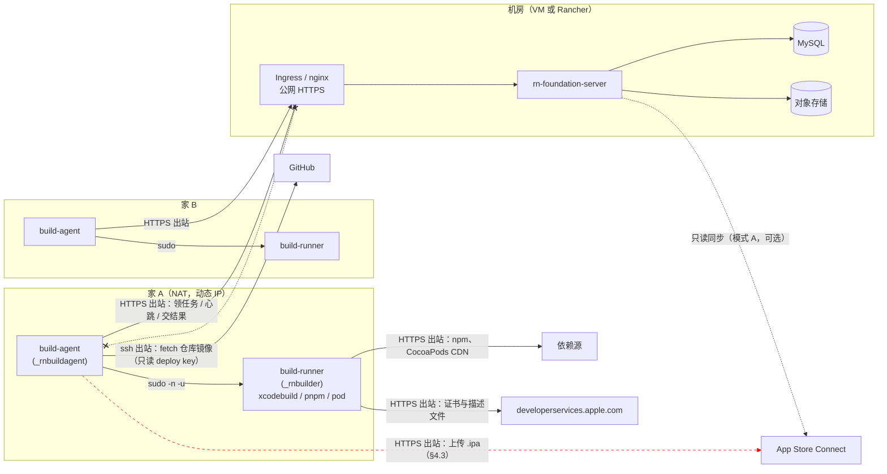
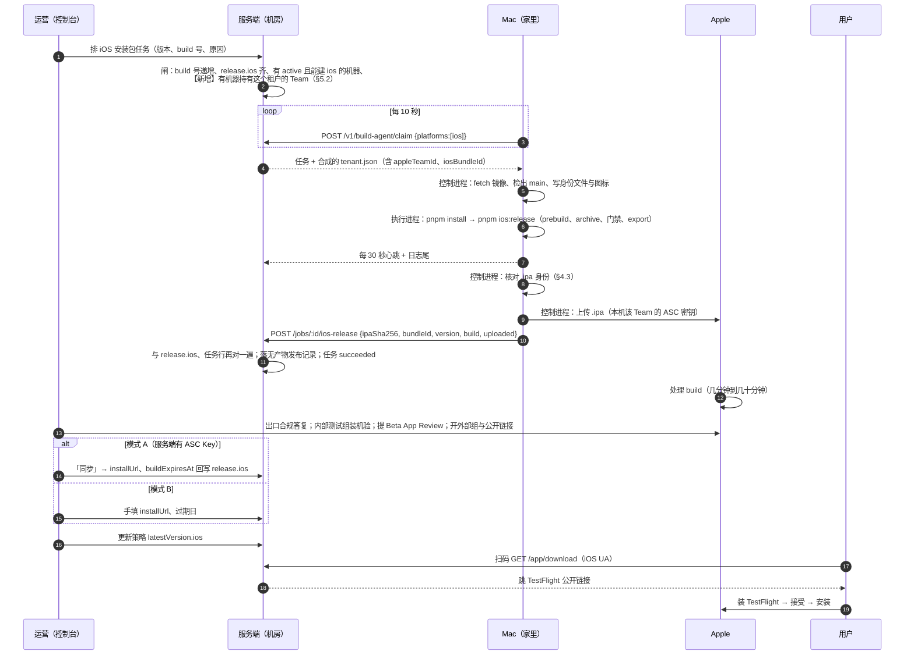

# 设计：家用网络里的 Mac 打包机与机房里的管理端怎么配合出 iOS 包

状态：设计（2026-09-18，同日按两条决定修订：Mac 是一个池子、自升级要做）。在 `ios-testflight-distribution-2026-09-17.md` 已实现的阶段 0–1 之上，回答它 §4.8 末尾与 §6 第 13 条留下的问题：**服务端跑在机房（虚拟机或 Rancher），Mac 打包机是家里的电脑、没有公网地址、可能有好几台**，两边怎么配合把 iOS 包打出来、发出去。

不改动已定的安全论证（`build-service-2026-09-11.md`：服务端不下发命令、签名材料不经服务端、任务只带参数）。本文引用的代码以 `origin/main` 2026-09-18 为准。

## 0. 一句话结论

**现有的打包机模型就是为这种网络写的。** 打包机「只出不进」：本机令牌 + 轮询认领，服务端从不连它（`cmd/build-agent/main.go` 包注释、`agent.serve`）。家用 NAT、动态 IP、没有端口映射都不构成障碍——Mac 只需要能出站到服务端的 HTTPS 源、GitHub、npm/CocoaPods 与 Apple。**不需要 VPN，不需要固定 IP，不需要在路由器上开任何东西。**

真正要补的是五件事，全在「多台」「家用」「macOS」这三个词上：

| # | 缺什么 | 为什么现在不够 | 见 |
| --- | --- | --- | --- |
| 1 | **Mac 池：每台都持有全部租户的签名材料，缺了要看得见** | 已定每台 Mac 能打任意租户的包。认领只按平台求交集（`build_agent.go` `claimBuildJob`），一台还没装齐某个 Team 材料的 Mac 会领走那个租户的任务、失败、退回、再领走——正是 §4.8 说的那个自愈不了的循环，只是换成了租户维度。同时 Apple 每个 Team 只给 3 张 Distribution 证书，Mac 多于 3 台就不能各自申请 | §4.4、§5.2 |
| 2 | **Mac 的账户、钥匙串与 ASC 密钥布局** | 执行进程的 `HOME` 被换成任务目录（`jobspec.jobPathEnv`），而 codesign 找钥匙串、xcodebuild 找 Xcode 账号、altool 找 `.p8` 全靠 `HOME`。原文 §10.3 已预判会撞；这里把修法定下来，并把「上传」从第三方代码里挪出来 | §4 |
| 3 | **macOS 的安装与常驻** | `install.sh` 只认 x86_64 + systemd，安装包只编 linux/amd64（`build-bundles.sh`），unit、sudoers、用户都是 Linux 的 | §4.5、§8 |
| 4 | **机器在线状态** | 登记里没有「最近一次心跳」。排队闸 `hasLiveBuilderFor` 只看 `active`，注释自己写着「一台 active 但已经关机的机器同样领不到，那件事这里看不出来」。家里的电脑会休眠、断电、断网，这个盲区在机房里可以忍，在家里不行 | §5.4 |
| 5 | **家用网络的失效路径** | 心跳断 10 分钟任务被回收重排（`build_reaper.go`），重排后用**同一个 build 号**再传一次 App Store Connect 会被 Apple 拒；45 分钟默认超时对「archive + 家用上行传几百 MB」偏紧 | §6 |

## 1. 场景与约束

| | 服务端 | Mac 打包机 |
| --- | --- | --- |
| 在哪 | 机房：虚拟机，或 Rancher 里的 Pod | 家里：Mac mini / MacBook，家用宽带 |
| 网络 | 有公网 HTTPS 源（`https://api.<租户域名>`） | NAT 后面，动态出口 IP，可能是运营商级 NAT；没有入站 |
| 台数 | 1 个部署（Rancher 可多副本） | **最少 1 台，动态增减**；由平台运维放置，无人值守，不属于第三方 |
| 可用性 | 常开 | 会休眠、关机、断电、换网络 |
| 持有 | 数据库、对象存储、租户配置、机器登记 | 源码检出、Xcode、**签名身份**、ASC 密钥、本机令牌 |
| 不能持有 | 任何签名材料（既定原则） | 服务端配置、其它 Mac 的身份 |

租户可能不止一个，每个租户一个 Apple Team、一个 bundle id（原文 §4.3「多租户隔离」）。**已定：Mac 是一个池子，任何一台都能打任何租户的包。** 含义是每台 Mac 都要持有全部 Team 的签名材料，新加一个租户就要把它的材料装到每一台上（§4.4）；换来的是调度上完全对称——任务落到哪台都一样，坏一台不影响任何租户。池子最少 1 台。**Mac 下线时队列不停**：任务照常排进去、等它回来再领（已定）；§5.4 的在线状态只用来告警和解释「为什么还没人领」，不用来拒绝排队。Mac 由平台运维放置、无人值守，「主人」就是运维自己；§7 里要防的是**机器被偷、被物理接触**，不是主人不可信。

## 2. 拓扑与网络

### 2.1 谁连谁



红色虚线是**不存在**的方向：服务端没有任何路径能连到 Mac。这不是限制，是设计（`build-service-2026-09-11.md`「不做什么」）。

### 2.2 Mac 需要的出站清单

| 目的地 | 谁发起 | 协议 | 干什么 | 断了会怎样 |
| --- | --- | --- | --- | --- |
| 服务端 API 源 | 控制进程 | HTTPS 443 | 登记公钥、认领（每 10 秒，`PollEvery`）、心跳（每 30 秒）、取图标、交 `/ios-release` | 领不到任务；构建中断 10 分钟没心跳被回收 |
| `github.com` | 控制进程 | ssh 22 | fetch 仓库镜像（deploy key + 固定 known_hosts，`checkout.go` `gitEnv`） | 任务在检出那一步失败 |
| npm registry、CocoaPods CDN | 执行进程 | HTTPS | `pnpm install`、`pod install`（prebuild 里） | 任务失败 |
| `developerservices2.apple.com` 等 | 执行进程 | HTTPS | `-allowProvisioningUpdates` 申请/续期证书与描述文件 | archive 失败 |
| App Store Connect 上传端点 | **控制进程**（§4.3） | HTTPS | 传 `.ipa` | 包出来了但没上去；任务按失败上报 |
| Apple NTP | 系统 | UDP 123 | ASC 的 JWT 对时钟敏感（`exp` ≤ 20 分钟） | 上传与同步报鉴权错 |

家用宽带上 22 端口出站偶尔被运营商拦；被拦时 GitHub 支持 `ssh://git@ssh.github.com:443`，镜像的 `remote.origin.url` 与固定 known_hosts 里的主机条目要一起改成那个（`checkMirror` 只核对配置键名，不核对 URL 值）。

### 2.3 服务端侧要满足的

| 要求 | 为什么 | VM（nginx） | Rancher（Ingress） |
| --- | --- | --- | --- |
| 打包机路径直接 200，**不重定向** | 客户端拒绝一切 3xx（`client.go` `refuseRedirects`）：跟随重定向会把令牌带到别处 | 别在 `/v1/build-agent/*`、`/v1/machine-setup/*` 上做 `www`/尾斜杠/http→https 之外的跳转 | 同左；`nginx.ingress.kubernetes.io/ssl-redirect` 对 https 直连无影响 |
| 透传 `x-machine-token`、`x-build-attempt`、`x-enrollment-code` 头 | 鉴权全靠它们 | 默认透传 | 默认透传；别配 header 白名单 |
| 读超时 ≥ 60 秒 | 单次请求 30 秒超时（`defaultHTTPRequestTimeout`） | 默认够 | `proxy-read-timeout` 默认 60 |
| 请求体上限 | iOS 任务**不上传产物**，最大的是 `logTail` JSON；Android 那侧的未签名包上传（PUT，30 分钟）仍要 ≥ 2 GiB | 已有 | `proxy-body-size` 要放大——这条是 Android 的，iOS 不需要 |
| `TRUSTED_PROXIES` 指向反代 | `externalOrigin` 据此判 https 并拼安装命令（`machine_setup.go`）；`machine-setup` 三条接口按 `ClientIP` 限速 20/分钟 | `127.0.0.1` | Ingress Pod 网段。不配的话所有 Mac 的注册请求都算同一个 IP，20/分钟共用 |
| 安装包目录 | `describe`/`bundle` 从 `/opt/rn-foundation/machine-bundles/current` 读（`defaultMachineBundleDir`，**不是配置项**） | `rn-foundation-apply bundles` 已经放好 | 要挂成卷，或在镜像构建时放进去；否则新 Mac 的 `describe` 回 503 `MACHINE_BUNDLE_UNAVAILABLE` |
| 多副本 | 认领用 MySQL 命名锁 + `FOR UPDATE SKIP LOCKED`（`claimBuildJob`），回收器按 `attempt` 守护（`build_reaper.go`） | 单实例 | 多副本安全，无需选主；回收器每副本各跑一轮是幂等的 |
| 出站到 `api.appstoreconnect.apple.com` | 只有模式 A 的只读同步要（`ios_asc.go` `syncIOSTestFlight`） | 确认出站策略 | NetworkPolicy 放行 |

**不需要做的**：给 Mac 的出口 IP 加白名单（做不到，也不该依赖）；给服务端加 mTLS（令牌 + TLS 已够，而且证书轮换会变成每台 Mac 的运维负担）；打 VPN。运维要远程维护 Mac 可以自己用 Tailscale / 屏幕共享，那与打包链路无关。

## 3. 一次 iOS 发布的完整动线



三点分工，写清楚免得混：

- **服务端只决定「给谁、出什么版本」**：它合成 `tenant.json`（`tenant_manifest.go`，`appleTeamId` 来自 `release.ios`），下发的是参数，不是命令。
- **Mac 决定「能不能签、要不要传」**：签名身份和 ASC 密钥都在 Mac 上；上传开关 `BUILD_AGENT_IOS_UPLOAD` 是机器级配置，由装机器的人打开（原文 §4.9）。
- **人决定「对外可见的事」**：提审、开公开链接、改测试员，平台不自动做（原文 §4.6.6）。

## 4. Mac 打包机的账户、钥匙串与密钥

### 4.1 沿用两进程两用户，换成 macOS 的写法

| Linux（现状） | macOS（本稿） | 说明 |
| --- | --- | --- |
| `rn-build-agent` 用户 | `_rnbuildagent`（`sysadminctl -addUser … -roleAccount`，uid 200–400 区间的隐藏服务账户） | 持令牌、出处密钥、仓库镜像、**上传用的 ASC 密钥** |
| `builder` 用户 | `_rnbuilder`（同上） | 跑 pnpm / pod / xcodebuild；持**签名钥匙串**与**申请描述文件用的 ASC 密钥** |
| `rn-build-jobs` 组 | `_rnbuildjobs`（`dseditgroup`） | 任务根目录 setgid，APFS 支持 |
| `/etc/sudoers.d/rn-build-agent` | 同路径同内容 | macOS 自带 sudo 与 visudo；规则不变：`_rnbuildagent ALL=(_rnbuilder) NOPASSWD:NOSETENV: /opt/rn-build-agent/build-runner` |
| systemd unit | `/Library/LaunchDaemons/win.anyfun.rn-build-agent.plist`，`UserName=_rnbuildagent`，`KeepAlive` | launchd 不读 env 文件：`ProgramArguments` 指向一个 root 0700 的包装脚本，它 `set -a; . /etc/rn-build-agent.env; exec /opt/rn-build-agent/build-agent`。令牌仍只在 env 文件（root 0600）里 |
| `RestartPreventExitStatus=77` | plist 用 `KeepAlive={SuccessfulExit:false}`；包装脚本把 77 翻成 0 并留一个 `revoked` 标记文件，成功退出 launchd 不重启 | 机器被吊销后别每 10 秒撞服务端 |
| `KillMode=mixed` | launchd 停服务只给主进程 SIGTERM，行为一致 | 排空而不是中止 |
| `/var/lib/rn-build-agent` | `/var/rn-build-agent`（macOS 没有 `/var/lib` 惯例） | 0700 |
| `/var/lib/rn-build-jobs` | `/var/rn-build-jobs` | 2750 |
| `ProtectSystem` / `InaccessiblePaths` 等 | 没有对应物 | 边界靠 uid 与文件权限，Linux 上也是这么说的（README「unit 硬化」末段） |

`build-runner` 的两处 Linux 假设要在真机上验：`reap` 清 `/tmp`、`/var/tmp`、`/dev/shm` 顶层属于构建用户的条目（`dirs.go`），macOS 没有 `/dev/shm`、每用户临时目录在 `/var/folders/…`；以及 `kill(-1)` 在 macOS 上的语义。两者都不是阻断，但要有结论再上生产。

### 4.2 钥匙串：固定路径 + 每任务重设搜索列表

问题（原文 §10.3 已预判）：执行进程的 `HOME` 是本任务的 `work/home`，而 macOS 把钥匙串搜索列表存在 `~/Library/Preferences/com.apple.security.plist`，登录钥匙串在 `~/Library/Keychains`。`HOME` 一换，`codesign` 什么证书都找不到。

做法：**钥匙串放固定路径，每个任务开始时在任务 HOME 里把它设成搜索列表并解锁。** 缓存隔离（pnpm、DerivedData、描述文件都在任务 HOME 下、用完即删）不受影响，签名材料也不在任务目录里。

```text
/var/rn-build-signing/                        _rnbuilder:_rnbuilder 0700   ← 机器装好时准备，不随任务删
  rn-signing.keychain-db                      0600  各租户 Team 的 Apple Distribution 证书 + 私钥
  rn-signing.password                         0600  钥匙串口令（随机生成，只有 _rnbuilder 读得到）
```

执行进程在 `buildIPA` 里、跑 `pnpm ios:release` 之前（Go 侧，不放进 RN-App 脚本，脚本要能在开发者自己的 Mac 上手工跑）：

```bash
security list-keychains -d user -s /var/rn-build-signing/rn-signing.keychain-db   # 写进任务 HOME 的 prefs
security unlock-keychain -p "$(cat /var/rn-build-signing/rn-signing.password)" /var/rn-build-signing/rn-signing.keychain-db
security set-keychain-settings /var/rn-build-signing/rn-signing.keychain-db       # 不自动上锁
```

装机时对每把导入的私钥做一次 `security set-key-partition-list -S apple-tool:,apple: -s -k <口令>`，否则 codesign 第一次用会弹 UI 授权——而这台机器没人盯着屏幕。

**要说清楚的一条**：`_rnbuilder` 跑的是 pnpm、CocoaPods、几千个依赖的代码，而它能解开这个钥匙串。也就是说**第三方构建代码能拿到该 Team 的 Distribution 证书私钥**。这是原文 §4.2 承认的 iOS 不对称——签名与构建分不开——本稿不假装解决了它，只把它缩到「这一把钥匙串、这几个 Team」，并靠 §7 的可撤销性兜底。

### 4.3 ASC 密钥分两层，上传挪到控制进程

现状：`pnpm ios:release --upload` 在**执行进程**里调 `xcrun altool`，`.p8` 按约定在 `~/.appstoreconnect/private_keys/` 找，`ASC_KEY_ID` / `ASC_ISSUER_ID` 是**机器级单值**环境变量（`jobspec.machineEnvKeys`）。在队列模式下这条路走不通，两个原因：

1. `~` 是任务 HOME，`.p8` 不在那里；`-allowProvisioningUpdates` 不带 `-authenticationKey*` 时用的是**当前用户在 Xcode 里登录的账号**，一个 role account 在任务 HOME 里没有这个东西。
2. 机器级单值只够一个 Team。多租户就是多 Team，一台 Mac 要给几个租户出包就要几把 Key。

改成：

| 用途 | 谁持有 | ASC 角色 | 存放 | 为什么 |
| --- | --- | --- | --- | --- |
| **申请证书与描述文件**（`-allowProvisioningUpdates`） | `_rnbuilder`（执行进程） | **Developer**，限制到本 App | `/var/rn-build-signing/provisioning/<TEAMID>/AuthKey_<KEYID>.p8` + `key.json{issuerId,keyId}` | xcodebuild 在执行进程里跑，只能它拿。Developer 是能干这件事的最小角色 |
| **上传 .ipa** | `_rnbuildagent`（控制进程） | Developer 或 App Manager，限制到本 App | `/var/rn-build-agent/asc/<TEAMID>/AuthKey_<KEYID>.p8` + `key.json` | 上传是对外可见、撤不回的动作，该由**不执行第三方代码**的那个进程做；控制进程还能在传之前独立核对 `.ipa` 的身份 |
| **只读同步**（模式 A） | 服务端（`ios.asc`） | App Manager | 数据库加密 | 已实现，不变 |

配套改动：

- `build-ios-release.mjs`：`--upload` 保留给手工路径；新增 `--provisioning-key-dir <目录>`，把 `-authenticationKeyPath / -authenticationKeyID / -authenticationKeyIssuerID` 传给两次 `xcodebuild`；目录按 `tenant.appleTeamId` 选子目录。**不再从 `.env.local` 读 `ASC_KEY_ID`**——它是 Team 级的，不是机器级的。
- `build-runner buildIPA`：不再传 `--upload`；把 `RN_IOS_SIGNING_DIR`（新增的机器级白名单键，只在 darwin 上接受）拼成上面的参数。
- `build-agent deliverIPA`：核对 `.ipa` 里 `Info.plist` 的 bundle id / 版本 / build 号（`unzip -p … | plutil -convert json`，控制进程自己做，不信执行进程的 `result.json`）→ `BUILD_AGENT_IOS_UPLOAD` 开着且本机有该 Team 的上传密钥 → `xcrun altool --upload-app --apiKey --apiIssuer`，`API_PRIVATE_KEYS_DIR` 指到控制进程自己的目录 → 传成功再报 `uploadedToAppStoreConnect: true`。
- `jobspec.machineEnvKeys` 里的 `ASC_KEY_ID` / `ASC_ISSUER_ID` 删掉。

密钥泄露的后果对照：执行进程那把（Developer）泄露，对方能给该 App 申请证书、注册设备、传 build；控制进程那把泄露，对方能传 build。两者都在 ASC 后台一点即废（原文 §4.6.1 的论证）。**每台 Mac 每个 Team 各自一把**，吊销一台 Mac 的密钥不影响别的 Mac——这也是 §5.5 下线一台 Mac 时要做的事。N 台 Mac × T 个 Team × 2 把，数量随池子线性涨；ASC 每个 Team 的 API Key 上限是 50 把，够用，但要在 ASC 上按「机器名-用途」命名，否则吊销时分不清哪把是哪台的。

### 4.4 签名材料怎么到每台 Mac

Mac 是池子，意味着每台都要有每个 Team 的三样东西。它们的来源和分发方式不一样：

| 材料 | 每 Team 几份 | 从哪来 | 怎么到 Mac |
| --- | --- | --- | --- |
| Apple Distribution 证书 + 私钥 | **1 份，全部 Mac 共用** | 在**一台**离线或专用 Mac 上申请一次，导出 `.p12` | 加密归档 + 口令进密码管理器，由运维放到每台 Mac 的钥匙串（§4.2）。**不经服务端** |
| 申请描述文件用的 ASC Key（Developer） | 每台 Mac 一把 | ASC 后台生成，`.p8` 只能下载一次 | 直接放到那台 Mac 的 `/var/rn-build-signing/provisioning/<TEAMID>/` |
| 上传用的 ASC Key | 每台 Mac 一把 | 同上 | 放到 `/var/rn-build-agent/asc/<TEAMID>/` |

**为什么证书不能每台 Mac 自己申请**：Apple 每个 Team 最多 3 张 Apple Distribution 证书。`-allowProvisioningUpdates` 在钥匙串里找不到可用证书时会**自动新建一张**，第 4 台 Mac 就申请不出来了；更糟的是前 3 台各自建了一张，之后任何一台的证书吊销都不影响别台，看起来方便，实际是把 3 个名额用光、再也加不了机器。所以一个 Team 一张证书，私钥分发。原文 §4.3 说「不手工搬 `.p12`」是在只有一台 Mac 时说的，池子模型下这条要收回，代价如实写进 §7。

**代理的自检因此更重要**：领到任务后先查钥匙串里有没有该 Team 的 Distribution 证书（§5.2），没有就拒收。不拒收的话 Xcode 会替这台机器新建证书，悄悄消耗一个名额。

**加一个租户**：申请证书、导出 → 每台 Mac 导入 + 放两把 Key → 每台重启代理（钥匙串盘点在启动时做，§5.2）→ 控制台看到每台都报了这个 Team 才排任务。少一台没装，那一台就领不到这个租户的任务，控制台上标出来。

**证书到期（一年）**：同一流程再走一遍；旧证书过期前新旧并存一段时间，钥匙串里两张都在，Xcode 会选没过期的。

### 4.5 装机清单（`install-macos.sh`，服务端下发）

复用 `install.sh` 的骨架与协议（describe → 下载核对安装包 → 安装 → enroll → 启动），但按角色只做构建机、按平台只做 macOS：

1. **前提**：Apple Silicon 或 x86_64；Xcode 已装并 `xcode-select`，`sudo xcodebuild -license accept` 与 `-runFirstLaunch` 已做；git ≥ 2.30、Node 22、pnpm、CocoaPods 在 `/usr/local/bin:/opt/homebrew/bin:/usr/bin:/bin` 里（这条 PATH 就是交给执行进程的那一条）；`LANG=en_US.UTF-8`（CocoaPods 在非 UTF-8 locale 下直接报错）。缺什么列全再退，注册码不消耗。
2. **用户与目录**：§4.1 那一列。`_rnbuilder` 的 home 设成 `/var/empty`，shell `/usr/bin/false`。
3. **程序**：`builder-darwin-arm64.tar.gz`（`build-bundles.sh` 多编一组 `GOOS=darwin GOARCH=arm64`，清单 `manifest.json` 里按 `role/os/arch` 多一项；`describe` 按脚本自报的 `uname` 选）。冒烟同 Linux：空环境跑 `build-agent` 必须以 2 退出。
4. **签名区**：建 `/var/rn-build-signing`，生成钥匙串与口令；**证书导入与 `.p8` 放置由人做**——脚本只建目录、打印放什么、什么权限，然后核对权限。密钥材料不经脚本、不经服务端。
5. **注册**：`build-agent enroll`（现有），注册码经 `RN_ENROLLMENT_CODE` 环境变量。
6. **仓库镜像**：生成 deploy key → 打印公钥 → 人加到 GitHub → **重跑同一条命令**克隆镜像（与 Linux 一致）。每台 Mac 一把 deploy key。
7. **常驻**：装 plist，`launchctl bootstrap system`，等 `runner-mode.json` 出现后打印 `show-key`。
8. **电源**：`pmset -c sleep 0 disksleep 0`，`systemsetup -setrestartpowerfailure on`；MacBook 要插电并合盖不休眠（`pmset -c disablesleep 1`）。这一步在 Linux 上不存在，在家里是第一位的故障源。

`env` 文件示例（`rn-build-agent-macos.env.example`，与 Linux 那份并排）：

```bash
BUILD_AGENT_SERVER=https://api.anyfun.win
BUILD_AGENT_MACHINE_TOKEN=            # enroll 写入
BUILD_AGENT_REPO=/var/rn-build-agent/repos/rn-app.git
BUILD_AGENT_WORKSPACE=/var/rn-build-jobs
BUILD_AGENT_STATE_DIR=/var/rn-build-agent/state
BUILD_AGENT_PLATFORMS=ios
BUILD_AGENT_TIMEOUT_MINUTES=120       # §6.2
BUILD_AGENT_RUNNER=/opt/rn-build-agent/build-runner
BUILD_AGENT_RUNNER_USER=_rnbuilder
BUILD_AGENT_IOS_UPLOAD=true           # 装机器的人决定
RN_IOS_SIGNING_DIR=/var/rn-build-signing    # 新增（§4.3）
LANG=en_US.UTF-8
```

## 5. 多台 Mac

### 5.1 一台 Mac 就是一台机器

每台 Mac 独立登记：自己的注册码、令牌、出处密钥、deploy key、ASC 密钥。**没有「Mac 池共用一个身份」这种东西**——吊销要能按台做。

出处密钥对 iOS 没有消费者（原文 §10.1 第 2 条），但注册与认领流程仍然要它：`enroll` 用它换令牌，`ensureKeyAccepted` 在控制台接受之前不领任务。所以控制台「接受」这一步对 Mac 照做，只是**不需要**在签名闸上 `trust-builder`——签名闸只签 Android，不认识 iOS 构建机。`DEPLOYMENT.md` §3.2 第 5 步对 iOS 机器跳过。

### 5.2 路由：池子模型下靠自报盘点，不靠登记

既然每台 Mac 都应该能打任何租户，登记里就不需要「这台能打哪些 Team」这一列——登记一列的正确值永远是「全部」，维护它只会引入一个能与实际不一致的地方。真正要回答的问题变成：**哪台 Mac 现在缺哪个 Team 的材料**。这个事实只有 Mac 自己知道，所以由它自报：

| 位置 | 规则 |
| --- | --- |
| 代理启动与每次认领前 | `security find-identity -v -p codesigning <钥匙串>` 盘点有哪些 Team 的 Apple Distribution 证书，交叉 `/var/rn-build-signing/provisioning/<TEAMID>/` 与 `/var/rn-build-agent/asc/<TEAMID>/` 是否齐，得到本机「材料齐全的 Team 列表」 |
| 认领 `POST /claim` | 请求体新增 `appleTeams: [...]`（自报，**只能收窄**：报了没有的 Team 只会让它领到一条必然失败的任务，后果落在自己身上）。服务端 iOS 任务的 SQL 多一个条件：任务租户的 `release.ios.appleTeamId` 在这个列表里 |
| 排队 `createBuildJob` | 看心跳表里每台 active 构建机**最近一次自报**的列表（不看它现在在不在线）：没有任何一台报过该租户的 Team → 409 `NO_BUILDER_FOR_TEAM`（材料没装，排进去永远没人领）；有报过但都不在线 → **照常排队**，响应带 `warnings:["no_ios_builder_online"]`，控制台提示「当前没有 iOS 打包机在线，任务会等待」 |
| 心跳表（§5.4） | `apple_teams JSON` 一列，认领时随 `agentCommit`/`os` 一起写 |
| 控制台 | 机器卡片列出自报的 Team；拿全部租户的 `release.ios.appleTeamId` 求差集，缺的标黄「缺 <租户> 的签名材料」。这是「池子」这个不变量的监视器 |
| 代理领到任务后 | `prepareWorktree` 再核一次该 Team 在不在列表里（盘点与认领之间可能有人动了钥匙串），不在就 `refused` |

为什么按 Team 而不按租户自报：Mac 上持有的是 Team 的证书，一个 Team 下可能有几个租户的 App（原文 §7.1 实测那把 Key 能看到 5 个 App）；按 Team 报与机器上实际有的东西一一对应，租户 → Team 的映射服务端从 `release.ios` 读。

### 5.3 并发与公平

- **一机一活**：`claimBuildJob` 对每台机器同时只派一条（409 `BUILDER_HAS_ACTIVE_JOB`）。两台 Mac 就是两条并发的 iOS 构建，不需要别的调度。
- **FIFO 跨租户**：`ORDER BY created_at`。iOS 队列与 Android 队列在同一张表里，但 Mac 只领 `platform='ios'`，互不影响。
- **不做亲和**：不记「租户 X 上次在哪台 Mac 打的」。iOS 没有增量缓存可复用（每任务新 HOME），亲和买不到东西。
- **Xcode 版本**：几台 Mac 装同一个 Xcode 版本，`build-ios-release.mjs` 把 `xcodebuild -version` 打进日志，`result.json` 加 `toolchain` 字段，服务端记进 `file_metadata`。Apple 不接受过旧 SDK 打的包，出问题时得知道是哪台机器的哪个 Xcode。

### 5.4 在线状态：加一张心跳表

`build.machines` 是 `app_configs` 里一份带版本号的 JSON 文档，写入走乐观锁（`writeMachineRegistry`）。N 台机器每 10 秒认领一次，把「最近在线」写回它会互相冲突。**另开一张表**：

```sql
CREATE TABLE build_machine_liveness (
  machine_id   VARCHAR(64) PRIMARY KEY,
  last_seen_at DATETIME(3) NOT NULL,
  agent_commit VARCHAR(48),
  os           VARCHAR(16),          -- darwin / linux
  platforms    JSON,
  updated_at   DATETIME(3) NOT NULL
);
```

- `claim` 与 `heartbeat` 里 `INSERT … ON DUPLICATE KEY UPDATE`，每机器每分钟最多写一次（服务端按 `last_seen_at` 节流），不进审计。
- `hasLiveBuilderFor` **不变**（仍只看登记是否 active）：Mac 掉线时任务要能排进去等它回来（已定，§1）。在线与否只进 `createBuildJob` 响应的 `warnings` 与控制台提示，不进拒绝判据。
- 控制台机器卡片显示「最近在线 x 分钟前」，超过 30 分钟标黄；有 iOS 任务排着、却没有一台 ios 机器在线时在打包任务列表顶部提示，并显示每条任务的排队时长（`build-concurrency-2026-09-15.md` §3.4 那一列）。排队的任务随时可以取消（现有 `cancelBuildJob`），不会因为等得久被自动回收——回收器只管 claimed/running。
- 代理侧不用改：它本来就在发这两个请求。`agent_commit` / `os` 从 `claim` 请求体新增的可选字段带上。

### 5.5 上一台、下一台

**上**：控制台新建构建机（勾 ios）→ 把一次性安装命令（60 分钟有效、一次性）通过安全渠道发给那台 Mac 的主人 → 对方按 §4.5 执行 → 加 deploy key、重跑 → 控制台接受出处公钥 → 运维把**全部 Team** 的证书归档（§4.4）交给主人导入钥匙串，并为这台 Mac 在每个 Team 的 ASC 后台生成两把 Key 放好 → 重启代理 → 控制台机器卡片上每个租户的 Team 都不标黄 → 排一条测试任务。机器主人**不需要**控制台账号，也不需要 ASC 账号（Key 由运维生成后交给他）。

**下**（顺序）：等它手上的任务结束 → 控制台吊销（令牌立即失效，代理以 77 退出）→ **ASC 后台吊销这台 Mac 的两把 Key** → Mac 上 `launchctl bootout`，销毁 `/var/rn-build-agent`（令牌、出处私钥、上传 Key、镜像）、`/var/rn-build-signing`（钥匙串、描述文件 Key）、`/etc/rn-build-agent.env` → GitHub 删它的 deploy key。Distribution 证书的私钥这台机器持有过，而且是**全部 Team 共用的那一张**（§4.4）。正常下线（换机器、主人退出）不吊销证书；**因被攻陷或失窃下线的**，每个 Team 的证书都要吊销并重新申请分发，这一次要把全部 Mac 都换上新证书。这是池子模型的真实代价，下线前要明确分类。

**换程序**：见 §5.6。

### 5.6 自升级（已定要做）

拉模型意味着服务端推不了升级，而每台 Mac 手工 scp 两个二进制在几台以后一定会有人忘。但**这是整个方案里唯一一条「服务端能往 Mac 上放可执行代码」的路**，而 Mac 上放着全部租户的签名材料——服务端被攻破时，这条路能把每台 Mac 的钥匙串都掏空。所以它不能只是「下载、校验 sha256、替换」：sha256 是服务端给的，服务端被攻破它就没有意义。

三道闸，缺一不可：

| 闸 | 挡什么 | 怎么做 |
| --- | --- | --- |
| **离线签名** | 服务端被攻破后下发恶意程序 | CI 产出 `manifest.json` 后，由**平台管理员一人**在离线机器上用发布密钥（Ed25519，私钥只在离线机器与密码管理器，保管方式同离线恢复密钥）签 `manifest.json`，签名文件与清单一起放进安装包目录。不做双人签名（已定）。Mac 上 `/opt/rn-build-agent/release-key.pub`（root 0644，装机时人工放、装机脚本核对指纹）；升级程序先验清单签名，再按清单核对归档与每个文件的 sha256。**服务端手里没有这把私钥，攻破它换不出一个能过验的清单。** 这与签名闸「不采信服务端」的原则同源 |
| **控制台审批** | 有问题的版本不该滚到所有 Mac | 机器登记新增平台级字段 `approvedAgentCommit`（`expectedVersion` + `reason` + `confirm`，进审计）。Mac 只升到这个提交；CI 部署了新版本不等于 Mac 会升。可以先审批、只重启一台 Mac 观察，再让其余的升 |
| **排空再换** | 换二进制打断构建 | 升级只在代理空闲时发生：控制进程认领时收到服务端回的 `approvedAgentCommit` 与自己不一致 → 不再认领、写标记文件、以退出码 75（新定义，`EX_TEMPFAIL`）退出；root 的升级程序接手 |

角色与流程：

- 控制进程（`_rnbuildagent`）**不写 `/opt`**，它只负责「发现要升、排空、退出」。写 `/opt/rn-build-agent/` 的是 root，与 Linux 上「二进制 root 所有、控制进程改不了」的要求一致（`checkRunner` 会拒绝非 root 所有的执行进程二进制）。
- `rn-build-agent-upgrade`（随安装包分发的脚本，root 0700，由 launchd 的 `KeepAlive={PathState: <标记文件>}` 或代理退出后触发）：读 env 文件里的令牌 → `GET /v1/build-agent/bundle`（机器令牌鉴权；回本机 os/arch 的清单、签名、归档地址）→ 验签 → 下载归档到临时目录、核对 → 解包核对每个文件 → 冒烟（空环境跑新 `build-agent` 必须以 2 退出；新 `build-runner` 自检 `--protocol` 与新 `build-agent` 一致）→ 原子替换两个二进制（先写 `.new`，`mv`）→ 删标记文件 → `launchctl kickstart` 代理。任何一步失败：保留旧二进制，写日志，代理照常重启（旧版继续工作），控制台上 `agentCommit` 落后的机器标出来。
- `build-agent` 加 `version` 子命令与 `-ldflags -X main.commit=…`（CI 编译时注入），`claim` 请求体的 `agentCommit` 就是它。清单里的 `commit` 与之比对，`-dirty` 的清单拒绝升级。
- 服务端：`GET /v1/build-agent/bundle` 复用 `machineBundles()` 读同一个目录，按查询参数 `os`/`arch` 选归档；限速按机器；审计不记（每台机器每次启动都可能来一次）。签名文件不在就回 503，**不回一个没签名的清单**——没签名就不升，是 fail-closed。
- 回滚：`approvedAgentCommit` 改回旧提交，旧归档还在安装包目录里（`rn-foundation-apply bundles <提交>` 按提交建目录，`current` 只是软链）。要求服务端保留最近 N 个提交的归档目录，而不是只留 `current`。

Linux 上的构建机（amos）**不走这条**。它走的是 `DEPLOYMENT.md` §1 那条「推」的路：RN-Server 合进 main → GitHub Actions 门禁 → 交叉编译 → 以 `rndeploy` 账号 scp 到 amos → `rn-foundation-apply` 换二进制并重启；`AMOS_DEPLOY_BUILD_AGENT=true` 时连构建机程序一起换。那条路成立的前提是 CI 能 ssh 进机器，家里的 Mac 没有入站，所以只能拉。两条路各管一种机器，不要并存在同一台上。

## 6. 家用网络的失效路径

### 6.1 断网、休眠、断电

| 发生什么 | 现有行为 | 结果 | 要改的 |
| --- | --- | --- | --- |
| 构建中断网 < 10 分钟 | 心跳失败只记日志，构建继续；网络回来心跳恢复 | 没影响 | — |
| 断网 ≥ 10 分钟 | 服务端回收：任务退回 `queued`、`attempt+1`（`reapStaleBuilds`）；Mac 下一次心跳 409 `BUILD_ATTEMPT_STALE`，当场中止、清目录、不上报 | 任务被另一台（或同一台）重领重建 | 见 §6.3 的重复上传问题 |
| 构建中休眠 / 断电 | 同上被回收；Mac 醒来后认领撞 409 `BUILDER_HAS_ACTIVE_JOB`（若还没被回收）→ 上报失败 | 一条失败记录，任务要重排 | §4.5 第 8 步禁休眠；断电靠 `restartpowerfailure` |
| 空闲时下线（唯一一台 Mac 关机几天） | 任务排进队列，无人认领；控制台提示无在线打包机 | 任务等着，Mac 回来 10 秒内领走；不失败、不占别的资源，只占这个租户的 build 号序列 | 已定行为，不改。等不及就 `cancel` |
| 服务端不可达（机房维护） | 认领失败只记日志，10 秒后再试；结果上报按退避重试到分钟级（`report`） | 自愈 | — |
| Mac 换了网络（IP 变） | 无感：没有任何按 IP 的绑定 | — | — |
| 出口被运营商拦 22 | 检出失败 | 任务失败 | §2.2 的 ssh 443 |

### 6.2 时长

一次 iOS 任务的时间构成：`pnpm install`（每任务独立 store，家用下行）+ `pod install`（CocoaPods CDN）+ `prebuild` + `archive`（Mac mini M 系列 10–20 分钟量级）+ `export` + **上传几百 MB 到 Apple（家用上行，可能十几分钟）**。默认 45 分钟偏紧，Mac 上写 `BUILD_AGENT_TIMEOUT_MINUTES=120`（上限 480）。心跳 goroutine 在整个 `buildAndDeliver` 期间都在跑（`runJob`），上传阶段不会因为没心跳被回收。

带宽是家用机的主要成本。每任务独立 pnpm store 是安全决定（`build-concurrency-2026-09-15.md` §7 的硬链接 TOCTOU），不为省带宽回退。可选的省法是家里放一个 npm 只读镜像（verdaccio 之类）并把它写进 `.npmrc`——那是机器主人的事，不进本稿。

### 6.3 重复上传：同一个 build 号传两次

任务被回收重排后**build 号不变**（任务行上的参数）。第一次尝试如果 `.ipa` 已经传进 ASC、只是 `/ios-release` 那一步没报上去，重建后再传，Apple 会拒：同一 `CFBundleVersion` 不能传两次。任务就此失败，而 ASC 上其实有这个 build。

处理：控制进程上传前先查一次（用它自己那把 Key，`GET /v1/builds?filter[app]=…&filter[version]=<build 号>`，`internal/ascapi` 已有 `LatestBuilds`，补一个按 version 过滤的调用）：

- 已有且 `processingState` 不是 `FAILED`/`INVALID` → 不再上传，按 `uploadedToAppStoreConnect: true` 上报，日志写明「ASC 上已有此 build，跳过上传」；
- 没有 → 上传。

服务端侧 `/ios-release` 的幂等已经有（同一认领、同一摘要回原记录；不同摘要 409 `IOS_RESULT_CONFLICT`）。跨认领的重复由上面这条挡。**如果本机没有上传 Key（`BUILD_AGENT_IOS_UPLOAD` 关）**，这条查询也做不了，那就是原文的手工路径：包留在机器上，人来传。

### 6.4 时钟

ASC 的 JWT `exp` ≤ 20 分钟，家用 Mac 时钟漂移几分钟就会 401。macOS 默认开 NTP（`systemsetup -getusingnetworktime`），装机脚本核对一次即可。

## 7. 安全边界：与 Android 侧不同的地方

沿用 `android-signing-gate-2026-09-16.md`「每个角色被攻破会怎样」的写法：

| 被攻破的 | 能做什么 | 挡它的 | 挡不住的 |
| --- | --- | --- | --- |
| **Mac 执行进程**（第三方依赖投毒） | 拿到本机钥匙串里的 Distribution 私钥与 Developer 角色 Key；能签**该 Team** 的任意包 | 只能签，**不能传**：上传 Key 在控制进程；传上去也要过 TestFlight 处理与 Beta 审核；证书与 Key 可在 Apple 后台吊销；用户装的是 Apple 重签的那份 | 它交付给控制进程的 `.ipa` 里的代码——控制进程核对身份，核不了内容（Android 侧同样承认这一点） |
| **Mac 控制进程**（令牌、上传 Key 泄露） | 以这台机器的名义交 `/ios-release`（无产物，服务端只核身份字段）；传任意 `.ipa` 进该 Team 的 ASC | 服务端要求 bundleId / 版本 / build 号与任务行和 `release.ios` 一致；控制台吊销机器令牌；ASC 吊销 Key | 已经落库的那条发布记录会成为 `latestVersion` 与 OTA 基线的依据——所以 `latestVersion.ios` 阶段一仍是**运营手填**（原文 §4.5.2），不跟随发布记录，是有意的 |
| **服务端 / 数据库** | 排任务、改 `release.ios`（Team ID、bundle id、installUrl）、改机器登记、改 `approvedAgentCommit`、换安装包目录里的归档 | Mac 检出固定 `main`（`buildBranch`），身份文件里的 bundle id 要与 `tenants/<slug>/tenant.json` 一致（`tenantfile.go` 那道闸），Team 要在本机钥匙串里有证书（§5.2 代理自检）；改 `installUrl` 只能指向 `testflight.apple.com` / `apps.apple.com`；**升级清单要过离线发布密钥的签名**（§5.6），服务端换不出能过验的程序 | 改 `installUrl` 把用户导去另一个 TestFlight 链接——这是原文 §4.5.1 已知的面，靠审计与只允许两个 host 缩小；把 `approvedAgentCommit` 改回一个有已知漏洞的旧版（缓解：清单里带最低允许提交，或发布密钥签名时带过期时间） |
| **拿到一台 Mac 的人**（失窃、被物理接触） | 上面「执行进程 + 控制进程」的合集，**对全部 Team**：签任意租户的包、传进任意租户的 ASC | 全盘加密（FileVault）+ 固件口令 + 自动登录关掉，关机状态下拿不到钥匙串；每台 Mac 各自的 ASC Key，吊一台不牵连别的；`.ipa` 要过 TestFlight 处理与 Beta 审核才到用户手里 | 开机运行中被接触到的机器上、全部 Team 共用的那张 Distribution 证书私钥——这是「池子」直接换来的代价。已定池子可以动态加机器，所以**每加一台都是多一处能拿到全部签名能力的物理点**，放置地点要按这个标准选 |

与 Android 最大的不同：Android 侧「执行第三方代码的机器没有签名能力」在 iOS 上不成立。本稿做的是把能切细的部分切细（ASC Key 按机器、按用途分）并让每一片都可撤销；池子模型下**证书私钥这一片是切不细的**，它靠 Apple 侧的可吊销与审核兜底，靠机器的物理安全兜前。

## 8. 改动清单

### 8.1 服务端（RN-Server）

| # | 改什么 | 位置 | 量级 |
| --- | --- | --- | --- |
| S1 | `claim` 接受自报 `appleTeams`，iOS 认领按它过滤；排队闸按心跳表里的自报列表判 `NO_BUILDER_FOR_TEAM`；机器视图带自报 Team 与缺口 | `build_agent.go` `claimBuildJob`、`build_jobs.go` `createBuildJob`、`machines.go`、契约 | 中 |
| S2 | `build_machine_liveness` 表（含 `apple_teams`）与迁移；`claim`/`heartbeat` 节流写入；`hasLiveBuilderFor` 加在线判据；机器视图带 `lastSeenAt` | `build_agent.go`、`build_reaper.go` 旁、`machines.go`、迁移 | 中 |
| S3 | `claim` 请求体接受可选 `agentCommit` / `os`；`/ios-release` 接受可选 `toolchain` 记进 `file_metadata` | `build_agent.go`、`ios_build_release.go`、`client.go` | 小 |
| S4 | 安装包多一组 darwin/arm64（可再加 amd64）；`manifest.json` 按 `role/os/arch`；`describe` 与 `bundle` 按脚本自报 os/arch 选 | `deploy/setup/build-bundles.sh`、`machine_setup.go`、CI `deploy-amos.yml` | 中 |
| S5 | `install-macos.sh`（服务端 `go:embed` 下发，`GET /v1/machine-setup/install-macos.sh`） | `internal/machinesetup/` | 大（脚本） |
| S6 | 自升级（§5.6）：`GET /v1/build-agent/bundle`（机器令牌鉴权，按 os/arch 回清单、签名、归档）；清单无签名时 503；登记加平台级 `approvedAgentCommit` 与 `POST /machines/approved-agent-commit`；`claim` 响应带 `approvedAgentCommit`；`rn-foundation-apply bundles` 保留最近 N 个提交的目录 | `machine_setup.go`、`machines.go`、`build_agent.go`、`deploy/amos/rn-foundation-apply` | 中 |
| S9 | 发布密钥签清单的离线工具（`build-keystore` 加 `sign-bundle-manifest` 子命令，或独立 `bundle-sign`）；CI 输出的清单不带签名，签名由人补进安装包目录 | `signing/cmd/…`、`deploy/setup/` | 小 |
| S7 | `ascapi` 补按 build 号查询 | `internal/ascapi` | 小 |
| S8 | Rancher 部署：机器安装包目录挂卷；`TRUSTED_PROXIES`；出站到 ASC 的 NetworkPolicy；Ingress 不重定向打包机路径 | 部署清单，不是代码 | — |

### 8.2 打包机程序（`cmd/build-agent`，同仓）

| # | 改什么 | 位置 |
| --- | --- | --- |
| A1 | 机器级白名单键加 `RN_IOS_SIGNING_DIR`（仅 darwin 接受）；删 `ASC_KEY_ID` / `ASC_ISSUER_ID` | `jobspec.go`、`config.go` |
| A2 | `buildIPA`：设钥匙串搜索列表并解锁（§4.2）；把 Team 的 provisioning Key 参数交给脚本；不再传 `--upload` | `build-runner/build.go` |
| A3 | `deliverIPA`：控制进程读 `.ipa` 的 `Info.plist` 核身份；查 ASC 有没有同号 build；上传；`uploadedToAppStoreConnect` 以真实结果为准 | `agent.go`、新 `ios_upload.go` |
| A4 | 钥匙串与密钥目录盘点得出「材料齐全的 Team 列表」，启动时与认领前各做一次；`claim` 带 `appleTeams`；`prepareWorktree` 再核一次，不在就 refused | `agent.go`、`client.go`、新 `ios_inventory.go` |
| A5 | `claim` 带 `agentCommit` / `os` | `client.go` |
| A6 | `reap` 与临时目录清理的 macOS 分支；`/dev/shm` 不存在时静默 | `build-runner/dirs.go` |
| A7 | 退出码 77（吊销）与 75（等待升级）的 launchd 处理放在包装脚本里 | `deploy/build-agent-macos/` |
| A8 | 自升级（§5.6）：`version` 子命令与 `-ldflags -X` 注入提交；认领响应里 `approvedAgentCommit` 与本机不一致时排空、写标记、以 75 退出；`rn-build-agent-upgrade` 脚本（验签、核对、冒烟、原子替换、kickstart） | `main.go`、`agent.go`、`deploy/build-agent-macos/rn-build-agent-upgrade` |

### 8.3 RN-App

| # | 改什么 |
| --- | --- |
| R1 | `build-ios-release.mjs`：`--provisioning-key-dir`，`-authenticationKeyPath/-authenticationKeyID/-authenticationKeyIssuerID` 传给两次 xcodebuild；打印 `xcodebuild -version`；`--upload` 只留手工路径 |
| R2 | `result.json` 的 `toolchain` 由脚本写到 stdout 一行、runner 解析（或 runner 自己跑 `xcodebuild -version`） |

### 8.4 RN-Admin

| # | 改什么 |
| --- | --- |
| C1 | 机器卡片：自报的 Team 列表与「缺 <租户> 的签名材料」标黄；「最近在线」；离线标黄；`agentCommit` 与 `approvedAgentCommit` 不一致时标出 |
| C4 | 「平台维护 → 打包机与签名闸」加「批准打包机程序版本」：显示 CI 当前安装包的提交与清单签名状态，审批走 `reason` + `confirm` |
| C2 | 新建构建机时可选「macOS」，安装命令换成 `install-macos.sh` 那条 |
| C3 | 打包任务列表：有 iOS 任务排队而无在线 iOS 机器时的提示 |

## 9. 落地顺序与验证

**阶段 A：一台 Mac、一个租户，手工装（不改服务端）**
先用现有代码在第一台 Mac 上把原文 §6 第 9 条「真机跑一遍」做完——这一条没有替代品。手工建用户、目录、sudoers、launchd，`BUILD_AGENT_PLATFORMS=ios`，`BUILD_AGENT_IOS_UPLOAD` 关。预期第一个错就是钥匙串（§4.2），在这台机器上把 A2 的做法验出来。
验证：控制台排一条 iOS 任务 → Mac 领到 → 出 `.ipa` → `/ios-release` 落记录、任务 succeeded → 包用手工 `altool` 传上去 → 内部测试组装机 → 冷启动、bootstrap、深链、Face ID、OTA。

**阶段 B：上传挪到控制进程，密钥分层（A1–A3、R1）**
验证：`BUILD_AGENT_IOS_UPLOAD=true` 下整条链不需要人碰；拔网线 15 分钟再插回，任务被回收重排，第二次不重复上传（§6.3）。

**阶段 C：第二台 Mac、第二个 Team（§4.4、S1、A4、C1）**
先在一台专用 Mac 上申请每个 Team 的证书、导出 `.p12`，两台 Mac 都导入。
验证：两个租户各排两条，四条任务在两台 Mac 上并行、任意分布；从一台钥匙串里删掉某个 Team 的证书并重启代理，控制台那台标黄「缺 X 的签名材料」，X 的任务只落到另一台；用 ASC 后台核对 Distribution 证书数量**没有增加**（自检没漏、Xcode 没有偷偷新建）。

**阶段 D：在线状态与装机脚本（S2–S6、C2、C3）**
验证：合上 MacBook 盖子，5 分钟后控制台标离线；此时排一条 iOS 任务**仍然成功**并带「无在线打包机」提示；打开盖子后 10 秒内被领走。删掉唯一一台的某个 Team 材料并重启代理，再排那个租户的任务被 409 `NO_BUILDER_FOR_TEAM`。新 Mac 从控制台一条命令装到能领任务，中途不出现令牌、口令、`.p8` 内容。

**阶段 E：Rancher 上线（S8）**
验证：`describe` 从卷里读到安装包；`externalOrigin` 拼出的安装命令是 https 的外部域名；两个 API 副本同时在，两台 Mac 同时认领只各拿到一条。

**阶段 F：自升级（S6、S9、A8、C4）**
验证：CI 出新提交、清单未签名 → Mac 不升、控制台显示「待签名」；离线签名后放进目录、控制台审批到该提交 → 正在构建的 Mac 做完手上那条才退出、升级、回来认领，`agentCommit` 变成新提交；改坏归档里一个字节 → 验签或核对失败，旧版继续跑，控制台标出落后；把 `approvedAgentCommit` 改回上一个提交 → Mac 降回去。

## 10. 未决

1. ~~Mac 的主人是谁决定了哪些 Team 的证书放在哪台机器上~~ **已决（2026-09-18）**：Mac 是池子，每台持有全部 Team 的材料（§1、§4.4）；台数最少 1、动态增减；机器由平台运维放置、无人值守，没有第三方主人。
2. iOS 的 OTA 构建（`expo export --platform ios`）不需要 Xcode，理论上可以在 Linux 构建机上做；现在执行进程写死 `--platform android`（`buildOTA`）。要不要让 amos 顺带出 iOS 的热更新包，与本稿无关，但会影响「Mac 要不要领 OTA 任务」的答案（现在是不领：`validateClaimedJob` 拒绝 iOS 的 OTA 任务）。
3. ~~已注册机器的自升级做不做~~ **已决（2026-09-18）**：做，形状见 §5.6；发布密钥由平台管理员一人持有，不做双人签名。
4. 钥匙串口令文件对 `_rnbuilder` 可读等于对第三方代码可读（§4.2）。替代是每次任务由人解锁——那与「无人值守」冲突。接受，记进风险台账。
5. **已决要写**：签名材料归档（§4.4）的制作、分发、轮换与销毁流程另写一份运维手册（照 `deploy/amos/SIGNING_GATE_ROLLOUT.md` 的形状），本稿只定了形状。发布密钥（§5.6）的生成与保管一并写进去。
