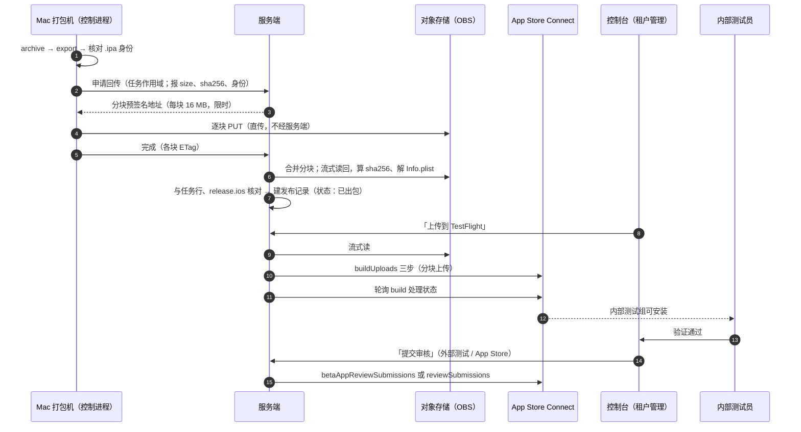

# iOS：平台代传 TestFlight 与控制台提审（2026-09-23）

> 状态：**草案，待拍板**。前置：`ios-testflight-distribution-2026-09-17.md`（分发模型、模式 A/B）、
> `ios-mac-builders-home-network-2026-09-18.md`（Mac 打包机、§4.3 上传账户）、
> `ios-mac-builders-implementation-2026-09-18.md`（实现与真机记录）。

## 0. 一句话

Mac 只管出包：打完的 `.ipa` **预签名分块直传到对象存储**（华为云 OBS），由**服务端**在人点按钮时
从存储取包传给 App Store Connect；内部测试组在 TestFlight 里装机验证过，再在控制台点「提交审核」。
Mac 上的上传账户（`_rnuploader`）退为备用。

## 1. 为什么改

2026-09-23 mac-01 第一次从检出一路打到上传：`ARCHIVE SUCCEEDED`、`EXPORT SUCCEEDED`、包身份核对通过，
倒在最后一步——`ios-upload` 连不上 `api.appstoreconnect.apple.com`。随后的实测：

| 从哪 → 到哪 | 结果 | 备注 |
| --- | --- | --- |
| Mac → App Store Connect（直连） | **TCP 超时**，3/3 | 不是偶发；经 Clash 节点 401、1.2 秒 |
| Mac → 机房（`api.predict.kim`，不经 Cloudflare） | 20–30 KB/s | 直连、经代理节点都一样 |
| Mac → 机房（`api.anyfun.win`，经 Cloudflare） | 忽快忽慢，3 次里 1 次 **522** | 522 = Cloudflare 回源失败 |
| Mac → Cloudflare 测速点（1 MB） | 约 320 KB/s，3 秒 | 经 TUN 与绕开 TUN 一样 |
| 机房 → App Store Connect | 401，0.7 秒 | 开发机与服务端同一机房（出口 IP 相同） |
| 机房 → OBS 新加坡（8 MB 分块 PUT） | 200，0.4–0.8 秒 | 约 10 MB/s |
| **Mac → OBS 新加坡（8 MB 分块 PUT）** | **TLS 握手超时**，经 Clash 126 秒、直连 160 秒，0 字节 | mac-01 与同网另一台 Mac 结果一致；经 Clash 也不通，疑为规则集把 `myhuaweicloud.com` 判成国内直连（未验证） |

两个结论：

1. **Mac 连 Apple 要靠代理**，而代理是这台 Mac 主人的私人设施（Clash 订阅），不是平台能保证的东西。
2. **Mac 连机房很慢**，所以"把包交回服务端再由服务端上传"不能走现在的服务端入口——24 MB 的包在
   25 KB/s 上要 16 分钟，几百 MB 的包就是几个小时。要换一条路回传。

同时，产品上本来就想要「控制台点一下上传 / 提审」，而不是构建完自动推给 Apple：先装机验证，再决定送审。

## 2. 先澄清：iOS 上"先自己装机验证"只能走 TestFlight

我们出的是 **App Store 发行签名**的包，Apple 规定这种包装不到任何设备上。能直接装的只有 Ad Hoc
（逐台登记 UDID、单独的描述文件）与开发包，而原设计**有意不做 Ad Hoc**：执行进程能解开签名私钥，
"签出来的东西没有出口"是它的补偿（打包机设计 §4.3、§10 威胁表第 1 行）。本稿不改变这一条。

所以"验证"= **TestFlight 内部测试**：上传不等于提审；内部测试组最多 100 人、**免审**，Apple 处理完
（一般 10–30 分钟）即可在 TestFlight App 里安装。测试员要是 App Store Connect 团队成员。

## 3. 方案

### 3.1 包回传：Mac → OBS 预签名分块直传

- 平台已有对象存储（控制台「发布存储」：`provider=obs`、`ap-southeast-3`，即新加坡）与**预签名分块直传**
  （`internal/api/upload_sessions.go`：16 MB 一块、服务端签发每块的 PUT 地址、客户端直传、服务端合并）。
  控制台上传 APK 走的就是它。新增一组**任务作用域**的等价接口给打包机用，而不是让打包机调管理员接口。
- 分块直传天然可续传：断一块重传一块，比 Android 那条"经服务端代理 PUT 整包"的路适合家用上行。
- 对象键：`ios/<tenantId>/<jobId>/<bundleId>-<version>-build<n>.ipa`。
- 预签名地址只对这一个对象键、只在这次任务内有效；打包机拿不到存储的长期凭证。
- **实测不通**（2026-09-23，见 §1 表）：家用网络连 OBS 新加坡 TLS 握手就超时。所以本节的"直传"要么换一个
  离 Mac 近的区域（§6 备选 B），要么经代理（§6 备选 C，先给 OBS 域名单独加一条走节点的规则再测）。
  在定下来之前，阶段 0/1 用 §6 备选 A（Mac 经代理直传 Apple）不受影响。

### 3.2 服务端核验

服务端在机房里读 OBS 很快，所以核验在服务端做，不信打包机自报：

- 流式读回整个对象算 sha256，与打包机报的比对（防传输损坏，也防有人往那个键上换包）。
- 解 zip 里 `Payload/*.app/Info.plist`：`CFBundleIdentifier`、`CFBundleShortVersionString`、`CFBundleVersion`
  必须等于任务行与 `release.ios`。这与打包机上 `iosArtifactProblems` 那道门禁同一组规则，服务端独立再做一次。
- 核验通过才建发布记录（`platform=ios`，带 `object_key`/`sha256`/`file_size`，与 Android 同一张表），
  状态「已出包」。原 TestFlight 设计 §4.5 的「外部托管发布」路径（不带产物）保留给模式 B 手工登记。

### 3.3 上传到 TestFlight（控制台按钮）

- 位置：租户管理 → iOS 打包与分发 → 发布记录的那一行，按钮「上传到 TestFlight」。
  可选开关「出包后自动上传」，默认关（与产品意图一致：人点才送）。
- 服务端起一个后台任务：流式从 OBS 读、按 Apple 给的 `uploadOperations` 分块传（与 `ios-upload` 同一套
  `internal/ascapi` 代码，`Uploader` 挪到服务端可用）。同号已存在按「已上传」处理（`ErrBuildAlreadyExists`，
  打包机设计 §6.3 的规则照搬）。
- 上传后轮询 `GET /v1/builds?filter[app]=…&filter[version]=<build>` 的 `processingState`，
  `VALID` 即「可测试」；`INVALID` 把 Apple 给的原因显示在那一行上。
- 权限：平台管理员与租户管理员可点；记审计（谁、何时、哪个 build）。

### 3.4 内部测试

- 内部测试组若开了「自动分发」，处理完即可装；否则服务端把 build 加进指定的内部组
  （`POST /v1/betaGroups/{id}/relationships/builds`）。控制台里选一次默认内部组即可。
- **出口合规**：`Info.plist` 没有 `ITSAppUsesNonExemptEncryption` 时，TestFlight 会挂「缺少出口合规信息」，
  答完才能测。RN-App 现在**没有**这个键。钱包 App 用到了密码学，能否按豁免申报是**合规问题，要租户/法务确认**，
  不能由平台替它答。确认后二选一：在 `app.config.ts` 写死（每个 build 免答），或保持不写、每个 build 在控制台上答
  （`PATCH /v1/builds/{id}` 的 `usesNonExemptEncryption`）。

### 3.5 提交审核

控制台「提交审核」给两个目标，按租户当前阶段选：

| 目标 | 做什么 | Apple 接口（以 Apple 文档为准） |
| --- | --- | --- |
| TestFlight 外部测试 | 送 Beta App Review，过了之后公开链接可用 | `POST /v1/betaAppReviewSubmissions`（build 关系）；「测试内容」写 `betaBuildLocalizations` |
| App Store | 建或复用可编辑的版本、挂上这个 build、送审 | `appStoreVersions`（建/改）→ `PATCH …/relationships/build` → `reviewSubmissions` + `reviewSubmissionItems` → 提交 |

审核资料（联系人、演示账号、说明）是 ASC 那边的前置，TestFlight 设计 §7.1 已列；控制台只做"缺什么"的检查与提示，
不在平台存演示账号口令。

### 3.6 模式 B 租户（不交 Key）

平台不碰 Apple。控制台给一个「下载 .ipa」（OBS 预签名 GET，短时有效），租户用 Apple 的 Transporter
自己传。这比现在"包停在 Mac 上"好：模式 B 第一次有了拿到包的正规途径。

> 2026-09-24：这一条已定为租户接入的第 ② 档（自助上传），先于本稿其余部分实现，回传先经服务端流式、再换 OBS 直传。
> 详见 `ios-tenant-delivery-tiers-2026-09-24.md`。

## 4. 安全模型的变化：服务端开始写 Apple 侧状态

原则「服务端不写 Apple 侧任何状态」（`internal/ascapi` 包注释，`TestServerSideNeverConstructsAnUploader` 守着）
要改成：**只有上传/提审这一个后台任务能构造 `Uploader`，而且只在人点了按钮之后**。

| 攻破了谁 | 原来 | 改后 | 说明 |
| --- | --- | --- | --- |
| 服务端 | 读租户 ASC 信息 | 还能**上传已有的包**、送审、动测试组 | **传不了恶意代码**：服务端没有签名私钥，只能传 Mac 签过的包；Apple 也会拒签名不对的包。最坏是把一个没打算发的版本推进 TestFlight 或送审 |
| Mac 控制进程 | 能让上传账户传任意通过核对的 `.ipa` | 只能往自己任务的对象键上传包 | 服务端独立核 sha256 与身份，比原来只靠 Mac 自己核更强 |
| Mac 执行进程 | 没有出口 | 没有出口（不变） | 预签名地址在控制进程手里，执行进程拿不到 |
| 对象存储凭证 | —— | 服务端持有（已是现状） | 打包机只拿单对象、限时的预签名地址 |

缓解：

- 租户在 ASC 建 Key 时**限到本 App**，角色 **App Manager**（上传与送审都需要；Admin 权限过大）。
- 上传、送审一律人触发、留审计；「出包后自动上传」默认关。
- Key 的存法沿用 `ios_asc.go`（`STORAGE_MASTER_KEY` 加密、按租户 AAD），不新增信任模型。

## 5. 与现有设计的关系

| 保留 | 改变 | 退役（逐步） |
| --- | --- | --- |
| Mac 手工签名、签名闸、执行进程无出口 | 包从"停在 Mac 上 / Mac 直传 Apple"变成"Mac 直传 OBS、服务端传 Apple" | 每台 Mac 装每个 Team 的上传 Key（`/var/rn-build-upload`、`ios-upload --install-key`）|
| `internal/ascapi` 的上传实现（分块、同号幂等） | 服务端可以构造 `Uploader`（仅上传/提审任务） | `BUILD_AGENT_IOS_UPLOAD=1` 作为备用路径保留一段时间，见 §6 |
| 发布记录表 | iOS 发布记录带产物（`object_key` 等） | —— |

**图标也改走 OBS**：打包机取租户图标现在经服务端接口，Mac 上 20–30 KB/s，近 1 MB 的图标要半分钟以上
（build 30–32 连续三轮倒在这里，已先把单次时限放宽到 3 分钟）。服务端改为给打包机发图标的预签名 GET 地址，
与包回传同一条快路。

## 6. 备选：Mac → OBS 也慢怎么办

| 备选 | 做法 | 代价 |
| --- | --- | --- |
| A. 保留 Mac 直传 Apple | 现有 `ios-upload`，经 `BUILD_AGENT_PROXY` 走代理（2026-09-23 已实现） | 依赖 Mac 主人的代理；没有"先验证再送"的按钮——但可以只传不送审，送审仍在控制台做（§3.5 不依赖包从哪条路传上去） |
| B. 换一个离 Mac 近的存储区域 | OBS 开一个国内/香港区的桶专给 iOS 回传，服务端跨区读 | 多一个桶与配置；跨区流量费 |
| C. 回传也经代理 | 预签名 PUT 经 `BUILD_AGENT_PROXY` | 代理节点到新加坡未必快，要测 |

§3.5 的提审与 §3.4 的内部测试**不依赖包从哪条路进 Apple**，所以控制台的「提交审核」可以先做，
回传路径按实测结果选。

## 7. 开放问题与实测

1. **回传走哪条路。** OBS 新加坡已实测不通（§1）。下一步二选一再测：给 `*.obs.ap-southeast-3.myhuaweicloud.com`
   加一条走代理节点的 Clash 规则重测；或者在华为云国内/香港区开一个桶测。测法不变：借现有的分块会话签一个分块
   PUT 地址，传一块 8 MB，然后取消会话（分块上传被中止，桶里不留对象）。
2. **出口合规怎么答**（§3.4）：要租户/法务定。
3. **发布存储的桶叫 `web3-rwa-dev`**：生产上的发布记录在一个名字带 `dev` 的桶里。是命名遗留还是真用了开发桶，要确认；
   iOS 包进来之前定下来，免得以后迁。
4. **包大小上限**：`ArtifactMaxSizeBytes` 是按 APK 定的，iOS 包的大小规律不同（build 29 是 24 MB，
   加了原生模块或资源会涨），要单独一个上限。
5. **多久清理**：TestFlight build 90 天过期，OBS 里的 `.ipa` 保留多久（建议跟随发布记录，删记录才删对象）。

## 8. 分阶段

| 阶段 | 内容 | 依赖 |
| --- | --- | --- |
| 0 | 现有路径先跑通一次：Mac 经代理直传 TestFlight，内部测试装机验证冷启动、推送、OTA | 打包机新版（`c116e9e`）上线 |
| 1 | 控制台「提交审核」（外部测试 / App Store）+ 处理状态显示 | ASC Key 为 App Manager 角色 |
| 2 | Mac → OBS 回传 + 服务端核验 + 发布记录带产物 + 「下载 .ipa」（模式 B） | §7 第 1 条实测通过 |
| 3 | 服务端「上传到 TestFlight」按钮；Mac 上传账户退为备用 | 阶段 2 |
| 4 | 图标改发预签名地址 | 阶段 2 的任务作用域签发接口 |
