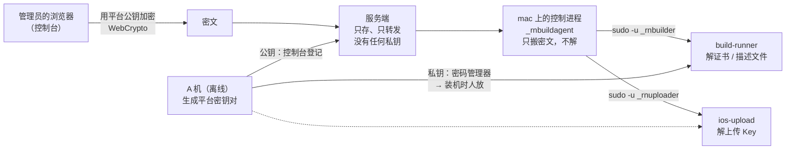

# iOS 签名材料的密文分发

2026-09-19 · RN-Server / 打包机

上游：[`ios-mac-builders-home-network-2026-09-18.md`](ios-mac-builders-home-network-2026-09-18.md)（§4.2 账户与目录、§4.3 材料、§4.4「由人放」）、
[`android-signing-gate-2026-09-16.md`](android-signing-gate-2026-09-16.md)（密钥封装给收件人的那一套）。
运维手册：[`SIGNING_MATERIAL.md`](../../deploy/build-agent-macos/SIGNING_MATERIAL.md)。

---

## 1. 现在是怎么做的，以及为什么要改

装机脚本铺好目录就停手，证书、描述文件、上传 Key **由人逐台放**（设计 §4.4）：

```bash
sudo -u _rnbuilder security import <证书>.p12 -k /var/rn-build-signing/rn-signing.keychain-db -T /usr/bin/codesign
sudo -u _rnbuilder security set-key-partition-list -S apple-tool:,apple: -s -k "$(sudo cat …password)" …
# 描述文件放 /var/rn-build-signing/profiles/<TEAMID>/<bundle id>.mobileprovision   0600 _rnbuilder
# 上传 Key 放 /var/rn-build-upload/<TEAMID>/{key.json,AuthKey_<KEYID>.p8}          0600 _rnuploader
```

一台机器、一个租户时这没什么。真正的代价在三件事上：

1. **加一台 Mac** 要把整套材料再搬一遍，而搬运途中材料是明文（U 盘、scp、聊天工具都见过）；
2. **年度续期**要挨台重做，漏一台的表现是「那台机器悄悄少报一个 Team」——不报错，只是任务不派给它；
3. 放错权限、放错目录、`set-key-partition-list` 忘了做，都会让机器**安静地**少报材料。今天（2026-09-19）真机上已经撞过一次同类问题：控制进程读不到 `profiles/`，盘点永远是空。

要的是：**材料在控制台上传一次，每台 Mac 自己取、自己落地。**

## 2. 不能做成什么样

整套打包机设计的前提只有一句：**服务端被攻破也签不出能过验的包。**发布密钥在离线机器上、Mac 按人给的指纹 pin 公钥、提交要验签——都是为这一句。

所以下面这个形状是**不可接受**的，哪怕它最省事：

> 明文 `.p12` / `.p8` 存在服务端，Mac 用机器令牌来取，取回来再加密存本地。

攻破服务端 = 拿到全部租户的 Apple 签名与上传能力。「在 Mac 上加密保存」挡不住：密文和解密能力走同一条路，攻击者在源头就拿到了明文。而 iOS 这侧的代价格外大——Apple Distribution 证书**一个 Team 只有一张**，吊销要租户的 Account Holder 到场重签、每台机器重新分发。

**可接受的形状只有一个：服务端只转发它读不懂的密文。**这不是新发明——Android 的签名密钥已经是这么发的（`signing/keystorebox`）：离线工具把密钥加密给每台签名闸的公钥，服务端只存密文，收件人不在名单里直接拒收。

## 3. 形状



三条性质，缺一条这套就不成立：

- **私钥从不经过服务端。**A 机生成，进密码管理器，装机时人放到 Mac 上。与 `--release-key-sha256` 同一个仪式。
- **加密发生在服务端之前。**浏览器里加密完再上传，服务端从头到尾只见密文。
- **控制进程不解密。**它持有机器令牌与出处密钥，不该同时握着签名材料。解密与落地由对应的角色账户做（§4.1 那条隔离照旧）。

## 4. 密钥体系

**平台级，两把，不是每台机器一把。**

| 密钥 | 谁持有私钥 | 解什么 |
| --- | --- | --- |
| `builder` | 每台 Mac 的 `_rnbuilder` | Apple Distribution 证书（`.p12` + 口令）、描述文件 |
| `uploader` | 每台 Mac 的 `_rnuploader` | App Store Connect 上传 Key（`.p8` + issuerId/keyId） |

**为什么不是每台一把**：一台机器一把的好处是吊销时只删一个收件人；代价是每加一台机器，所有材料都要重新加密一次。平台目前是一两台 Mac，而**证书私钥本来就是全部 Mac 共用的**（一个 Team 一张证书，§4.3），所以「一台机器被攻破」这件事的后果不因共用解密密钥而变大——那台机器的钥匙串里本来就有证书私钥。取舍写在这里，代价是：**丢一台 Mac 要换平台密钥并重新加密全部材料**，而不是删一行。

**为什么按角色分两把**：合成一把的话，拿到构建账户就同时获得上传能力——那正是三个账户分开要挡的事（构建跑第三方代码，上传能往 App Store 传包）。增量是零：生成两把，装机放两把。

构造复用 `signing/keystorebox`：

```
临时 X25519 密钥 → ECDH → HKDF-SHA256(info = 标签 ‖ 临时公钥 ‖ 收件人公钥)
→ AES-256-GCM，附加数据 = 标签 ‖ Purpose ‖ 收件人指纹
```

只换 `Purpose`（`ios-signing-material` / `ios-upload-key`），不新发明格式，也不再做一遍密码学评审。

## 5. 材料与数据模型

| 材料 | 粒度 | 收件人 | 落到哪 |
| --- | --- | --- | --- |
| Distribution 证书 `.p12` + 口令 | 每 Team 一份，全机共用 | `builder` | 导进 `rn-signing.keychain-db`，并做 `set-key-partition-list` |
| 描述文件 `.mobileprovision` | 每 (Team, bundle id) 一份 | `builder` | `/var/rn-build-signing/profiles/<TEAMID>/<bundle id>.mobileprovision` |
| 上传 Key `.p8` + issuerId/keyId | **每 Team 一份**，所有 Mac 共用（2026-09-19 调整，见下） | `uploader` | `/var/rn-build-upload/<TEAMID>/{key.json,AuthKey_<KEYID>.p8}` |

**上传 Key 为什么不再按机器分**（2026-09-19，实现当天改的）：母设计
（`ios-mac-builders-home-network-2026-09-18.md` §4.3a）定的是每台 Mac 每个 Team 一把，
理由是丢一台能只吊销那一把。这条策略挡不住它要挡的事——**证书私钥是全部 Mac 共用的**
（一个 Team 一张证书）。一台 Mac 丢了，`.p12` 就算泄露：要在 Apple 后台吊销证书、重签、
给所有机器重发，那一刻所有 Mac 本来就停了。上传 Key 分不分机器，只改变「顺手要不要换那把
Key」，省不下这次全平台停机。

代价却是天天在付：ASC Key 只能在**租户自己的 Apple 账号**里建，按机器分就等于要求租户
「按平台有几台打包机」建 N 把——于是「平台有几台 Mac」必须漏给租户，租户的上传页上还得
摆一份打包机列表。而租户那一侧本来只该是「我传我自己的 Apple 材料，下发是平台的事」，
证书与描述文件正是这样。

所以上传 Key 与证书同级：**这个 Team 一份**，服务端 `scope` 空串，所有 Mac 都取得走。

母设计里那条「更严一档」（为每台 Mac 在租户的 ASC 里建专用用户、用它的 Individual Key）
**一并去掉**：Individual Key 天生按用户、也就是按机器走，与这里的模型冲突；而它要求租户为
每台打包机准备一个邮箱、走一次邀请——那正是这次要拿掉的「租户得知道平台有几台机器」。

服务端一张表 `ios_signing_material`：

```
id            材料 id
kind          certificate | profile | upload-key
team_id       Apple Team ID
bundle_id     描述文件才有
machine_id    上传 Key 才有（NULL = 所有机器）
purpose       密文里的用途标签，取出来时对照
recipient_sha256  收件人公钥指纹（服务端只做对照，不做判据）
ciphertext    JSON（keystorebox.Box）
version       同一 (kind, team, bundle/machine) 的第几版，单调递增
uploaded_by / uploaded_at / 审计
```

**服务端不校验能不能解开**——它没有私钥。它做的检查只为帮运维当场发现拿错文件：`purpose` 对不对、收件人指纹在不在登记的平台公钥里、大小上限、同一格对应的版本有没有往上走。与清单签名那条路同一个口径：**这些检查不是安全边界，判据在 Mac 上。**

## 6. 三段流程

### 6.1 上传（控制台）

1. 管理员选文件（`.p12` + 口令 / `.mobileprovision` / `.p8` + issuerId、keyId）；
2. **浏览器**取控制台上登记的平台公钥，用 WebCrypto 做 §4 那套封装；
3. 只把密文 POST 上去。明文不进网络、不进服务端日志。

**上传口挂在哪一页**（2026-09-19 审出来的，初稿放错了）：

| 材料 | 在哪一页 | 为什么 |
| --- | --- | --- |
| 证书、描述文件 | **租户的「iOS 打包与分发」** | Apple Team 与 bundle id 就写在那一页的表里，上传时直接带出来。放在平台页等于让人再抄一遍 Team ID——多两次抄写只是多两次抄错的机会，而抄错了没有任何地方校验得出来 |
| 上传 Key | **租户的「iOS 打包与分发」**（2026-09-19 二次调整） | 初稿放在平台页，理由是「它按机器分，而机器是平台级的」。改成每 Team 一份之后（见 §5），它与证书完全同级：租户传一次、所有 Mac 自己取，租户页上再也不出现打包机。顺带修掉一个真 bug：平台页找已存的那一把只按 `scope=机器`、**不看 Team**，多个 Apple Team 时会把别的 Team 那一把显示成这台机器的 |
| 两把平台公钥 | 平台的「Apple 证书与密钥」（2026-09-24 前叫「iOS 签名材料」）→ 平台加密公钥 | 整个平台一次 |

材料是平台级资产（一个 Team 一张证书，全部 Mac 共用），所以租户页那一块只对 `platformAdmin`
显示上传口，其他人看到的是一句「找平台管理员」。接口侧本来就只认平台管理员，这里只决定显示成
什么样。

于是平台页只剩两样：**两把平台公钥**（整个平台一次）和一张**全量只读总览**（所有材料列全，带
「这一份加密给的公钥已经不是登记的那把」的标记与删除）。上传一律回租户页。

> 2026-09-24：平台页改名「Apple 证书与密钥」，总览改成按租户一行（证书、描述文件、ASC 上传 Key、打包机装齐没有），
> 删除按种类写后果并带版本检查——见 RN-Admin `docs/design/ios-credentials-overview-2026-09-24.md`。

> WebCrypto 的 X25519 是近年才铺开的（Chrome、Safari、Firefox 都已支持，**具体版本以实现时实测为准**）。**做特性检测，不做静默降级**：
> 浏览器不支持就明确拒绝并指向离线工具（`ios-material encrypt`），绝不回退到「传明文让服务端加密」。

### 6.2 下发（代理）

控制进程每次认领前的盘点已经知道「这台机器该有哪些 Team 的材料」（§5.4）。加一步：

```
GET /v1/build-agent/ios-material            → 该我装的材料清单（kind、team、bundle、version、recipient）
GET /v1/build-agent/ios-material/<id>       → 密文
```

控制进程比对本机已装版本，只取新的。**它不解密**，把密文写进一个只有对应角色进得去的落地目录，然后：

```
sudo -n -u _rnbuilder  /opt/rn-build-agent/build-runner install-ios-material --file <密文>
sudo -n -u _rnuploader /opt/rn-build-agent/ios-upload   install-key         --file <密文>
```

两个程序各自用自己那把私钥解、自己落地、自己核对（`purpose`、Team、bundle id 与文件内容是否自洽），然后把结果回给控制进程——只回「成了 / 没成 + 原因」，不回内容。

### 6.3 落地之后

盘点照旧（今天刚改成经 `build-runner` 取原文），控制台上那台机器的 Team 列表自己就变了。**没有额外的「同步完成」状态**：能签什么以盘点为准，多一个状态就多一个能与实际不一致的地方。

## 7. 装机时私钥怎么放

装机脚本加两个参数，值是**本机上的文件路径**，内容由人从密码管理器取：

```bash
sudo bash install-macos.sh --server … --code … --release-key-sha256 … \
     --material-key-builder  /path/to/builder.x25519 \
     --material-key-uploader /path/to/uploader.x25519
```

脚本做三件事：校验是合法的 X25519 私钥、按 0600 装到对应账户名下、**把公钥指纹打出来让人与控制台上登记的那一把核对**。指纹不符就停——放错密钥的表现否则是「材料下来了但解不开」，而那条错要等到第一次下发才出现。

不传这两个参数照样能装（今天这套「由人放」的流程继续可用），只是这台机器不会自动收材料。

## 8. 轮换、吊销、加机器

| 事件 | 要做什么 |
| --- | --- |
| 加一台 Mac | 装机时放同样的两把私钥。**服务端一个字不用改**——这正是选平台级密钥的理由 |
| 证书年度续期 | 在离线机器上做好新 `.p12`，控制台上传新版本。各台机器下次盘点前自己取 |
| 丢一台 Mac | 控制台吊销那台机器（令牌立即失效）→ **换平台密钥**：A 机生成新的一对，控制台登记新公钥，把全部材料重新加密上传，逐台装机放新私钥。代价明确写在这里，是 §4 那个取舍的账单 |
| 上传 Key 吊销 | 它是每 (机器, Team) 一份：ASC 后台吊销那一把，控制台传一把新的给那台机器 |

## 9. 与 Android 签名闸的对照

| | Android 密钥 | iOS 材料（本文） |
| --- | --- | --- |
| 密文格式 | `keystorebox` v3 | 同一套构造，换 `Purpose` |
| 收件人 | **每台签名闸一把**，离线 pin 文件里 | **平台两把**（按角色），见 §4 的取舍 |
| 谁加密 | 离线工具 | 浏览器（离线工具作为兜底） |
| 服务端角色 | 只存密文 | 只存密文 |
| 收件人怎么被信任 | 签名闸本机 `trust-peer`，指纹带外核对 | 装机时人放私钥，指纹与控制台登记值核对 |

## 10. 分期

| 期 | 内容 | 验收 |
| --- | --- | --- |
| **A**（2026-09-19 完成） | 信封提取成 `internal/sealedbox`（`keystorebox` 照旧，固定向量验证字节未变）；`iosmaterial` 格式；`ios-material` 离线工具 | 工具产出的密文能被 Go 侧解开；换收件人、改一个字节都解不开 |
| **B**（2026-09-19 完成） | 服务端：表、上传接口、下发接口、审计；控制台卡片与浏览器加密 | 明文一个字节都没到服务端（抓包与日志两处验）；浏览器不支持 X25519 时明确拒绝 |
| **C**（2026-09-19 完成） | 代理侧：拉清单、取密文、交给两个角色程序落地；`build-runner install-ios-material`、`ios-upload install-key` | 控制台传一份证书 + 描述文件，机器不用人碰就报出那个 Team |
| **D**（2026-09-19 完成） | 装机脚本收两把私钥、核对指纹；运维手册与本文对齐 | 重装一台机器，除了两把私钥不需要任何手工材料 |

**A、B、C 之间可以隔天做**，每一期自己完整：A 完了还是人工放材料，只是多了工具；B 完了材料在服务端存着但没人取；C 完了才真正省掉人工。

## 10.1 跨实现向量

加密在浏览器里、解密在 Mac 上的 Go 程序里，同一套构造写了两遍。写歪一个字节的后果是「材料
传上去了、机器永远解不开」——而那要等真机取材料时才发现，还容易被当成密钥放错。

所以两边各钉一份**同一个向量**：

| 在哪 | 钉的是什么 |
| --- | --- |
| `signing/iosmaterial/browser_vector_test.go` | 浏览器用固定临时密钥与 nonce 封的那一份密文，Go 必须解得开 |
| RN-Admin `src/core/ios-material-box.spec.ts` | 同样的输入封出来的字节，必须与那一份逐字节相同 |

改任何一侧的构造，另一侧立刻挂。**两处一起改才算数。**

## 11. 已知取舍与缺口

- **平台密钥共用**：丢一台 Mac 的代价是换密钥 + 全量重新加密（§8）。换成每台一把可以只删一行，但每加一台机器都要重新加密全部材料。当前机群规模下选了前者。
- **上传 Key 共用**：同一条取舍的延伸（§5）。丢一台 Mac 要换这把 Key 时，所有 Mac 一起换——但那种时候证书本来就要全平台换。换来的是租户侧不必知道平台有几台打包机。
- **浏览器加密**：把一段密码学放进了前端。缓解：构造与 Go 侧同一套并有跨实现测试；不支持就拒绝，不降级。
- **服务端可以拒绝服务**：它能把密文换成垃圾、或者不下发。这与今天「它能不下发安装包」同级，不增加伪造能力——Mac 解不开就是解不开。
- **指纹核对靠人眼**：装机脚本把两个公钥指纹打出来，由人与控制台上登记的那两把比。脚本本可以从 `describe` 里取登记值自己比——指纹是公开值，服务端在这里撒谎最多骗出一次"装了把解不开的私钥"（拒绝服务），骗不出能用的材料。没做是因为这一步的性质是**带外**：私钥从密码管理器来、判据也该从那儿来。代价是人少看一眼就漏掉，而漏掉的表现要等第一次下发才出现。要补的话补成"脚本自己比，不一致只警告不中止"，别让它变成中止条件。
- **口令与 `.p8` 在落地之后仍是明文文件**（钥匙串口令、`AuthKey_*.p8`），由文件权限与账户隔离保护。这一点本文不改变。
