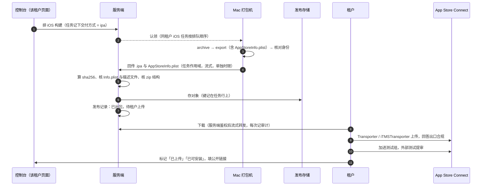

# iOS：租户接入分两档（全托管 / 自助上传）（2026-09-24）

> 状态：**档位已拍板：支持 ① ②，按租户配置、可切换；第 ② 档与切换待实现。**
> 第 2 版：同日做了三路对抗评审（安全、代码契合、Apple 事实与运营），结论和处理见 §8。
> 前置：`ios-testflight-distribution-2026-09-17.md`（分发模型、模式 A/B、对接清单）、
> `ios-signing-material-distribution-2026-09-19.md`（签名材料怎么下发到 Mac）、
> `ios-platform-testflight-upload-2026-09-23.md`（平台代传 TF、包回传）。

## 0. 决定

2026-09-23 build 34 全链路跑通（打包 → 签名 → 上传 TestFlight → 内部测试真机安装）之后，讨论了「租户不肯交这么多材料怎么办」。
按租户愿意交出的程度分过四档，**只支持前两档**：

| 档位 | 租户交什么 | 平台做什么 | 租户自己做什么 | 结论 |
| --- | --- | --- | --- | --- |
| ① 全托管 | 证书与描述文件 + 上传 Key（+ 可选的 App Manager Key） | 打包、签名、上传 TestFlight；有 App Manager Key 时同步公开链接与过期日 | 回答出口合规、提审 | **支持**，已实现 |
| ② 自助上传 | 只有证书与描述文件 | 打包、签名，把 `.ipa` 交给租户下载 | 上传、回答出口合规、建测试组、提审，把公开链接填回控制台 | **支持**，本文设计 |
| ③ 不交证书 | 只有源码配置 | 交出未签名归档 | 自己在 Mac 上用 Xcode 签名、上传 | 不做：租户要有 Mac 与懂 Xcode 的人，支持成本高 |
| ④ 没有开发者账号 | 无 | 用平台账号替租户上架 | —— | **不做**，而且做不了，见 §1 |

**① 和 ② 是每个租户自己的配置，可以切换**（2026-09-24 拍板）。切换规则见 §3.2。

**谁来操作**：现在服务端只有一个管理员账号（`ADMIN_USERNAME`，登录见 `internal/api/server.go:692`），会话里不带租户，
租户按访问的域名区分。所以"租户自己选"在本文的实现范围内指**在该租户的控制台页面上配置**，操作的人是平台管理员（按租户的要求改）。
要让租户用自己的账号操作，需要先做租户账号，另开设计，前提见 §4。

## 1. Apple 条款：头号风险与约束

条款原文以 [App Review Guidelines](https://developer.apple.com/app-store/review/guidelines/) 当期版本为准，下面是 2026-09-24 核对的内容。
TestFlight 外部测试走同一套条款（2.2：「Any app submitted for beta distribution via TestFlight should be intended for public distribution
and should comply with the App Review Guidelines」），所以这些问题**在外部测试提审时就可能碰到**，不是等到上架才碰到。

### 1.1 头号风险：多个租户的白标 App 可能被判重复（4.3）

① 和 ② 解决的只是"**谁来提交**"，没有解决"**这些 App 是不是重复**"。

- 4.3(a)：「Don't create multiple Bundle IDs of the same app」。
- 4.2.6 的后半句（第 1 版漏引了）：模板服务「should offer tools that let their clients create customized, innovative apps that provide unique customer experiences」。
- Apple 开发者论坛上有白标 App 从各客户自己的账号提交、仍被整体拒绝的案例，拒信原文是
  「shares a similar binary, metadata, and/or concept as apps submitted to the App Store by other developers, with only minor differences」
  （[thread 759119](https://developer.apple.com/forums/thread/759119)）。这是论坛案例，不是条款原文；TestFlight 外审会不会同样查 4.3，**未核实**。

后果落在**租户自己的开发者账号**上，严重时影响账号。处理：

1. **接第 2 个 iOS 租户之前，先用两个租户实走一次外部测试提审**，确认这条路走得通，再对外承诺 iOS 能力。
2. 每个租户准备差异化材料：功能配置、内容、名称与图标、审核备注里写清楚这个 App 服务的是谁、和同平台其他 App 有什么不同。
3. 对接说明里明确告诉租户：被判重复的风险落在租户账号上。
4. 备选方案写在这里备查：4.2.6 允许的「picker」聚合模式，即平台自己发**一个** App，在里面按租户切换。这会改变产品形态，不在本文范围。

### 1.2 其他约束

| 条款 | 内容 | 对我们的后果 |
| --- | --- | --- |
| 4.2.6 | 模板或生成服务做的 App 必须由**内容提供方自己**提交，服务方不应替客户提交 | 第 ④ 档不成立：每个租户必须有自己的开发者账号 |
| 3.1.5(i) | 钱包类 App 只能由**以组织身份注册**的开发者提供 | 租户必须是组织账号（要 D-U-N-S 编号）。原对接清单"个人账号也能发 TestFlight"已在 `ios-testflight-distribution-2026-09-17.md` §4.3 更正 |
| 5.1.1(ix) | 金融、博彩、加密交易所等强监管领域的 App 应由**提供该服务的法律实体**提交 | 和 3.1.5(i) 叠加：提交主体要是真正提供服务的公司，不只是"组织账号" |
| 3.1.5(iii)(iv) | 交易所要在有牌照的地区提供；期货、类证券交易要由持牌金融机构提供 | 预测功能与 DEX 相关功能要单独评估定性（还可能被归到 5.3 博彩类） |
| 2.3.1(a) | 不得有隐藏、休眠或未说明的功能；新功能要在审核备注里具体说明 | 控制台远程开关的功能（例如预测）在审核时要是打开并在备注里说明的状态，不能审完再开 |
| 2.5.2 | App 不能下载、执行会引入或改变功能的代码 | OTA 热更新只用于修复与调整。业界通常引用开发者协议（DPLA）3.3.1(B) 作为解释型代码可下载的依据，前提是不改变 App 的主要用途（条款原文未逐字核对） |

## 2. 两档各要交什么

| 材料 | ① 全托管 | ② 自助上传 | 用在哪 |
| --- | --- | --- | --- |
| Team ID、Bundle ID、ASC 里的 App 记录 | 要 | 要 | 任务路由、包身份核对 |
| Apple Distribution 证书（`.p12` + 口令） | 要 | 要 | Mac 上签名 |
| App Store 描述文件 | 要 | 要 | Mac 上签名 |
| 上传 Key（Team Key，Developer 角色） | 要 | **不要** | Mac 上的上传账户传 TestFlight |
| App Manager Key（模式 A） | 可选 | **不要**（这把 Key 本身就能上传，交了就不是第 ② 档） | 服务端只读同步公开链接、过期日；以后控制台提审 |
| APNs 密钥 | 要推送就要 | 要推送就要 | 推送 |
| 出口合规 | 租户在 ASC 里**逐个 build 回答** | 同左 | RN-App 的门禁禁止在 `Info.plist` 写死答案（`scripts/lib/ios-release-identity.js:176-181`），拿到法务书面答复前每个 build 都要答，否则 TestFlight 显示 Missing Compliance、谁都装不了 |
| TestFlight 公开链接 | 有 App Manager Key 时自动同步 | 租户手工填 | 扫码落地页、App 内更新入口 |

证书与描述文件怎么交、怎么下发到每台 Mac，按 `ios-signing-material-distribution-2026-09-19.md` 走，两档没有区别。
**第 ② 档少掉的是所有能操作租户 App 的 ASC Key。**

## 3. 第 ② 档的设计

### 3.1 流程

### 3.2 交付方式与切换

**存在哪**：单独的配置键（例如 `release.ios.delivery`）和单独的接口，**不放进 `release.ios`**。
原因：手工保存与 TestFlight 同步都按固定字段整份重写 `release.ios`（`release_identity_apple.go:236-240`、`ios_asc.go:357-366`），
放进去会在第 ② 档每次保存公开链接时被冲回默认值。这个键和 `release.ios` 一样不进 App 的 bootstrap，不需要"发布"就生效。
写入带 `expectedVersion`、要确认、记审计。

**不从"Mac 上有没有 Key"推出来。** 否则第 ① 档租户的 Key 丢了或被吊销时，会被悄悄降成第 ② 档：包停在存储里没人传，运营却以为已经进了 TestFlight。

**切换规则：**

| 情况 | 规则 | 为什么 |
| --- | --- | --- |
| 什么时候生效 | 交付方式在**排队那一刻**写进任务（`build_jobs` 新列），之后改配置只影响新排的任务。构建列表显示每条任务的交付方式 | 同一条任务中途换方式，既难审计也难解释 |
| 有未完成任务时 | **有排队中、已领取、构建中的 iOS 安装包任务时，拒绝切换**，提示先取消或等完成（这三种状态都能取消） | 见下一行 |
| 认领顺序 | 认领 SQL 加一条：**同租户没有更早的排队中 iOS 安装包任务**才能领 | 现在同租户只挡"同时在跑两条"（`build_agent.go:265-289`），排队顺序是碰巧成立的：以前同租户的 iOS 任务领取条件完全相同。按交付方式分路由后，① 的 N 号卡住时 ② 的 N+1 号会先打完落库，N 号之后传进 TestFlight 却在 `/ios-release` 被 `RELEASE_VERSION_NOT_INCREASING` 拒掉，包撤不回来。加了这条，卡住的任务会挡住后面的任务，积压告警会报出来，由人处理 |
| ② → ① | 允许保存。检查"有没有能上传的机器"按**登记语义**判：登记在用的机器里，最近一次上报这个 Team 的上传 Key 状态是 `ok` 或 `error`（装了 Key、没被 Apple 拒）。一台都没有就在配置旁标红，**排队时拒绝**并说明原因；机器只是暂时离线不算 | 沿用"机器都掉线也照常排队"的现有规则（`build_machine_liveness.go:265-271`、`build_jobs.go:485-497`）；`error` 多半是代理临时断了，不该让任务排不进去 |
| ① → ② | 立即生效（前提是没有未完成任务）。确认弹窗要求勾选「已在 App Store Connect 吊销上传 Key 与 App Manager Key」，并说明 Mac 上的 Key 什么时候清掉（§3.9）。服务端存的 App Manager Key（`ios.asc`）同时删除 | 切到 ② 多半是想收回授权。平台删掉自己这边的副本不等于授权收回，真正收回授权要靠 ASC 吊销 |
| 同一 Team 下多个租户 | 如果同一个 Team 下还有别的租户是 ①，切换时提示"这个 Team 的上传 Key 仍会留在打包机上" | Team Key 限不了 App，一个 Team 一把 |
| build 号 | 两种方式共用同一个递增计数，切换不重置。中间有没传的号没关系 | Apple 只要求同一版本号下后传的号更大 |
| 旧交付件 | 同一版本号下，一旦有更高的 build 被上传或出包，更早的 ② 交付件标为「已被取代，传不上去了」，下载页写明"只传最新的一个" | 同一版本号下后传的号必须更大（[TN2420](https://developer.apple.com/library/archive/technotes/tn2420/_index.html)，已归档），切到 ① 后平台自动传了 N+1，租户手上的 N 就作废了 |
| 公开链接 | ② 下手工填；切到 ① 且有 App Manager Key 时开始自动同步，**手工填过的值优先**（现有代码已如此，`ios_asc.go:359-362`） | 切换不能冲掉租户填的链接 |

### 3.3 打包机

- `deliverIPA`：按任务的交付方式分支。`testflight` 走现在的上传账户；`ipa` 不碰上传账户，回传控制进程手里那份 `.ipa`。身份核对两条路都照做。
- **回传单独计时**：现在任务总时限（`buildCtx`，mac-01 设的是 120 分钟）包住了整个构建和交付（`agent.go:358`、`:387`）。
  70–80 分钟的编译加 16 分钟回传，再碰上一次失败重试就会超时、丢掉打好的包。回传改成像结果上报（`reportCtx`）那样放在总时限外面，单独给时限。
- **回传卡住检测**：单次上传请求只有 30 分钟的总时限（`client.go:39`），连接卡住要干等 30 分钟才重试。加"60 秒没有新字节就断开重试"。
- **上传 Key 状态逐 Team 上报**：现在 `RequireUploadKey` 是整机开关，开着上传的 Mac 缺哪个 Team 的 Key，就报不出那个 Team、领不到它的任务。
  改成逐 Team 上报状态，不再用它挡 Team，并新增一个取值 `missing`（没装 Key），不再和 `error`（装了但探测失败）混在一起。
  探测其实是每次认领（约 10 秒一次）对每个 Team 都做（`ios_inventory.go:290-292`），和注释说的"启动时探一次"不一致，要改注释或降低频率。
- **导出时生成 `AppStoreInfo.plist`**：Windows 和 Linux 上用 iTMSTransporter 上传必须带它，现在的导出选项没有打开 `generateAppStoreInformation`
  （RN-App `scripts/lib/ios-release-identity.js:58-75`）。这是 RN-App 的改动，两档都打开，② 把它和 `.ipa` 一起回传。键名与行为上线前在 mac-01 上用 `xcodebuild -help` 核对。

### 3.4 回传路径

- **先复用现有的任务作用域流式回传**（Android 未签名包那条：`uploadStream` → `receiveBuildDelivery`，它现在就放 iOS 任务通过）。
  build 29 的包 24 MB。重试时每次用新的对象键，被替换的旧对象会删掉，迟到的上传只删自己写的那个（`build_agent.go:773-789`）；心跳在单独的协程里继续，回传期间取消能打断回传。
- **要注意走的是哪个入口**：mac-01 的 `BUILD_AGENT_SERVER` 是 `api.anyfun.win`，经过 Cloudflare（`rn-build-agent-macos.env.example:15`）。
  之前 20–30 KB/s 的实测是不经 Cloudflare 的 `api.predict.kim`；经 Cloudflare 的那条 3 次里有 1 次 522。Cloudflare 套餐的请求体上限（常见是 100 MB）**未核实**。
  服务端这边能放行：nginx 不缓冲请求体、读写超时 3600 秒，Go 服务端读超时 3600 秒。
- **上限**：按 25 KB/s，30 分钟只能传约 45 MB，中途断了只能整包重传。包涨到这个量级之前，要么换成 OBS 分块直传（平台代传设计的阶段 2），要么先把这条路改成分块续传。
  `ArtifactMaxSizeBytes`（512 MiB）和 `jobspec.MaxIPASize`（2 GiB）都不是瓶颈，瓶颈是传输。
- 换路只影响 Mac 与服务端之间，租户的下载不变。

### 3.5 服务端

**对象键存在任务行上。** `build_jobs` 新增 `ipa_object_key` / `ipa_sha256` / `ipa_size`（以及 `AppStoreInfo.plist` 的对象键），并加进 `jobObjectKeyColumns`。
现有的清理（重新认领、失败、取消、回收、删除发布）全按 `build_jobs` 上的对象键列做（`build_job_objects.go:30-33`、`release_purge.go:190-206`），只记在 `file_metadata` 里的对象会变成孤儿。

**收尾**：② 的 `/ios-release` 在同一个 `FOR UPDATE` 里要求本次认领已经回传、摘要与上报一致（参照 `build_agent.go:993-998`）。
① 的收尾反过来：上报"没上传"就拒收。

**核验**（不信 Mac 自报，比 Mac 上的门禁多几项）：
- 流式算 sha256 与大小；
- `Payload/*.app/Info.plist`：bundle id、版本、build 号等于任务行与 `release.ios`；
- `embedded.mobileprovision`：TeamIdentifier 等于该租户的 Team，没有 `ProvisionedDevices` / `ProvisionsAllDevices`，`get-task-allow` 为 false。这样"它是 App Store 包"就从假设变成了检查；
- zip 结构白名单：只允许 `Payload/<唯一>.app/`、`SwiftSupport/`、`Symbols/` 等 Xcode 导出会产生的目录；
- plist 解析器现在在 `cmd/build-agent/bplist.go`（`package main`），要挪到 internal 包给服务端用。

**发布记录**：`file_metadata` 写 `delivery:"ipa"` 与交付件的摘要副本，`hosted` 取新的值（不再写死 `testflight`，审计文案也不再写 "TestFlight build"）；
**分发产物的 `sha256` 列不填**。这不只是语义问题，还是安全前提：
- 激活发布要求 `sha256` 非空（`server.go:949-955`；`verified_at` 入库时就会写上，真正挡住激活的是 `sha256`），所以 ② 的记录不会被激活，不会触发推送与强更；
- 无需登录的公开下载 `/v1/public/releases/:id/download` 现在靠 `hosted` 挡住 iOS 记录（`simplified_releases.go:899`），要显式把 `delivery:"ipa"` 也挡住，交付件只能走 §3.6 的鉴权下载。

这一条和平台代传设计 §3.2"发布记录带 `object_key`/`sha256`"冲突，**以本文为准**，那份已加注。

**顺带修的注释**：`ios_build_release.go:31` 说发布记录"是 latestVersion 的依据"，和代码不符。iOS 的 `latestVersion` 读的是人工配置（`server.go:1936`），只有 Android 直装走发布记录。

**保留期**：交付件保留 30 天，或租户标记"已上传"后 7 天，到期只删对象、保留发布记录。现在没有"只删对象"的路径（`purgeRelease` 连记录一起删），要新写一个定时清理。

### 3.6 下载

- **服务端鉴权后流式转发**，不给 OBS 预签名链接。原因有三：Mac 连 OBS 新加坡 TLS 握手超时，国内租户很可能一样；预签名链接"签发"了不等于"下载"了，审计不准；链接泄露后谁都能下。
  Android 的公开下载已经是服务端流式转发，照着做。
- 支持 Range（大文件断点续传），每次下载记审计（谁、哪个交付件、字节数）。
- 下载页显示 sha256 与文件大小，供租户核对。
- 只按 `jobId` / `releaseId` 查出对象键，不接受客户端传来的键。
- 新路由以 `/upload` 或 `/download` 结尾时注意数据库超时豁免的写法（`server.go:495`）。

### 3.7 租户每次发版要做的事（写进控制台的操作说明）

1. 控制台排构建，等状态变成「已出包，待上传」。
2. 下载 `.ipa`（Windows/Linux 还要下载 `AppStoreInfo.plist`），核对 sha256。
3. 上传，二选一：
   - **Mac**：Transporter App，用 Apple ID 登录；
   - **Windows 11 / Red Hat Linux**：iTMSTransporter 命令行，`-assetDescription` 指向 `AppStoreInfo.plist`，用 App 专用密码或租户自己的 API Key 认证。
   - 另外，租户也可以用自己的 API Key 调 ASC API 的 `buildUploads` 上传。
   - 上传账号的角色要是 Account Holder、Admin、App Manager 或 Developer。
4. 等 Apple 处理完（一般 10–30 分钟），在 ASC 里**回答这个 build 的出口合规**。
5. 加进测试组；外部测试要提交 Beta 审核（Admin 或 App Manager 角色）。
6. 回控制台：标记「已上传」；审核通过、能装了再标记「已可安装」；第一次还要填公开链接。
7. 上传或审核被 Apple 拒时，把拒绝原文贴回控制台那条记录（平台看不到 Apple 发给租户的邮件）。

控制台状态：已出包 → 已上传（租户标）→ 已可安装（租户标）；另有"已被取代"和"已过期"。
公开链接跨 build 不变（[Invite external testers](https://developer.apple.com/help/app-store-connect/test-a-beta-version/invite-external-testers/)），
所以"链接填好了"不代表新 build 能装，要以"已可安装"为准。

### 3.8 版本策略与 90 天

- **强更阈值**：第 ② 档租户保存 iOS 版本策略时，最低支持版本不能高于最近一个标了"已可安装"的版本，超过就拒绝保存并说明原因。
  否则用户会被强更引到 TestFlight，那里只有旧 build，用户就被锁在外面了。
- **90 天到期**：平台没有 Key，读不到 `expirationDate`。按「出包时间 + 90 天」提前告警（上传不会早于出包，所以这个时间只会比真实到期早，偏保守）；租户标记了上传日期之后改用上传日期。
- 热更新基线候选列表（`ota.go:87`）会出现还没传 TestFlight 的 ② 记录，列表上要标出状态，避免选错基线。

### 3.9 安全

- **包本身**：App Store 签名的 `.ipa` 原样装不到设备上（[TN2319](https://developer.apple.com/library/archive/technotes/tn2319/_index.html)），
  但拿到它的人可以用自己的证书重签成 Ad Hoc 包装机，也可以改包仿冒（上传前的包没有 FairPlay 加密，这一点是业界常识，未找到 Apple 原文）。
  所以它是一份**未发布的钱包二进制**，要防外流：鉴权下载、每次审计、不给长期链接。
  反过来，租户用自己的证书重签 Ad Hoc 在自己设备上验证，是租户可以做的正当用法，平台不拦。
- **执行进程的出口**：任务令牌它拿不到，回传由控制进程从自己的副本发出（0700 目录、`O_NOFOLLOW`、有大小上限）。
  但 `.ipa` 的每个字节都是执行进程产出的，服务端只读几个 plist，所以包里理论上能夹带额外内容交到租户手上。执行进程本来就能访问公网（打包机设计 §4.1），这不是新增能力；zip 结构白名单能挡住明显的夹带。
- **Mac 上的上传 Key 删不掉**：服务端删除材料只删服务端的密文，**已经装到 Mac 上的那一份不会消失**（`internal/api/ios_material.go:421-422`），打包机的同步只装不删。
  所以切到 ② 的租户，它的上传 Key 仍留在每台 Mac 上，被攻破的控制进程仍可以调上传账户。处理：
  1. 切换确认时要求在 ASC 吊销 Key（§3.2）。**吊销之后这条风险才算消除**；
  2. 补"墓碑"：材料清单里下发已撤下的条目，由 `_rnuploader` 删掉本地文件并回报，控制台逐台显示是否已清除（阶段 2）。
- **② → ① 时上传 Key 怎么交**：现在只有平台接口能上传材料，浏览器里加密后才上传，服务端只存密文（材料分发设计 §6.1）。
  在租户账号出来之前，由平台管理员上传；租户如果不想把明文交给平台的人，用离线工具 `ios-material encrypt` 自己加密，只交密文。
  以后开放给租户账号时，只允许上传 upload-key 这一类，并且服务端强制 Team ID 等于该租户 `release.ios.appleTeamId`。
- **崩溃符号**：导出开着 `uploadSymbols`，符号化后的崩溃进租户的 ASC 账号，第 ② 档平台看不到 TestFlight 的崩溃与反馈；dSYM 也会随任务目录删掉。
  回传时另存一份只有平台能取的 dSYM 与 Hermes source map（阶段 3，可后做），对接说明里请租户转发崩溃日志。

### 3.10 与平台代传设计的关系

第 ② 档做完，"包从 Mac 回到存储、服务端核验、交付件挂在任务与发布记录上"这一段就有了，这正是平台代传设计的阶段 2。
以后第 ① 档改成"服务端从存储传 TestFlight"（阶段 3），复用同一个对象，Mac 上的上传 Key 可以逐步退役。

## 4. 租户账号：让租户自己操作的前提（另开设计）

本文的实现不依赖租户账号。以后要让租户自己登录操作（切换交付方式、下载交付件、标记状态），先满足：

1. 会话绑定 `tenant_id`（现在 `admin_sessions` 没有这一列）；
2. 每个租户范围的接口都校验"会话里的租户 = 按域名解析出的租户"（现在 `domainTenantScope` 只按 Host 定租户，`server.go:478-489`，照搬就是跨租户越权）；
3. 审计记到具体的人（现在 actor 永远是同一个账号）；
4. 租户账号能做的事列白名单：切换交付方式、下载交付件、标记状态、上传自己 Team 的 upload-key；不包括平台级材料与打包机管理。

## 5. 上线顺序与分阶段

服务端严格解析认领请求体，上传 Key 状态只认固定几个取值（`build_agent.go:89-91`、`build_machine_liveness.go:150-154`，控制台 `api.ts:1977` 的 zod 也是写死的枚举）。
所以顺序必须是：**服务端 → 控制台 → 批准新版打包机 → 开放选择 ②**。在批准的打包机版本支持 ② 之前，排队时拒绝 ② 任务，
否则旧版打包机开着上传就会把包传进 TestFlight，关着上传则任务"成功"了却没有交付件（`agent.go:557-568`）。

| 阶段 | 内容 | 仓库 |
| --- | --- | --- |
| 1 | 服务端：`release.ios.delivery` 配置与接口；`build_jobs` 加 `delivery` 与交付件列（迁移、`buildJobColumns`、`scanBuildJob`、`buildJobView`、排队 INSERT）；有未完成任务时拒绝切换；认领按排队顺序与交付方式路由；接受 `missing` 取值；打包机版本不支持时拒绝 ② 排队；① 收尾拒收"没上传" | RN-Server |
| 2 | 服务端：回传收件、核验（plist 解析器挪进 internal 包）、交付件落任务行、发布记录 `delivery:"ipa"`、公开下载挡住、鉴权流式下载、定时清理、积压告警加"没有能上传的机器" | RN-Server |
| 3 | 控制台：交付方式配置与切换确认、构建列表显示交付方式、下载页（sha256、操作说明）、状态标记、版本策略校验、到期告警 | RN-Admin |
| 4 | 打包机：`ipa` 分支回传（单独时限、卡住检测）；逐 Team 上报上传 Key 状态与 `missing`；材料墓碑。发新版本，签清单（序号 ≥19） | RN-Server（build-agent） |
| 5 | RN-App：导出选项打开 `generateAppStoreInformation`（要用户签名提交） | RN-App |
| 6 | 真机验证：anyfun 切到 ② 打一次，下载后分别用 Transporter（Mac）和 iTMSTransporter（Linux）上传，确认 Apple 接受；再切回 ① 打一次，确认自动上传照常、旧交付件标成"已被取代" | —— |
| 7 | 接第 2 个 iOS 租户前：两个租户实走一次外部测试提审（§1.1） | —— |

OpenAPI（`contracts/openapi.json`）跟着各阶段改：BuildJob、交付方式接口、AppleTeamReport 的枚举、`unsigned/upload` 描述里的 "apk jobs only"、下载接口。

## 6. 开放问题

1. **交付件保留期**：先定 30 天 / 标记上传后 7 天（§3.5），按实际使用调整。
2. **Cloudflare 请求体上限与实际上行速度**：确认 anyfun 的 Cloudflare 套餐；必要时 Mac 的 `BUILD_AGENT_SERVER` 改指不经 Cloudflare 的入口，或尽早换 OBS 直传。
3. **上传 Key 探测频率**：每 10 秒对每个 Team 探一次，会不会碰到 ASC 的限流，要观察；可以降到每几分钟一次，结果缓存。
4. **build 号被占用**（租户在平台之外也往同一个 App 传过包）：解法是升 `CFBundleShortVersionString`（换了版本号可以从头用 build 号）；对接说明里写"这个 App 的 build 号只由平台分配"。
5. **发布存储的桶名 `web3-rwa-dev`**：iOS 交付件进来之前确认是不是生产桶（平台代传设计 §7 第 3 条）。
6. **未核实**：TestFlight 外审是否查 4.3；处理失败（Invalid Binary）的 build 号是否算占用；90 天从上传算还是从处理完算。

## 7. 不做的事

- 不替租户回答出口合规，不在平台存 Apple ID 口令或演示账号口令。
- 不给第 ② 档租户开"平台代传"的后门：第 ② 档就是平台没有任何能操作租户 App 的 Key。
- 不从"Mac 上有没有 Key"自动推断交付方式。

## 8. 评审记录（2026-09-24，三路对抗评审）

评审只读，结论已逐条对照代码与 Apple 文档核实。

| # | 发现 | 级别 | 处理 |
| --- | --- | --- | --- |
| 1 | 同租户 iOS 任务不再按排队顺序被领，build 号会乱序，包撤不回 | P0 | 认领按排队顺序；有未完成任务时拒绝切换（§3.2） |
| 2 | 服务端没有"租户管理员"，会话不带租户，按 Host 定租户 | P0 | 本文改为"在该租户页面配置、平台管理员操作"；租户账号另开设计（§0、§4） |
| 3 | 多租户白标 App 可能被判 4.3 重复，风险落在租户账号上 | P0 | 列为头号风险；接第 2 个租户前实走外审（§1.1、§5 阶段 7） |
| 4 | Mac 上的上传 Key 删不掉，"② 下 Mac 上没有 Key"不成立 | P1 | 切换时要求 ASC 吊销；补材料墓碑（§3.9） |
| 5 | ② → ① 上传 Key 由谁交没写，会逼出明文转交 | P1 | 平台上传 + 离线加密；租户账号时限 upload-key 且强制 Team（§3.9） |
| 6 | 交付件键只放 `file_metadata` 会成孤儿；两份设计对存哪列说法相反，填错列会让公开下载放行 | P1 | 键放 `build_jobs` 新列；发布记录不填分发列；公开下载显式挡住（§3.5） |
| 7 | `delivery` 放进 `release.ios` 会被每次保存冲掉 | P1 | 单独配置键与接口（§3.2） |
| 8 | "没有在线的 ok 机器就拒绝排队"与现有"离线也能排队"冲突；Key 被吊销的任务会一直排着，不会像原文说的那样失败 | P1 | 按登记语义判；新增 `missing`；积压告警加原因（§3.2、§3.3） |
| 9 | 回传算在任务总时限里；卡住要等 30 分钟 | P1 | 回传单独计时；60 秒无字节断开（§3.3） |
| 10 | 上线顺序不对会让认领全部 400 | P1 | 服务端 → 控制台 → 打包机 → 开放 ②（§5） |
| 11 | Transporter App 只有 Mac 版；Win/Linux 命令行必须带 `AppStoreInfo.plist`，现在不生成 | P1 | 导出生成并一起交付；操作说明分平台（§3.3、§3.7） |
| 12 | 同一版本号下有更高 build 后旧包作废 | P1 | 标"已被取代"（§3.2） |
| 13 | ② 下平台拿不到 Apple 侧状态：强更可能锁死用户、90 天无告警、每个 build 都要答合规 | P1 | 租户标记状态；强更阈值校验；出包 + 90 天告警；清单写明合规（§2、§3.7、§3.8） |
| 14 | OBS 预签名下载国内可能打不开，也审计不到真实下载 | P1 | 改为服务端鉴权流式下载（§3.6） |
| 15 | "装不到设备所以不增加风险"论证不严；"执行进程没有出口"说法不对 | P2 | 改写（§3.9） |
| 16 | 服务端核验不够：没核描述文件与 zip 结构 | P2 | 补核验项（§3.5） |
| 17 | ② 下崩溃符号与反馈只进租户账号 | P2 | 平台另存 dSYM 与 source map（§3.9） |
| 18 | 条款漏引：5.1.1(ix)、3.1.5(iii)(iv)、2.3.1(a)；OTA 依据应引 DPLA 3.3.1(B) | P2 | 补进 §1.2 |
| 19 | 入口是经 Cloudflare 的 `api.anyfun.win`，不是实测的 `api.predict.kim` | P2 | 写明并列入开放问题（§3.4、§6） |
| 20 | `ios_build_release.go:31` 注释与代码矛盾；OTA 基线候选会出现未上传的 ② 记录 | P2 | 实现时顺带修；列表标状态（§3.5、§3.8） |

评审确认成立、不用改的：回传期间心跳不停、取消能打断回传；现有流式回传放 iOS 通过，重试不留孤儿；build 号共用计数；手工公开链接优先；
回传由控制进程发出、执行进程拿不到令牌；`latestVersion` 是人工配置；交付方式显式配置而不是推断。
