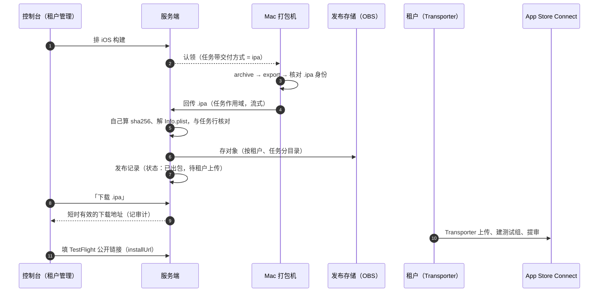

# iOS：租户接入分两档（全托管 / 自助上传）（2026-09-24）

> 状态：**档位已拍板（2026-09-24）：支持 ① ②，租户自选、可随时切换；第 ② 档与切换待实现**。
> 前置：`ios-testflight-distribution-2026-09-17.md`（分发模型、模式 A/B、对接清单）、
> `ios-signing-material-distribution-2026-09-19.md`（签名材料怎么下发到 Mac）、
> `ios-platform-testflight-upload-2026-09-23.md`（平台代传 TF、包回传）。

## 0. 决定

2026-09-23 build 34 全链路跑通（打包 → 签名 → 上传 TestFlight → 内部测试真机安装）之后，讨论了「租户不肯交这么多材料怎么办」。
按租户愿意交出的程度分过四档，**只支持前两档**：

| 档位 | 租户交什么 | 平台做什么 | 租户自己做什么 | 结论 |
| --- | --- | --- | --- | --- |
| ① 全托管 | 证书与描述文件 + 上传 Key（+ 可选的 App Manager Key） | 打包、签名、上传 TestFlight；有 App Manager Key 时同步公开链接与过期日 | 提审 | **支持**，已实现 |
| ② 自助上传 | 只有证书与描述文件 | 打包、签名，把 `.ipa` 交给租户下载 | 用 Transporter 上传、建测试组、提审，把公开链接填回控制台 | **支持**，本文设计 |
| ③ 不交证书 | 只有源码配置 | 交出未签名归档 | 自己在 Mac 上签名、上传 | 不做：租户要有 Mac 与懂 Xcode 的人，支持成本高 |
| ④ 没有开发者账号 | 无 | 用平台账号替租户上架 | —— | **不做**，而且做不了，见 §1 |

**① 和 ② 由租户在控制台自己选，可以随时切换**（2026-09-24 拍板）。切换的规则见 §3.2。

## 1. 做这个决定时核对过的 Apple 条款

条款原文以 [App Review Guidelines](https://developer.apple.com/app-store/review/guidelines/) 当期版本为准，下面是 2026-09-24 的内容。
TestFlight 外部测试走的是同一套条款：「Any app submitted for beta distribution via TestFlight should … comply with the App Review Guidelines」（2.2），
所以这几条**在外部测试提审时就可能被卡**，不是等到上架才碰到。

| 条款 | 内容 | 对我们的后果 |
| --- | --- | --- |
| 4.2.6 | 用商业模板或 App 生成服务做出来的 App，必须由**内容提供方自己**提交；服务方不应替客户提交。唯一的替代是平台自己发一个 App、在里面按客户切换（"picker" 聚合模式） | 第 ④ 档不成立：平台不能用自己的账号给每个租户各发一个 App。每个租户必须有自己的开发者账号 |
| 3.1.5(i) | 钱包类 App 只能由**以组织身份注册**的开发者提供 | 租户必须是组织账号（要 D-U-N-S 编号）。原对接清单写的「个人账号也能发 TestFlight」对钱包 App 不成立，已在 `ios-testflight-distribution-2026-09-17.md` §4.3 更正 |
| 2.5.2 | App 不能下载、安装或执行会引入或改变功能的代码 | OTA 热更新只用于修复与调整，不能用来绕过审核上线新功能或改变 App 用途 |

另外，预测功能有被归到博彩类（5.3，要求牌照与地区限制）的风险。这取决于审核员怎么定性，外部提审前要单独评估。

## 2. 两档各要交什么

| 材料 | ① 全托管 | ② 自助上传 | 用在哪 |
| --- | --- | --- | --- |
| Team ID、Bundle ID、ASC 里的 App 记录 | 要 | 要 | 任务路由、包身份核对 |
| Apple Distribution 证书（`.p12` + 口令） | 要 | 要 | Mac 上签名 |
| App Store 描述文件 | 要 | 要 | Mac 上签名 |
| 上传 Key（Team Key，Developer 角色） | 要 | **不要** | Mac 上的上传账户传 TestFlight |
| App Manager Key（模式 A） | 可选 | 不要 | 服务端只读同步公开链接、过期日；以后控制台提审 |
| APNs 密钥 | 要推送就要 | 要推送就要 | 推送 |
| 出口合规答复 | 要 | 要 | 每个 build 的合规问卷（或写进 `Info.plist`） |
| TestFlight 公开链接 | 有 App Manager Key 时自动同步 | 租户手工填 | 扫码落地页、App 内更新入口 |

证书与描述文件怎么交、怎么下发到每台 Mac，按 `ios-signing-material-distribution-2026-09-19.md` 走，两档没有区别。
**第 ② 档少掉的只是能操作租户 App 的那把上传 Key。**

## 3. 第 ② 档的设计

### 3.1 流程

### 3.2 交付方式：租户自己选，随时可切

租户的 iOS 配置加一个字段 `delivery`：`testflight`（第 ① 档）或 `ipa`（第 ② 档）。**租户管理员在控制台自己改**，
和其他配置一样带 `expectedVersion`、要确认、记审计。

**不从"Mac 上有没有 Key"推出来。** 如果让 Mac 自己看这个 Team 有没有上传 Key 来决定，第 ① 档租户的 Key 丢了或被吊销时，
会被**悄悄降成第 ② 档**：包停在存储里没人去传，运营却以为已经进了 TestFlight。显式配置时，这种情况会让任务失败，并在报错里写清原因。

**切换的规则：**

| 情况 | 规则 | 为什么 |
| --- | --- | --- |
| 什么时候生效 | 交付方式在**排队那一刻**写进任务，之后改配置只影响新排的任务。控制台的构建列表显示每条任务按哪种方式交付 | 同一条任务中途换交付方式，既难审计也难解释；想换就取消重排（排队、领取、构建中都能取消） |
| ② → ① | 允许保存；但如果没有任何在线 Mac 对这个 Team 报 `uploadProbe=ok`，控制台在配置旁边标红「还没有能上传的打包机」，排队时直接拒掉并说明原因（沿用 TestFlight 设计 §4.5.3「排队时就拒掉无人认领的任务」） | 保存不依赖机器状态（Key 可能正在下发），但不能让任务排进去以后永远没人领 |
| ① → ② | 立即生效。存量的上传 Key 与 App Manager Key 不会自动删除，控制台提示「已存的 Key 仍在，建议删除，并在 App Store Connect 里吊销」，给一个删除入口 | 切到 ② 多半是租户想收回授权；只停用不删除，等于授权还在 |
| build 号 | 两种方式共用同一个递增计数，切换不重置 | 两种方式传的都是 ASC 里同一个 App；中间有没传上去的号（② 下租户没传）留空没关系，Apple 只要求后传的号更大 |
| 公开链接 `installUrl` | ② 下手工填；切到 ① 且有 App Manager Key 时开始自动同步，但**手工填过的值优先**，除非租户清掉手工值 | 沿用 TestFlight 设计 §4.6.2「自动同步（可人工覆盖）」，切换不能把租户填的链接冲掉 |
| 已出包的交付件 | 切到 ① 后，之前 ② 产生的 `.ipa` 照样可以下载，按 §5 第 1 条的保留期清理 | 租户可能还没来得及传 |

### 3.3 打包机改动

- `deliverIPA`：按任务的交付方式分支。`testflight` 走现在的上传账户；`ipa` 不碰上传账户，把控制进程手里那份 `.ipa` 回传服务端。
  身份核对（`checkIPAMatchesJob`）两条路都照做。
- 盘点：现在 `RequireUploadKey` 是整机开关，开着上传的 Mac 缺哪个 Team 的上传 Key，就报不出那个 Team，也就领不到它的任务。
  改成**逐 Team 报上传 Key 的状态**（现有的 `uploadProbe`），不再用它挡 Team。
- 路由：服务端认领时，`testflight` 任务只派给这个 Team `uploadProbe=ok` 的机器；`ipa` 任务派给有这个 Team 签名身份的任何机器。

### 3.4 回传路径：先经服务端，再换 OBS 直传

`ios-platform-testflight-upload-2026-09-23.md` §1 的实测：Mac → 机房 20–30 KB/s，Mac → OBS 新加坡 TLS 握手超时。

- **先用现有的任务作用域流式回传**（Android 未签名包那条：`uploadStream` → `receiveBuildDelivery`）。build 29 的包是 24 MB，
  按 25 KB/s 算约 16 分钟。相比 70 分钟左右的编译可以接受，而且不用等回传路径拍板。
- **限制**：单次请求时限 `uploadRequestTimeout` 是 30 分钟，按 25 KB/s 最多传约 45 MB；中途断了只能整包重传（`withRetry`）。
  包涨到这个量级之前，要么换成 OBS 分块直传（平台代传设计的阶段 2），要么先把这条路改成分块续传。
- 换路只影响 Mac 与服务端之间，控制台的「下载 .ipa」和租户这一侧不变。

### 3.5 服务端

- 回传收下后**自己核验，不信 Mac 自报**：流式算 sha256 与大小；解 `Payload/*.app/Info.plist`，bundle id、版本、build 号必须等于任务行与 `release.ios`。
  规则与 Mac 上的门禁相同，服务端独立再做一次（平台代传设计 §3.2）。
- 发布记录：这一份 `.ipa` 是**交给租户的交付件**，不是分发产物。`ios_build_release.go` 开头说的"Apple 会重签，所以 sha256 对不上用户装的那份"仍然成立，
  所以 `object_key` 与 `sha256` 记在 `file_metadata` 的交付件字段里，不填分发产物的那几列，免得有人把它当成"用户装的就是这个"。
- 下载：平台管理员与该租户的管理员可以取短时有效的预签名 GET 地址，每次取都记审计。
- `latestVersion` 与强更阈值是人工配置，不跟着发布记录走，所以"包打出来了但租户还没传 TestFlight"时不会误推更新。
  控制台在第 ② 档租户的发布记录上写明「待租户上传到 TestFlight」，提醒运营等链接填好、Apple 处理完再调版本策略。

### 3.6 控制台

- 租户 iOS 配置：交付方式二选一，租户管理员可改。旁边写清两档各要交什么（§2），以及切换规则的要点（§3.2）。
  选 ① 时显示「能上传的打包机」状态；选 ② 时隐藏上传 Key 相关的检查项，存量 Key 给删除入口。
- 排队确认弹窗：写明这次按哪种方式交付。
- 构建与发布记录：第 ② 档那一行给「下载 .ipa」和一段 Transporter 操作说明；状态显示「已出包，待租户上传」。
- 公开链接：沿用现有的手工填写 `installUrl`（模式 B）。

### 3.7 安全

- App Store 签名的 `.ipa` **装不到任何设备上**（必须经 Apple 处理后才能通过 TestFlight 或 App Store 安装），把它交给租户不增加泄露面。
  执行进程依然没有出口：回传由控制进程做，执行进程拿不到任务令牌。
- 第 ② 档的 Mac 上没有这个 Team 的上传 Key，"签好的包被偷偷传到 Apple"这条路在这个 Team 上不存在。
- 存储里的 `.ipa` 可以被下载，所以下载地址短时有效、限这个租户，每次都留审计。

### 3.8 与平台代传设计的关系

第 ② 档做完，"包从 Mac 回到存储、服务端核验、发布记录带交付件"这一段就有了，这正是平台代传设计的阶段 2。
以后第 ① 档改成"服务端从存储传 TestFlight"（阶段 3），复用同一个对象，Mac 上的上传 Key 可以逐步退役。

## 4. 分阶段

| 阶段 | 内容 | 仓库 |
| --- | --- | --- |
| 1 | 租户 iOS 配置加 `delivery`（租户管理员可改、审计）；排队时写进任务；② → ① 没有能上传的机器时拒绝排队；认领按交付方式与 `uploadProbe` 路由 | RN-Server |
| 2 | 打包机：`ipa` 分支回传；盘点改逐 Team 报上传 Key 状态 | RN-Server（build-agent，要发打包机新版本、签清单） |
| 3 | 服务端核验、存对象、发布记录交付件字段、下载地址接口 | RN-Server |
| 4 | 控制台：交付方式配置与切换提示、存量 Key 删除入口、「下载 .ipa」、状态文案 | RN-Admin |
| 5 | 真机验证：anyfun 切到 ② 打一次，下载后用 Transporter 上传，确认 Apple 接受；再切回 ① 打一次，确认自动上传照常 | —— |

## 5. 开放问题

1. **交付件保留多久**：建议 30 天后删对象、发布记录保留。租户上传后可在控制台标记"已上传"，提前删除。
2. **包大小上限**：`ArtifactMaxSizeBytes` 是按 APK 定的；iOS 交付件要单独的上限（平台代传设计 §7 第 4 条）。
3. **build 号冲突**：第 ② 档租户如果在平台之外也往同一个 App 传过包，平台递增的 build 号可能已被占用，Transporter 会拒。
   对接说明里写清楚：这个 App 的 build 号只由平台分配。
4. **发布存储的桶名 `web3-rwa-dev`**：iOS 交付件进来之前确认是不是生产桶（平台代传设计 §7 第 3 条）。
