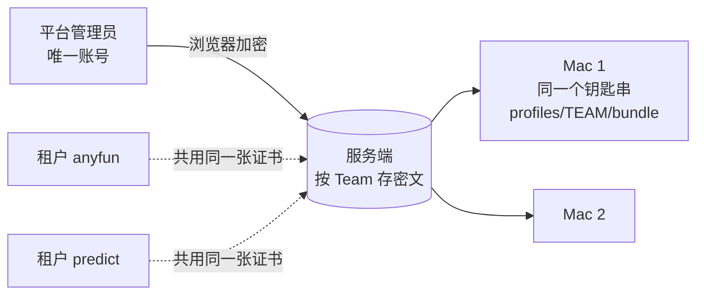

# iOS 签名材料与推送凭据改由租户自己提交（含前提：租户账号）（2026-09-25）

## 0. 结论

用户要求：
- Distribution 证书、App Store 描述文件、上传 Key、App Manager Key 由**租户**提交，平台管理员不代交；
- 不同交付方式要交的材料不同；
- 推送凭据（FCM、APNs）也由租户提交。

现在做不到，有两个根上的原因：

1. **没有租户账号。** 全系统只有一个管理员账号（环境变量 `ADMIN_USERNAME`，`server.go:709`），它同时是平台管理员；
   `admin_sessions` 没有租户列（`migrations.go:1081`）。三个控制台域名是同一个人用同一个账号在登录——
   「租户管理员」这个身份还不存在。交付分档设计 §4 已经把它列为「让租户自己操作的前提（另开设计）」。
2. **材料按 Team 存、同 Team 的租户共用。** `ios_signing_material` 的主键是 `(kind, team_id, scope)`，没有租户；
   anyfun 与 predict 同在 J4JDFC8LCC 下，平台上只有一张证书、一把上传 Key。谁能换它，谁就能让同 Team 的别人构建失败——
   所以当初只能收在平台管理员手里。

方案分四部分，按顺序上线：

- **A. 租户账号**：单独写成一篇（`tenant-console-accounts-and-sso-2026-09-25.md`）：
  - 先上 RN 本地租户账号；
  - 再接入公司统一认证 ChainUp 认证中心（CID），与 pm-cup2026、web3-rwa 一样作为子业务；
  - 会话绑定租户，平台权限按会话角色判断。
- **B. 材料按租户存、租户自己交**：主键加租户；同 Team 的租户各交各的，互不影响；按交付方式规定哪些要交、哪些拒收。
  平台管理员只保留只读总览与紧急删除（删除真的会从 Mac 上撤掉）。
- **C. Mac 打包机按租户隔离，并在安装前核对内容**：提交者从受信的平台管理员变成了租户，Mac 是最后一道关——
  证书真属于这个 Team、描述文件的 bundle id 与类型对得上、材料确实是这个租户交的才装；构建时只给本租户的描述文件，
  签名身份按证书指纹钉死。
- **D. 推送凭据由租户提交**：租户接口已经有了。要做的是：
  - 去掉「没配就用平台那一行」的回落；
  - APNs 核对 Team；
  - 按设备 token 的环境发送；
  - 包里的 `aps-environment` 改成 `production`。

另有一组**不依赖账号的修补（阶段 0）**可以先做：
- 自助上传时服务端拒收 App Manager Key；
- 修一个现有缺陷：删除材料后再传，版本号从 1 重来，Mac 会一直跳过它；
- 控制台几处按交付方式显示。

## 1. 现状

| 材料 | 现在谁交 | 接口 | 存储维度 | 内容核对 |
| --- | --- | --- | --- | --- |
| Distribution 证书（.p12 + 口令） | 平台管理员（租户页只对平台管理员显示上传口，`ios-build-page.tsx` 的 `IOSSigningMaterialSection`） | `POST /v1/admin/platform/ios-material` | 每 Team 一份 | 浏览器不核对、服务端只见密文；Mac 只查格式（`iosmaterial.Material.Validate`） |
| App Store 描述文件 | 同上 | 同上 | 每 (Team, bundle id) 一份 | 同上；落盘路径取材料里**自报**的 `profiles/<TEAM>/<bundle>.mobileprovision`（`iosinstall.go:198` `writeProfile`） |
| 上传 Key（Developer 角色 Team Key） | 同上 | 同上 | 每 Team 一份（`scopeFor` 为空串） | Mac 上的只读探测（uploadProbe） |
| App Manager Key | 登录这个控制台的人（租户范围接口，按域名定租户） | `PUT /v1/admin/ios/asc-credentials` | 每租户一份（服务端主密钥加密） | 服务端拿 bundle id 去 Apple 核对；**不看交付方式**（`ios_asc.go:156`，整个文件都没有交付方式判断） |

- Mac：
  - 所有证书导进同一个钥匙串 `rn-signing.keychain-db`。
  - RN-App 构建脚本把 `codeSignIdentity: "Apple Distribution"`（按名字）写进 pbxproj 的 `CODE_SIGN_IDENTITY`（`build-ios-release.mjs:617-623`）；导出选项里没有 `signingCertificate`（`ios-release-identity.js:58-76`）。
  - runner 把 `profiles/` 下**所有** Team 的描述文件复制进构建账户的家目录（`iossigning.go:121` `copyProvisioningProfiles`），而且只认 `profiles/<TEAM>/` 这一层。
  - 上传 Key 存在 `keys/<TEAM>/`（`ios-upload/installkey.go:70`）。
- 派活：
  - 机器自报的 `appleTeams` 里有 `TEAM.bundle` 才算能打（`build_machine_liveness.go:112` `signingPairs`，调用在 `build_agent.go:194`）。
  - 任务行上已有 `tenant_id`（`build_agent.go:315-330`）。
  - 排队判据用的是同一套（`ios_delivery.go:175` `NO_BUILDER_FOR_TEAM`，另见 `build_reaper.go:162`、`ios_material_tenants.go:198`）。
- 平台权限：
  - `requirePlatformAdmin` / `isPlatformAdmin` 拿会话里的 actor **字符串**去比 `PLATFORM_ADMIN_USERNAMES`（`chain_scan_admin.go:26-48`）。
  - 登录与会话接口返回的 `platformAdmin` 也这样算（`server.go:727`）。
- 现有缺陷：
  - 材料版本号是每格自己的计数：上传时取旧版本 +1，删除时直接删行（`ios_material.go`）。
  - 所以删掉再传，版本从 1 开始；而 Mac 按 `have >= Version` 跳过（`cmd/build-agent/ios_material.go:69`），**新传的那份永远装不上**。
  - 证书与描述文件删了也不会从 Mac 上消失（见 `ios_material.go` 删除处的注释）。



## 2. A. 租户账号（前提）

租户账号，以及接入公司统一认证（ChainUp 认证中心，与 pm-cup2026、web3-rwa 共用），单独写成一篇：`tenant-console-accounts-and-sso-2026-09-25.md`（下称「账号设计」）。原来写在这一节的内容已经挪过去。本文依赖其中这几条：

- 会话带 `role`、`tenant_id`、`account_id`、`auth_time`；平台权限按会话角色判断，不按用户名（账号设计 §3.3）；
- 租户范围的接口，在 `domainTenantScope` 之后校验「会话租户 = 域名租户」（账号设计 §3.3）；
- 只有 `admin` 角色的租户账号能交、删材料，`viewer` 只能看；
- 上传或删除签名材料、推送凭据，以及切换交付方式，都算敏感操作，要求 15 分钟内在 RN 输过 TOTP（账号设计 §4.5）；
- 开放租户账号之前，先把现有的租户接口审一遍（账号设计 §3.4）。

## 3. B. 材料按租户存、租户自己交

### 3.1 存储

- `ios_signing_material` 主键改为 `(tenant_id, kind, team_id, scope)`。
- 密文格式升到 v2，**材料里带租户 id**：
  - 浏览器从 `GET /tenant` 取到租户 id，封进材料；
  - Mac 只在「清单说这份属于哪个租户」与「材料自己说属于哪个租户」一致时才装；
  - 这样租户交一份声称属于别人的材料会被拒，服务端（只见密文）也没法把 A 的材料挪给 B。
- 同一个 Team 的两个租户各交各的：
  - 可以交同一张证书，也可以各用一张（Apple 允许一个 Team 同时有多张 Distribution 证书）；
  - **一个租户换、删自己的材料，碰不到别的租户**，这也符合用户早先定的「Team 可以共用也可以各自一个，不强制」；
  - 同一张证书交两次时，Mac 按指纹认出已经有了，不重复导入（§4.2）。
- 版本号改成**永不重用**：
  - 新版本 = max(当前毫秒时间戳, 旧版本 + 1)；
  - 现有打包机按 `have >= Version` 比较，照样能用，删掉再传也不会被跳过；
  - 这一条修的是现有缺陷，阶段 0 就做。

### 3.2 接口（租户范围）

| 接口 | 作用 |
| --- | --- |
| `GET /v1/admin/ios/material` | 本租户的材料清单（版本、上传人、时间、各台 Mac 是否装上、核对不过的原因）+ 平台的两把加密公钥（公钥本来就不是机密） |
| `POST /v1/admin/ios/material` | 上传一份密文 |
| `POST /v1/admin/ios/material/remove` | 删自己的一份（带版本与原因） |

服务端只能核对密文外层的明文提示；Mac 上还会按密文里的那份再核一遍：

- 租户 id 等于会话租户；
- Team 等于本租户 `release.ios` 登记的 Team；
- 描述文件的 bundle id 等于登记的 bundle id；
- **按交付方式收**：自助上传时拒收上传 Key（`IOS_DELIVERY_SELF_UPLOAD`），全托管时收；
- 每类材料只保留当前一份，新上传的覆盖旧版本；
- 上传与删除按租户限频，进审计。

App Manager Key（`/v1/admin/ios/asc-credentials`）：自助上传时拒收——阶段 0 就补。

### 3.3 按交付方式要交什么

| 材料 | 全托管 | 自助上传 |
| --- | --- | --- |
| Distribution 证书 | 要 | 要 |
| App Store 描述文件（须包含上面那张证书） | 要 | 要 |
| 上传 Key（Developer 角色 Team Key） | 要 | **拒收** |
| App Manager Key | 可选（同步公开链接、过期日） | **拒收** |
| TestFlight 公开链接、build 过期日 | 有 App Manager Key 时自动同步，否则手填 | 手填 |

切换交付方式：

- 现状（`ios_delivery.go:487,498`）：切到自助上传时，App Manager Key 一定删；Team 的上传 Key 只在「同 Team 没有别的全托管租户」时删。
- 之后：上传 Key 按租户存，切到自助上传时**无条件**删掉本租户那一份，Mac 上靠按租户的墓碑一起撤掉。
- 确认框写明「请在 App Store Connect 吊销这两把 Key」，再加一句：「如果同一个 Team 下别的 App 也在用这把 Key，吊销会让它们也传不了」。
  Apple 那一侧的 Key 没法限定到单个 App，平台隔离不了。

切到全托管时，材料清单里上传 Key 变成「缺」。

### 3.4 平台管理员

- 「Apple 证书与密钥」页改为**只读**的按租户总览：缺什么、哪台 Mac 没装上、核对不过的原因、哪些快到期。去掉上传口。
- 保留**紧急删除**，用于证书泄露、账号被盗：
  - 要填原因，进审计；
  - 删完在该租户页上显示「平台管理员于某时删除了某材料：原因」；
  - 删除必须真的撤到 Mac 上（§4.1 的墓碑），否则等于没删。
- 平台管理员不代交材料（用户明确要求）。

### 3.5 存量迁移

- 现有按 Team 存的每一行，复制给 `release.ios` 用这个 Team 的每个租户：
  - 证书、上传 Key 按 Team 复制；
  - 描述文件按 bundle id，归到登记了它的租户；
  - 例如 J4JDFC8LCC 的证书与上传 Key 各复制成 anyfun、predict 两份，anyfun 的描述文件归 anyfun。
- 迁过来的是 v1 密文，里面没有租户：
  - 这些行标 `legacy`，Mac 只对标了 `legacy` 的清单项接受 v1；
  - 租户重传之后就是 v2；
  - 阶段 6 去掉 v1 支持，到时还没重传的，控制台提示重传。
- 旧行在所有 Mac 切到新布局之后删除。
- predict 现在要传的描述文件：按现在的方式用平台管理员账号传即可，迁移时会归到 predict 名下，不用等。

## 4. C. Mac 打包机

### 4.1 按租户落盘

目录一律用**服务端给的租户 id**，不用 slug，也不用 `TenantDirectory`（`jobspec.go:237`）：这两个要么租户自己能改，要么会与别的租户撞。
runner 的任务说明里加 `TenantID`。

| 材料 | 现在 | 之后 |
| --- | --- | --- |
| 证书 | 共用钥匙串 | 仍是共用钥匙串，同一张证书只存一份身份；另记一份本机索引「租户 → 证书 SHA-1」 |
| 描述文件 | `profiles/<TEAM>/<bundle>.mobileprovision` | `profiles/tenants/<租户id>/<TEAM>/<bundle>.mobileprovision` |
| 上传 Key | `keys/<TEAM>/` | `keys/tenants/<租户id>/<TEAM>/` |

- 目录多一层 `tenants/`：租户 id 是 10 位数字，正好也匹配 Team ID 的正则，直接放在第一层会与旧布局混淆。
- 上传 Key 的旧密文里没有租户，由控制进程用 `--tenant` 传给 ios-upload。ios-upload 校验字母表；v2 材料再与材料里的租户比对。
- 本机「装到第几版」的记录键加上租户：`<租户>/<kind>/<team>/<scope>`。
- **墓碑扩到所有种类，并按租户做**（现在只对上传 Key、按 Team 做，`ios_material.go:101-124`）：
  - 清单完整、而本机从清单装过的某一格已经不在清单里，就撤掉它：描述文件删文件，上传 Key 删目录；
  - 证书先删索引项；钥匙串里的身份按 SHA-1 计引用，没有任何租户再用时才 `delete-identity`。
- 旧布局的文件在新布局装齐后清掉。

### 4.2 安装前核对（新的安全边界）

以前材料只来自平台管理员，Mac 只查格式；现在任何租户账号都能交。所以 Mac 解开之后、落地之前要核对内容，不合格就不装，
原因随盘点报回，租户页和平台页上都看得到。

**证书**：

- 不能用 Go 解 .p12：`signing/pkcs12` 只收 AES（PBES2），遇到 RC2/3DES 直接报错；而运维手册要求用 `openssl pkcs12 -export -legacy` 导出，因为 macOS 的 `security import` 读不了 AES 版（`SIGNING_MATERIAL.md:64,73`）。两者互斥。
- 改走临时钥匙串：
  1. 在签名目录下建一个随机口令的临时钥匙串，把 .p12 导进去；
  2. 在同一个 `security -i` 进程里设搜索列表、跑 `find-identity -v -p codesigning`（LaunchDaemon 下的写法同 `iosinventory.go:37-51`），取出身份的 SHA-1。能列出来，就说明私钥与证书配对，而且 macOS 认为它有效：链到系统钥匙串里的 WWDR G3、未过期；
  3. 用 `find-certificate -Z -p` 导出证书，交给 Go `crypto/x509` 核对：OU 等于材料里的 Team ID；CN 以 `Apple Distribution:`（或旧式 `iPhone Distribution:`）开头；未过期；以安装包里的 `AppleWWDRCAG3.cer` 为锚点 `Verify` 通过；
  4. 合格后看主钥匙串里有没有这个 SHA-1：已有就只写索引，没有才导入，并做 `set-key-partition-list`。导入报 already exists 也当成功，再核一次 SHA-1 在列；
  5. 删掉临时钥匙串。
- 某个租户在这台机器上「证书就绪」的判据：**索引里的 SHA-1 出现在主钥匙串的 `find-identity -v` 里**，不看装机记录。

**描述文件**：

- 复用 `internal/ipa.ParseProfile`（`ipa.go:176-209`），它已经能取 Team、bundle、到期日、设备、企业标记；再补一项 `DeveloperCertificates`（plist 的 data 字段已能读出，`xml.go:126`）。
- 核对项：
  - `TeamIdentifier` 含该 Team；
  - `application-identifier` 等于 `TEAM.bundle`；
  - 没有 `ProvisionedDevices` / `ProvisionsAllDevices`（即 App Store 类型）；
  - 未过期；
  - `DeveloperCertificates` 里有本租户那张证书（按 SHA-1）。
- 不验 CMS 签名（`ParseProfile` 本来也不验）：伪造一份描述文件，最多让这个租户自己的构建或 App Store 审核失败；它只落在本租户目录下，碰不到别人。

**上传 Key**：沿用只读探测，改成按租户目录探。

**浏览器端**：

- 只解析描述文件，用来早点提醒传错了。
- .p12 是 RC2/3DES 加密的，WebCrypto 解不了，控制台现在也没有 p12 解析库；证书对不对由 Mac 核对，约 2 分钟后在清单上显示结果。
- 浏览器和服务端都不是安全边界，Mac 才是。

### 4.3 构建按租户取

- **描述文件只复制本租户的**：
  - runner 现在会把全部描述文件复制进构建账户家目录（`iossigning.go:118-160`）；按租户存以后，两个租户可能传同名的描述文件，而 Xcode 按名字选，会选错；
  - runner 从任务说明里取租户 id；复制发生在构建代码运行之前，仍在可信的一侧。
- **签名身份按证书 SHA-1 钉死**：
  - runner 从本机索引取本租户证书的 SHA-1，连同本租户的描述文件目录，用新参数交给 RN-App 构建脚本；
  - 构建脚本把 SHA-1 写进 `CODE_SIGN_IDENTITY`，并在导出选项里加 `signingCertificate`。现在导出这一步是自动挑证书，同一个 Team 下有两张时会挑错。
- **这一条要改 RN-App，需要用户签名提交**：
  - `build-ios-release.mjs:105-109` 解析租户位置参数时，要把新参数排除掉；
  - RN-App 必须兼容「不传 SHA-1、读旧布局」，因为它会先于服务端迁移（阶段 4）上线；
  - `signingCertificate` 接受 SHA-1 是 Apple 文档写明的；`CODE_SIGN_IDENTITY` 填 40 位 SHA-1 要在真机上确认一次。
- **上传 Key 改按租户取**：从 `keys/tenants/<本租户>/<TEAM>/` 取。要改的地方：
  - ios-upload：`main.go:147`、`listKeys`、`removeKey`；
  - 控制进程：`ios_deliver.go`；
  - 服务端：`iosKeysToRevokeFor` 改按 `tenant_id`。

### 4.4 盘点与派活按租户

- 自报盘点加一项 `tenantMaterial`，按租户报：
  - 证书 SHA-1 与是否就绪；
  - 描述文件是否合格；
  - 上传 Key 的探测结果；
  - 核对不过的原因。
- 要改的地方：代理 `agent.go:206-213`、`client.go:344`；服务端 `build_machine_liveness.go` 加一列并写迁移。
- 现有按 Team 的 `appleTeams` 保留，供控制台显示与过渡。
- 认领条件改成：本任务的租户 id，加上它**当前** `release.ios` 的 Team 与 bundle，在这台机器按租户自报的列表里并且就绪。
  要跟当前配置比，防止租户改了身份之后还拿旧材料打包。
- 排队判据（`ios_delivery.go:175`、`build_reaper.go:162`、`ios_material_tenants.go:198`）跟着按租户算；平台页的「哪台没装上」「已下发未装上（pendingInstall）」也一样。

### 4.5 兼容与切换顺序

- 能力 `tenant-signing-material` 要在**取清单的请求里**带上：
  - 现在能力只在认领时写进在线记录（`agent.go:188`），而材料同步发生在认领之前（`agent.go:225`）；
  - 服务端只对带了这个能力的请求返回带租户的清单，否则返回旧的按 Team 的清单。
- 旧版打包机永远拿不到带租户的清单（靠上一条保证）。一旦拿到，它会把两个租户落进同一格互相覆盖，取密文时也不带租户。
- 上线顺序：**先发新版打包机并批准（阶段 2）→ RN-App 兼容版（阶段 3）→ 再迁移服务端数据（阶段 4）**。中间任何时刻旧机器照旧能打。
- 前提：§4.2 的「导入按指纹幂等」要先做好，否则迁移后每台 Mac 的证书格都会装失败。

## 5. D. 推送凭据改由租户提交

### 5.1 现状

- 通道：
  - 在用的只有 FCM（服务账号 JSON）和 APNs（只收 .p8 Token 认证）；
  - 华为推送只有全局环境变量，App 也从不上报 hms token，实际上没在用；
  - 其它厂商的通道不存在。
- 存储：
  - 按租户存在 `app_configs` 的 `push.fcm`、`push.apns` 里，用服务端主密钥加密；
  - 服务端要拿它发推送，所以必须解得开。这和签名材料「服务端解不开」是两套模型，是有意这样设计的，不改。
- 接口：
  - 租户范围的 GET/PUT/DELETE/test 已经有了（`server.go:457-464`），控制台「推送凭据」页也不限平台管理员；
  - 另外还有一组改平台默认那一行的接口（`server.go:254-257`）；
  - 所以**租户账号一上线，租户就能自己交**。要改的是下面这些问题。
- 问题：
  1. 自己没配，就回落到平台那一行（tenant 0，`pushcreds.go:95`、`apns.go:80`）。租户以为没配推送，其实在用平台的 Firebase 项目或 APNs Key。
  2. 继承时，租户视图会带出平台那一行的 `projectId`、`clientEmail`、`updatedBy` 等字段（`push_credentials.go:284-296`）；租户点「测试」，会改写平台那一行的验证时间（`push_credentials.go:265-275`）。
  3. 不拿 APNs Key 的 Team 去和 `release.ios` 的 Team 比对，只靠保存时发一条探活推送；改了 bundle id 之后也不重新验证。
  4. APNs 回 403 `InvalidProviderToken` 时，不当作凭据错误，而是按普通错误重试，最多 5 次（`dispatcher.go:460-464,489`）。
  5. 环境按凭据配一个，但设备 token 各有各的环境。环境配错时 APNs 回 `BadDeviceToken`，token 会被直接作废（`dispatcher.go:461-462`），设备要重新注册才能恢复。具体情况：
     - `push_tokens` 有 `environment` 列（`migrations.go:671`），但注册时不校验，缺省填 `production`（`installations.go:206,215`）；
     - App 上报的值是 `development` / `production`（`installation-service.ts:384-388`）；
     - 派发取 token 时不查这一列（`dispatcher.go:274`）；
     - APNs 客户端每份凭据只建一个，环境固定（`apns.go:230-233`、`dispatcher_apns.go:36-50`）。
  6. RN-App 里的 `expo-notifications` 插件没传参数（`app.config.ts:295`），默认往 entitlements 写 `aps-environment=development`。App Store / TestFlight 包要的是 `production`；导出时这个值会不会被描述文件里的替换掉，还没有核实。
  7. 本租户和平台都没有凭据行时，派发会退回环境变量里的旧凭据（`dispatcher.go:104-118,330-331`、`dispatcher_apns.go:25-26`）。只删平台那一行的话，之后新建的租户会悄悄用上环境变量里的平台凭据。

### 5.2 改法

- **去掉平台回落**：FCM、APNs 都去掉，和 App Manager Key 一样只认租户自己的那一份。迁移步骤：
  1. 先只读查一遍生产上哪些租户在继承；
  2. 对这些租户，服务端解开平台那一行，按租户的附加数据重新加密，存成它自己的一行；
  3. 最后删掉平台那一行和 `/platform/push/*` 接口，**同一版里删掉环境变量兜底**（`FCM_*`、`APNS_*` 与 legacy sender）。
- 租户视图只显示自己的那一行；「测试」也只动自己那一行。
- **APNs 核对**：
  - 保存时，凭据里的 Team ID 必须等于本租户 `release.ios` 的 Team，再用 topic 探活确认；
  - 租户改了 Team 或 bundle id，推送凭据标为「待重新验证」，并在控制台提示。
- **按 token 的环境发送**：
  - 注册时校验 `environment` 只能是 `development` / `production`，存量缺省值按安装包类型回填；
  - 派发时带上 token 的环境：`development` 走 APNs sandbox，`production` 走正式环境；
  - APNs 客户端按（租户，环境）缓存；
  - Apple 现在允许把一把 Key 限定到单一环境或 topic（待核实），所以保存与「测试」时两个环境各探一次，控制台显示哪个环境可用，凭据里不再配置环境；
  - 这样 `BadDeviceToken` 才可信，作废 token 的逻辑可以保留。
- 403 `InvalidProviderToken` 判为凭据错误，`TopicDisallowed` 判为配置错误（Key 不能发这个 bundle id）：停止重试，标记失效，在控制台上显示出来。
- **推送权限（`aps-environment`）**：
  - RN-App 的 release 构建给 `expo-notifications` 传 `mode: "production"`。这要用户签名提交，归进阶段 3；
  - Mac 核对描述文件（§4.2）时多查一项：租户配了 APNs，描述文件的 Entitlements 里就必须有 `aps-environment=production`，否则提示「这个 App ID 没开推送」；
  - 自助上传时服务端解包核对 .ipa，也加这一项，而且要看**签名后二进制里的 entitlements**，不能只看描述文件；
  - 先对一次现有导出的 .ipa 跑 `codesign -d --entitlements`，确认导出时 `development` 会不会被描述文件替换掉。
- **同一个 Team 共用 APNs Key**：
  - 各租户各交各的，存的是各自的副本；一方在 Apple 后台吊销这把 Key，另一方也会一起断。控制台上像上传 Key 那样提示；
  - Apple 对每个 Team 能建的 APNs Key 数量有限制（具体上限待核实），同一个 Team 的租户交同一把就行。
- **换 Firebase 项目**：
  - FCM 凭据必须和包里的 google-services.json 属于同一个项目，保存时已经比对了（`push_credentials.go:95-102`）；
  - 租户换项目就等于换 google-services.json，要发全量包；旧版本设备的 token 属于旧项目，新凭据发不过去（`SENDER_ID_MISMATCH`）；
  - 控制台在项目变化时明确提示：过渡期内，旧版本设备收不到推送；
  - 要做到不中断，就得按 token 记住它属于哪个项目，同时保留两套凭据。这不在本期。
- **与交付方式无关**：推送在全托管和自助上传下都一样，都是可选项。材料清单里单列一项「推送（可选）」，包括 FCM 服务账号 + google-services.json，以及 APNs Key。
- 华为推送的全局环境变量和死代码另行讨论删除，不在本期。

## 6. 控制台

- **租户的 iOS 页**：材料卡对租户账号开放。
  - 顶部是按当前交付方式的清单，逐项显示「已交 / 缺 / 不需要 / 不能交 / Mac 核对不过（原因）」，点击跳到对应位置。
  - 证书、描述文件、上传 Key 的上传口按交付方式出现。
  - 自助上传时「App Store Connect 接入」卡不显示表单；库里意外还存着的话，标红要求删除。
  - 上传前在浏览器里解析描述文件：Team、bundle id、类型、到期日。
- **命名统一**：上传 Key（Developer 角色，交给打包机上传用）、App Manager Key（只读同步用），两个叫法全站一致。
- **平台页**：「Apple 证书与密钥」改为只读 + 紧急删除；新增「租户账号」页。

## 7. 安全

| 威胁 | 以前 | 之后 |
| --- | --- | --- |
| 一个租户（或被盗的租户账号）影响别的租户的构建 | 只有平台管理员能交，不存在 | 只能影响自己：按租户存、按租户 id 落盘、只复制本租户的描述文件、签名身份按指纹钉死、Mac 装前核对 |
| 租户交一份声称属于别人的材料 / 服务端把材料挪给别的租户 | —— | v2 材料里带租户 id，Mac 与清单比对 |
| 读到别的租户的私钥 | —— | 密文只有 Mac 解得开；租户接口只列自己的元数据 |
| 伪造材料攻击 Mac 的解析与导入 | 来源受信 | 装前核对 + 现有大小上限；解析靠 Go 代码与临时钥匙串，不经 shell 拼接 |
| 租户起名冒充平台管理员 | 只有一个账号 | 平台权限按会话角色判；租户 actor 带前缀 |
| 撞租户账号口令 / 定向锁号 | 只有一个账号 | 按 IP 限速 + 按账号退避（不硬锁）、scrypt、查无此人也恒时、停用即踢会话、审计 |
| 跨租户越权调接口 | 只有一个账号，不存在 | `domainTenantScope` 之后统一校验会话租户 = 域名租户；Origin 绑定到同一租户 |
| 从现有接口看到别的租户 | 只有平台管理员在看 | 按账号设计 §3.4 逐个审 |

残余风险：

- 同一台 Mac 的钥匙串里有所有租户的证书私钥，构建时跑的 RN-App 代码理论上能碰到它们。这与今天相同：RN-App 是平台的代码，提交签名由 Mac 核对，租户不能在 Mac 上跑自定义脚本。
- Apple 那一侧不隔离：几个租户共用同一张证书或同一把 Team Key 时，一个租户在 Apple 后台吊销它，别的租户会一起断。
  平台能做的是在控制台上提示，并建议各租户各用各的证书与 Key。

## 8. 分阶段

| 阶段 | 内容 | 仓库 | 要签清单 / 用户签名 |
| --- | --- | --- | --- |
| 0 ✅ | 自助上传时拒收 App Manager Key；材料版本号永不重用（修删后重传被跳过）；控制台的 ASC 卡、材料卡徽章按交付方式显示；APNs 的 `InvalidProviderToken` / `TopicDisallowed` 判为凭据错误。**2026-09-25 已上线**（RN-Server `f05284e`、RN-Admin `eb9d6b7`，不用重签） | RN-Server、RN-Admin | 否 |
| 1 | 租户本地账号（即账号设计的 S0：会话角色、租户校验、接口审计、账号管理页）。接统一认证是账号设计的 S2，不挡本文后续阶段 | RN-Server、RN-Admin | 否 |
| 2 | Mac：临时钥匙串核对 + 按指纹幂等导入、描述文件核对（含 `aps-environment`）、按租户 id 落盘、全种类按租户墓碑与钥匙串引用计数、按租户盘点、取清单时带能力、同时认两种清单、v2 材料、ios-upload `--tenant`、runner 只复制本租户描述文件并传 SHA-1 | RN-Server（打包机） | 要签、批准 |
| 3 | RN-App：接收证书 SHA-1 与描述文件目录，写进 `CODE_SIGN_IDENTITY` 与导出选项 `signingCertificate`，不传时照旧；release 构建给 `expo-notifications` 传 `mode: "production"` | RN-App | 用户签名提交 |
| 4 | 服务端：材料按租户存 + 迁移（legacy 标记）、租户材料接口、按交付方式收、切换交付方式时按租户删、派活与排队按租户、平台页只读 + 紧急删除；推送：去掉平台回落并迁移（连同租户视图不带平台字段、「测试」不改平台那一行——这两项原列阶段 0，没有平台回落就不存在了，挪到这里一起做）、APNs 的 Team 核对、按 token 的环境发送、自助上传的 .ipa 核对 `aps-environment` | RN-Server | 否 |
| 5 | 控制台：租户侧材料清单与上传（v2 封装，含「推送（可选）」）、描述文件浏览器端解析、Mac 核对结果展示、换 Firebase 项目时的提示 | RN-Admin | 否 |
| 6 | 去掉 v1、旧布局与 Team 级旧路径；真机验证：anyfun、predict 各交一套，同 Team 两张不同证书各自打包成功，紧急删除后 Mac 上确实撤掉 | 全部 | 要签（打包机去掉旧代码） |

## 9. 已定与待定

2026-09-25 用户答复：

1. 租户账号：先说要和 pm-cup2026 的租户端打通、用单点登录；后来改为用 web3-rwa 已接的公司统一认证（ChainUp 认证中心），RN、pm-cup 都作为子业务接入。设计见账号设计，其中 §10 还有几项待定。
2. 平台管理员：「保留」。只保留只读总览和紧急删除，不代交材料。
3. 推送凭据：改由租户提交，见 §5。Android 签名密钥仍由签名闸生成和保管，不在本文范围。

## 10. 不做的

- 不替租户向 Apple 申请证书或描述文件：那要 Admin / App Manager 级别的 Key，与自助上传档「平台不持有能操作租户 App 的 Key」冲突。
- 不让租户在 Mac 上运行自定义脚本。
- 不在 Go 里补 RC2/3DES 的 .p12 解码：临时钥匙串用的是 macOS 自己的解析，与真正导入走同一条路，还少写一套分组密码代码。

## 11. 评审记录

2026-09-25 初稿写完后，做了一轮只读可行性评审（对照 RN-Server、RN-Admin、RN-App 代码）。下面各条已抽查代码确认，并据此修改了本文：

| 问题 | 证据 | 改动 |
| --- | --- | --- |
| 初稿说「同一张证书导两次是幂等的」——错 | `iosinstall.go:171-175` 把 `security import` 的非零退出都当失败；装机脚本对 add-certificates 的 already exists 专门放行（`install-macos.sh:859`） | §4.2：按 SHA-1 判断是否已有，already exists 当成功；就绪看钥匙串，不看装机记录 |
| 平台权限按用户名判，租户起同名账号即越权 | `chain_scan_admin.go:26-48` | 按会话角色判，actor 加前缀（现在账号设计 §3.3） |
| `signing/pkcs12` 不收 legacy，而 .p12 必须用 legacy | `pkcs12.go` 包注释、`SIGNING_MATERIAL.md:64,73` | §4.2：改走临时钥匙串 |
| 删后重传，版本从 1 开始，被 Mac 跳过（现有缺陷） | `ios_material.go` 上传取旧版本 +1、删除直接删行；代理用 `have >= Version` | §3.1：版本号永不重用，放进阶段 0 |
| runner 复制全部描述文件、只认一层目录；导出选项没有 `signingCertificate` | `iossigning.go:118-160`、`ios-release-identity.js:58-76` | §4.3：只复制本租户的；RN-App 加导出选项并向后兼容 |
| 租户校验不能放进 `authenticate()` | `server.go:213-214` 先于 `337-338` 执行 | 放在 `domainTenantScope` 之后（现在账号设计 §3.3） |
| 现有租户接口带出别的租户的 slug；租户能改 `repoDirectory`；bundle id 跨租户不唯一 | `ios_delivery.go:330,343`、`build_config.go:190-245` | 新增接口审计一节（现在账号设计 §3.4） |
| 能力在认领时才上报，而材料同步在认领之前 | `agent.go:188,225` | §4.5：取清单时带上能力 |
| 证书、描述文件删了不会从 Mac 上消失，紧急删除等于无效 | `ios_material.go` 删除处的注释 | §4.1：全种类墓碑 + 钥匙串引用计数 |
| 租户不在密文里，「Mac 是边界」的说法不成立 | `iosmaterial` 格式 | §3.1：v2 材料带租户 id，迁移过来的行标 legacy |
| 目录用 slug / TenantDirectory 会被租户改或撞；10 位租户 id 与 Team ID 正则撞 | `jobspec.go:237` | §4.1：用租户 id，多一层 `tenants/` |
| 小偏差：`signingPairs` 的定义位置、`NO_BUILDER_FOR_TEAM` 的行号；切换交付方式时上传 Key 其实也会删 | —— | §1、§3.3 已改 |

## 12. 实现约定（2026-09-27）

2026-09-27 用户确认：Apple 材料（证书、描述文件、上传 Key）全部由租户上传；一个租户的上传不能影响别的租户；上传前要做格式检查。
本节把阶段 2–5 各仓库之间的接口定死，四处按它各自实现。推送（第 5 节 D）不在这一轮。

### 12.1 密文 v2（`signing/iosmaterial`）

- `Box.Version`：1 = 旧格式（没有租户），2 = 带租户。常量 `VersionLegacy = 1`、`VersionTenant = 2`。
- v2 在 Box 外层与 Material 明文里各加 `tenantId`（字符串，`^[1-9][0-9]{0,19}$`）：
  - v1 两处都不许有；v2 两处都必须有，而且相等（`Open` 里与 kind/teamId/bundleId 一起比）；
  - 解密构造不变：同一个 KDF 标签 `rn-ios-material/v1`，附加数据仍然是用途。租户在明文里，受 AEAD 保护，不必再进附加数据。
- `Seal`：`Material.TenantID` 非空就封成 v2，否则 v1。浏览器（RN-Admin）只封 v2。
- `ParseBox` 两种都收。服务端的租户上传口只收 v2（§12.4）。
- 浏览器实现与 Go 实现用同一个固定向量互相核对：`browser_vector_test.go` 加一条 v2 向量。

### 12.2 打包机取清单（阶段 2 ↔ 阶段 4）

- 能力名 `tenant-signing-material`：
  - 进 `agentCapabilities`，认领时照常报；
  - 取清单时放在查询串里：`GET /v1/build-agent/ios-material?capability=tenant-signing-material`。
- 服务端对带能力的请求回按租户的清单：

  ```json
  {"layout":"tenant","complete":true,"items":[
    {"tenantId":"1000000001","kind":"certificate","teamId":"J4JDFC8LCC","scope":"",
     "purpose":"ios-builder-material","recipientSha256":"…","version":1759000000000,"legacy":false}
  ]}
  ```

  - `legacy=true`：从旧的按 Team 的行复制过来的 v1 密文（§3.5）。Mac 只对这种项接受 v1；
  - 没带能力的请求、以及还没升级的服务端：照旧回按 Team 的清单，没有 `layout` 字段（等价于 `"layout":"team"`）。
- 取密文：`GET /v1/build-agent/ios-material/box?tenantId=…&kind=…&teamId=…&scope=…`。不带 `tenantId` 就取旧的按 Team 的那一行。
- 打包机把最近一次清单的布局记进本机记录：
  - 收到过 `layout=tenant` 就进入**租户模式**，不再回落；
  - 租户模式下才在认领里报 `tenantMaterial`（§12.3）。旧版服务端的认领请求体是 `DisallowUnknownFields`，提前报会 400。
- 本机记录 `ios-material.json` 改成：

  ```json
  {"layout":"tenant","installed":{"<租户>/<kind>/<team>/<scope>":1759000000000}}
  ```

  - 旧格式（顶层就是 slot → 版本）读进来当作 `layout=team`。
- 同步顺序：先证书，再描述文件，最后上传 Key。描述文件要核对「包含本租户那张证书」，证书得先装上。
- 核对不过的那一版记在内存里（slot → 版本 + 原因），同一版不再反复试，直到清单上出现新版本；进程重启后再试一次。

### 12.3 认领自报 `tenantMaterial`（阶段 2 ↔ 阶段 4）

租户模式下，认领请求体多一个字段（`appleTeams` 照旧报，给控制台显示与过渡用）：

```json
"tenantMaterial":[
  {"tenantId":"1000000001","teamId":"J4JDFC8LCC","bundleIds":["win.anyfun.app"],
   "certificateSha1":"<40 位大写十六进制>","certificateReady":true,"expiresAt":"2027-01-01T00:00:00Z",
   "uploadProbe":"ok","apsEnvironment":"production","problems":["…"]}
]
```

- 每个 (租户, Team) 一项，最多 64 项；`problems` 最多 8 条，每条最多 300 字。
- `certificateReady`：本机索引里这个 (租户, Team) 的 SHA-1 出现在签名钥匙串 `find-identity -v -p codesigning` 的结果里。
- `bundleIds`：只列核对通过、没过期的描述文件。
- `uploadProbe` 的取值同 `appleTeams`：`ok` / `forbidden` / `error` / `missing` / 空（这台机器没开上传）。
- `apsEnvironment`：描述文件 Entitlements 里的 `aps-environment`，没有就空。现在只报不判，推送那一轮再用。
- 服务端：
  - 存进 `build_machine_liveness` 的新列 `tenant_material`；
  - 可签对从 `TEAM.bundle` 变成 `<租户>:TEAM.bundle`，只收 `certificateReady=true` 的项；
  - 认领 SQL 按任务的 `tenant_id` 拼，同时比对当前 `release.ios` 的 Team 与 bundle。
- 报了 `tenantMaterial` 的机器只按租户对派活；没报的（旧机器）照旧按 Team 对。

### 12.4 服务端（阶段 4）

- 表 `ios_signing_material`：
  - 加 `tenant_id BIGINT UNSIGNED NOT NULL DEFAULT 0` 与 `legacy TINYINT(1) NOT NULL DEFAULT 0`；
  - 主键改为 `(tenant_id, kind, team_id, scope)`；
  - `tenant_id=0` 的是旧的按 Team 的行，只下发给不带能力的请求，阶段 6 删除。
- 迁移（Go 函数，幂等）：对每个配了 `release.ios` 的租户，从 `tenant_id=0` 复制，复制的行标 `legacy=1`，版本号照抄：
  - 证书：按 Team；
  - 描述文件：按 (Team, bundle id)，bundle id 不分大小写；
  - 上传 Key：按 Team，只复制给交付方式是全托管的租户。
- 租户接口：租户端，要 `admin` 角色与二次验证。
  - `GET /v1/admin/ios/material`：
    - `tenantId`、两把公钥、当前 Team / bundle / 交付方式；
    - 本租户的各格：版本、上传人、时间、legacy、stale；
    - 按交付方式的要求清单；
    - Mac 核对结果：按机器汇总，不带机器 id 与名字；
    - 最近的平台紧急删除记录。
  - `POST /v1/admin/ios/material`：请求体是 v2 密文。依次校验：
    - v2；`tenantId` = 会话租户；
    - Team = `release.ios` 的 Team；描述文件的 bundle id = `release.ios` 的 bundle id（原样比）；
    - 收件人是登记的那把公钥；
    - 自助上传时拒收上传 Key（`IOS_DELIVERY_SELF_UPLOAD`）；
    - 按租户限频；进审计。
  - `POST /v1/admin/ios/material/remove`：`{kind, teamId, scope, expectedVersion, reason, confirm}`，只删本租户的行。
- 平台接口（只读 + 紧急删除）：
  - `POST /v1/admin/platform/ios-material` 删除，平台不代交；
  - `POST /v1/admin/platform/ios-material/remove` 要带 `tenantId`（`"0"` 表示旧的按 Team 的行），审计记在那个租户名下；
  - 总览与按租户总览改读按租户的行。
- 切到自助上传：无条件删本租户的上传 Key 行；`iosKeysToRevokeFor` 按租户查。
- 认领响应加 `tenantId`。排队判据、平台页的「装没装上」都按租户算（报了 `tenantMaterial` 的机器按租户对，旧机器按 Team 对）。

### 12.5 Mac（阶段 2）

- 租户 id 一律用清单或任务里服务端给的值，按 `^[1-9][0-9]{0,19}$` 校验后才拼路径。
- 布局：
  - `profiles/tenants/<租户>/<TEAM>/<bundle>.mobileprovision`；
  - `keys/tenants/<租户>/<TEAM>/`；
  - 证书索引 `tenant-certificates.json`：`{"<租户>/<TEAM>":"<SHA-1>"}`，放在签名目录，0600，原子写。
- `build-runner install-ios-material --signing-dir D --tenant T [--legacy]`：
  - v2：材料里的租户必须等于 `--tenant`；
  - v1：只在带 `--legacy` 时收；不带 `--tenant` 时走旧布局，与现在相同。
  - 证书按 §4.2 核对：
    - 临时钥匙串里 `find-identity -v` 取 SHA-1；
    - x509 核对 OU = Team、CN 前缀、未过期、链到 WWDR G3（证书内嵌进程序，测试核对它与 `deploy/build-agent-macos/AppleWWDRCAG3.cer` 字节相同）；
    - 主钥匙串里没有这个 SHA-1 才导入；写索引。
  - 描述文件按 §4.2 核对，`DeveloperCertificates` 要含索引里本租户那张证书的 SHA-1。
  - 输出一行 JSON：成功时带 `certificateSha1`；失败时退出码非 0，原因写在 `build-runner: error: …`。
- `build-runner remove-ios-material --signing-dir D --tenant T --kind K --team TEAM [--scope BUNDLE]`：
  - 描述文件删文件；
  - 证书删索引项，已经没有索引项引用的 SHA-1 才 `delete-identity -Z`。
- 上传账户 `ios-upload`：
  - `--install-key`、`--remove-key`、上传与 `--probe` 都认 `--tenant T`，读写 `keys/tenants/T/TEAM/`；
  - `--install-key --tenant T` 收 v2（租户必须相等），v1 要再带 `--legacy`；
  - `--list-keys` 的输出加 `"tenants":{"<租户>":["TEAM"]}`。
- 墓碑：
  - 租户模式、清单完整时，本机记录里有、清单里没有的租户格一律撤：描述文件、证书索引、上传 Key 都撤；
  - 旧布局的格在本租户新格装齐之后删：旧描述文件与旧上传 Key 目录删掉，钥匙串里的身份不动。
- 构建：
  - `jobspec.Spec` 加 `tenantId`、`appleTeamId`；
  - runner 在两者都有、索引里有这个 (租户, Team) 时：
    - 只复制 `profiles/tenants/<租户>/` 下的描述文件；
    - 给构建脚本加 `--profiles-dir <D>/profiles/tenants/<租户> --signing-certificate <SHA-1>`；
  - 租户模式下缺索引项直接失败，不回落到旧布局。
- 领到任务后的复核：租户模式按 (租户, Team, bundle) 查，旧模式照旧。

### 12.6 RN-App（阶段 3）

- `pnpm ios:release <slug> --signing-dir D [--profiles-dir P] [--signing-certificate SHA1]`：
  - `--profiles-dir`：在 `P/<TEAM>/` 下找描述文件，不给时是 `D/profiles`；
  - `--signing-certificate`：40 位十六进制，写进 pbxproj 的 `CODE_SIGN_IDENTITY`，并在导出选项里加 `signingCertificate`；不给时照旧用 `Apple Distribution`；
  - 两个新参数的值都不能被当成租户位置参数。
- release 构建给 `expo-notifications` 传 `mode: "production"`。
- 提交由用户签名。

### 12.7 控制台（阶段 5）

- 租户的「iOS 打包与分发」页，材料卡：
  - 顶部是按交付方式的清单：已交 / 缺 / 不需要 / 不能交 / Mac 核对不过（原因）；
  - 证书：.p12 + 口令，浏览器只查扩展名、大小、非空；
  - 描述文件：浏览器解析 Team、bundle id、类型（有设备列表或 `ProvisionsAllDevices` 就不是 App Store）、到期日，与当前 `release.ios` 对不上就不让传；
  - 上传 Key：只在全托管时出现。浏览器查 `.p8` 是 PEM 的 PKCS#8 私钥、Key ID 10 位、Issuer ID 是 UUID；
  - 封 v2，`tenantId` 取 `GET /v1/admin/ios/material` 返回的那个；
  - 删自己的材料；显示平台的紧急删除记录。
- 平台「Apple 证书与密钥」页：只读总览 + 按租户的紧急删除（要填原因）。
