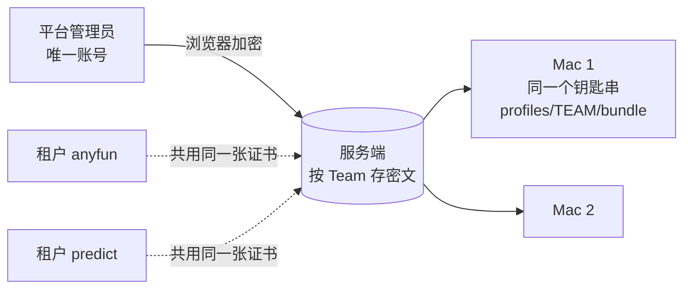

# iOS 签名材料改由租户自己提交（含前提：租户账号）（2026-09-25）

## 0. 结论

用户要求：Distribution 证书、App Store 描述文件、上传 Key、App Manager Key 由**租户**提交，平台管理员不代交；
不同交付方式要交的材料不同。

现在做不到，有两个根上的原因：

1. **没有租户账号。** 全系统只有一个管理员账号（环境变量 `ADMIN_USERNAME`，`server.go:709`），它同时是平台管理员；
   `admin_sessions` 没有租户列（`migrations.go:1081`）。三个控制台域名是同一个人用同一个账号在登录——
   「租户管理员」这个身份还不存在。交付分档设计 §4 已经把它列为「让租户自己操作的前提（另开设计）」。
2. **材料按 Team 存、同 Team 的租户共用。** `ios_signing_material` 的主键是 `(kind, team_id, scope)`，没有租户；
   anyfun 与 predict 同在 J4JDFC8LCC 下，平台上只有一张证书、一把上传 Key。谁能换它，谁就能让同 Team 的别人构建失败——
   所以当初只能收在平台管理员手里。

方案分三部分，按顺序上线：

- **A. 租户账号**：平台管理员给每个租户建账号；会话绑定租户，只能在自己的控制台域名上登录、只能动自己租户的数据；
  平台权限按会话角色判，不再按用户名。开放之前把现有租户接口逐个审一遍（有的会带出别的租户的信息）。
- **B. 材料按租户存、租户自己交**：主键加租户；同 Team 的租户各交各的，互不影响；按交付方式规定哪些要交、哪些拒收。
  平台管理员只保留只读总览与紧急删除（删除真的会从 Mac 上撤掉）。
- **C. Mac 打包机按租户隔离，并在安装前核对内容**：提交者从受信的平台管理员变成了租户，Mac 是最后一道关——
  证书真属于这个 Team、描述文件的 bundle id 与类型对得上、材料确实是这个租户交的才装；构建时只给本租户的描述文件，
  签名身份按证书指纹钉死。

另有一组**不依赖账号的修补（阶段 0）**可以先做：
- 自助上传时服务端拒收 App Manager Key；
- 修一个现有缺陷：删除材料后再传，版本号从 1 重来，Mac 会一直跳过它；
- 控制台几处按交付方式显示。

## 1. 现状

| 材料 | 现在谁交 | 接口 | 存储维度 | 内容核对 |
| --- | --- | --- | --- | --- |
| Distribution 证书（.p12 + 口令） | 平台管理员（租户页只对平台管理员显示上传口，`ios-build-page.tsx` 的 `IOSSigningMaterialSection`） | `POST /v1/admin/platform/ios-material` | 每 Team 一份 | 浏览器不核对、服务端只见密文；Mac 只查格式（`iosmaterial.Material.Validate`） |
| App Store 描述文件 | 同上 | 同上 | 每 (Team, bundle id) 一份 | 同上；落盘路径取材料里**自报**的 `profiles/<TEAM>/<bundle>.mobileprovision`（`iosinstall.go:198` `writeProfile`） |
| 上传 Key（Developer 角色 Team Key） | 同上 | 同上 | 每 Team 一份（`scopeFor` 为空串） | Mac 上的只读探测（uploadProbe） |
| App Manager Key | 登录这个控制台的人（租户范围接口，按域名定租户） | `PUT /v1/admin/ios/asc-credentials` | 每租户一份（服务端主密钥加密） | 服务端拿 bundle id 去 Apple 核对；**不看交付方式**（`ios_asc.go:156`，整个文件都没有交付方式判断） |

- Mac：
  - 所有证书导进同一个钥匙串 `rn-signing.keychain-db`。
  - RN-App 构建脚本把 `codeSignIdentity: "Apple Distribution"`（按名字）写进 pbxproj 的 `CODE_SIGN_IDENTITY`（`build-ios-release.mjs:617-623`）；导出选项里没有 `signingCertificate`（`ios-release-identity.js:58-76`）。
  - runner 把 `profiles/` 下**所有** Team 的描述文件复制进构建账户的家目录（`iossigning.go:121` `copyProvisioningProfiles`），而且只认 `profiles/<TEAM>/` 这一层。
  - 上传 Key 存在 `keys/<TEAM>/`（`ios-upload/installkey.go:70`）。
- 派活：
  - 机器自报的 `appleTeams` 里有 `TEAM.bundle` 才算能打（`build_machine_liveness.go:112` `signingPairs`，调用在 `build_agent.go:194`）。
  - 任务行上已有 `tenant_id`（`build_agent.go:315-330`）。
  - 排队判据用的是同一套（`ios_delivery.go:175` `NO_BUILDER_FOR_TEAM`，另见 `build_reaper.go:162`、`ios_material_tenants.go:198`）。
- 平台权限：
  - `requirePlatformAdmin` / `isPlatformAdmin` 拿会话里的 actor **字符串**去比 `PLATFORM_ADMIN_USERNAMES`（`chain_scan_admin.go:26-48`）。
  - 登录与会话接口返回的 `platformAdmin` 也这样算（`server.go:727`）。
- 现有缺陷：
  - 材料版本号是每格自己的计数：上传时取旧版本 +1，删除时直接删行（`ios_material.go`）。
  - 所以删掉再传，版本从 1 开始；而 Mac 按 `have >= Version` 跳过（`cmd/build-agent/ios_material.go:69`），**新传的那份永远装不上**。
  - 证书与描述文件删了也不会从 Mac 上消失（见 `ios_material.go` 删除处的注释）。

## 2. A. 租户账号（前提）

### 2.1 账号模型

- 新表 `tenant_admin_accounts`：
  - `id`、`tenant_id`、`username`（租户内唯一）；
  - `password_hash`：沿用现有 scrypt 格式（`server.go:2287` `verifyPassword`）；
  - `status`（active / disabled）；
  - `created_by`、`created_at`、`password_changed_at`、`last_login_at`。
- 平台管理员照旧是环境变量里那一个账号（`ADMIN_USERNAME` + `PLATFORM_ADMIN_USERNAMES`），不进这张表；`x-admin-key`
  明确定为平台身份。
- 不开放自助注册：
  - 账号只由平台管理员在控制台建，初始口令只显示一次；
  - 租户可以自己改口令；
  - 平台管理员可以停用、重置口令，要填原因，进审计。

### 2.2 登录与会话

- `admin_sessions` 加三列：`role`（platform / tenant）、`tenant_id`（平台会话为 NULL）、`account_id`。
- 登录时按域名定租户：
  - 登录接口不在 `domainTenantScope` 之下（`server.go:211-214`），所以在处理函数里直接调 `s.tenant.resolve(Host)`；
  - 这样解析不会错到别的租户：console.* 的 `/v1/` 已被 nginx 改写成对应的 api.*，而 `tenant_domain` 有唯一键。
- 核对顺序：
  - 先按平台管理员核对；不是的话，在按域名解析出的租户下查租户账号；
  - **租户账号只能在自己租户的控制台域名上登录**：在 console.anyfun.win 输入 predict 的账号，按查无此人处理；
  - 查无此人时也跑一次 scrypt，让响应时间不泄露账号是否存在。
- 限速：
  - 沿用按 IP 的计数；
  - 另加按「租户 + 用户名」的**退避**，不做硬锁定——硬锁定能被别人拿来定向锁号。
- `authenticate()` 每次请求都按 `account_id` 查账号状态：停用或重置口令之后，已有的会话立即失效。
- 会话接口多返回 `role`、`tenantId`、`username`。

### 2.3 授权

- **平台权限按会话角色判**：
  - 条件改成 `role = platform 且 tenant_id IS NULL`，不再拿用户名比对名单；
  - 不改的话，租户建一个与平台管理员同名的账号，就拿到了全部 `/platform` 权限；
  - 租户会话的 actor 写成 `tenant:<租户id>:<用户名>`，与平台账号的名字不可能重合，审计也不会撞名。
- **租户范围接口**（`/v1/admin/...`）：
  - 租户会话的 `tenant_id` 必须等于按域名解析出的租户，否则 403；
  - 这条检查放在 `current` 路由组里、`domainTenantScope` **之后**的一个中间件里（`server.go:337-338`）；不能放进 `authenticate()`，因为它先于 `domainTenantScope` 执行，那时还不知道域名对应哪个租户；
  - 平台会话照旧可以在任何一个租户的控制台上操作那个租户。
- **Origin**：
  - 现在任何租户域名都算可信 Origin（`server.go:604-633` `originAllowed`）；
  - 改成：Origin 所属的租户必须与 Host 的租户相同（平台控制台域名除外）。

### 2.4 开放之前要审的现有租户接口

租户账号一开，`registerTenantRoutes` 下的每个接口都会被租户直接调用。已知要改的：

- `GET /v1/admin/ios/delivery` 会返回同 Team 下其它全托管租户的 **slug**（`ios_delivery.go:330,343`）。
  材料按租户存之后，切换交付方式不再依赖别的租户（§3.3），所以这一项改成只返回一个布尔值：同一个 Team 下还有没有别的 App。
- 任务视图里带打包机名字：对租户只显示「iOS 打包机 / Android 打包机」。
- `repoDirectory`（RN-App 仓库里的 `tenants/<目录>`）现在租户能改（`build_config.go:190-245`）。它决定打哪一份代码，改成只有平台管理员能改。
- `release.ios` 的 bundle id 跨租户没有唯一校验：保存时要拒绝别的租户已经在用的 bundle id。
- 其余接口逐个过一遍，结论记进实现 PR。

### 2.5 控制台

- 平台维护下新增「租户账号」页，只有平台管理员看得到：列表、新建（初始口令只显示一次）、停用、重置口令。
- 右上角显示当前账号与所属租户。租户账号的导航里没有平台维护。

## 3. B. 材料按租户存、租户自己交

### 3.1 存储

- `ios_signing_material` 主键改为 `(tenant_id, kind, team_id, scope)`。
- 密文格式升到 v2，**材料里带租户 id**：
  - 浏览器从 `GET /tenant` 取到租户 id，封进材料；
  - Mac 只在「清单说这份属于哪个租户」与「材料自己说属于哪个租户」一致时才装；
  - 这样租户交一份声称属于别人的材料会被拒，服务端（只见密文）也没法把 A 的材料挪给 B。
- 同一个 Team 的两个租户各交各的：
  - 可以交同一张证书，也可以各用一张（Apple 允许一个 Team 同时有多张 Distribution 证书）；
  - **一个租户换、删自己的材料，碰不到别的租户**，这也符合用户早先定的「Team 可以共用也可以各自一个，不强制」；
  - 同一张证书交两次时，Mac 按指纹认出已经有了，不重复导入（§4.2）。
- 版本号改成**永不重用**：
  - 新版本 = max(当前毫秒时间戳, 旧版本 + 1)；
  - 现有打包机按 `have >= Version` 比较，照样能用，删掉再传也不会被跳过；
  - 这一条修的是现有缺陷，阶段 0 就做。

### 3.2 接口（租户范围）

| 接口 | 作用 |
| --- | --- |
| `GET /v1/admin/ios/material` | 本租户的材料清单（版本、上传人、时间、各台 Mac 是否装上、核对不过的原因）+ 平台的两把加密公钥（公钥本来就不是机密） |
| `POST /v1/admin/ios/material` | 上传一份密文 |
| `POST /v1/admin/ios/material/remove` | 删自己的一份（带版本与原因） |

服务端只能核对密文外层的明文提示；Mac 上还会按密文里的那份再核一遍：

- 租户 id 等于会话租户；
- Team 等于本租户 `release.ios` 登记的 Team；
- 描述文件的 bundle id 等于登记的 bundle id；
- **按交付方式收**：自助上传时拒收上传 Key（`IOS_DELIVERY_SELF_UPLOAD`），全托管时收；
- 每类材料只保留当前一份，新上传的覆盖旧版本；
- 上传与删除按租户限频，进审计。

App Manager Key（`/v1/admin/ios/asc-credentials`）：自助上传时拒收——阶段 0 就补。

### 3.3 按交付方式要交什么

| 材料 | 全托管 | 自助上传 |
| --- | --- | --- |
| Distribution 证书 | 要 | 要 |
| App Store 描述文件（须包含上面那张证书） | 要 | 要 |
| 上传 Key（Developer 角色 Team Key） | 要 | **拒收** |
| App Manager Key | 可选（同步公开链接、过期日） | **拒收** |
| TestFlight 公开链接、build 过期日 | 有 App Manager Key 时自动同步，否则手填 | 手填 |

切换交付方式：

- 现状（`ios_delivery.go:487,498`）：切到自助上传时，App Manager Key 一定删；Team 的上传 Key 只在「同 Team 没有别的全托管租户」时删。
- 之后：上传 Key 按租户存，切到自助上传时**无条件**删掉本租户那一份，Mac 上靠按租户的墓碑一起撤掉。
- 确认框写明「请在 App Store Connect 吊销这两把 Key」，再加一句：「如果同一个 Team 下别的 App 也在用这把 Key，吊销会让它们也传不了」。
  Apple 那一侧的 Key 没法限定到单个 App，平台隔离不了。

切到全托管时，材料清单里上传 Key 变成「缺」。

### 3.4 平台管理员

- 「Apple 证书与密钥」页改为**只读**的按租户总览：缺什么、哪台 Mac 没装上、核对不过的原因、哪些快到期。去掉上传口。
- 保留**紧急删除**，用于证书泄露、账号被盗：
  - 要填原因，进审计；
  - 删完在该租户页上显示「平台管理员于某时删除了某材料：原因」；
  - 删除必须真的撤到 Mac 上（§4.1 的墓碑），否则等于没删。
- 平台管理员不代交材料（用户明确要求）。

### 3.5 存量迁移

- 现有按 Team 存的每一行，复制给 `release.ios` 用这个 Team 的每个租户：
  - 证书、上传 Key 按 Team 复制；
  - 描述文件按 bundle id，归到登记了它的租户；
  - 例如 J4JDFC8LCC 的证书与上传 Key 各复制成 anyfun、predict 两份，anyfun 的描述文件归 anyfun。
- 迁过来的是 v1 密文，里面没有租户：
  - 这些行标 `legacy`，Mac 只对标了 `legacy` 的清单项接受 v1；
  - 租户重传之后就是 v2；
  - 阶段 6 去掉 v1 支持，到时还没重传的，控制台提示重传。
- 旧行在所有 Mac 切到新布局之后删除。
- predict 现在要传的描述文件：按现在的方式用平台管理员账号传即可，迁移时会归到 predict 名下，不用等。

## 4. C. Mac 打包机

### 4.1 按租户落盘

目录一律用**服务端给的租户 id**，不用 slug，也不用 `TenantDirectory`（`jobspec.go:237`）：这两个要么租户自己能改，要么会与别的租户撞。
runner 的任务说明里加 `TenantID`。

| 材料 | 现在 | 之后 |
| --- | --- | --- |
| 证书 | 共用钥匙串 | 仍是共用钥匙串，同一张证书只存一份身份；另记一份本机索引「租户 → 证书 SHA-1」 |
| 描述文件 | `profiles/<TEAM>/<bundle>.mobileprovision` | `profiles/tenants/<租户id>/<TEAM>/<bundle>.mobileprovision` |
| 上传 Key | `keys/<TEAM>/` | `keys/tenants/<租户id>/<TEAM>/` |

- 目录多一层 `tenants/`：租户 id 是 10 位数字，正好也匹配 Team ID 的正则，直接放在第一层会与旧布局混淆。
- 上传 Key 的旧密文里没有租户，由控制进程用 `--tenant` 传给 ios-upload。ios-upload 校验字母表；v2 材料再与材料里的租户比对。
- 本机「装到第几版」的记录键加上租户：`<租户>/<kind>/<team>/<scope>`。
- **墓碑扩到所有种类，并按租户做**（现在只对上传 Key、按 Team 做，`ios_material.go:101-124`）：
  - 清单完整、而本机从清单装过的某一格已经不在清单里，就撤掉它：描述文件删文件，上传 Key 删目录；
  - 证书先删索引项；钥匙串里的身份按 SHA-1 计引用，没有任何租户再用时才 `delete-identity`。
- 旧布局的文件在新布局装齐后清掉。

### 4.2 安装前核对（新的安全边界）

以前材料只来自平台管理员，Mac 只查格式；现在任何租户账号都能交。所以 Mac 解开之后、落地之前要核对内容，不合格就不装，
原因随盘点报回，租户页和平台页上都看得到。

**证书**：

- 不能用 Go 解 .p12：`signing/pkcs12` 只收 AES（PBES2），遇到 RC2/3DES 直接报错；而运维手册要求用 `openssl pkcs12 -export -legacy` 导出，因为 macOS 的 `security import` 读不了 AES 版（`SIGNING_MATERIAL.md:64,73`）。两者互斥。
- 改走临时钥匙串：
  1. 在签名目录下建一个随机口令的临时钥匙串，把 .p12 导进去；
  2. 在同一个 `security -i` 进程里设搜索列表、跑 `find-identity -v -p codesigning`（LaunchDaemon 下的写法同 `iosinventory.go:37-51`），取出身份的 SHA-1。能列出来，就说明私钥与证书配对，而且 macOS 认为它有效：链到系统钥匙串里的 WWDR G3、未过期；
  3. 用 `find-certificate -Z -p` 导出证书，交给 Go `crypto/x509` 核对：OU 等于材料里的 Team ID；CN 以 `Apple Distribution:`（或旧式 `iPhone Distribution:`）开头；未过期；以安装包里的 `AppleWWDRCAG3.cer` 为锚点 `Verify` 通过；
  4. 合格后看主钥匙串里有没有这个 SHA-1：已有就只写索引，没有才导入，并做 `set-key-partition-list`。导入报 already exists 也当成功，再核一次 SHA-1 在列；
  5. 删掉临时钥匙串。
- 某个租户在这台机器上「证书就绪」的判据：**索引里的 SHA-1 出现在主钥匙串的 `find-identity -v` 里**，不看装机记录。

**描述文件**：

- 复用 `internal/ipa.ParseProfile`（`ipa.go:176-209`），它已经能取 Team、bundle、到期日、设备、企业标记；再补一项 `DeveloperCertificates`（plist 的 data 字段已能读出，`xml.go:126`）。
- 核对项：
  - `TeamIdentifier` 含该 Team；
  - `application-identifier` 等于 `TEAM.bundle`；
  - 没有 `ProvisionedDevices` / `ProvisionsAllDevices`（即 App Store 类型）；
  - 未过期；
  - `DeveloperCertificates` 里有本租户那张证书（按 SHA-1）。
- 不验 CMS 签名（`ParseProfile` 本来也不验）：伪造一份描述文件，最多让这个租户自己的构建或 App Store 审核失败；它只落在本租户目录下，碰不到别人。

**上传 Key**：沿用只读探测，改成按租户目录探。

**浏览器端**：

- 只解析描述文件，用来早点提醒传错了。
- .p12 是 RC2/3DES 加密的，WebCrypto 解不了，控制台现在也没有 p12 解析库；证书对不对由 Mac 核对，约 2 分钟后在清单上显示结果。
- 浏览器和服务端都不是安全边界，Mac 才是。

### 4.3 构建按租户取

- **描述文件只复制本租户的**：
  - runner 现在会把全部描述文件复制进构建账户家目录（`iossigning.go:118-160`）；按租户存以后，两个租户可能传同名的描述文件，而 Xcode 按名字选，会选错；
  - runner 从任务说明里取租户 id；复制发生在构建代码运行之前，仍在可信的一侧。
- **签名身份按证书 SHA-1 钉死**：
  - runner 从本机索引取本租户证书的 SHA-1，连同本租户的描述文件目录，用新参数交给 RN-App 构建脚本；
  - 构建脚本把 SHA-1 写进 `CODE_SIGN_IDENTITY`，并在导出选项里加 `signingCertificate`。现在导出这一步是自动挑证书，同一个 Team 下有两张时会挑错。
- **这一条要改 RN-App，需要用户签名提交**：
  - `build-ios-release.mjs:105-109` 解析租户位置参数时，要把新参数排除掉；
  - RN-App 必须兼容「不传 SHA-1、读旧布局」，因为它会先于服务端迁移（阶段 4）上线；
  - `signingCertificate` 接受 SHA-1 是 Apple 文档写明的；`CODE_SIGN_IDENTITY` 填 40 位 SHA-1 要在真机上确认一次。
- **上传 Key 改按租户取**：从 `keys/tenants/<本租户>/<TEAM>/` 取。要改的地方：
  - ios-upload：`main.go:147`、`listKeys`、`removeKey`；
  - 控制进程：`ios_deliver.go`；
  - 服务端：`iosKeysToRevokeFor` 改按 `tenant_id`。

### 4.4 盘点与派活按租户

- 自报盘点加一项 `tenantMaterial`，按租户报：
  - 证书 SHA-1 与是否就绪；
  - 描述文件是否合格；
  - 上传 Key 的探测结果；
  - 核对不过的原因。
- 要改的地方：代理 `agent.go:206-213`、`client.go:344`；服务端 `build_machine_liveness.go` 加一列并写迁移。
- 现有按 Team 的 `appleTeams` 保留，供控制台显示与过渡。
- 认领条件改成：本任务的租户 id，加上它**当前** `release.ios` 的 Team 与 bundle，在这台机器按租户自报的列表里并且就绪。
  要跟当前配置比，防止租户改了身份之后还拿旧材料打包。
- 排队判据（`ios_delivery.go:175`、`build_reaper.go:162`、`ios_material_tenants.go:198`）跟着按租户算；平台页的「哪台没装上」「已下发未装上（pendingInstall）」也一样。

### 4.5 兼容与切换顺序

- 能力 `tenant-signing-material` 要在**取清单的请求里**带上：
  - 现在能力只在认领时写进在线记录（`agent.go:188`），而材料同步发生在认领之前（`agent.go:225`）；
  - 服务端只对带了这个能力的请求返回带租户的清单，否则返回旧的按 Team 的清单。
- 旧版打包机永远拿不到带租户的清单（靠上一条保证）。一旦拿到，它会把两个租户落进同一格互相覆盖，取密文时也不带租户。
- 上线顺序：**先发新版打包机并批准（阶段 2）→ RN-App 兼容版（阶段 3）→ 再迁移服务端数据（阶段 4）**。中间任何时刻旧机器照旧能打。
- 前提：§4.2 的「导入按指纹幂等」要先做好，否则迁移后每台 Mac 的证书格都会装失败。

## 5. 控制台

- **租户的 iOS 页**：材料卡对租户账号开放。
  - 顶部是按当前交付方式的清单，逐项显示「已交 / 缺 / 不需要 / 不能交 / Mac 核对不过（原因）」，点击跳到对应位置。
  - 证书、描述文件、上传 Key 的上传口按交付方式出现。
  - 自助上传时「App Store Connect 接入」卡不显示表单；库里意外还存着的话，标红要求删除。
  - 上传前在浏览器里解析描述文件：Team、bundle id、类型、到期日。
- **命名统一**：上传 Key（Developer 角色，交给打包机上传用）、App Manager Key（只读同步用），两个叫法全站一致。
- **平台页**：「Apple 证书与密钥」改为只读 + 紧急删除；新增「租户账号」页。

## 6. 安全

| 威胁 | 以前 | 之后 |
| --- | --- | --- |
| 一个租户（或被盗的租户账号）影响别的租户的构建 | 只有平台管理员能交，不存在 | 只能影响自己：按租户存、按租户 id 落盘、只复制本租户的描述文件、签名身份按指纹钉死、Mac 装前核对 |
| 租户交一份声称属于别人的材料 / 服务端把材料挪给别的租户 | —— | v2 材料里带租户 id，Mac 与清单比对 |
| 读到别的租户的私钥 | —— | 密文只有 Mac 解得开；租户接口只列自己的元数据 |
| 伪造材料攻击 Mac 的解析与导入 | 来源受信 | 装前核对 + 现有大小上限；解析靠 Go 代码与临时钥匙串，不经 shell 拼接 |
| 租户起名冒充平台管理员 | 只有一个账号 | 平台权限按会话角色判；租户 actor 带前缀 |
| 撞租户账号口令 / 定向锁号 | 只有一个账号 | 按 IP 限速 + 按账号退避（不硬锁）、scrypt、查无此人也恒时、停用即踢会话、审计 |
| 跨租户越权调接口 | 只有一个账号，不存在 | `domainTenantScope` 之后统一校验会话租户 = 域名租户；Origin 绑定到同一租户 |
| 从现有接口看到别的租户 | 只有平台管理员在看 | 按 §2.4 逐个审 |

残余风险：

- 同一台 Mac 的钥匙串里有所有租户的证书私钥，构建时跑的 RN-App 代码理论上能碰到它们。这与今天相同：RN-App 是平台的代码，提交签名由 Mac 核对，租户不能在 Mac 上跑自定义脚本。
- Apple 那一侧不隔离：几个租户共用同一张证书或同一把 Team Key 时，一个租户在 Apple 后台吊销它，别的租户会一起断。
  平台能做的是在控制台上提示，并建议各租户各用各的证书与 Key。

## 7. 分阶段

| 阶段 | 内容 | 仓库 | 要签清单 / 用户签名 |
| --- | --- | --- | --- |
| 0 | 自助上传时拒收 App Manager Key；材料版本号永不重用（修删后重传被跳过）；控制台的 ASC 卡、材料卡徽章按交付方式显示 | RN-Server、RN-Admin | 否 |
| 1 | 租户账号：表、登录（恒时、退避）、会话 role/tenant_id/account_id、平台权限按角色、`domainTenantScope` 之后的租户校验、Origin 绑定、审计 actor；按 §2.4 审计并修改接口（slug、机器名、`repoDirectory` 收归平台、bundle id 唯一）；控制台账号管理页 | RN-Server、RN-Admin | 否 |
| 2 | Mac：临时钥匙串核对 + 按指纹幂等导入、描述文件核对、按租户 id 落盘、全种类按租户墓碑与钥匙串引用计数、按租户盘点、取清单时带能力、同时认两种清单、v2 材料、ios-upload `--tenant`、runner 只复制本租户描述文件并传 SHA-1 | RN-Server（打包机） | 要签、批准 |
| 3 | RN-App：接收证书 SHA-1 与描述文件目录，写进 `CODE_SIGN_IDENTITY` 与导出选项 `signingCertificate`；不传时照旧 | RN-App | 用户签名提交 |
| 4 | 服务端：材料按租户存 + 迁移（legacy 标记）、租户材料接口、按交付方式收、切换交付方式时按租户删、派活与排队按租户、平台页只读 + 紧急删除 | RN-Server | 否 |
| 5 | 控制台：租户侧材料清单与上传（v2 封装）、描述文件浏览器端解析、Mac 核对结果展示 | RN-Admin | 否 |
| 6 | 去掉 v1、旧布局与 Team 级旧路径；真机验证：anyfun、predict 各交一套，同 Team 两张不同证书各自打包成功，紧急删除后 Mac 上确实撤掉 | 全部 | 要签（打包机去掉旧代码） |

## 8. 要用户决定的

1. 租户账号：谁来建、每个租户几个账号、要不要二次验证（TOTP）？
2. 平台管理员是否完全不代交？用户已说「不能是平台管理员」，这里按「只保留紧急删除」写。
3. APNs 推送凭据、Android 相关凭据，是否也照这个模式改由租户提交？这不在本文范围，模式可以复用。

## 9. 不做的

- 不替租户向 Apple 申请证书或描述文件：那要 Admin / App Manager 级别的 Key，与自助上传档「平台不持有能操作租户 App 的 Key」冲突。
- 不让租户在 Mac 上运行自定义脚本。
- 不在 Go 里补 RC2/3DES 的 .p12 解码：临时钥匙串用的是 macOS 自己的解析，与真正导入走同一条路，还少写一套分组密码代码。

## 10. 评审记录

2026-09-25 初稿写完后，做了一轮只读可行性评审（对照 RN-Server、RN-Admin、RN-App 代码）。下面各条已抽查代码确认，并据此修改了本文：

| 问题 | 证据 | 改动 |
| --- | --- | --- |
| 初稿说「同一张证书导两次是幂等的」——错 | `iosinstall.go:171-175` 把 `security import` 的非零退出都当失败；装机脚本对 add-certificates 的 already exists 专门放行（`install-macos.sh:859`） | §4.2：按 SHA-1 判断是否已有，already exists 当成功；就绪看钥匙串，不看装机记录 |
| 平台权限按用户名判，租户起同名账号即越权 | `chain_scan_admin.go:26-48` | §2.3：按会话角色判，actor 加前缀 |
| `signing/pkcs12` 不收 legacy，而 .p12 必须用 legacy | `pkcs12.go` 包注释、`SIGNING_MATERIAL.md:64,73` | §4.2：改走临时钥匙串 |
| 删后重传，版本从 1 开始，被 Mac 跳过（现有缺陷） | `ios_material.go` 上传取旧版本 +1、删除直接删行；代理用 `have >= Version` | §3.1：版本号永不重用，放进阶段 0 |
| runner 复制全部描述文件、只认一层目录；导出选项没有 `signingCertificate` | `iossigning.go:118-160`、`ios-release-identity.js:58-76` | §4.3：只复制本租户的；RN-App 加导出选项并向后兼容 |
| 租户校验不能放进 `authenticate()` | `server.go:213-214` 先于 `337-338` 执行 | §2.3：放在 `domainTenantScope` 之后 |
| 现有租户接口带出别的租户的 slug；租户能改 `repoDirectory`；bundle id 跨租户不唯一 | `ios_delivery.go:330,343`、`build_config.go:190-245` | 新增 §2.4 |
| 能力在认领时才上报，而材料同步在认领之前 | `agent.go:188,225` | §4.5：取清单时带上能力 |
| 证书、描述文件删了不会从 Mac 上消失，紧急删除等于无效 | `ios_material.go` 删除处的注释 | §4.1：全种类墓碑 + 钥匙串引用计数 |
| 租户不在密文里，「Mac 是边界」的说法不成立 | `iosmaterial` 格式 | §3.1：v2 材料带租户 id，迁移过来的行标 legacy |
| 目录用 slug / TenantDirectory 会被租户改或撞；10 位租户 id 与 Team ID 正则撞 | `jobspec.go:237` | §4.1：用租户 id，多一层 `tenants/` |
| 小偏差：`signingPairs` 的定义位置、`NO_BUILDER_FOR_TEAM` 的行号；切换交付方式时上传 Key 其实也会删 | —— | §1、§3.3 已改 |
