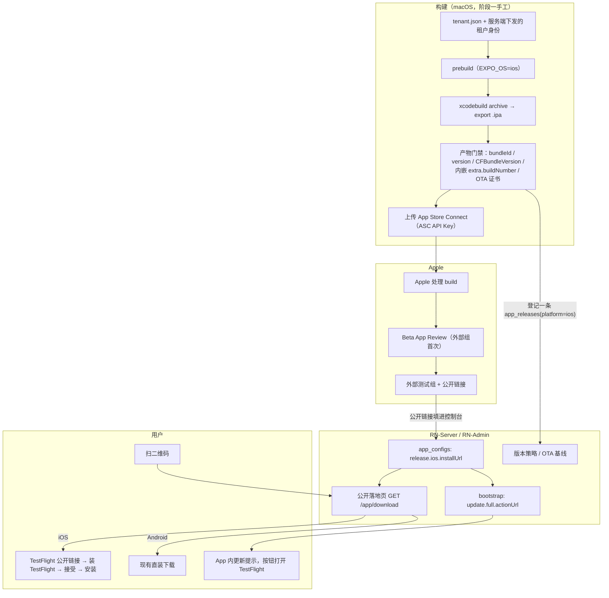

# 设计：iOS TestFlight 分发（租户自有 Apple 开发者账号）

状态：阶段 0–1 已实现（2026-09-17），未推送。跨 RN-App / RN-Server / RN-Admin 三个仓库。实现记录与偏离见 §10。

这是 `docs/design/build-service-2026-09-11.md:180`（「iOS：需要 macOS 构建机与签名身份，另排」）那一条的落地方案。不改动该文档确立的安全论证——服务端不下发命令、签名材料不经服务端、任务只带参数——但 iOS 的签名模型与 Android 不同，见 §4.2 与 §8.4。

Apple 的规则条款随时会变。本文里凡是写「Apple 要求」的地方，实施前以 Apple 当期文档为准；文中的数字（90 天、10000 人、100 席）是 2026-09 的值。

## 1. 要解决的问题

租户持有自己的 Apple 开发者账号，要两件事：

1. 打出 TestFlight 版本的安装包；
2. 普通用户扫二维码就能装上。

第 2 件在 iOS 上没有 Android 那种「下载 APK 直接装」的等价物，所以整份文档的形状由 §2 的边界决定，而不是由「把 Android 那套照搬到 iOS」决定。

## 2. 边界：TestFlight 是什么，不是什么

iOS 上能让**不特定用户扫码就装**的路径只有两条：App Store 上架页，和 TestFlight 公开链接（`https://testflight.apple.com/join/XXXXXXXX`）。其余三条都不满足「普通用户」：

| 路径 | 为什么不行 |
| --- | --- |
| 企业计划（In-House） | 条款限本组织员工内部使用，面向公众分发会被吊销证书 |
| Ad Hoc | 要逐台登记 UDID，上限 100 台/年/设备类型 |
| MDM | 要求设备先被组织接管 |

这与 `RN-App/docs/RELIABILITY_AND_RELEASE.md:166-171` 已有的判断一致。所以本稿只做 TestFlight。

TestFlight 的边界，按对运营影响从大到小：

| 事实 | 后果 |
| --- | --- |
| **每个 build 90 天后过期** | 过期后用户点开就是「此测试版已过期」。必须至少每 90 天发一个新 build，断更 = 全体失效。这和 direct APK「发一版管半年」的心智完全相反 |
| 外部测试上限 10000 人 | 超过就装不进来，且名额按「接受邀请的人」算 |
| 外部测试组的每个 build 要过 Beta App Review | 首次必审，之后小改多数可复用审核结果，改动大会重审。审的是同一套 App Review Guidelines，钱包类要备演示账号与功能说明 |
| 内部测试 100 席、免审 | 但每个内部测试员要是 App Store Connect 用户，只适合自己团队 |
| 用户要有 Apple ID，并先装 TestFlight App | 扫码落地页必须能引导这一步 |
| 公开链接在微信/企微内置浏览器里常被拦 | 落地页要提示「用 Safari 打开」 |

**结论**：TestFlight 是「可扫码的测试通道」，不是 direct APK 的 iOS 等价物。把它当正式长期分发用，90 天那条会周期性地咬人。要长期分发只有上架 App Store，那是另一份文档。

## 3. 现状

### 3.1 数据面基本已经是双平台的

| 能力 | 位置 | 状态 |
| --- | --- | --- |
| 发布记录、OTA 记录、安装记录的 `platform` 枚举含 `ios` | `internal/store/migrations.go:618/633/657` | 可用 |
| OTA manifest 按 `expo-platform` 分发 | `internal/api/ota.go:946/991` | 可用 |
| 更新策略的 iOS 版本阈值 | `internal/api/server.go:2083`、`RN-Admin/src/modules/app-config/version-combobox.tsx` | 可用 |
| bootstrap 按 `x-platform` 分流 | `internal/api/server.go:1836` | 可用 |
| 租户 iOS 身份（Team ID + bundle id）存储与接口 | `internal/api/release_identity_apple.go`、路由 `server.go:352-353` | 有后端，**无管理端界面** |
| iOS 通用链接归属声明 AASA | `internal/api/release_identity_apple.go:195` | 在发，但客户端没接（§3.2.3） |
| 构建任务表接受 `platform=ios`，build 号递增闸对 ios 通用 | `internal/api/build_jobs.go:288/464` | 可排队，**无人认领**（§3.2.1） |
| 租户 iOS 身份进 `tenant.json` | `RN-App/tenants/anyfun/tenant.json`（`iosBundleId`、`iosBuildNumber: "9"`） | 可用 |

### 3.2 缺口

按会先撞上的顺序。

#### 3.2.1 没有 macOS 构建链路（阻断性）

打包机代理明确只做 Android：`cmd/build-agent/build.go:221`（`this agent only builds android`）、`cmd/build-agent/ota.go:20`。`config.go:143` 允许 `BUILD_AGENT_PLATFORMS` 里写 `ios`，但没有对应实现。amos 是 Linux，iOS 包在物理上打不出来。

更糟的是失败方式：从控制台排一条 `platform=ios` 的安装包任务，服务端会接受（`build_jobs.go:288`），而没有任何代理会领它，`reapStaleBuildJobs` 又只回收 `claimed`/`running`——于是这条任务**永远 queued 且永远不被回收**，并占住一个 build 号。`docs/design/build-concurrency-2026-09-15.md:63` 已经记录了这一条，至今没做。OTA 那侧已经在排队时就拒了（`build_ota_jobs.go:82-86`），安装包这侧没有对称的闸。

#### 3.2.2 iOS 构建时 `EXPO_OS` 没人设置，OTA 身份会错（阻断性，本次发现）

`RN-App/app.config.ts:114` 用 `process.env.EXPO_OS === "ios"` 决定 `extra.buildNumber` 与 `updates.requestHeaders["x-build-number"]` 取哪个值。而 `@expo/cli` 的构建产物里根本没有 `EXPO_OS` 这个字符串——prebuild 不设置它。`scripts/build-ota.mjs:58` 在调 `expo export` 时手工设了，prebuild 这一侧没有。

实测（`EXPO_PUBLIC_TENANT=anyfun pnpm exec expo config --json`，2026-09-17）：

```text
ios.buildNumber            = 9      ← 对
android.versionCode        = 46
extra.buildNumber          = 46     ← 错，iOS 包里会是 Android 的 versionCode
updates.requestHeaders     = { ..., "x-build-number": "46" }   ← 错
```

影响面（Android 不受影响，它恰好落在默认分支上）：

| 通道 | 结果 |
| --- | --- |
| Info.plist `CFBundleVersion` | **对**（来自 `ios.buildNumber`） |
| 运行时 `X-Build-Number` 请求头 | **对**——`src/core/network/api-client.ts:50` 优先用 `Application.nativeBuildVersion` |
| OTA manifest 请求头 `x-build-number`（原生侧，编进 Expo.plist） | **错**：发 46 |
| OTA manifest 里内嵌的目标包身份 | **错**：`src/core/updates/update-service.ts:218` 优先取 `extra.buildNumber`，与本机运行时的 9 比对（`:199`）不相等 → 所有 iOS OTA 被判定「不属于本机」 |

修法见 §4.4（iOS 构建脚本显式设 `EXPO_OS=ios`，并在门禁里复验产物）。这个缺陷现在看不见，因为一个 iOS 包都还没打过。

#### 3.2.3 RN-App 的 iOS 段几乎是空的

`app.config.ts` 的 `ios` 只有 `supportsTablet` / `bundleIdentifier` / `buildNumber`。实测 `ios.associatedDomains = null`、`ios.infoPlist = null`。缺的东西：

| 缺什么 | 不补的后果 |
| --- | --- |
| `ios.associatedDomains` | 服务端 AASA 已经在发（`release_identity_apple.go:211`），客户端不声明，**iOS 上 App Link 完全不生效**：WalletConnect 回跳退回可抢注的自定义 scheme（正是安全评审 N13 要堵的洞），邀请链接也打不开 App |
| AASA 只声明 `/app/wc`（`release_identity_apple.go:25` 单一常量） | Android 侧两条路径都声明了（`app.config.ts` 的 `APP_LINK_PATH` + `INVITE_LINK_PATH`），iOS 少了 `/app/invite/` |
| `ios.config.usesNonExemptEncryption` | 每次上传都要人工回答出口合规问卷，忘了就卡住分发。**但这个值不能由工程单方面填**，见 §8.2 |
| `NSFaceIDUsageDescription` | 代码用了 `expo-local-authentication`（`src/test/setup.ts:20` 有 mock），没有权限文案：iOS 首次调 Face ID 直接崩，也过不了审 |
| iOS 推送（APNs） | 服务端有 `APNS_PRIVATE_KEY` 配置位，客户端这条链从没验证过 |
| iOS 产物门禁脚本 | Android 有 `scripts/build-android-release.mjs` + `verify-android-release.mjs` 一整套身份校验（包名 / 签名者 / 版本 / 权限），iOS 一条都没有 |

#### 3.2.4 iOS 没有安装入口，强更会把用户锁死

bootstrap 只在 `platform == "android" && distribution == "direct"` 时计算 `actionUrl`（`server.go:1862`）。iOS 永远拿到空串。而 `resolveUpdateDecision`（`server.go:1747`）只在 `development` 渠道下把「无 actionUrl」降级成 `recommended`，所以 iOS 上一旦触发强更，App 会走到 `RN-App/src/features/updates/update-modal.tsx:217` 那个「强制更新但没有按钮」的分支——用户卡在强更页，没有任何出路。

#### 3.2.5 扫码入口写死 Android

`publicLatestReleaseDownload`（`simplified_releases.go:556`）在没有 platform 参数时默认 android，注释原话：「浏览器扫码打开时不会带这些，默认给 Android：iOS 目前没有直装分发链路」。邀请落地页的下载按钮固定指向它（`referral_landing.go:73`）。

**今天 iOS 用户扫邀请二维码，拿到的是一个 APK。**

#### 3.2.6 管理端没有 iOS 面

`RN-Admin/src/modules/build-config/` 下只有 `android-build-page` 和 Android 版 `release-identity-section`。`GET/PUT /v1/admin/release-identity/ios` 有后端没前端，只能用 curl 配。

#### 3.2.7 发布入库假设产物是 APK

`simplified_releases.go:303` 只在 `platform == "android"` 时做 apkinspect、签名者 pin 比对、版本一致性校验。iOS 记录零校验，却仍然**必须先上传一个产物文件**才能建记录——而 TestFlight 的产物在 Apple 那边，我们手里的 `.ipa` 不是用户装的那一份（Apple 会重新签名和瘦身）。

## 4. 方案

### 4.1 总体动线



### 4.2 构建与签名：选型

| | EAS Build（Expo 云 macOS） | 自有 Mac 跑 iOS build-agent |
| --- | --- | --- |
| 上手 | 一条命令出包 | 要写 `pnpm ios:release <slug>` + 代理的 ios 分支 |
| 签名材料 | Distribution 证书私钥或 ASC Key 托管给 Expo | 自持 |
| 与现有模型 | 冲突：`build_jobs.go:22-45` 的论证是「签名密钥只在打包机，服务端只知道指纹」 | 一致 |
| 审计链 | 绕开 build_jobs、发布记录、SBOM | 复用 |
| 成本 | 订阅制，按构建计费 | 一台 Mac mini + 维护 |

**选型：阶段一在一台 Mac 上手工跑通并固化成脚本，阶段三再接进 build-agent。**

理由是排序问题而不是偏好问题：现在连一个 iOS 包都没打过，§3.2.2 那个 `EXPO_OS` 缺陷就是没打过的直接证据，先花两周做 iOS 打包机，得到的是一条自动化的、把未知缺陷批量生产的流水线。EAS 可以用来救急验证一次，但不作为租户生产方案——它要求把签名身份交出去，而这与 Android 那侧刚刚立起来的签名闸（`android-signing-gate-2026-09-16.md`）方向相反。

**iOS 的签名模型与 Android 不对称，这点要提前说清**：Android 那套「构建机出未签名包、签名闸单独签」在 iOS 上做不到——`xcodebuild -exportArchive` 时签名就已经发生，Mac 必然同时持有源码和签名身份。iOS 的补偿是 Apple 侧的可撤销性（证书随时吊销、分发通道由 Apple 托管、用户装的那一份由 Apple 重签），所以泄露的后果比 Android direct 的 keystore 轻——但不等于零。iOS 的具体安全模型在阶段三单列一节，不在本稿定稿。

### 4.3 租户要提供什么（对接清单）

前置：租户已加入 Apple Developer Program。个人账号也能发 TestFlight，但主体是个人；组织账号需要 D-U-N-S 编号，注册审核可能要几天到几周。**本节全部由租户侧操作，平台只接收结果。**

| # | 材料 | 从哪来 | 是否机密 |
| --- | --- | --- | --- |
| 1 | Apple Team ID（10 位） | developer.apple.com → Account → Membership details | 否 |
| 2 | Bundle ID 已注册 | developer.apple.com → Certificates, Identifiers & Profiles → Identifiers → `+` → App IDs | 否 |
| 3 | App Store Connect 里的 App 记录 | appstoreconnect.apple.com → 我的 App → `+` → 新建 App | 否 |
| 4 | ASC API Key：Issuer ID、Key ID、`.p8` | 见下方步骤 | **`.p8` 机密** |
| 5 | 出口合规问卷的书面答复 | 租户法务 | 否，但要留痕 |
| 6 | APNs 密钥（Key ID + `.p8`，iOS 推送要用） | 与第 4 项同一个页面的「Apple Push Notifications service (APNs)」 | **机密** |

**第 2 项**：Bundle ID 必须等于 `tenants/<slug>/tenant.json` 的 `iosBundleId`（anyfun 是 `com.anyfun.foundation`）。它全球唯一、先到先得，且**一旦绑定 App 记录就不能再改**——如果被别人占了，只能改 `tenant.json` 并连带改 `check-build-profiles.mjs` 的唯一性断言与 `release.ios`。注册时勾上 Push Notifications 与 Associated Domains 两项能力，否则 §4.4 的深链与推送到构建时才失败。

**只勾这两项。** App ID 上其余能力我们一项都不用——`@react-native-community/netinfo` 只读连接类型（wifi/蜂窝/离线），不读 SSID，所以不需要 Access WiFi Information；相机（扫收款码）、Face ID、剪贴板是 Info.plist 里的用途说明，不是 App ID 能力。多勾的代价是描述文件带上用不到的权限，并在审核时招来「为什么要读这个」的问询——钱包类 App 尤其不该给出这种问题。能力表**事后可改**（改完重新生成描述文件即可），Bundle ID 不可改，所以拿不准的留到真正要用时再加。

**第 3 项**：新建 App 时填的「名称」在 App Store 全球唯一（会被占用，与 Bundle ID 是两回事），「SKU」是租户内部标识、随便填但建不可改，Bundle ID 从下拉里选第 2 项注册的那个。

**第 4 项（Issuer ID / Key ID / `.p8`）的获取步骤**：

1. 用**具有 Account Holder 权限**的账号登录 appstoreconnect.apple.com——首次生成 API 密钥必须由 Account Holder 开通，其他角色只能看到「请求访问」；
2. 用户和访问 → 集成（Integrations）→ App Store Connect API → **团队密钥**（Team Keys）；
3. `+` 新建，填名称，选角色：**App Manager**（管理 TestFlight 测试组与公开链接需要它；只上传 build 用 Developer 即可）；
4. 三样东西在同一页上：**Issuer ID** 在页面顶部（整个团队共用一个 UUID），**Key ID** 在新建那一行（10 位），**`.p8`** 点「下载 API 密钥」。

`.p8` **只能下载一次**，离开页面后 Apple 不再提供第二次下载，丢了只能吊销重建。注意别选成同一页面上的 APNs 密钥或 Sandbox 密钥。

**签名证书与描述文件不在这张清单里**：Distribution 证书与 App Store provisioning profile 由构建机用第 4 项的 Key 自动申请与续期（Xcode automatic signing），不需要租户手工导出 `.p12` 搬运——少一次私钥跨机传输就少一处泄露面。

**如果租户不愿意交出 API Key**（常见）：退路是租户自己在 ASC 网页上建外部测试组、开公开链接，只把那条 `https://testflight.apple.com/join/XXXXXXXX` 给平台。§4.5 和 §4.6 的扫码分发只需要这一个字符串；代价是每次发版的 TestFlight 操作都要租户手工点，且平台拿不到 build 过期日（§5）。

保管纪律：`.p8` 放仓库外 0600 目录，按键取值，不 echo、不进命令行参数、不进仓库、不进截图。

为什么用 API Key 而不是 Apple ID 口令：可按角色最小权限、可单独吊销、不受 2FA 干扰、不牵连账号本身。

多租户隔离：每租户一个 Apple Team、一个 Bundle ID、一把 ASC Key。不共用——共用一把 Key 等于任何一个租户的运营都能动别人的 App。

### 4.4 RN-App 改动

| # | 改什么 | 文件 | 为什么 |
| --- | --- | --- | --- |
| 1 | iOS 构建时显式 `EXPO_OS=ios` | 新增 `scripts/build-ios-release.mjs` | §3.2.2；不要指望 CLI 会设 |
| 2 | 产物门禁复验 `extra.buildNumber == CFBundleVersion` | 同上 | 环境变量漏设是静默失败，门禁要把它变成构建失败 |
| 3 | `ios.associatedDomains: ["applinks:<apiHost>"]` | `app.config.ts` | §3.2.3；host 从 `apiBaseUrl` 推，与 Android 的 `appLinkHost` 同源 |
| 4 | Face ID 权限文案 | `app.config.ts` 的 `expo-local-authentication` 插件配置 | 不配会崩 |
| 5 | `ios.config.usesNonExemptEncryption` | `app.config.ts` | 值等法务答复，见 §8.2 |
| 6 | `tenant.json` 增 `appleTeamId` | `tenants/<slug>/tenant.json` + `scripts/tenant-config.mjs` + `check-build-profiles.mjs` | 构建要 `DEVELOPMENT_TEAM`；与 `signerSha256` 平行——公开身份指纹进 tenant.json。**同步改** `cmd/build-agent/tenantfile.go:74` 的必填键与「只允许改 version/androidVersionCode」那道闸 |
| 7 | `check-build-profiles.mjs` 校验 `iosBuildNumber` 为正整数字符串 | 同文件 | 现在只校验 version 与 androidVersionCode |
| 8 | TF 包用现成的 `production-store` profile | `eas.json` | 见 §4.7。**不要**混用 `ios-mdm`，那是给 MDM 的 |

第 1、2 条是阻断性的，其余在第一个包打出来之前做完即可。改完跑 `pnpm config:check` 与 `pnpm check`（含 prettier，照 CI 那套）。

### 4.5 RN-Server 改动

#### 4.5.1 `release.ios` 增加安装入口

```json
{
  "appleTeamId": "ABCDE12345",
  "bundleId": "com.anyfun.foundation",
  "installUrl": "https://testflight.apple.com/join/XXXXXXXX"
}
```

校验（`release_identity_apple.go`）：`installUrl` 可空（没配就是没配，与今天行为一致）；非空时必须是 https、host 只允许 `testflight.apple.com` 或 `apps.apple.com`、有非空 path、长度 ≤ 255。

**不另存一个 `installChannel` 字段**：它能从 host 推出来，存两份就有了一个能自相矛盾的地方。

写入沿用现有形状：`expectedVersion` 乐观锁 + `reason` + `confirm`，进审计（`release_identity_update`）。

#### 4.5.2 bootstrap 给 iOS 下发 actionUrl

在 `server.go:1862` 那个 `if` 旁边加 iOS 分支：

```go
if platform == "ios" && distribution == "store" {
    // TestFlight / App Store 的安装入口由租户登记，服务端不托管产物
    if rec, err := s.iosReleaseIdentityRecord(ctx, tenant.ID); err == nil && rec != nil {
        actionURL = rec.Value.InstallURL
    }
}
```

只给 `store`，不给 `mdm`：MDM 是受管设备的分发，把 TestFlight 链接发给它是错配。`releaseId` / `sha256` / `size` 保持为 null——产物不在我们手里，编一个出来就是撒谎。

客户端侧不需要改就能用：`update-modal.tsx:123` 的 `Linking.openURL(actionUrl)` 打开 TestFlight 链接即可；应用内直装那条分支要求 `distribution === "direct"`（`:65`），iOS 的 store 包进不去。**要加的只有一条**：`update-modal` 的按钮文案在 iOS 上应该是「前往 TestFlight」而不是「立即更新」，否则用户预期跳转到系统安装器。

`latestVersion` 的来源阶段一仍是运营手填的 `updatePolicy.latestVersion.ios`（`server.go:1846`）；阶段二再考虑让它跟随 iOS 的 active 发布记录。

#### 4.5.3 排队时就拒掉无人认领的 iOS 安装包任务

在 `createBuildJob` 加闸，与 OTA 那侧（`build_ota_jobs.go` 的「打包机只做 android」）对称。否则一条任务永久占住队列和 build 号（§3.2.1）。

**判据不写成「iOS 不行」，写成登记**（实现时的修正，见 §4.8）：iOS 打包机就是一台装了 Xcode 的 Mac，接进来之后这里不该还硬编码着平台名。所以闸的条件是「`build.machines` 里有没有一台没被吊销、且声明能构建这个平台的构建机」，没有就 409 `NO_BUILDER_FOR_PLATFORM` 并指路去登记。

这条与 TestFlight 无关，是现在就该修的存量缺陷。

#### 4.5.4 iOS 发布记录：不要求产物

给 iOS 加一条「外部托管发布」路径：建记录时只要 `platform=ios` + `version` + `buildNumber` + `releaseNotes` + 审核原因，不需要 artifact token，`object_key` / `sha256` / `file_size` 记空，`file_metadata` 记 `{"hosted":"testflight","bundleId":...,"installUrl":...}`。

为什么不是「上传 .ipa 只作归档」：我们手里的 `.ipa` 不是用户装的那一份（Apple 会重新签名），把它当发布产物存起来，会让「发布记录的 sha256」这个字段在 iOS 上变成一个看起来有意义、实际对不上任何东西的值。归档需求另走对象存储，不混进发布记录。

这条记录的价值在别处：它是 `latestVersion` 的依据、是 OTA 基线（`ota.go:289/408` 要求基线 `verified`/`active`）、是审计里「这一版什么时候发的」。注意 `ota.go:751` 已经写明只有 Android 基线经过 apkinspect，iOS 基线的应用身份绑定本来就弱，这条路径不引入新的信任假设。

#### 4.5.5 公开落地页 `GET /app/download`

租户域名下的公开页，形状照抄 `referral_landing.go`（内联模板、`html/template` 转义、`noindex`、`no-store`）：

- 按 `User-Agent` 判平台：iOS → `release.ios.installUrl`；Android → `/v1/public/releases/latest/download`；判不出 → 两个按钮都给；
- iOS 且未配 `installUrl`、或 Android 且没有 active 发布 → 该按钮置灰并说明「尚未开放」，不要 404：这个地址会被印在海报上，404 的成本远高于一句「暂未开放」；
- 页面不显示租户内部状态（与邀请页同一条纪律）；
- iOS 分支加一行提示：在微信/企微里打开请点右上角「在 Safari 中打开」。

然后把 `referral_landing.go:73` 的 `DownloadURL` 改指到它，顺手修掉 §3.2.5 那个「iOS 用户扫邀请码拿到 APK」。

**一个二维码双端通吃**：海报和线下物料印 `https://<租户域名>/app/download`，不印 TestFlight 链接本身——TF 链接换了（换组、重开公开链接）不用重印。

### 4.6 管理端的 iOS 配置面：两种接入模式

租户交不交 App Store Connect API Key，决定平台能替它做多少事。**两种都要支持，且共用同一张配置面**——只有「有没有装 Key」这一个判据，不做两套页面。

#### 4.6.1 平台可以代管 ASC Key（修正初稿的保留意见）

初稿把「服务端保存租户 ASC Key」列为未决，理由是它引入「平台代管租户 Apple 凭证」这个新的信任边界。**这个理由不成立**：服务端早就在按租户加密保管同类材料。

| 材料 | 存储位置 | 做法 |
| --- | --- | --- |
| OTA 签名私钥 | `app_configs` 的 `ota.signing` | secretbox + `STORAGE_MASTER_KEY`，AAD 绑租户，只写不读、整把替换（`internal/api/ota_signing.go:339`） |
| FCM 服务账号 JSON | `push.fcm` | 明文只留给人看的标识（projectId / clientEmail / keyId），整份 JSON 加密（`internal/pushcreds/pushcreds.go:55-63`） |
| APNs 密钥 | `push.apns` | 键已预留，接口未实现 |
| 打包机签名 keystore | 密封给打包机公钥 | `internal/buildkeystore` |

ASC Key 与 FCM 服务账号是同一类东西：第三方平台签发的、可吊销的服务凭证，泄露后在对方后台点一下就作废。存法照抄 `pushcreds` 即可，不需要新的信任模型。

**真正的新增风险只有一条**：ASC Key 的权限范围比 FCM 服务账号大——它能动租户 App Store 账号下的 App。缓解办法是让租户在 ASC 建 Key 时**限制到本 App**（2026-09-17 实测那把 Key 能看到该团队全部 5 个 App），并在管理端的上传表单旁边写明这件事。

#### 4.6.2 两种模式

| | 模式 A：托管 | 模式 B：自助 |
| --- | --- | --- |
| 租户交出 | Team ID、bundle id、**ASC API Key** | Team ID、bundle id、**TestFlight 公开链接** |
| 平台能做 | 只读同步：App 记录、最新 build、过期日、测试组、公开链接 | 什么都不问 Apple |
| `installUrl` 来源 | 自动同步（可人工覆盖） | 人工填 |
| build 过期日（§5 的 90 天时钟） | 自动读 `expirationDate`，到点告警 | 人工填，或没有告警 |
| 每次发版 | 平台可代查状态；提审与开链接仍由人点 | 租户自己在 ASC 网页上全程操作 |
| 适用 | 平台代运营、租户信任度高 | 租户不愿交凭证（常见，要当默认路径对待） |

**模式 B 是默认路径，不是降级路径。** 扫码分发（§4.5.5）、App 内更新入口（§4.5.2）只需要 `installUrl` 一个字符串，没有 Key 也全都能跑。模式 A 省掉的只是人工抄链接和人工记过期日。

#### 4.6.3 数据形状

两个键分开存，理由照搬 `pushcreds.go:36-38` 的原话——轮换互不影响、审计一目了然、字段形状不同：

```jsonc
// app_configs: release.ios —— 身份与分发入口，全明文
{
  "appleTeamId": "J4JDF…",          // 10 位
  "bundleId": "com.anyfun.foundation",
  "installUrl": "https://testflight.apple.com/join/XXXXXXXX",
  "installUrlSource": "manual",      // manual | synced：同一个 URL 手填与同步来的长得一样，推不出来，所以存
  "buildExpiresAt": "2026-12-16T08:00:00Z"  // 模式 B 人工填，模式 A 同步覆盖
}

// app_configs: ios.asc —— 凭证，仅模式 A
{
  "issuerId": "3223d…",              // 明文：ASC 页面上公开显示，管理端要靠它回答「现在用的是哪把钥匙」
  "keyId": "8WQNTAY7MP",             // 明文，同上
  "appId": "6811004741",             // 保存时验证顺带查到，省掉之后每次同步再查一次
  "privateKeyEncrypted": "…",        // secretbox，AAD 绑租户，只写不读
  "verifiedAt": "2026-09-17T…"
}
```

#### 4.6.4 接口

| 方法 | 路径 | 说明 |
| --- | --- | --- |
| GET / PUT | `/v1/admin/release-identity/ios` | 已存在；扩展 `installUrl`、`installUrlSource`、`buildExpiresAt` |
| GET | `/v1/admin/ios/asc-credentials` | 只回 issuerId / keyId / appId / verifiedAt，**不回私钥** |
| PUT | `/v1/admin/ios/asc-credentials` | 装或整把替换；`expectedVersion` + `reason` + `confirm`，进审计 |
| DELETE | `/v1/admin/ios/asc-credentials` | 退回模式 B；响应里提示「还要去 ASC 把这把 Key 吊销」 |
| POST | `/v1/admin/ios/testflight/sync` | 只读同步，回写 `installUrl` / `buildExpiresAt`；模式 B 下 409 |

#### 4.6.5 保存即验证

装 Key 时立刻用它签一个 JWT 调 `GET /v1/apps?filter[bundleId]=<该租户的 bundleId>`，**必须恰好命中 1 条**才算保存成功，同时把 `appId` 与 `verifiedAt` 写下来。

这条照抄 FCM 的规矩（`pushcreds.go:44-45`：「验证要和真正发送走同一条路，否则『验证通过』证明不了任何事」）。它同时挡掉两类错配：Key 属于别的团队，以及 bundle id 与 `tenant.json` 对不上——后者在 2026-09-17 的实测里是对的，但那是人工核对的结果，不该靠人每次都记得核。

#### 4.6.6 平台不做的事

同步是**只读**的。以下三件永远由人在管理端点、且二次确认，绝不自动：

- 提交 Beta App Review；
- 开关公开链接、改公开链接名额上限；
- 增删测试员。

理由：它们直接改变对外可见状态，而且失败后果不对称——多开一个公开链接是把内测包发给全世界，少开一个只是没人能装。

#### 4.6.7 页面形状（RN-Admin `build-config` 模块新增「iOS 打包与分发」）

三段：

1. **应用身份**：Team ID、bundle id（与 `tenants/<slug>/tenant.json` 比对，不一致时显眼报错，不是静默采用其中一个）；
2. **App Store Connect 接入**：模式选择；模式 A 显示 Issuer ID / Key ID / 上传 `.p8` / 最近验证时间 / 「限制到本 App」提示；模式 B 整段折叠；
3. **TestFlight 状态**：公开链接（模式 A 只读同步 + 可覆盖，模式 B 手工填）、当前 build 与过期日、**链接的二维码**（供运营直接下载做物料）。

二维码渲染在管理端本地完成，不要调第三方二维码服务——那等于把租户的分发链接送给一个无关的第三方。

顺带：`android-build-page` 的排队表单在 iOS 打包机上线前不出现 iOS 选项（§4.5.3 的后端闸是第二道保险）。

#### 4.6.8 部署约束

模式 A 要求服务端能出站访问 `api.appstoreconnect.apple.com`。服务端本来就要出站到 FCM 与链上 RPC，不是新增网络面，但 amos 上的出站策略要确认一次。模式 B 不需要任何出站。

### 4.7 分发渠道语义：为什么复用 `store`

TestFlight 包的 `distributionChannel` 用 `store`，不新增 `testflight` 枚举。

新增一个枚举要改：`app.config.ts` 的类型、`check-build-profiles.mjs` 的映射表、`server.go:1840` 的 `oneOf`、`ota.go:988` 的白名单、App 端 `bootstrap.schema.ts`、管理端 zod schema——六处，换来的信息量是「这个包的安装入口是 TF 还是商店」，而这件事 `installUrl` 的 host 已经说了。

代价要写明：`update.full.channel` 在 TF 包上报的是 `store`，运营在管理端看不出区别。如果将来 TF 与正式商店需要**不同的更新策略**（比如 TF 用户要更激进的强更节奏），那时再加枚举，不在现在加。

### 4.8 多台 Mac：任务路由靠登记，不靠自报

阶段一只有一台 Mac，但「只有一台」不该被写进代码——换一台机器、加一台机器都是常态，而队列是跨租户的，一台配错的机器能把别人的发布一起拖住。

做法是给 `build.machines` 的构建机加一个 `platforms`（空 = `["android"]`，加这个字段之前登记的构建机全是 Linux）：

| 位置 | 规则 |
| --- | --- |
| 排队（`createBuildJob`） | 没有一台没被吊销、能构建这个平台的构建机 → 409，不排 |
| 认领（`claimBuildJob`） | 代理自报的 `platforms` 与登记**求交集**：自报只能收窄，不能扩张 |
| 改能力（`POST /machines/:id/platforms`） | `expectedVersion` + `reason` + `confirm`，进审计 |
| 代理自己（`BUILD_AGENT_PLATFORMS`） | 认 `android` / `ios`；声明 `ios` 但不是 macOS 时**启动即失败** |

「自报只能收窄」这一条是关键。一台没装 Xcode 的机器报了 `ios`，领走的任务只会失败、退回排队、再被它领走——一个自愈不了的循环。登记由平台管理员维护，自报只是「我这次想干什么」。

**Mac 不在公网不构成障碍**：打包机本来就是拉模型（本机令牌 + 轮询认领），只需要出站到服务端。反过来服务端不需要、也没有任何办法主动连它——这正是 `build-service-2026-09-11.md` 立的那条「服务端不下发命令」。

**还没做的一块**：`machine_setup.go` 生成的安装命令是 Linux + systemd 的。Mac 上目前要人工装（放二进制、写 launchd plist、准备 `BUILD_AGENT_*` 环境）。另外 macOS 上的执行进程隔离（`BUILD_AGENT_RUNNER_USER`）要给那个用户单独准备签名身份的钥匙串，没有就只能用 `-`（与控制进程同用户），而那正是 §8.4 说的那个风险。

### 4.9 iOS 安装包任务的生命周期

Android 是 `queued → claimed → running → built（待签名）→ signing → succeeded`。**iOS 是 `queued → claimed → running → succeeded`**，中间没有待签名这个状态。

原因只有一条：`xcodebuild -exportArchive` 导出的那一刻签名就已经发生了，没有「未签名包」这种东西可以交给签名闸。签名闸的认领 SQL 本来就带 `platform='android'`，所以 iOS 任务真要走到 `built` 会永远停在那里——`/built` 因此对 iOS 关掉，改走 `POST /v1/build-agent/jobs/:id/ios-release`。

| | Android | iOS |
| --- | --- | --- |
| 交付物 | 未签名 APK + SBOM，上传服务端 | 已签名 `.ipa`，**不上传** |
| 出处签名 | 必须，签名闸据此验货 | 无——没有签名闸这一环 |
| 原生指纹 | 必须 | 无 |
| 发布记录 | 有产物、有 sha256 | 无产物，`file_size` / `sha256` 为 NULL |
| 结束状态 | `succeeded`（签名闸写） | `succeeded`（构建机写） |

`.ipa` 不上传，是因为用户装的那一份是 Apple 重签、瘦身之后的东西（§4.5.4）。它的摘要仍然记进 `file_metadata`，标 `ipaSelfReported`，只当审计凭证。

上传 App Store Connect 由**这台 Mac 自己**决定（`BUILD_AGENT_IOS_UPLOAD`，默认关），用的是机器本地的 ASC 凭证，不是服务端保管的那把——上传是对外可见的动作，包进了 ASC 就撤不回来，这个决定该留在装机器的人手里。服务端那把（`ios.asc`）只读，两者可以是不同的 Key。

## 5. 90 天时钟

这是本方案唯一的周期性运营负担，单列一节免得被当成脚注。

| 事件 | 必须做什么 | 谁 |
| --- | --- | --- |
| build 上传后 | 记下过期日（上传日 + 90 天） | 发布负责人 |
| 过期前 14 天 | 出下一个 build 并提交 Beta App Review | 发布负责人 |
| 过期前 3 天仍未替换 | 升级告警：全体 TF 用户即将失效 | 平台 |
| 已过期 | 老用户打不开，新用户扫码能装最新 build（若有） | —— |

阶段二把「当前 TF build 的过期日」做成控制台上的一个字段（可从 ASC API 的 `expirationDate` 拉），比靠人记靠谱。

## 6. 分阶段任务

本节的勾选状态以 2026-09-17 的实现为准，详见 §10。

**阶段 0（不需要 Mac）——已完成**

1. ✅ `build_jobs.go` 拒掉没人能构建的平台（§4.5.3，判据换成了登记，见 §4.8）；
2. ✅ RN-App 的 iOS 配置补齐：`associatedDomains`、Face ID 文案、`appleTeamId`（经 `release.ios` 进合成的 tenant.json）及配套闸；
3. ✅ AASA 补 `/app/invite/*`；
4. ✅ `release.ios` 增 `installUrl` + bootstrap iOS actionUrl + 更新弹窗的 iOS 文案；
5. ✅ 公开落地页 `/app/download`，邀请页改指它；
6. ✅ 管理端 iOS 段（§4.6），含 `ios.asc` 与只读同步。

**阶段 1（需要 Mac）——代码已就位，等第一台机器**

7. ✅ `scripts/build-ios-release.mjs`：prebuild（`EXPO_OS=ios`）→ archive → export → 产物门禁；门禁逻辑是纯函数，单测不需要 Mac；
8. ✅ 打包机的 iOS 路径（`BUILD_AGENT_PLATFORMS=ios`）与 `POST /jobs/:id/ios-release`（§4.9），端到端测试用假 `pnpm` 跑通；
9. ⬜ **在真机上跑一遍**：出第一个 build，上传 ASC，内部测试组装机验证——冷启动、bootstrap、深链回跳、Face ID、推送、OTA（重点验 §3.2.2 修没修对）。这一条没有替代品，下面全部依赖它。

**阶段 2（TestFlight 对外）**

10. ⬜ 出口合规答复落地（§8.2），Beta App Review 资料（演示账号、功能说明）；
11. ⬜ 外部测试组 + 公开链接 + 扫码动线端到端；
12. ⬜ 90 天告警：`buildExpiresAt` 已经落库并在管理端提醒（§4.6），还缺一条到期前的主动通知。

**阶段 3**

13. ⬜ macOS 上的机器安装流程（`machine_setup.go` 目前只出 Linux + systemd 的命令，见 §4.8 末尾）；
14. ⬜ iOS 签名安全模型单列设计（§8.4）。

## 7. 验证清单

### 7.1 只用 ASC API Key、不需要 Mac 就能验的

全部只读 `GET`，不改 Apple 侧任何状态。JWT：ES256，`kid` = Key ID，payload `iss` = Issuer ID、`aud` = `appstoreconnect-v1`、`exp` ≤ 20 分钟。

| 检查 | 调用 | 期望 |
| --- | --- | --- |
| Key 有效、权限够 | `GET /v1/apps?limit=5` | 200，非空 |
| App 记录存在且 bundle id 对齐 | `GET /v1/apps?filter[bundleId]=<tenant.json 的 iosBundleId>` | 恰好 1 条；记下 app id |
| Team ID 与 `release.ios` 一致 | 与控制台登记值人工比对 | 相等 |
| 已有 build 与过期时间 | `GET /v1/builds?filter[app]=<id>&limit=10` | `version`（= CFBundleVersion）、`processingState`、`expired`、`expirationDate` |
| 测试组现状 | `GET /v1/betaGroups?filter[app]=<id>` | 内外部组、`publicLinkEnabled`、`publicLink`、`publicLinkLimit` |
| Beta 审核资料是否齐 | `GET /v1/apps/<id>/betaAppReviewDetail`、`/betaAppLocalizations` | 演示账号、联系人、说明 |

**写操作要先问**（建外部组、开/关公开链接、提交 Beta App Review、改测试员名单）——照 `CLAUDE.md` 的写操作纪律。

上面这批检查已固化成 `RN-App/scripts/asc-check.mjs`（`pnpm asc:check`），发版前例行跑：

```bash
pnpm asc:check --env <仓库外的凭证文件> --tenant anyfun [--json] [--strict]
```

它把「必须成立的事实」与「该提醒的事」分开：Key 失效、查不到 App 记录、ASC 上的 bundle id 与 `tenants/<slug>/tenant.json` 不一致 → 退出码 1；没有 build、没有外部测试组、公开链接没开、build 临近过期（§5 的 14 天线）、Beta 审核资料不全 → 警告，`--strict` 下才算失败。私钥、JWT、演示账号口令都不打印。不进 `pnpm check`——它需要一份只存在于运维机上的凭证。

口令纪律：`.p8` 放仓库外 0600 文件，脚本按路径读、私钥不落命令行、不回显、不进日志；JWT 打印时只打 header 与 `exp`。

**2026-09-17 实测**（anyfun 租户的团队 Key，全部只读，未改动 Apple 侧任何状态）：

| 检查 | 结果 |
| --- | --- |
| Key 有效性 | 通过，ES256/P-256 私钥可用 |
| App 记录 | `AnyFun`，`com.anyfun.foundation`，SKU `anyfun`，App ID `6811004741` |
| bundle id 与 `tenants/anyfun/tenant.json` | **一致** |
| 已有 build | **0 个**（iOS 包一次都没打过，符合预期） |
| TestFlight 测试组 | **0 个** |
| Beta 审核资料（联系人、电话、演示账号、审核备注） | **全空** |
| TestFlight 测试内容本地化 | **全空** |

两条观察：

1. **这把 Key 能看到该团队下全部 5 个 App**（其余 4 个是租户的其他产品）。ASC 支持把 Key 的访问范围限制到指定 App，建议收敛——泄露或误操作时的影响面从「整个团队」缩到「一个 App」。
2. **公开链接现在开不了**：它要求先有一个通过 Beta App Review 的 build。所以「建外部测试组 → 开公开链接」这两步排在第一个 build 之后做才有意义，现在建只会得到一个打开显示「暂无可测试版本」的链接。审核资料（§7.1 表第 6 行）倒是可以提前填，它是提审的前置。


### 7.2 需要 Mac 的

archive / export / 上传；产物门禁的全部断言。

### 7.3 需要真机的

扫码 → 落地页 → TestFlight → 安装 → 冷启动 → 深链回跳（验 `associatedDomains` 生效）→ OTA 收得到（验 §3.2.2）→ 强更页有按钮且能跳 TF。

## 8. 风险

### 8.1 Beta App Review 会卡住整条链路

钱包类 App 的审核不确定性高。缓解：先走内部测试组（免审）验证技术链路，外部测试的时间不进对外承诺；备好演示账号与「自托管钱包、不代管用户资产」的说明。

### 8.2 出口合规问卷不能由工程替租户回答

App 用了非 Apple 提供的加密实现（`@noble/ciphers`、`@noble/hashes` 做本地钱包加密与签名）。`ITSAppUsesNonExemptEncryption=false` 的含义是「不使用非豁免加密」，多数同类 App 属于豁免类别，**但这是租户的法务判断，不是默认值**。错误声明的后果落在租户主体上，可能还要提交年度自我分类报告。

**执行上**：`app.config.ts` 里这一项留空 → 每次上传在 ASC 网页上人工回答；拿到书面答复后再写死进配置。不要为了省一次点击先填一个 `false`。

### 8.3 OTA 仍受 Apple 规则约束

expo-updates 在 TF 包里能用，但 Apple 的 2.5.2 / 3.3 要求热更新不得改变 App 的主要功能或绕过审核。现有的 OTA 治理（每租户一把签名密钥、runtime 绑定、`RN-App/docs/SAAS_TENANT_BUILD_RUNBOOK.md` §3.2.2 的密钥仪式）在 iOS 上同样要走一遍——**每租户每环境一把，不与 Android 共用**。

### 8.4 Mac 同时持有源码与签名身份

见 §4.2。阶段一只有一台人工操作的 Mac，风险靠「机器专用、全盘加密、证书可吊销」缓解；阶段三接自动化时必须先出安全模型，不要把 Android 签名闸的结论直接套过来。

### 8.5 90 天

见 §5。这是运营流程风险，不是技术风险，但它最可能真的发生。

## 9. 未决

1. iOS 的 `latestVersion` 阶段二是否改由发布记录驱动（今天 Android direct 走 `visibleSimplifiedRelease`，iOS 走运营手填）；
2. ~~TF build 过期日是否拉进控制台~~ **已决**（2026-09-17）：见 §4.6——服务端按租户加密保管 ASC Key 与它保管 OTA 私钥、FCM 服务账号是同构的，不是新的信任边界；同时保留不交 Key 的模式 B 作为默认路径；
3. 上架 App Store 之后 TF 与商店并存时的渠道语义（§4.7 的枚举问题会在那时重新打开）。

## 10. 实现记录与偏离（2026-09-17）

代码分别在三个从 `origin/main` 开的 worktree 上，**本地提交、未推送**。

| 仓库 | 内容 |
| --- | --- |
| RN-Server | `release.ios` 扩字段、bootstrap iOS actionUrl、`/app/download`、AASA 补路径、构建机平台能力、iOS 任务生命周期、`internal/ascapi`、`ios.asc` 与只读同步、契约 |
| RN-App | `app.config.ts` 的 iOS 段、`pnpm ios:release` 与产物门禁、`pnpm asc:check`、更新弹窗的 TestFlight 文案 |
| RN-Admin | 「iOS 打包与分发」页、打包机的可构建平台 |

### 10.1 与设计不一致的地方

**1. 阶段 3 的「iOS 接进 build_jobs」提前到了阶段 1。**
原计划是先在一台 Mac 上手工跑通、固化成脚本，阶段三再接队列。提前的理由是需求变了：要支持**多台 Mac**，而「多台」只有在队列路由里才有意义——手工脚本没有「派给谁」这个问题。§4.2 选自有 Mac 而不是 EAS 的论据本来就是「复用 build_jobs、发布记录、SBOM」，所以这是把既定方向的时间点挪前，不是换方向。手工路径仍然在：`pnpm ios:release <slug>` 可以脱离队列单独跑。

**2. iOS 任务没有出处签名（provenance）。**
Android 那套是给签名闸验货用的：构建机交未签名包，签名闸只认自己 pin 的构建机签的声明。iOS 没有签名闸这一环，出处声明会变成一个没有消费者的审计装饰。§8.4 已经把 iOS 的安全模型留给单独一节，这条一并留到那时定。

**3. §4.5.3 的闸从「iOS 一律 422」改成「没有能构建这个平台的机器才拒」。**
理由见 §4.8：判据写成登记而不是平台名，iOS 打包机上线之后这里不用再改一次。

**4. `tenants/anyfun/tenant.json` 没有填 `appleTeamId`。**
字段与校验都在，值还空着——App Store Connect API 查不到 Team ID，只能从 developer.apple.com 的 Membership 页抄。真正的构建走的是服务端合成的那份清单（来自 `release.ios`），所以这不阻断队列里的构建，只阻断在本机手工跑 `pnpm ios:release`。

### 10.2 实现期间复核过的事实

在 `origin/main`（比本地主检出新 148 个提交）上重新验了一遍 §3.2 的三条，全部仍然成立：

- `EXPO_PUBLIC_TENANT=anyfun pnpm exec expo config --json` → `extra.buildNumber = "46"`，而 `ios.buildNumber = "9"`；`updates.requestHeaders["x-build-number"] = "46"`；
- `ios` 段只有 `supportsTablet` / `bundleIdentifier` / `buildNumber`，没有 `associatedDomains`；
- `android.permissions` 里没有 `USE_BIOMETRIC` / `USE_FINGERPRINT`，说明 `expo-local-authentication` 的 config plugin 从来没被应用过——Face ID 文案确实是缺的。
- `@expo/cli` 的 `build/src/prebuild/` 与 `build/src/export/` 里没有任何一处写 `EXPO_OS`，所以「CLI 不会替我们设」这条判断在 SDK 57 上仍然成立。

### 10.3 还没有被验证的部分

打包机的 iOS 路径在这台 Linux 上只能用假 `pnpm` 跑通协议（领取 → 写 spec → 交付 `.ipa` → `/ios-release`）。**真正的 `xcodebuild` 一行都没跑过**：archive、`-exportArchive`、`-allowProvisioningUpdates` 自动申请描述文件、`codesign -d --entitlements`、`plutil -convert json`、`xcrun altool --upload-app` 全部要在第一台 Mac 上验（阶段 1 第 9 条）。
