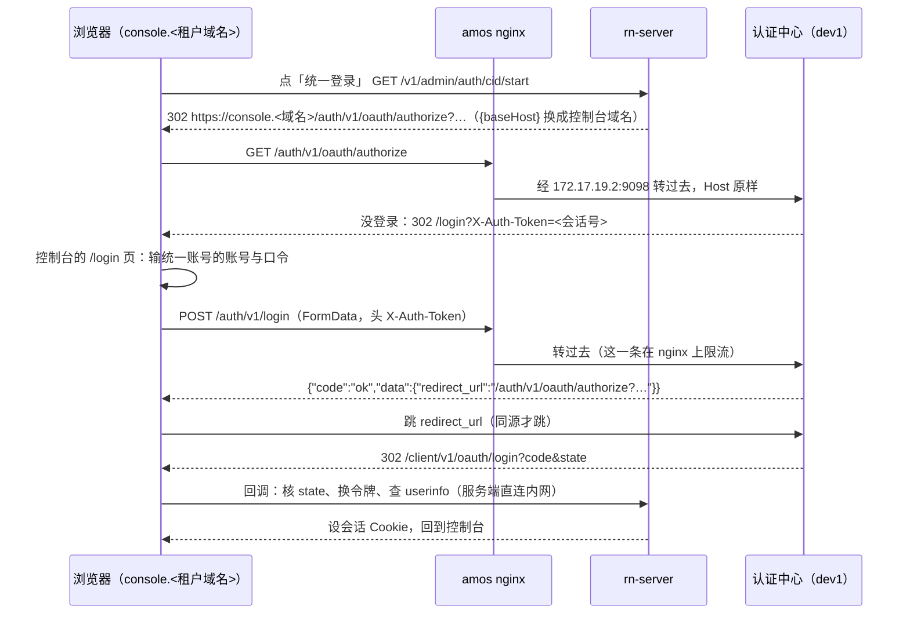

# 平台管理员也进账号表、走统一登录；登录页放进控制台（2026-09-27）

> 状态：发布 1 已上线（2026-09-27）。其中建号、初始口令、绑定、建号命令、控制台里平台管理员的增删改，已被 [console-accounts-external-maintenance-2026-09-27.md](console-accounts-external-maintenance-2026-09-27.md) 取代：账号改由外部系统写入，RN 只鉴别。发布 2（删环境变量账号）在外部系统写好第一条平台管理员记录并验收之后做。前置文档：[tenant-console-accounts-and-sso-2026-09-25.md](tenant-console-accounts-and-sso-2026-09-25.md)（下称「账号设计」）。

## 1. 用户的决定（2026-09-27）

1. `tenant_admin_accounts` 加一个标识，区分租户成员与平台管理员；平台管理员也走统一登录。
2. **环境变量里的管理员账号（`ADMIN_USERNAME` / `ADMIN_PASSWORD_HASH`）完全删掉**，不留口令登录。
3. **同一个统一账号不能既是平台管理员、又是某个租户的成员**。
4. **登录页放进控制台**：不再跳 `login.dexfun.win`，在 `console.<租户域名>/login` 上输统一账号的账号口令（认证中心「挂在应用域名下」的部署方式，账号设计 §4.7）。

## 2. 现状

| | 现在 |
| --- | --- |
| 平台管理员 | 环境变量里唯一的一个账号，口令哈希写在 `/etc/rn-foundation.env`；登录后是**平台会话**（`admin_sessions.tenant_id` 为 NULL） |
| 能不能进平台维护 | 平台会话 + actor 在 `PLATFORM_ADMIN_USERNAMES` 里（`requirePlatformAdmin`） |
| 二次验证 | 平台会话不用（理由：没有邮箱，口令只在平台手里） |
| 租户成员 | `tenant_admin_accounts`，初始口令 → 绑定统一账号 → 只走统一登录 |
| 统一登录 | 授权与退出在 `https://login.dexfun.win`（集中登录域名，与 pm 跨域名单点登录）；换令牌与 userinfo 走 dev1 内网入口 `http://172.17.19.2:9098` |
| 自动化 | `x-admin-key`（`ADMIN_API_KEY` + `ADMIN_API_ACTOR`），不落会话，按平台会话处理；amos 上发 OTA 的脚本在用 |
| 生成口令哈希的页面 | 平台维护里有一页专门给 `ADMIN_PASSWORD_HASH` 算哈希（`platform_password.go`、RN-Admin `admin-password-page`） |

## 3. 设计

### 3.1 账号表

`tenant_admin_accounts` 加一列，平台账号不属于任何租户：

```sql
ALTER TABLE tenant_admin_accounts
  ADD COLUMN scope VARCHAR(16) NOT NULL DEFAULT 'tenant'
    COMMENT 'tenant=租户成员（tenant_id 必填，只能在这个租户的控制台域名上登录）；platform=平台管理员（tenant_id 为 NULL，任何控制台域名都能登录）' AFTER id,
  MODIFY tenant_id BIGINT UNSIGNED NULL COMMENT '所属租户 tenants.id；平台管理员为 NULL',
  ADD COLUMN tenant_key BIGINT UNSIGNED AS (IFNULL(tenant_id, 0)) STORED
    COMMENT '唯一键用：平台账号记作 0。MySQL 唯一索引不比较 NULL，直接建在 tenant_id 上平台账号之间查不出重复。由数据库生成，无人写入',
  ADD CONSTRAINT ck_tenant_admin_scope CHECK ((scope = 'platform' AND tenant_id IS NULL) OR (scope = 'tenant' AND tenant_id IS NOT NULL)),
  DROP INDEX uq_tenant_admin_login, ADD UNIQUE KEY uq_tenant_admin_login (tenant_key, login_name),
  DROP INDEX uq_tenant_admin_idp,   ADD UNIQUE KEY uq_tenant_admin_idp (tenant_key, idp, idp_subject),
  ADD KEY ix_tenant_admin_subject (idp, idp_subject);
```

- 平台账号的 `tenant_id` 用 NULL，而不是某个特殊租户 id：所有租户查询都带 `tenant_id=?`，天然查不到平台账号，不会被误当成某个租户的成员。
- 表名不改（`tenant_admin_accounts` 已经在迁移、代码、文档里到处都是）；表注释改成「控制台账号：租户成员与平台管理员」。
- 迁移 63，只加列、放宽 NULL、换唯一键；已有的行全部是 `scope='tenant'`，行为不变。

### 3.2 会话与判据

- 平台账号登录出的会话：`tenant_id` 仍为 NULL（沿用「平台会话」的判据，账号设计 §3.4 的租户隔离一行都不用改），`account_id` 填上；actor 记作 `platform:<账号 id>`，与租户账号的 `tenant:<租户>:<账号>` 分开。
- 每个请求都回表查账号状态（与租户账号一样），停用立即生效。
- **平台管理员的判据**改成：平台会话，且（a）有账号 → 账号是 `scope='platform'`、状态 `active`；（b）没有账号（只剩 `x-admin-key`）→ 照旧看 `PLATFORM_ADMIN_USERNAMES`。
- 平台会话在任何租户的控制台域名上都有效（与现在一样）；租户会话仍只在自己租户的域名上有效。
- 待绑定（`pending_bind`）的平台账号与租户账号一样，只能走会话、登出、二次验证与绑定那几条接口。

### 3.3 登录



- **初始口令登录**（只给待绑定的账号）：先按登录名找平台账号，找不到再找这个域名所属租户的成员。为了不出现歧义，平台账号的登录名全局唯一，并且**不能与任何租户成员的登录名相同**（两边建号时互相检查）。
- **统一登录回调**：按统一账号 id 先找平台账号，再找这个租户的成员。第 1 节第 3 条保证两者不会同时存在，先后顺序只是写法。
- 平台管理员在哪个控制台域名上登录都行：三个控制台域名都已在认证中心登记回调地址。

### 3.4 同一个统一账号不能有双重身份

- 绑定确认时，在同一个事务里 `SELECT … FROM tenant_admin_accounts WHERE idp=? AND idp_subject=? FOR UPDATE`（走新加的 `ix_tenant_admin_subject`）：
  - 绑平台账号：这个统一账号已经是**任何**租户的成员 → 拒绝（`cidError=already_member`）；
  - 绑租户成员：它已经是平台管理员 → 拒绝（`cidError=already_platform`）。
- `FOR UPDATE` 在可重复读下会锁住这个索引区间，两边同时绑定同一个统一账号时后一个会等前一个提交，不会双双通过。
- 已经存在的双重身份（目前没有：线上只有一个租户成员 fuyu，还没有平台账号）不自动处理。

### 3.5 二次验证要收紧

「口令只在平台手里」这个理由不成立了：统一账号口令泄露，拿到的就是整个平台。所以平台账号**也要**过邮箱二次验证，范围比租户成员大：

- 账号设计 §4.5 里已经要求二次验证的敏感操作；
- `/v1/admin/platform/*` 下所有的写操作（扫链、打包机、统一登录配置、邮件发送、批准打包机版本……）；
- 控制台成员与平台管理员的建号、停用、重置；
- 发起绑定之前（与租户成员一样）。

`x-admin-key` 不受影响（自动化，没有人可以收验证码）。

### 3.6 建号与第一个平台账号

- **界面**：平台维护 › 控制台成员加一栏「平台管理员」，列表、建号、停用、重置与租户成员相同，都要二次验证、写审计。不能停用自己，也不能停用最后一个可用的平台管理员（防止把平台锁死）。
- **第一个平台账号**：环境变量账号删掉之后没有人能在界面上建第一个，所以加一条命令，在 amos 上由有 root 的人执行：

  ```bash
  # 与服务同一个用户、同一份 EnvironmentFile；不在 shell 里 source /etc/rn-foundation.env（值里有特殊字符时
  # bash 报错会把整行连口令打出来，09-13 真出过事）
  run() { sudo systemd-run --quiet --pipe --wait -p User=rnfoundation -p EnvironmentFile=/etc/rn-foundation.env /opt/rn-foundation/rn-server "$@"; }
  run admin platform-account create --login <登录名> --email <邮箱> --name <显示名>
  run admin platform-account reset  --login <登录名>   # 找回：回到待绑定，重新给初始口令
  ```

  初始口令**只打印到执行者的终端**一次（不进日志、不进审计，审计只记「谁在命令行建了账号」）。

### 3.7 删掉环境变量账号

- 删掉：`ADMIN_USERNAME`、`ADMIN_PASSWORD_HASH` 两个配置项（及生产环境必填检查、`rn-server config` 里的两行）、登录接口里平台账号那条路、生成口令哈希的接口与 RN-Admin 的那一页、建租户成员时「登录名不能等于 ADMIN_USERNAME」的检查。
- 保留：`ADMIN_API_KEY` / `ADMIN_API_ACTOR` / `ADMIN_API_ALLOWED_IPS`（自动化）；`PLATFORM_ADMIN_USERNAMES` 只剩给自动化 actor 判平台管理员用，配置参考里写明。
- 代价（用户已接受）：**认证中心停摆时，所有人都登不进 RN 控制台**，平台管理员也一样；恢复办法是修好认证中心。`x-admin-key` 的脚本不受影响。

### 3.8 登录页放进控制台

- **RN 的统一登录配置**：授权地址改成 `https://{baseHost}/auth/v1/oauth/authorize`，退出地址改成 `https://{baseHost}/auth/v1/logout`；换令牌与 userinfo 不变（内网入口）。代码已经支持 `{baseHost}`（RN 发起时传控制台域名），只改配置。
- **amos nginx**（控制台的公共片段）：

  ```nginx
  # 认证中心挂在控制台域名下：/auth/v1/* 经 dev1 的内网入口转给认证中心，Host 原样
  # （认证中心按 Host 认应用与域名，没登录时把浏览器送回 https://<Host>/login）
  location ^~ /auth/v1/ {
      proxy_pass http://172.17.19.2:9098;
      proxy_set_header Host              $host;
      proxy_set_header X-Forwarded-Proto https;
      proxy_set_header X-Forwarded-For   $proxy_add_x_forwarded_for;
  }
  # 口令登录接口单独限流。amos 看不到真实客户端 IP（公网入口是网关按 SNI 转发的 TCP，access log 里只有一个来源），
  # 所以按 IP 的限流实际是全局的：每分钟 60 次、突发 20
  location = /auth/v1/login {
      limit_req zone=rn_cid_login burst=20 nodelay;
      limit_req_status 429;
      proxy_pass http://172.17.19.2:9098;
      proxy_set_header Host              $host;
      proxy_set_header X-Forwarded-Proto https;
      proxy_set_header X-Forwarded-For   $proxy_add_x_forwarded_for;
  }
  ```

  `/login` 单独一个 location：在本 location 里直接出 `index.html`（`try_files /index.html =404`，第一个参数是文件就不会内部跳转），带上严格 CSP 与 `X-Frame-Options: DENY`。顺带发现：`location = /index.html` 写了 `add_header Cache-Control`，按 nginx 的规则 server 级的三个安全头就不再继承，控制台的 HTML 一直没带 `X-Frame-Options` 等——这次在那里补上。dev1 的内网入口已经原样透传 Host 与 `X-Forwarded-Proto`，只放行 amos，只转 `/auth/v1/*` 与 `/internal/v1/userinfo`，不用改。RN 自己的 Cookie 路径都在 `/v1/admin`、`/client/v1/oauth/login` 下，不会带到 `/auth/v1/`。
- **RN-Admin 的 `/login` 页**：地址上有 `X-Auth-Token` 时显示「统一账号登录」表单（账号或邮箱、口令），用 FormData 交给同源的 `/auth/v1/login`（请求头带 `X-Auth-Token`、`remember_me=false`、`lang` 按界面语言），成功后**只跟随同源的** `redirect_url`，别的一律当异常；失败显示认证中心给的原因。口令不存、不进日志。写法照 `cid-local/login-page/login.js` 与 SDK 的示例应用。
- **代价**：
  - 与 pm 之间的跨域名单点登录没了（pm 继续用 `login.dexfun.win`），每个控制台域名也要各登一次；
  - 统一账号的口令现在经过控制台页面：控制台一旦有 XSS，拿到的就不只是控制台会话，还有统一账号口令。控制台目前没有 CSP，这一版给 `/login` 这一页加上严格的 `Content-Security-Policy`（只许同源脚本与请求）。

## 4. 切换分两步，防止锁死

第 1 节第 2 条要求删掉环境变量账号，但**不能和新账号上线放在同一次发布里**：新平台账号要先在线上建好、绑好、用统一登录进过平台维护，才能拆掉旧入口，否则中间哪一步不通就没人进得去。

| 步骤 | 内容 | 谁做 |
| --- | --- | --- |
| 发布 1 | 3.1–3.6、3.8 的代码（平台账号、二次验证、控制台登录页、建号命令）；环境变量账号**暂时还能登** | 我写，用户合并 |
| nginx | 控制台加 `/auth/v1/` 转发与限流 | 用户在 amos 上以 root 执行 |
| 配置 | 平台维护 › 统一登录：授权与退出地址改成 `{baseHost}` | 我改（先问） |
| 建号 | 在 amos 上执行建号命令建用户自己的平台账号 → 初始口令登录 → 二次验证 → 在控制台的登录页登统一账号 → 确认绑定 → 用统一登录进平台维护验收 | 用户 |
| 发布 2 | 3.7：删掉环境变量账号的代码 | 我写，用户合并 |
| 收尾 | 从 `/etc/rn-foundation.env` 删掉 `ADMIN_USERNAME`、`ADMIN_PASSWORD_HASH` | 用户在 amos 上以 root 执行 |

两次发布都不改 `go.mod` 与打包机的构建输入，**打包机不用重签**。

## 5. 改动面

- RN-Server：迁移 63；`admin_session.go`（登录、会话、判据）、`tenant_accounts.go`（平台账号的增删改查、登录名互斥）、`cid_login.go` 与 `cid_bind_code.go`（回调找账号、双重身份检查）、`second_factor.go` 与 `server.go`（平台账号的二次验证范围）、`cmd/server`（建号命令）；发布 2 删 `platform_password.go` 与配置项；库测覆盖平台账号的建号、绑定、登录、二次验证、停用、互斥、最后一个平台管理员。
- RN-Admin：控制台成员页的「平台管理员」一栏；`/login` 统一账号登录页；会话视图的平台管理员判据；发布 2 删口令哈希页。
- 部署：`deploy/amos/nginx-snippet-console.inc` 与 `nginx-rn-foundation.conf`（限流 zone）。
- 文档：`docs/CONFIGURATION.md`、`docs/database/ADMIN_ACCOUNTS_SCHEMA.md`、账号设计的实施记录、新 ADR（平台管理员进账号表、去掉环境变量账号）。

## 6. 残留风险

- 认证中心是 dev1 上的单实例，经 Cloudflare 隧道对外（换令牌走内网，不经隧道）：它停摆 = RN 控制台全员登不进（用户已接受）。
- 认证中心本身没有登录失败锁定，只靠 nginx 限流；而 amos 看不到真实客户端 IP，限流实际是全局的（每分钟 60 次）：挡得住高速撞库，挡不住慢速的，还可能被人故意打满、让正常用户一时登不进；要靠邮箱二次验证兜底。
- 控制台页面经手统一账号口令（3.8）。

## 7. 发布 1 实施记录（2026-09-27）

RN-Server 分支 `feat/platform-accounts`、RN-Admin 分支 `feat/platform-accounts`，都从各自的 origin/main 开。

**与上面设计不一样的地方**：

| 设计里写的 | 实现 | 理由 |
| --- | --- | --- |
| nginx 按 IP 限流，每分钟 20 次 | 全局每分钟 60 次、突发 20 | amos 看不到真实客户端 IP（网关按 SNI 转发 TCP），按 IP 等于全局；20 次太容易被人打满 |
| 控制台成员页加一栏「平台管理员」 | 平台维护里单独一页「平台管理员」，与控制台成员同一个组件 | 成员页管的是当前域名的租户，平台管理员不属于任何租户，放一页里容易看错 |
| 没提 | 有平台账号时不能删发信配置（409 `MAIL_REQUIRED_FOR_SECOND_FACTOR`） | 平台账号做写操作都要邮箱二次验证，删了发信就再没人能改回来（只剩服务器上的管理密钥） |
| 没提 | 平台账号相关的审计动作用 `platform_account_*` 前缀，记在平台（`tenant_id=0`） | 与租户成员的 `tenant_account_*` 分开，审计页按租户过滤时不会混进来 |
| 没提 | 顺带补上控制台 `index.html` 一直缺的 `X-Frame-Options` 等安全头 | `location = /index.html` 写了 `add_header`，nginx 就不再继承外层的三个安全头 |
| 没提 | 验证码与绑定通知邮件里「成员账号」改成中性的「账号」 | 平台管理员也收这些邮件 |

**验证**：

- RN-Server：`gofmt`、`go vet ./...`、不连库的包 `go test -race` 全过；`internal/api` 与 `internal/store` 库测在独立测试库上除 7 条 keystore 用例外全过——那 7 条在未改动的代码上用同样参数（`-race`）同样失败，是本机 `-race` 下列 keystore 超过请求时限，与本改动无关。新增 `TestDBPlatformAccounts`（建号命令、任何域名的初始口令登录、绑定、统一登录后的平台会话、写操作要二次验证、双重身份在回调与确认两处都挡住、不能动自己与最后一个、发信配置保护、命令行重置）连跑三遍一致。
- nginx 模板：本机起了一份，实测 `/login` 的 CSP 与 `X-Frame-Options: DENY`、首页补上的安全头、`/auth/v1/` 转发、登录接口第 22 次开始 429。
- 认证中心挂在应用域名下：在 dev1 上模拟 amos 转发（`Host: console.anyfun.win`、`X-Forwarded-Proto: https`）用测试账号走了一遍：没登录 → 302 `https://console.anyfun.win/login?X-Auth-Token=…`；登录接口回 `{"code":"ok","data":{"redirect_url":"https://console.anyfun.win/auth/v1/oauth/authorize?…"}}`；跟过去 → 302 回 `https://console.anyfun.win/client/v1/oauth/login?code&state`。口令错回 `{"code":"401","msg":"Bad credentials"}`。认证中心在控制台域名上设 `X-Auth-Token`、`XSRF-TOKEN` 两个 `Path=/` 的 Cookie，与 RN 的 Cookie 不重名。
- RN-Admin：`pnpm check` 全过（58 个测试文件、706 项）。
- 两次提交都不改 `go.mod` 与打包机构建输入，打包机不用重签。

**上线步骤**（第 4 节表格的前四步）：合并两个 PR → 用户在 amos 上装 nginx 的两个文件（`rn-foundation.conf`、`rn-foundation-snippet-console.inc`）→ 统一登录配置的授权与退出地址改成 `https://{baseHost}/auth/v1/…`（写线上配置，先问）→ 用户在 amos 上执行建号命令建自己的平台账号、绑定、用统一登录进平台维护验收。之后再做发布 2。

