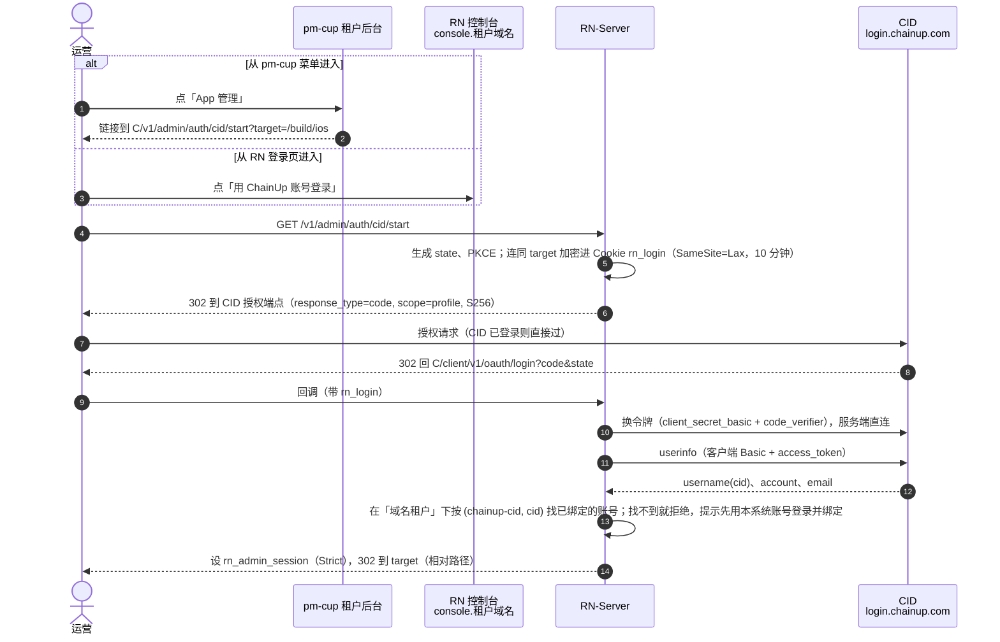
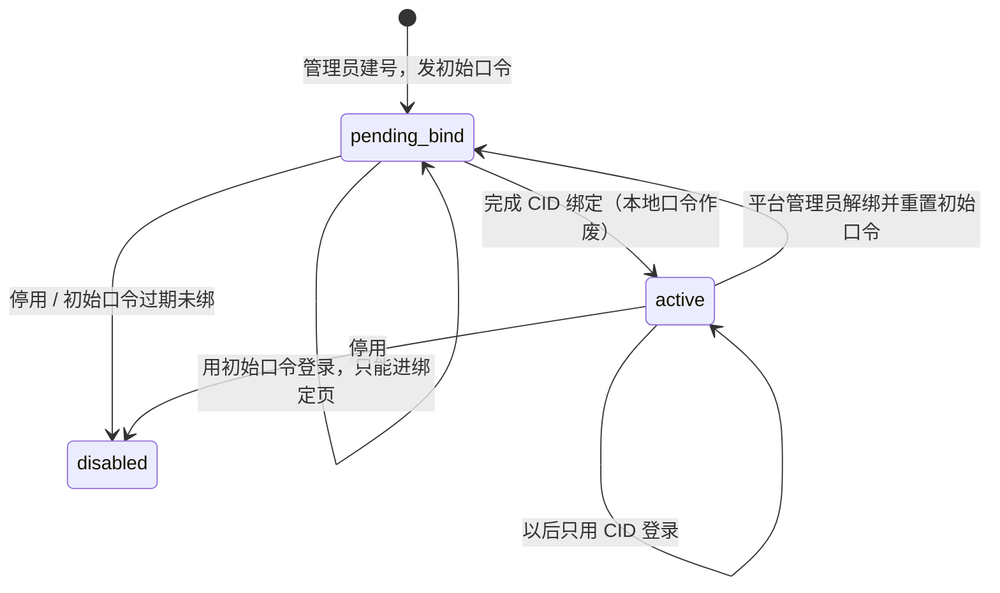

# 租户控制台账号与统一认证（ChainUp 认证中心）（2026-09-25）

## 0. 结论

背景：

- RN 控制台要有租户账号。这是签名材料、推送凭据改由租户自己交的前提，见 `ios-tenant-owned-signing-material-2026-09-25.md`。
- 用户要求以后和预测市场平台 **pm-cup2026 的租户端**打通，建议用单点登录。
- 用户又指出：`/home/ubuntu/fy/work/web3-rwa` 已经集成了公司的「统一认证」。问能不能把它作为认证服务端，让 pm-cup、RN 与 web3-rwa 一样，作为统一认证下的子业务接入。

结论：**可以，推荐这样做。** 它比初稿里「pm-cup 自己当 OIDC 身份提供方」更合适（初稿的比较留在 §2）。

1. **那个平台是公司自研的 ChainUp 认证中心（下称 CID）**：
   - 生产环境 `login.chainup.com`，测试环境 `auth-server.dw2nn.com`；
   - web3-rwa 的**商户后台**已经这样接了：一个应用登记、按域名区分商户、权限在本地；
   - 这套模型和 RN、pm-cup「按域名分租户、权限在本地」完全一致。
2. **好处**：
   - pm-cup 不用自己造一个身份提供方，只要像 web3-rwa 一样接 CID；
   - RN 不再依赖 pm-cup 登录的安全度：pm-cup 那几处登录问题（§8）仍该修，但不再是 RN 的前提；
   - 一个运营用一个账号走 RN、pm-cup、web3-rwa；
   - CID 是公司已有、有人运维的服务，以后别的产品也能接；
   - anyfun 这类不接预测平台的租户，同样可以用 CID 登录。
3. **它不是 OIDC，只能回答「这个人是谁」**：
   - 协议是 OAuth2 授权码 + PKCE，scope 只有 `profile`，没有 id_token 和 JWKS；
   - RN 后端拿授权码换 access token，再调 userinfo，得到 `username`（账号 uuid，即 cid）与 `email`（09-26 源码核对：没有 `account` 字段，§4.9）；
   - 由此带来三点：
     - **租户归属与角色由各系统自己管**：RN 本地维护「哪个 cid 是哪个租户的什么角色」，与 web3-rwa 的 `tenant_admin(tenant_id, cid)` 同一个做法；
     - **不自动开户**：先由管理员在本系统建账号，本人用这个账号登录后绑定 CID 账号，之后只走 CID（用户 09-25 提出的方案，§4.3）；
     - **敏感操作用 RN 自己的 TOTP 再验证**：CID 不告诉我们对方登录时用了几个因素、何时登录的。
4. **RN 与 pm-cup 的租户对应不经过 CID**。同一个人在两边各自被授权；RN 对 pm-cup 的业务数据关联仍用 `services.predict.scopeId`，登录不用它。
5. **RN 与 pm-cup 建议登记成两个应用**。用户提议当成同一个应用、按域名区分，技术上能行（web3-rwa 自己就是一个应用配所有商户域名），但有两个坑（§4.6）：
   - 「按域名放行」从 web3-rwa 的用法看是**整份覆盖**：同一个人被两个系统各推一次域名清单，后推的会冲掉先推的；
   - client_secret 与管理凭据要两个团队共用。
   分成两个应用，单点登录的体验没有区别：CID 的登录态在 `login.chainup.com` 上，登一次，两边都能进。
6. **要认证中心团队给几样东西、答几个问题**（§6）。最关键的是：
   - CID 没有自助注册（web3-rwa 是用管理接口按邮箱替人开号）；
   - 「按域名放行」要不要逐人绑定，是覆盖还是追加；
   - 能不能给 RN 一个只管本应用的受限凭据。
   这几条决定「登录后引导绑定」能不能让用户自己一步做完。
7. **本地账号的两种用途**：
   - 平时只是绑定 CID 之前的过渡：绑定之后本地口令作废；
   - 应急账号（平台建、强制 TOTP、不绑定，CID 不可用时用）后续再加（用户 09-25）；
   - 账号模型、本地登录、授权改造都不依赖 CID，可以先做（阶段 S0）。
8. **CID 有两种部署方式，体验不一样**（§4.7，09-25 用户给出测试环境配置后确认）：
   - 集中登录域名：跨应用单点登录；
   - 挂在应用域名下（web3-rwa 测试环境就是这种）：各应用用自己的登录页，同一个账号，但每个域名要各登一次。
   RN 用哪种，要和 CID 团队定。
   2026-09-26 给认证中心加了「同父域名共享登录态」（§4.9）：挂在应用域名下时，只要 RN 控制台与 pm 商户后台在同一个父域名下，也能登一次两边都进。
9. **SDK 已写好并用模拟 CID 跑通两种方式**：`/home/ubuntu/fy/work/cid-go-sdk`（只依赖标准库，RN 与 pm 都能用），附两个示例应用。拿到真应用就能联调（§4.8）。
10. **开发期先用我们自己部署的认证中心**（用户 2026-09-26）：认证中心源码已在 `web3-rwa/authorization-center`，在 dd 上部署了一套，示例应用已对它跑通绑定、跨域名免登、退出联动（§4.9）。S2 不再等 CID 团队登记应用。

## 1. 现状

| | RN 控制台 | pm-cup2026 租户端 | web3-rwa 商户后台 |
| --- | --- | --- | --- |
| 账号 | 只有一个：环境变量 `ADMIN_USERNAME`，同时是平台管理员（`server.go:709`） | `tenant_admin(tenant_id, email)`，bcrypt 口令（`schema.sql:363-381`） | `tenant_admin(tenant_id, cid)`，**登录交给 CID**，查不到本地记录就 401（`TenantFilter.java:63-81`） |
| 登录 | 用户名 + 口令 | 口令 + 人机验证 → 临时令牌 → 邮件验证码（`service/auth.go:159-400`） | CID：OAuth2 授权码 + PKCE（`SecurityConfig.java:116-152`） |
| 会话 | 服务端会话表；Cookie HttpOnly、SameSite=Strict、Path=/v1/admin（`server.go:725`） | HS256 JWT 存 localStorage，无吊销 | Redis 会话 |
| 权限 | 只分平台 / 非平台，按用户名判（`chain_scan_admin.go:26-48`） | 角色 → 菜单 → 权限码 | 本地 `role_ids` → 权限码 |
| 租户解析 | 按 Host | 按前端塞的 `X-Tenant-Domain` 头（经 Next rewrite 转发，后端看不到原始 Host） | 按域名 |

CID 的能力（09-25 从 web3-rwa 与 `authorization-java-sdk` 看到的；09-26 拿到服务端源码后核对的结果见 §4.9）：

- 端点：
  - 授权 `…/auth/v1/oauth/authorize`，支持 `{baseHost}` 占位符，疑似能按租户域名白标；
  - 换令牌 `…/auth/v1/oauth/token`，客户端认证方式 `client_secret_basic`；
  - userinfo `…/internal/v1/userinfo`：用客户端 Basic 认证 + 表单里的 access_token，不是标准的 Bearer；
  - 登出 `…/auth/v1/logout?back=`（`oauth-sdk-application.yml:18,42-48`）。
- 应用登记：`/admin/v1/applications {clientName, domain}` 返回 client_id / secret。
- 按域名放行：`/admin/v1/applications/{name}/bind-domains [{account, domains}]`，给每个人推一份允许登录的域名。
  web3-rwa 默认绑「租户主域名 + `console.` 前缀」（`TenantDomainServiceImpl.java:170-224`）。
- **没有自助注册**：web3-rwa 添加商户管理员时，用管理接口 `POST /admin/v1/users` 按邮箱替人开号，拿到 cid 再推域名（`chainup-tenant/.../AdminController.java:349-381`）。
- **按域名放行疑似整份覆盖**：web3-rwa 每次从自己库里算出这个人的**完整**域名清单再推，没有域名时推空清单（`TenantDomainServiceImpl.java:170-224`）。服务端源码不在本机，要向 CID 团队确认。
- 管理接口（建用户、绑域名）用的是一个**能管所有应用和所有用户的超级账号**（`BaseController.java:32-42`）。
- 看不到的：二次验证、登录时间 / 认证方式的回传、后台登出通知、SLA。

## 2. 方案比较

| 方案 | 结论 | 理由 |
| --- | --- | --- |
| **CID 作统一认证，RN、pm-cup、web3-rwa 都是子业务** | **推荐** | 公司已有、有人运维；模型与三个系统一致；pm-cup 改动最小；RN 不再受 pm-cup 登录安全度牵连 |
| pm-cup 租户端作 OIDC 身份提供方（初稿方案） | 不再推荐 | pm-cup 要新建整套 OP 端点，还要先修登录漏洞；OP 拿不到可信的原始主机名（经 Next rewrite 转发）；pm-cup 平台运维能改任何租户管理员的邮箱和口令（`tenant_ext.go:686,738`），等于能进任何租户的 RN 控制台 |
| 另起独立身份平台（Keycloak / Zitadel / Logto 等） | 不采用 | 公司已有 CID，再起一套是重复建设 |
| 共享 Cookie / 自定义签名跳转 / SAML | 不采用 | 域名不同、非标准或太重（初稿已比较） |

CID 不是 OIDC 的代价：
- RN 要写一段 OAuth2 + CID userinfo 的接入代码（Go，没有现成 SDK，用 `golang.org/x/oauth2` 加一次自定义 userinfo 调用）；
- 拿不到签名的身份令牌，身份靠「后端直连 CID 换令牌、查 userinfo」来保证。这是机密客户端的标准做法，令牌不经过浏览器。

以后 CID 如果支持 OIDC，RN 换成标准 OIDC 即可，账号模型不变。

## 3. RN 租户账号

### 3.1 复用映射

| 初稿里拟新增 | 处理 | 理由 |
| --- | --- | --- |
| `tenant_admin_accounts` 租户账号表 | **新建** | 「控制台上的人」是新实体：一个租户多个人，登录时要按 (租户, cid) 查找，有状态、角色、绑定；`app_configs` 一键一行的 JSON 承载不了按人查找与唯一约束 |
| `tenant_admin_identities` 外部身份表 | **取消，合并进账号表** | 一个账号只绑一个外部身份，两列（`idp`、`idp_subject`）加唯一键即可 |
| 邀请表 | **取消** | 用「初始口令 + 待绑定」代替邀请链接（§4.3）：还没绑定的账号就是 `status=pending_bind` 的账号，不需要另一张表 |
| 登录流程临时状态表（state、PKCE） | **取消，用加密 Cookie** | 10 分钟、一次性、只有发起它的浏览器用；用 `secretbox` 加密后放进 Cookie，不落库 |
| CID 客户端配置 | **复用 `app_configs`**，`tenant_id=0`、键 `auth.cid` | 平台级一份，secret 用 `secretbox` 加密 |
| 每租户登录方式 | **复用 `app_configs`**，键 `auth.login` | 租户级配置，一键一行 |
| 会话 | **复用 `admin_sessions`**，加列 | 见 §3.3 |
| 审计 | **复用 `audit_events`** | actor 用 `tenant:<租户id>:<账号id>` |

### 3.2 账号表（草案）

```sql
CREATE TABLE tenant_admin_accounts (
  id BIGINT UNSIGNED NOT NULL AUTO_INCREMENT COMMENT '账号主键；审计 actor 用它，不用显示名',
  tenant_id BIGINT UNSIGNED NOT NULL COMMENT '所属租户 tenants.id；一个账号只属于一个租户',
  display_name VARCHAR(120) NOT NULL COMMENT '显示名，添加成员时填写，仅用于界面',
  login_name VARCHAR(64) NOT NULL COMMENT '本地登录名，建号时填写，租户内唯一；成员绑定 CID 后不再用于登录',
  email VARCHAR(255) NOT NULL COMMENT '建号时填写的邮箱，用于界面显示、通知，以及按邮箱替人开 CID 号；不作登录依据、不唯一',
  kind VARCHAR(16) NOT NULL COMMENT 'member=普通成员（必须绑定 CID）；break_glass=平台建的应急账号（不绑定、只用本地口令 + TOTP）',
  idp VARCHAR(32) NULL COMMENT '外部身份源：chainup-cid；NULL=尚未绑定，或应急账号',
  idp_subject VARCHAR(120) NULL COMMENT 'CID userinfo 的 username（cid）；绑定后不变，换绑要先由平台管理员解绑',
  status VARCHAR(16) NOT NULL COMMENT 'pending_bind=只能用初始口令登录且只能去绑定页；active=可登录（成员只走 CID，应急账号只走本地）；disabled=已停用（会话立即失效）',
  password_hash VARCHAR(255) NULL COMMENT 'scrypt。成员：初始口令，绑定成功后置 NULL；应急账号：长期口令',
  password_expires_at DATETIME(3) NULL COMMENT '成员初始口令的过期时间（UTC，建号后 72 小时）；NULL=应急账号或已绑定',
  totp_secret_enc VARBINARY(255) NULL COMMENT 'TOTP 密钥（secretbox 加密）；NULL=尚未登记，首次登录强制登记',
  created_by VARCHAR(120) NOT NULL COMMENT '添加人 actor',
  created_at DATETIME(3) NOT NULL COMMENT '创建时间（UTC）',
  last_login_at DATETIME(3) NULL COMMENT '最近登录时间（UTC）；NULL=从未登录',
  PRIMARY KEY (id),
  UNIQUE KEY uq_account_login (tenant_id, login_name),
  UNIQUE KEY uq_account_idp (tenant_id, idp, idp_subject),
  KEY ix_account_tenant (tenant_id, status)
) ENGINE=InnoDB COMMENT='租户控制台账号：平台或租户 admin 添加，RN-Server 登录与授权时读';
```

- 唯一键是 (租户, idp, subject)：同一个 cid 可以分别是 anyfun 和 predict 的成员，各算一个账号、各有角色；同一个租户里一个 cid 只能绑一个账号。
- 不以 email 作用户名或唯一键：pm-cup 与 CID 的 email 都能改，拿它当身份会接错人。
- 平台管理员照旧是环境变量里那一个，不进这张表。

### 3.3 会话与授权

- `admin_sessions` 加列：
  - `role`（platform / tenant）；
  - `tenant_id`（平台会话为 NULL）；
  - `account_id`；
  - `auth_method`（local / cid）；
  - `second_factor_at`：最近一次在 RN 输入 TOTP 的时间，§4.5 用。
- **平台权限按会话角色判**：条件是 `role=platform 且 tenant_id IS NULL`，不再按用户名。
- **租户校验**：在 `current` 路由组里、`domainTenantScope` 之后加中间件（`server.go:337-338`），要求会话租户等于域名租户，否则 403。
- `authenticate()` 每次请求都查账号状态：停用立即生效。
- **先不分角色**（用户 09-25）：租户账号在本租户范围内都能操作。以后加只读角色时，要按路由白名单放行，不能只放行 GET——有几个 GET 会给出敏感东西：
  - 导出签名密钥密文（`server.go:471`）；
  - 下载签名后的 .ipa（`:438`）；
  - 原始诊断日志（`:368`）；
  - 钱包用户（`:372-373`）。
- Origin：现在任何租户域名都算可信（`server.go:604-633`），改成 Origin 所属租户必须与 Host 的租户相同。
- 会话时长沿用现在的 8 小时（`config.go:124` 默认 28800 秒），另加 1 小时空闲超时。

### 3.4 开放之前要审的现有租户接口

- `GET /v1/admin/ios/delivery` 返回同 Team 其它租户的 slug（`ios_delivery.go:330,343`）→ 改为只返回布尔值。
- 任务视图带打包机名字 → 对租户只显示机器类型。
- `repoDirectory`（`build_config.go:190-245`）→ 收归平台管理员。
- `release.ios` 的 bundle id 跨租户不唯一 → 保存时拒绝别的租户已经在用的。
- `services.predict.scopeId` 现在租户能改（`PATCH /app-config`，`server.go:1366-1379`），服务端保存时只校验格式，回读核对只在可选的「测试连接」里做 → 收归平台管理员，或者保存时强制回读。
- 推送凭据的租户视图带出平台那一行的字段，「测试」会改写平台那一行（见签名材料设计 §5）。
- 其余接口逐个过一遍，结论记进实现 PR。

### 3.5 控制台

- **登录页**：主按钮「用 ChainUp 账号登录」；下面是「还没绑定的，先用本系统账号登录」。
  - 如果 CID 用「挂在应用域名下」的方式（§4.7），RN-Admin 要新加一个 `/login` 路由：地址上带 `X-Auth-Token` 时显示 ChainUp 账号登录表单，交给同域名的 `/auth/v1/login`。现在 RN-Admin 没有 `/login` 路由，没登录时是在原页面上直接显示登录框。
- **成员页（只有平台管理员能用，用户 09-25 定）**：
  - 添加成员：填显示名、登录名、邮箱，生成初始口令（只显示一次，72 小时内有效）；
  - 停用；
  - 解绑并重置初始口令：本人的 CID 账号丢了或要换时用；
  - 列表显示绑定状态和最近登录时间。
- **CID 那一侧**：ChainUp 账号与应用在 RWA 平台端的「统一认证 › 应用管理 / 用户管理」页添加（用户 09-25 说明）；RN 不持有 CID 的管理凭据。
- **平台维护**：CID 客户端配置；每个租户的登录方式。
- **右上角**：显示当前账号、所属租户。

## 4. 接入 CID

### 4.1 流程



从 pm-cup 进来就是一个普通链接。两边共用 CID 的登录状态，所以用户无感。不需要 OIDC 的「第三方发起登录」，也不需要 pm-cup 给 RN 传任何令牌。

### 4.2 回调与 Cookie 的细节

- **回调地址**：`https://console.<租户域名>/client/v1/oauth/login`，按租户域名各一个，都要在 CID 登记（§6 第 1 条）。路径是认证中心固定的，不能自定义（09-26 源码核对，§4.9）；console.* 的 nginx 要把这个路径转给 RN-Server。
  nginx 把 console.* 的 `/v1/` 转给 RN-Server 时，Host 已改写成 api.*（`nginx-rn-foundation.conf:25-30`）。所以回调地址不从 Host 拼，而是取本租户登记的控制台域名。
- **只能从 console.* 发起**：
  - 后端分不清请求来自 console.* 还是 api.*（两者到后端时 Host 一样）；
  - 如果从 api.* 进入 start，`rn_login` 会设在 api.* 上，回调必然失败；
  - 解决：nginx 的 api.* 站点屏蔽 `/v1/admin/auth/cid/`。这要改 amos 上的 nginx，交给用户执行脚本。
- **Cookie**：
  - `rn_login` 是 HttpOnly、Secure、Path=/client/v1/oauth/login（在 start 的响应里设、回调时读），**SameSite=Lax**。从 CID 跳回是跨站的顶层导航，Strict 的 Cookie 带不过来；
  - 授权请求固定 `response_mode=query`（CID 若用 form_post，Lax 也带不过来）；
  - Cookie 名按 state 区分（`rn_login_<state 前 8 位>`），多个标签页同时登录不会互相覆盖；
  - 会话 Cookie 仍是 Strict：回调响应本身就能设下它（顶层导航的响应可以设任何 SameSite 的 Cookie），之后控制台页面的请求是同站的，照常带上。
- **跳转地址**：
  - `target` 只收本控制台的相对路径，拒绝以 `//`、`/\`、`/v1/` 开头的值；
  - 登录后与登出后的跳转一律用相对路径或登记的控制台域名，不用 `externalOrigin`——它拼出来的是 api.*（`server.go:344-348`）。
- **令牌**：access token 用完即弃，不存、不下发浏览器；userinfo 返回的 `username` 为空或格式不对就拒绝。

### 4.3 成员的添加与绑定（先用本系统账号登录，再绑定 CID）

这是用户 09-25 提出的方案：各系统先支持自己的账号登录，但必须绑定统一账号；没绑定的，登录后引导绑定；绑定之后直接走统一登录。
这是常见的「账号关联迁移」做法，对 pm-cup 尤其合适：它已经有一批 `tenant_admin` 账号，不用逐个替人开 CID 号再通知。



**添加**：租户 admin 或平台管理员建账号，填登录名、邮箱、角色，拿到初始口令（72 小时有效），交给本人。

**第一次登录**：
- 用登录名 + 初始口令登录，接着登记 TOTP；
- 这时的会话是「待绑定」状态：除了绑定页、会话查询、登出，别的接口一律 403。

**绑定**：
1. 本人在绑定页点「绑定 ChainUp 账号」；
2. RN 从**这个已登录的会话**发起一次 CID 授权：state 与本会话绑定，带 PKCE；
3. CID 登录后回调，RN 用授权码换令牌、调 userinfo 拿到 cid 和邮箱；
4. 页面显示「将绑定到 ChainUp 账号 ×××（邮箱）」，本人确认后才落库；
5. 落库时本地口令置空，状态变 active，写审计，并通知本租户的 admin。

**以后**：只能用 CID 登录。用登录名 + 口令登录会被拒绝，提示「请用 ChainUp 账号登录」。

**CID 账号从哪来**：CID 没有自助注册。
- 本人已有 CID 账号（例如已经在用 web3-rwa）：直接登录完成绑定——前提是 CID 不要求先给他绑定 RN 的域名；
- 没有 CID 账号，或者 CID 要求逐人放行域名：绑定页先让本人填邮箱，RN 用受限管理凭据按邮箱开号（已有则查出 cid），并放行本控制台域名，再跳去 CID 登录；
  回调拿到的 cid 必须与开号返回的一致，才算本人确实掌握这个 CID 账号；
- 拿不到受限凭据时，只能由平台管理员在 CID（或 web3-rwa 平台控制台的「统一认证」页）替他开号、放行，本人再来绑定；
- 不论哪种，**RN 都不持有那个能管所有应用的超级账号**。

**要防的**：
- **绑定 CSRF**：攻击者诱导受害者的会话，完成一次用攻击者 CID 账号的授权，于是受害者的 RN 账号绑到了攻击者名下。
  防法：state 绑定本会话；PKCE（攻击者的授权码配不上受害者的 verifier）；落库前显示 CID 账号并要本人确认。
- 发起绑定前 10 分钟内必须输过 TOTP。
- 初始口令 72 小时不绑就作废，要管理员重置。

**移除与换绑**：
- 在 RN 停用立即生效（每次请求都查账号状态）；CID 那边停用，下次登录就进不来；
- 本人的 CID 账号丢了或要换：只能由平台管理员「解绑并重置初始口令」，本人重新走一遍绑定。

**不自动开户**：用 CID 登录、但在这个租户下没有已绑定账号的人，一律拒绝。在 RN 停用的人，换个 cid 也进不来。

**应急账号**：`kind=break_glass`，平台建，只用本地口令 + TOTP，不绑定，不走上面的流程。

### 4.4 登出

删 RN 会话，然后跳到 CID 的 `…/auth/v1/logout?back=https://console.<租户域名>/`，CID 那边一起退出。
没有后台登出通知时，别的系统（pm-cup）的会话不受影响；这是 CID 的现状，§6 第 5 条问。

### 4.5 敏感操作再验证（RN 自己的 TOTP）

以下操作的后果比「看」大得多：

- 上传或删除签名材料、推送凭据、App Manager Key；
- 切换交付方式；
- 发版、热更新放量或回滚；
- 成员与角色管理。

CID 不回传登录时间和认证方式，所以 RN 自己做二次验证：

- 每个租户账号第一次登录时必须在 RN 登记 TOTP；
- 做敏感操作时，`second_factor_at` 必须在 15 分钟以内，否则弹框输验证码。

这样即便 CID 某个账号的口令泄露，也做不了敏感操作。以后 CID 如果能强制二次验证并回传认证时间，再考虑放宽。

### 4.6 RN 与 pm-cup 用一个应用还是两个

用户提议把 pm 和 RN 当成 CID 里的同一个应用，用不同的域名区分。

- **能行的部分**：web3-rwa 就是一个应用配所有商户域名，回调地址按请求域名变化（`redirect-uri: '{baseUrl}/client/v1/oauth/login'`），说明 CID 支持一个应用多个域名。
- **坑一：按域名放行疑似整份覆盖。**
  - web3-rwa 每次推的都是某个人的完整域名清单（§1）；
  - 两个系统共用一个应用时，同一个人被 RN 推一次 `[console.anyfun.win …]`、被 pm 推一次 `[pm 商户后台域名 …]`，后推的会冲掉先推的，这个人就登不进另一边；
  - 要共用，就得有一方统管两边的域名清单，或者 CID 提供追加 / 删除单个域名的接口。
- **坑二：凭据共用。**
  - 一个应用只有一份 client_secret 和一把管理凭据，两个团队各部署一份；
  - 一方泄露（pm-cup 仓库已经有机密进 git 的先例，§8），另一方也得跟着轮换；
  - pm 那边拿着管理凭据，能给任何人放行 RN 的域名。RN 本地还有成员核对挡着，但少了一层。
- **体验没有区别**：CID 的登录态在 `login.chainup.com` 上，与应用个数无关；登一次，两个应用都直接过。
- **结论**：推荐两个应用，只是多登记一次。如果 CID 团队更愿意用一个应用，先确认放行接口的语义，并定下由谁统管域名清单。

### 4.7 CID 的两种部署方式，RN 各要做什么

2026-09-25 用户给出 web3-rwa 测试环境的配置后确认：CID 的地址不是固定的，有两种部署方式。

| | 集中登录域名 | 挂在应用域名下（web3-rwa 测试环境） |
| --- | --- | --- |
| 授权 / 退出地址 | 认证中心自己的域名（样例 `login.chainup.com`） | `https://{baseHost}/auth/v1/…`，即每个应用自己的域名 |
| 登录页 | 认证中心自己的 | **应用自己的** `/login?X-Auth-Token=…`：前端把账号口令用 FormData 交给同域名的 `/auth/v1/login`（请求头带 `X-Auth-Token`），成功后跳到返回的 `redirect_url`（web3-rwa 商户后台 `LoginForm.tsx:109-130`） |
| 应用域名的入口 | 不用动 | 把 `/auth/v1/*` 转给认证中心，**保留原始 Host**（认证中心靠 Host 认出是哪个应用、哪个域名） |
| 换令牌 / userinfo | 同一个域名 | 内网地址（测试环境是 `authorization-center.rwa-new-demo:9099`） |
| 登录态 | 在认证中心的域名上：**RN 与 pm 之间单点登录** | 落在各应用自己的域名上：**同一个 ChainUp 账号，但 RN、pm 各登一次** |

RN 如果用「挂在应用域名下」，要多做三件事：

1. **nginx**：console.* 加 `location ^~ /auth/v1/`，转给认证中心面向浏览器的那一侧，`proxy_set_header Host $host`。
   RN 的会话 Cookie 是 Path=/v1/admin，不会被带到 /auth/v1/。改 amos 上的 nginx 要交给用户执行脚本。
2. **RN-Admin 加 `/login` 路由**（§3.5）。
3. **换令牌与 userinfo 的地址要从 amos 连得上**：测试环境的是 K8s 集群内网地址，amos 不在那个集群里。

体验上，「RN 与 pm 之间单点登录」只有集中登录域名才做得到。如果要的是「统一账号、各系统自己的登录页和品牌」，用挂在应用域名下即可。这要和 CID 团队一起定（§6）。

### 4.8 SDK 与联调

- SDK 在 `/home/ubuntu/fy/work/cid-go-sdk`（本地仓库，未推送），只依赖标准库：
  - 发起登录（PKCE）、回调换令牌、取用户信息、退出地址；
  - `/auth/v1/` 反向代理：保留 Host，并且不把本应用的会话 Cookie 转给认证中心；
  - 两种部署方式都支持，四个地址都来自配置，授权与退出地址支持 `{baseHost}` 占位符。
- 附两个示例应用，模拟 RN 控制台与 pm 商户后台，按 §4.3 实现「本地登录 → 引导绑定 → 之后统一登录」；另附一个本地模拟的 CID。
- 已验证（2026-09-25，全部对模拟 CID）：
  - `go test -race`：单元测试，加上两种方式各一条完整链路的端到端测试；
  - 真浏览器跑实际程序（挂在应用域名下），确认了以下几点：
    - 应用自己的登录页能完成登录；
    - 绑定需要本人确认；
    - 绑定后本地口令被拒；
    - 退出时认证中心也一起退出；
    - 另一个域名要再登一次。
- 还没对真的 CID 跑过。需要：
  - 两个应用的 client_id / secret，放在仓库外的 600 文件里；
  - 换令牌与 userinfo 的地址从这台机器连得上：生产 `login.chainup.com` 连得上；测试环境 `auth-server.dw2nn.com` 能解析但连不上，而测试环境给出的配置里是集群内网地址；
  - 如果是挂在应用域名下，还需要认证中心面向浏览器那一侧的地址（示例应用自己代理 `/auth/v1/*`）。

### 4.9 开发期用自建认证中心（2026-09-26）

用户把认证中心源码放进了 `web3-rwa/authorization-center`（Spring Boot 3.1 + Spring Authorization Server，Java 17），并决定开发期先用我们自己部署的这一套，不等 CID 团队登记应用。

**部署**（用户 09-26 规定：认证中心部署在 dev1，amos 只放 RN 相关服务；运维说明 `~/fy/work/cid-local/README.md`）：

- 代码取自分支 `feat/session-cookie-parent-domain`（已推送、未合并），用 `bin/deploy.sh` 从指定提交构建，旧包留在 `releases/` 供回滚；
- 容器 `cid-server`（127.0.0.1:9099）与 `cid-redis`，随机器重启自动拉起，日志轮转；配置在 `~/fy/work/cid-local/application-local.yaml`；
- 库是用户配的远程 MySQL `auth_server`，里面有真实应用，写库先问用户；
- 用的是「挂在应用域名下」：浏览器访问 `https://<应用域名>/auth/v1/*`；
- 服务端直连（换令牌、userinfo）：dev1 本机用 `127.0.0.1:9099`；amos 用 `172.17.19.2:9098`。9098 是 nginx 的内网入口，只放行 amos，只转发 `/auth/v1/*` 与 `/internal/v1/userinfo`。09-26 已从 amos 实测换令牌的客户端认证正常；
- 管理接口 `/admin/*` 只在 dev1 本机能访问；
- 已登记两个应用（RWA 平台端添加），凭据在 `~/fy/work/.secrets/cid-apps.env`，测试账号在 `cid-local-test-users.env`；
- 联调用的示例应用与 `rn-cid` / `pm-cid.dexfun.win` 两个入口，测通后已按用户要求拆掉。库里这两个应用登记的仍是这两个域名，接入时换成真实域名。
- **公网入口 `https://login.dexfun.win`**（用户 09-26 要求：pm 留在自己的 K8s 开发环境，远程调用认证中心）：
  - 用的是**集中登录域名**方式：认证中心的 `auth-center.domain` 就是它；没登录时跳到它的 `/login`，那是一个静态登录页；
  - nginx 只放行登录、退出、授权、换令牌、`config/i18n`、userinfo 与登录页，其余一律 404。管理、调试、测试、注册、重置口令都不开放；登录接口按 IP 限流；
  - 登录态 Cookie 固定在 `login.dexfun.win`，不会带给其它 dexfun.win 站点；
  - 09-26 走公网实测通过：授权 → 登录页 → 回调拿到授权码 → 换令牌 → userinfo 返回 `username`（uuid）与 `email`。认证中心会同时发 refresh_token，应用不保存它；
  - **RN 与 pm 都用这个集中域名**。两边的登录态都在 `login.dexfun.win` 上，不论应用域名是否同父域名，都是登一次两边都进（每个应用仍要求本系统里有已绑定的账号）。RN-Admin 不需要 `/login` 路由，§4.7 里挂在应用域名下要多做的三件事也都不用做。

**同父域名共享登录态**（这次加的，`authorization-center` 025be10）：

- `application_domain` 新增 `session_cookie_domain` 列，填父域名（如 `dexfun.win`），NULL 表示不共享（原行为）；
- 请求的主机名落在这个父域名下时，认证中心的登录态 Cookie `X-Auth-Token` 带 `Domain=<父域名>`；会话本来就存在 Redis 里，所以同父域名下的应用登一次就够；
- 认证中心每分钟重读这一列，改库不用重启；
- 对 §4.7 的修正：挂在应用域名下时，**同父域名的应用之间也能单点登录**，不同父域名的仍各登一次。
  - 同一租户的 RN 控制台（`console.<租户域名>`）与 pm 商户后台都在租户域名下时，两边登一次即可；
  - 不同租户的父域名不同，登录态天然不串，这正是想要的；
- 代价：这个 Cookie 会发给父域名下的所有子域名，任何一个子域名的后端都能拿到它，等同于登录凭证。
  - 例如 anyfun 开了以后，`api.anyfun.win`（RN-Server）也会收到它；
  - 只给专门接入认证中心的应用所在的父域名开；接入前确认这些子域名的服务都不记录请求 Cookie。

**实测**（`~/fy/work/cid-local/bin/sso-e2e.sh`：用 curl 扮演浏览器，走示例应用的完整流程）：两个账号、两个方向（先登 rn 或先登 pm）各一轮，全部通过。每轮验证四点：

- 第一个应用绑定时要登录认证中心；
- 第二个应用绑定时不出登录页，直接发授权码；
- 两个应用自己的会话清掉后，「统一登录」都免输口令；
- 在一边退出，另一边也要重新登录。

**源码核对**（修正 §1、§4.6、§6 里的推测）：

| 问题 | 源码里的实际情况 |
| --- | --- |
| 按域名放行是覆盖还是追加 | `bind-domains` 按「(账号, 应用)」**整份覆盖**：先查出这个人在本应用下的旧域名，删掉不在新清单里的（`AdminOpService.bindApplicationDomains`）。覆盖只限同一个应用，**两个应用互不影响**，§4.6 推荐两个应用的理由成立 |
| 是否必须逐人放行 | 看域名的 `binding_user_type`：`strict`（默认）要求这个人被放行了这个域名，否则**不发授权码、静默跳走**；`loose` 放行所有账号 |
| 自助注册 | 有，`/auth/v1/signup`，要邮箱验证码，前提是认证中心配好了发信通道。管理接口建号时生成随机 10 位口令并用邮件发出 |
| userinfo 返回什么 | `username`（账号 uuid，即 cid），加上各登录标识，如 `email`。**没有 `account` 字段**，§0 第 3 条的说法要改 |
| 应用凭据 | 管理接口建的应用，**client_secret 就等于 client_id**。自建期间可以在库里改；生产必须让 CID 团队改 |
| 回调地址 | 固定为 `<域名>/client/v1/oauth/login`，不能自定义，与 §4.2 设想的 `/v1/admin/auth/cid/callback` 不同（见下文「对 RN 实现的影响」） |
| 新登记的应用与域名 | 启动时载入，之后每 15 分钟刷新一次，所以最多要等 15 分钟 |
| 没登录时 | 跳到 `https://<Host>/login?X-Auth-Token=<会话号>`：路径固定是 `/login`，协议强制 https |
| 会话 | 存在 Redis，默认 3600 秒；连续失败超过 5 次锁号 |
| 登出 | `…/auth/v1/logout?back=` 的 `back` **不校验**（代码里留着 todo），是开放跳转；没有后台登出通知（代码里写着「未实现」） |
| 二次验证、OIDC | 都没有 |
| 出错时 | HTTP 200，错误码放在 JSON 的 `code` 里 |

**对 RN 实现的影响**：

1. **回调**：用认证中心固定的 `https://console.<租户域名>/client/v1/oauth/login`。
   - console.* 的 nginx 要把这个路径转给 RN-Server；
   - `rn_login` Cookie 的 Path 相应改成 `/client/v1/oauth/login`。
2. **nginx**：console.* 上 `/auth/v1/` 转给认证中心，**保留原始 Host**。认证中心靠 Host 认出是哪个应用、哪个域名；这一点与现在 `/v1/` 改写成 api.* 的做法不同。
3. **RN-Admin**：加 `/login` 路由（§3.5）。
4. **换令牌与 userinfo 的地址**：
   - RN-Server 跑在 dd 上时，直接连 127.0.0.1:9099；
   - amos 与 dd 是同一宿主机上的两台虚拟机，内网互通：09-26 实测 amos → dd:80 通，dd:9099 只监听 127.0.0.1，所以不通；
   - amos 上的 RN-Server 用 `http://172.17.19.2:9098`（上文的内网入口，已建好）；amos 的 nginx 把 console.* 的 `/auth/v1/` 也转到这里。
5. **在自建认证中心上加租户控制台域名**：通过库或 dd 本机的管理接口，写 `application_domain`（同一租户要共享登录态时，填 `session_cookie_domain`）。写库前先问用户。
6. **userinfo 的 `username` 当作 cid**：为空或不是 uuid 格式时拒绝。

## 5. pm-cup 那边要做的（交给对方团队）

- 接 CID，用同样的迁移方式：
  - 在 CID 登记一个应用（推荐与 RN 分开，§4.6）；
  - `tenant_admin` 加 `cid` 列；
  - 现有账号先用原来的口令 + 邮件验证码登录，登录后引导绑定 CID；绑定后只走 CID；
  - Go 端没有 SDK，用 `golang.org/x/oauth2` 加 userinfo 调用；
  - 角色与权限照旧在本地。
- **绑定必须在走完邮件验证码之后**，只接受正式令牌，不接受 ltemp 临时令牌。否则 §8 那个「口令对了就能绕过验证码」的漏洞会被永久化：
  拿到口令的人能把别人的账号绑到自己的 CID 名下。
- 菜单里加「App 管理」，链接到对应 RN 控制台的 `/v1/admin/auth/cid/start?target=…`。
- 不需要做 OIDC 身份提供方，不需要给 RN 签任何令牌。

## 6. 要认证中心团队给的、要确认的

1. **登记应用**：
   - 给 RN、pm-cup 各登记一个应用（§4.6），发 client_id / secret；
   - RN 每个租户一个控制台域名（console.anyfun.win、predict 的控制台域名……），一个应用能否配多个域名？回调地址怎么校验？以后加租户怎么加？
2. **部署方式与地址**（§4.7）：
   - RN、pm 用集中登录域名还是挂在应用域名下？
   - 换令牌与 userinfo 有没有从集群外（amos、这台开发机）连得上的地址？
   - 挂在应用域名下时，示例应用把 `/auth/v1/*` 转给哪个地址？
   - 认证中心把没登录的用户送回应用的哪个路径，是固定 `/login` 吗？
3. **按域名放行**：
   - `bind-domains` 是否每个用户都必须绑，授权时是否拦？
   - 是整份覆盖还是追加？有没有追加 / 删除单个域名的接口？
   - 能否给 RN 应用一个**只能管本应用用户与域名**的受限凭据，而不是全局超级账号？
4. **开号**：
   - 有没有自助注册？
   - 用管理接口按邮箱开号时，CID 会不会给本人发激活邮件、让本人自己设口令？
   - 同一邮箱已有账号时，是返回已有的 cid 吗？
5. **身份字段**：
   - userinfo 的 `username`（cid）是否永久不变、不复用？
   - `email` 是否经过验证？
6. **二次验证**：CID 有没有 TOTP 等二次验证，能否对某个应用强制？能否强制重新登录，并回传登录时间？
7. **会话与登出**：CID 的会话多长？有没有后台登出通知？账号停用后，已发出的 access token 是否立即失效？
8. **路线**：有没有支持 OIDC（id_token、JWKS、discovery）的计划？
9. **品牌**：商户运营看到的是 ChainUp 登录页，能否按租户域名白标（SDK 的 `{baseHost}` 占位符）？
10. **可用性**：CID 的可用性与限流是多少？CID 出故障时，所有接入的系统都登不进（RN 的应急账号后续再加）。
11. **测试环境**：能否在 `auth-server.dw2nn.com` 给 RN 登记一个测试应用，用来联调？

## 7. 安全

| 威胁 | 对策 |
| --- | --- |
| CID 某个账号口令泄露 | 在 RN 没被添加为成员的人进不来；敏感操作要 RN 自己的 TOTP；会话 8 小时 + 1 小时空闲超时 |
| CID 本身被攻破 | 攻击者能冒充任何 cid 登录 RN，但敏感操作仍要 RN 本地的 TOTP；可以按租户关掉 CID 登录 |
| 授权码被截获、重放 | PKCE + 加密 Cookie 里的 state；换令牌只在服务端、带客户端凭据；回调地址在 CID 登记 |
| 登录 CSRF（把受害者登成攻击者的账号） | state 绑在发起时的 `rn_login` Cookie 上 |
| 开放跳转 | `target` 只收相对路径，并拒绝 `//`、`/\`、`/v1/` 开头 |
| 从 api.* 发起导致 Cookie 错域 | nginx 的 api.* 站点屏蔽 `/v1/admin/auth/cid/` |
| 初始口令泄露，被别人抢先绑定 | 72 小时过期；首次登录要登记 TOTP；绑定前要本人确认 CID 账号；绑定后通知租户 admin；发现绑错由平台管理员解绑重置 |
| 绑定 CSRF（受害者的账号被绑到攻击者的 CID） | 绑定从已登录会话发起，state 绑定本会话 + PKCE；落库前显示 CID 账号并要本人确认 |
| 待绑定会话被拿去做别的 | 待绑定状态只能访问绑定页、会话查询、登出 |
| 租户账号冒充平台 | 平台权限按会话角色判 |
| 跨租户越权 | `domainTenantScope` 之后校验会话租户；Origin 绑定到同一租户；唯一键含租户 |
| CID 不可用 | 应急账号后续再加；在那之前租户账号进不来，平台管理员照旧能进 |

## 8. 顺带发现的别的仓库的安全问题（要转给对应团队）

只读代码看到，没有实测，也没读任何机密的值：

- **pm-cup2026**：
  - 输完口令拿到的临时令牌（ltemp）能直接调受保护的接口，**邮件验证码形同虚设**。已由两次独立阅读确认，没有别处挡住：
    - `token.Parse` 不查类型（`token.go:41-66`）；
    - `RoutePermission` 不看 `Type`（`permission.go:98-133`）；
    - 白名单只有登录接口（`config.yaml:352-360`）；
    - 临时令牌有效 30 分钟（`config.yaml:64`）。
  - 私钥 `gamma-jwt-private.pem` 与 `services/*/k8s/dev/secret.yaml` 在 git 里；
  - 固定验证码能用配置或 `OTP_FIXED_CODE` 环境变量打开（`config.go:849`）；
  - 全局 CORS 为 `*`；
  - 租户由前端塞的请求头决定，查不到时回落到租户 1（`handlers/tenant.go:26-35`）。
- **web3-rwa**：
  - 6 个 Java 文件的注释里有明文 Basic 凭据；
  - 6 个 yml 里提交了 client-secret；
  - 管理接口用的是能管所有应用和用户的超级账号。
- **authorization-center（认证中心本身，09-26 读源码与自建联调时发现）**：
  - 管理接口建的应用，client_secret 就是 client_id，拿到 client_id 就能冒充这个应用换令牌；
  - 登出的 `back` 参数不校验，是开放跳转；
  - `binding_user_type=strict` 时，没被放行的人登录后不报错，被静默跳走，排查困难；
  - 出错时返回 HTTP 200，错误码放在 JSON 的 `code` 里；
  - 管理员是代码里写死的一个账号；
  - `auth_server-prod.sql` 缺 `binding_user_type` 列，与代码不一致；
  - 测试插件 surefire 2.19.1 跑不了 JUnit 5，而且默认跳过测试，CI 实际不跑单测。

## 9. 分阶段

| 阶段 | 内容 | 谁做 | 依赖 |
| --- | --- | --- | --- |
| S0 | 账号表、会话加列、平台权限按会话角色、租户校验、Origin 绑定、§3.4 接口审计、本地登录（初始口令、TOTP、待绑定状态）、平台端成员页 | 我们 | 无，先做；签名材料设计的阶段 1 就是它。CID 接好之前，成员暂时用本地口令登录，待绑定限制先不开 |
| S1 | 登记应用、回答 §6 | CID 团队（用户对接）；应用与账号在 RWA 平台端「统一认证」页添加 | 无 |
| S2 | 先用 SDK 的两个示例应用对真 CID 联调（§4.8）；再在 RN 里接：CID 登录（start / callback / userinfo）、登录后引导绑定、打开待绑定限制、敏感操作 TOTP 再验证、登出联动、nginx 屏蔽 api.* 上的登录路径；挂在应用域名下时还有 `/auth/v1/` 转发与 RN-Admin `/login` 路由（§4.7） | 我们 | S0；S1 或自建认证中心（开发期用自建的，§4.9） |
| S3 | pm-cup 接 CID（同样先本地登录再绑定）、菜单入口 | pm-cup 团队 | S1 |
| S4 | 测试环境联调 → 生产上线（先 predict、再 anyfun） | 各方 | S2、S3 |
| S5 | 应急账号（平台建、强制 TOTP、不绑定）；需要时加只读角色 | 我们 | 后续 |

## 10. 已定与待定

2026-09-25 用户答复：

1. 用 CID 作统一认证；RN 与 pm-cup **登记两个应用**。
2. **用户自己去对接 CID 团队**。
3. ChainUp 账号与应用在 **RWA 平台端的「统一认证」页**添加；RN 的本地账号由 RN 平台管理员添加。
4. RN **先不分角色**。
5. **应急账号后续再加**。

2026-09-26 用户：
- 开发期先用我们自己部署的认证中心（§4.9）；同父域名共享登录态已实现并推送（`authorization-center` 分支 `feat/session-cookie-parent-domain`，未合并）；
- 认证中心部署在 dev1，amos 只放 RN 相关服务；认证中心开公网 `login.dexfun.win`，pm 在自己的开发环境远程调用；
- 拆掉临时联调，直接做 pm 与 RN 的接入；pm 那边也由我们做（原 S3）；
- RN 先做最小闭环：账号表、会话分平台 / 租户、租户隔离、Origin 同租户、本地初始口令 + 待绑定、平台端成员页，接着接认证中心（统一登录、引导绑定、确认、退出联动）；
- **TOTP 暂不做，先把设计说定再实施**；§3.4 的租户接口审计这次也不在范围里，给真实租户开放前要补。

待定：§6 里 CID 团队的答复（09-26 已按源码核对了一部分，§4.9），尤其是生产用哪种部署方式、amos 怎么连到换令牌地址。§8 的安全问题由谁转给 pm-cup 与 web3-rwa 团队，也还没定。

## 11. 不做的

- 不让 pm-cup 做身份提供方，也不自建身份平台。
- RN 不持有 CID 的全局超级管理账号。
- 不按 email 自动开户、自动合并账号；用 CID 登录但没有已绑定账号的人一律拒绝。
- 不在 RN 里做找回口令：应急账号由平台管理员重置。
- 不调 pm-cup 的业务接口，不读 pm-cup、web3-rwa 的数据库。

## 12. 评审记录

- 初稿（pm-cup 作 OIDC 身份提供方）写完后，做了一轮只读评审。其中协议细节（azp、amr、private_key_jwt、Back-Channel Logout 等）随改用 CID 不再适用。
- 仍然适用、已并入本文的：
  - Strict 会话 Cookie 能在回调响应里设下；
  - 临时 Cookie 要用 Lax，并固定 `response_mode=query`；
  - 从 api.* 发起时 Cookie 会错域；
  - 跳转不能用 `externalOrigin`；
  - `target` 的校验规则；
  - 以后加只读角色时要按路由白名单放行；
  - 用户名与唯一键不用 email（pm-cup 的 email 可改，`admin.go:124`）；
  - `scopeId` 是租户可改的、保存时并不回读；
  - 新表要给复用映射表。
- 改用 CID 的依据：2026-09-25 对 `/home/ubuntu/fy/work/web3-rwa` 的只读调研。已抽查确认以下几条：
  - scope 只有 `profile`（`chainup-tenant/src/main/resources/application.yml:39-40`）；
  - userinfo 只取 email、cid、account（`AuthenticationUserInfoService.java:23-25`）；
  - 本地按 (tenant_id, cid) 判租户（`TenantFilter.java:63-117`）；
  - `bind-domains` 的请求形状（`AdminEndpoint.java:47-53`）。
- 2026-09-25 用户提出：
  - 「pm 与 RN 当成同一个应用、用不同域名接入」；
  - 「支持各自的账号登录，但必须绑定统一账号，没绑定时登录后引导绑定，之后直接走统一登录」。
  后一条已采用（§4.3，替代初稿的邀请链接）。前一条分析见 §4.6，推荐仍分两个应用。依据是 web3-rwa 推域名的写法（`TenantDomainServiceImpl.java:170-224`，每次推完整清单）与开号方式（`AdminController.java:349-381`）。
- 2026-09-25 用户给出 web3-rwa 测试环境的 CID 配置：授权与退出地址是 `https://{baseHost}/…`，换令牌与 userinfo 走集群内网。据此补了 §4.7（两种部署方式），并对照商户后台登录页的写法（`chainup-rwa-tenant/src/views/login/components/LoginForm.tsx:109-130`）实现了 SDK 的反向代理与示例应用的登录页；§4.8 记录了验证结果。
- 2026-09-26 用户把认证中心源码放进 `web3-rwa/authorization-center`，在 dd 上自建了一套；应用户要求加了「同父域名共享登录态」，标识放在库表 `application_domain.session_cookie_domain` 而不是配置文件（用户：「数据库表中加个标识……更通用不用改配置文件」）。示例应用对它实测通过后，用户决定开发期先用自建的。§4.9 记录部署、实测与源码核对；据此改了 §0 第 3 条（userinfo 字段）、§4.1 与 §4.2（回调路径固定为 `/client/v1/oauth/login`）、§9 的 S2 依赖。
