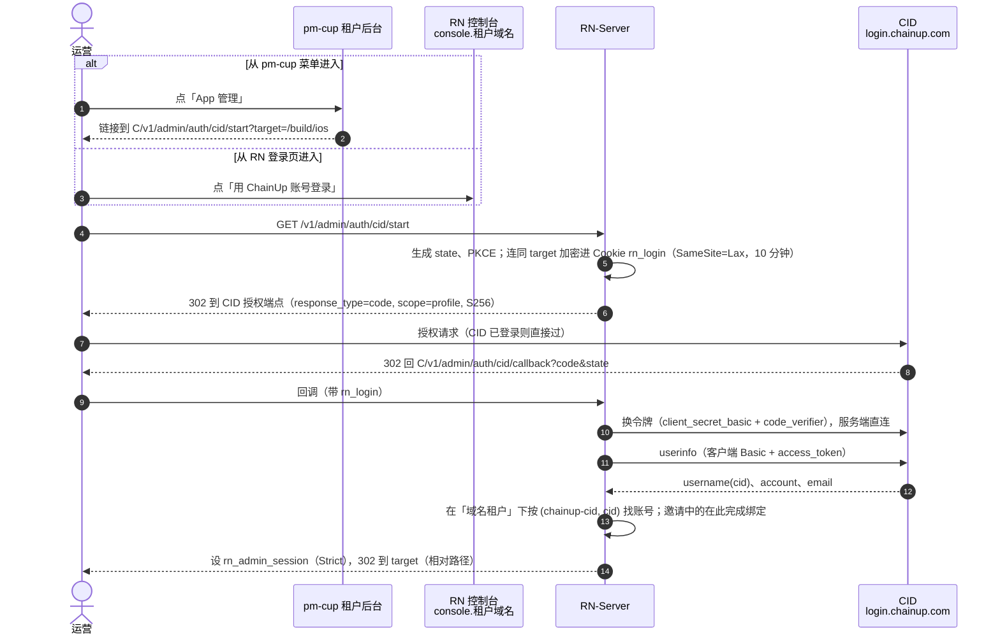

# 租户控制台账号与统一认证（ChainUp 认证中心）（2026-09-25）

## 0. 结论

背景：

- RN 控制台要有租户账号。这是签名材料、推送凭据改由租户自己交的前提，见 `ios-tenant-owned-signing-material-2026-09-25.md`。
- 用户要求以后和预测市场平台 **pm-cup2026 的租户端**打通，建议用单点登录。
- 用户又指出：`/home/ubuntu/fy/work/web3-rwa` 已经集成了公司的「统一认证」。问能不能把它作为认证服务端，让 pm-cup、RN 与 web3-rwa 一样，作为统一认证下的子业务接入。

结论：**可以，推荐这样做。** 它比初稿里「pm-cup 自己当 OIDC 身份提供方」更合适（初稿的比较留在 §2）。

1. **那个平台是公司自研的 ChainUp 认证中心（下称 CID）**：
   - 生产环境 `login.chainup.com`，测试环境 `auth-server.dw2nn.com`；
   - web3-rwa 的**商户后台**已经这样接了：一个应用登记、按域名区分商户、权限在本地；
   - 这套模型和 RN、pm-cup「按域名分租户、权限在本地」完全一致。
2. **好处**：
   - pm-cup 不用自己造一个身份提供方，只要像 web3-rwa 一样接 CID；
   - RN 不再依赖 pm-cup 登录的安全度：pm-cup 那几处登录问题（§8）仍该修，但不再是 RN 的前提；
   - 一个运营用一个账号走 RN、pm-cup、web3-rwa；
   - CID 是公司已有、有人运维的服务，以后别的产品也能接；
   - anyfun 这类不接预测平台的租户，同样可以用 CID 登录。
3. **它不是 OIDC，只能回答「这个人是谁」**：
   - 协议是 OAuth2 授权码 + PKCE，scope 只有 `profile`，没有 id_token 和 JWKS；
   - RN 后端拿授权码换 access token，再调 userinfo，得到 `username`（即 cid）、`account`、`email`；
   - 由此带来三点：
     - **租户归属与角色由各系统自己管**：RN 本地维护「哪个 cid 是哪个租户的什么角色」，与 web3-rwa 的 `tenant_admin(tenant_id, cid)` 同一个做法；
     - **不自动开户**：先由管理员添加成员，被邀请人第一次用 CID 登录时完成绑定；
     - **敏感操作用 RN 自己的 TOTP 再验证**：CID 不告诉我们对方登录时用了几个因素、何时登录的。
4. **RN 与 pm-cup 的租户对应不经过 CID**。同一个人在两边各自被授权；RN 对 pm-cup 的业务数据关联仍用 `services.predict.scopeId`，登录不用它。
5. **要认证中心团队给几样东西、答几个问题**（§6）。最关键的三件：
   - 给 RN、pm-cup 各登记一个应用；
   - 一个应用能配多个控制台域名；
   - 「按域名放行」要不要逐人绑定，能不能给 RN 一个只管本应用的受限凭据。
6. **RN 本地账号只作应急入口**：每个租户一个，由平台建，强制 TOTP；CID 不可用时还能进。账号模型、授权改造不依赖 CID，可以先做（阶段 S0）。

## 1. 现状

| | RN 控制台 | pm-cup2026 租户端 | web3-rwa 商户后台 |
| --- | --- | --- | --- |
| 账号 | 只有一个：环境变量 `ADMIN_USERNAME`，同时是平台管理员（`server.go:709`） | `tenant_admin(tenant_id, email)`，bcrypt 口令（`schema.sql:363-381`） | `tenant_admin(tenant_id, cid)`，**登录交给 CID**，查不到本地记录就 401（`TenantFilter.java:63-81`） |
| 登录 | 用户名 + 口令 | 口令 + 人机验证 → 临时令牌 → 邮件验证码（`service/auth.go:159-400`） | CID：OAuth2 授权码 + PKCE（`SecurityConfig.java:116-152`） |
| 会话 | 服务端会话表；Cookie HttpOnly、SameSite=Strict、Path=/v1/admin（`server.go:725`） | HS256 JWT 存 localStorage，无吊销 | Redis 会话 |
| 权限 | 只分平台 / 非平台，按用户名判（`chain_scan_admin.go:26-48`） | 角色 → 菜单 → 权限码 | 本地 `role_ids` → 权限码 |
| 租户解析 | 按 Host | 按前端塞的 `X-Tenant-Domain` 头（经 Next rewrite 转发，后端看不到原始 Host） | 按域名 |

CID 的能力（从 web3-rwa 与 `authorization-java-sdk` 看到的；服务端源码不在本机）：

- 端点：
  - 授权 `…/auth/v1/oauth/authorize`，支持 `{baseHost}` 占位符，疑似能按租户域名白标；
  - 换令牌 `…/auth/v1/oauth/token`，客户端认证方式 `client_secret_basic`；
  - userinfo `…/internal/v1/userinfo`：用客户端 Basic 认证 + 表单里的 access_token，不是标准的 Bearer；
  - 登出 `…/auth/v1/logout?back=`（`oauth-sdk-application.yml:18,42-48`）。
- 应用登记：`/admin/v1/applications {clientName, domain}` 返回 client_id / secret。
- 按域名放行：`/admin/v1/applications/{name}/bind-domains [{account, domains}]`，给每个人推一份允许登录的域名。
  web3-rwa 默认绑「租户主域名 + `console.` 前缀」（`TenantDomainServiceImpl.java:170-224`）。
- 管理接口（建用户、绑域名）用的是一个**能管所有应用和所有用户的超级账号**（`BaseController.java:32-42`）。
- 看不到的：二次验证、登录时间 / 认证方式的回传、后台登出通知、SLA。

## 2. 方案比较

| 方案 | 结论 | 理由 |
| --- | --- | --- |
| **CID 作统一认证，RN、pm-cup、web3-rwa 都是子业务** | **推荐** | 公司已有、有人运维；模型与三个系统一致；pm-cup 改动最小；RN 不再受 pm-cup 登录安全度牵连 |
| pm-cup 租户端作 OIDC 身份提供方（初稿方案） | 不再推荐 | pm-cup 要新建整套 OP 端点，还要先修登录漏洞；OP 拿不到可信的原始主机名（经 Next rewrite 转发）；pm-cup 平台运维能改任何租户管理员的邮箱和口令（`tenant_ext.go:686,738`），等于能进任何租户的 RN 控制台 |
| 另起独立身份平台（Keycloak / Zitadel / Logto 等） | 不采用 | 公司已有 CID，再起一套是重复建设 |
| 共享 Cookie / 自定义签名跳转 / SAML | 不采用 | 域名不同、非标准或太重（初稿已比较） |

CID 不是 OIDC 的代价：
- RN 要写一段 OAuth2 + CID userinfo 的接入代码（Go，没有现成 SDK，用 `golang.org/x/oauth2` 加一次自定义 userinfo 调用）；
- 拿不到签名的身份令牌，身份靠「后端直连 CID 换令牌、查 userinfo」来保证。这是机密客户端的标准做法，令牌不经过浏览器。

以后 CID 如果支持 OIDC，RN 换成标准 OIDC 即可，账号模型不变。

## 3. RN 租户账号

### 3.1 复用映射

| 初稿里拟新增 | 处理 | 理由 |
| --- | --- | --- |
| `tenant_admin_accounts` 租户账号表 | **新建** | 「控制台上的人」是新实体：一个租户多个人，登录时要按 (租户, cid) 查找，有状态、角色、邀请；`app_configs` 一键一行的 JSON 承载不了按人查找与唯一约束 |
| `tenant_admin_identities` 外部身份表 | **取消，合并进账号表** | 一个账号只绑一个外部身份，两列（`idp`、`idp_subject`）加唯一键即可 |
| 邀请表 | **取消，合并进账号表** | 邀请就是「还没绑定的账号」：`status=invited` + 邀请码摘要 + 过期时间 |
| 登录流程临时状态表（state、PKCE） | **取消，用加密 Cookie** | 10 分钟、一次性、只有发起它的浏览器用；用 `secretbox` 加密后放进 Cookie，不落库 |
| CID 客户端配置 | **复用 `app_configs`**，`tenant_id=0`、键 `auth.cid` | 平台级一份，secret 用 `secretbox` 加密 |
| 每租户登录方式 | **复用 `app_configs`**，键 `auth.login` | 租户级配置，一键一行 |
| 会话 | **复用 `admin_sessions`**，加列 | 见 §3.3 |
| 审计 | **复用 `audit_events`** | actor 用 `tenant:<租户id>:<账号id>` |

### 3.2 账号表（草案）

```sql
CREATE TABLE tenant_admin_accounts (
  id BIGINT UNSIGNED NOT NULL AUTO_INCREMENT COMMENT '账号主键；审计 actor 用它，不用显示名',
  tenant_id BIGINT UNSIGNED NOT NULL COMMENT '所属租户 tenants.id；一个账号只属于一个租户',
  role VARCHAR(16) NOT NULL COMMENT 'admin=租户范围内可写；viewer=按只读白名单访问',
  display_name VARCHAR(120) NOT NULL COMMENT '显示名，添加成员时填写，仅用于界面',
  email VARCHAR(255) NOT NULL COMMENT '添加成员时填写的邮箱，用于发邀请与界面显示；不作登录依据、不唯一',
  idp VARCHAR(32) NULL COMMENT '外部身份源：chainup-cid；NULL=未绑定（邀请中）或本地应急账号',
  idp_subject VARCHAR(120) NULL COMMENT 'CID userinfo 的 username（cid）；绑定后不变',
  status VARCHAR(16) NOT NULL COMMENT 'invited=已邀请未绑定；active=可登录；disabled=已停用（会话立即失效）',
  invite_token_hash CHAR(64) NULL COMMENT '邀请码 SHA-256；绑定或过期后置 NULL',
  invite_expires_at DATETIME(3) NULL COMMENT '邀请过期时间（UTC）；NULL=没有待用的邀请',
  password_hash VARCHAR(255) NULL COMMENT '仅本地应急账号：scrypt；CID 账号为 NULL',
  totp_secret_enc VARBINARY(255) NULL COMMENT 'TOTP 密钥（secretbox 加密）；NULL=尚未登记，首次登录强制登记',
  created_by VARCHAR(120) NOT NULL COMMENT '添加人 actor',
  created_at DATETIME(3) NOT NULL COMMENT '创建时间（UTC）',
  last_login_at DATETIME(3) NULL COMMENT '最近登录时间（UTC）；NULL=从未登录',
  PRIMARY KEY (id),
  UNIQUE KEY uq_account_idp (tenant_id, idp, idp_subject),
  KEY ix_account_tenant (tenant_id, status)
) ENGINE=InnoDB COMMENT='租户控制台账号：平台或租户 admin 添加，RN-Server 登录与授权时读';
```

- 唯一键是 (租户, idp, subject)：同一个 cid 可以分别是 anyfun 和 predict 的成员，各算一个账号、各有角色。
- 不以 email 作用户名或唯一键：pm-cup 与 CID 的 email 都能改，拿它当身份会接错人。
- 平台管理员照旧是环境变量里那一个，不进这张表。

### 3.3 会话与授权

- `admin_sessions` 加列：
  - `role`（platform / tenant）；
  - `tenant_id`（平台会话为 NULL）；
  - `account_id`；
  - `auth_method`（local / cid）；
  - `second_factor_at`：最近一次在 RN 输入 TOTP 的时间，§4.5 用。
- **平台权限按会话角色判**：条件是 `role=platform 且 tenant_id IS NULL`，不再按用户名。
- **租户校验**：在 `current` 路由组里、`domainTenantScope` 之后加中间件（`server.go:337-338`），要求会话租户等于域名租户，否则 403。
- `authenticate()` 每次请求都查账号状态：停用立即生效。
- **viewer 按路由白名单放行，不是「只许 GET」**：有几个 GET 会给出敏感东西，不在白名单里：
  - 导出签名密钥密文（`server.go:471`）；
  - 下载签名后的 .ipa（`:438`）；
  - 原始诊断日志（`:368`）；
  - 钱包用户（`:372-373`）。
- Origin：现在任何租户域名都算可信（`server.go:604-633`），改成 Origin 所属租户必须与 Host 的租户相同。
- 会话时长沿用现在的 8 小时（`config.go:124` 默认 28800 秒），另加 1 小时空闲超时。

### 3.4 开放之前要审的现有租户接口

- `GET /v1/admin/ios/delivery` 返回同 Team 其它租户的 slug（`ios_delivery.go:330,343`）→ 改为只返回布尔值。
- 任务视图带打包机名字 → 对租户只显示机器类型。
- `repoDirectory`（`build_config.go:190-245`）→ 收归平台管理员。
- `release.ios` 的 bundle id 跨租户不唯一 → 保存时拒绝别的租户已经在用的。
- `services.predict.scopeId` 现在租户能改（`PATCH /app-config`，`server.go:1366-1379`），服务端保存时只校验格式，回读核对只在可选的「测试连接」里做 → 收归平台管理员，或者保存时强制回读。
- 推送凭据的租户视图带出平台那一行的字段，「测试」会改写平台那一行（见签名材料设计 §5）。
- 其余接口逐个过一遍，结论记进实现 PR。

### 3.5 控制台

- **登录页**：主按钮「用 ChainUp 账号登录」；另有一个不显眼的「应急登录」（本地账号）。
- **成员页（租户 admin 与平台管理员可见）**：
  - 添加成员：填显示名、邮箱、角色，生成邀请链接；
  - 停用、改角色、重发邀请；
  - 列表显示绑定状态和最近登录时间。
  - 租户 admin 能不能加别的 admin，见 §9 待定问题。
- **平台维护**：
  - CID 客户端配置；
  - 每个租户的登录方式；
  - 建、重置本租户的应急账号。
- **右上角**：显示当前账号、角色、所属租户。

## 4. 接入 CID

### 4.1 流程



从 pm-cup 进来就是一个普通链接。两边共用 CID 的登录状态，所以用户无感。不需要 OIDC 的「第三方发起登录」，也不需要 pm-cup 给 RN 传任何令牌。

### 4.2 回调与 Cookie 的细节

- **回调地址**：`https://console.<租户域名>/v1/admin/auth/cid/callback`，按租户域名各一个，都要在 CID 登记（§6 第 1 条）。
  nginx 把 console.* 的 `/v1/` 转给 RN-Server 时，Host 已改写成 api.*（`nginx-rn-foundation.conf:25-30`）。所以回调地址不从 Host 拼，而是取本租户登记的控制台域名。
- **只能从 console.* 发起**：
  - 后端分不清请求来自 console.* 还是 api.*（两者到后端时 Host 一样）；
  - 如果从 api.* 进入 start，`rn_login` 会设在 api.* 上，回调必然失败；
  - 解决：nginx 的 api.* 站点屏蔽 `/v1/admin/auth/cid/`。这要改 amos 上的 nginx，交给用户执行脚本。
- **Cookie**：
  - `rn_login` 是 HttpOnly、Secure、Path=/v1/admin/auth/cid，**SameSite=Lax**。从 CID 跳回是跨站的顶层导航，Strict 的 Cookie 带不过来；
  - 授权请求固定 `response_mode=query`（CID 若用 form_post，Lax 也带不过来）；
  - Cookie 名按 state 区分（`rn_login_<state 前 8 位>`），多个标签页同时登录不会互相覆盖；
  - 会话 Cookie 仍是 Strict：回调响应本身就能设下它（顶层导航的响应可以设任何 SameSite 的 Cookie），之后控制台页面的请求是同站的，照常带上。
- **跳转地址**：
  - `target` 只收本控制台的相对路径，拒绝以 `//`、`/\`、`/v1/` 开头的值；
  - 登录后与登出后的跳转一律用相对路径或登记的控制台域名，不用 `externalOrigin`——它拼出来的是 api.*（`server.go:344-348`）。
- **令牌**：access token 用完即弃，不存、不下发浏览器；userinfo 返回的 `username` 为空或格式不对就拒绝。

### 4.3 成员的添加、绑定与移除

- **添加**：
  - 平台管理员或租户 admin 在成员页填邮箱、角色，RN 生成一次性邀请链接（24 小时，只存摘要），通过邮件或别的渠道发给本人；
  - 被邀请人点链接 → 用 CID 登录 → 回调时 RN 把这个 cid 绑到该账号，状态变 active；
  - 邀请链接本身就是授权凭据。
  - 如果 CID 确认 userinfo 的 email 经过验证，绑定时再要求 email 一致（§6 第 3 条）。
- **按域名放行**：如果 CID 要求逐人绑定域名才能登录，有两种办法：
  1. 首选：CID 给 RN 应用一个只能管本应用用户与域名的受限凭据，RN 在绑定时自动调用；
  2. 否则：由平台管理员在 CID（或 web3-rwa 平台控制台的「统一认证」页）手工绑定。
  - 不论哪种，**RN 都不持有那个能管所有应用的超级账号**。
- **不自动开户**：用 CID 登录、但在这个租户下没有账号的人，一律拒绝，提示「请联系管理员添加」。
  - 在 CID 那边换了账号（cid 变了）的人，要重新邀请；
  - 在 RN 停用的人，换个 cid 也进不来。
- **移除**：在 RN 停用立即生效，因为每次请求都查账号状态；CID 那边停用，下次登录就进不来。

### 4.4 登出

删 RN 会话，然后跳到 CID 的 `…/auth/v1/logout?back=https://console.<租户域名>/`，CID 那边一起退出。
没有后台登出通知时，别的系统（pm-cup）的会话不受影响；这是 CID 的现状，§6 第 5 条问。

### 4.5 敏感操作再验证（RN 自己的 TOTP）

以下操作的后果比「看」大得多：

- 上传或删除签名材料、推送凭据、App Manager Key；
- 切换交付方式；
- 发版、热更新放量或回滚；
- 成员与角色管理。

CID 不回传登录时间和认证方式，所以 RN 自己做二次验证：

- 每个租户账号第一次登录时必须在 RN 登记 TOTP；
- 做敏感操作时，`second_factor_at` 必须在 15 分钟以内，否则弹框输验证码。

这样即便 CID 某个账号的口令泄露，也做不了敏感操作。以后 CID 如果能强制二次验证并回传认证时间，再考虑放宽。

## 5. pm-cup 那边要做的（交给对方团队）

- 像 web3-rwa 一样接 CID：
  - 在 CID 登记一个应用；
  - `tenant_admin` 加 `cid` 列，登录改走 CID（Go 端没有 SDK，用 `golang.org/x/oauth2` 加 userinfo 调用）；
  - 角色与权限照旧在本地。
- 菜单里加「App 管理」，链接到对应 RN 控制台的 `/v1/admin/auth/cid/start?target=…`。
- 不需要做 OIDC 身份提供方，不需要给 RN 签任何令牌。

## 6. 要认证中心团队给的、要确认的

1. **登记应用**：
   - 给 RN、pm-cup 各登记一个应用，发 client_id / secret；
   - RN 每个租户一个控制台域名（console.anyfun.win、predict 的控制台域名……），一个应用能否配多个域名？回调地址怎么校验？以后加租户怎么加？
2. **按域名放行**：`bind-domains` 是否每个用户都必须绑？能否给 RN 应用一个**只能管本应用用户与域名**的受限凭据，而不是全局超级账号？
3. **身份字段**：
   - userinfo 的 `username`（cid）是否永久不变、不复用？
   - `email` 是否经过验证？
4. **二次验证**：CID 有没有 TOTP 等二次验证，能否对某个应用强制？能否强制重新登录，并回传登录时间？
5. **会话与登出**：CID 的会话多长？有没有后台登出通知？账号停用后，已发出的 access token 是否立即失效？
6. **路线**：有没有支持 OIDC（id_token、JWKS、discovery）的计划？
7. **品牌**：商户运营看到的是 ChainUp 登录页，能否按租户域名白标（SDK 的 `{baseHost}` 占位符）？
8. **可用性**：CID 的可用性与限流是多少？CID 出故障时，所有接入的系统都登不进，RN 为此保留应急账号。
9. **测试环境**：能否在 `auth-server.dw2nn.com` 给 RN 登记一个测试应用，用来联调？

## 7. 安全

| 威胁 | 对策 |
| --- | --- |
| CID 某个账号口令泄露 | 在 RN 没被添加为成员的人进不来；敏感操作要 RN 自己的 TOTP；会话 8 小时 + 1 小时空闲超时 |
| CID 本身被攻破 | 攻击者能冒充任何 cid 登录 RN，但敏感操作仍要 RN 本地的 TOTP；可以按租户关掉 CID 登录、只留应急账号 |
| 授权码被截获、重放 | PKCE + 加密 Cookie 里的 state；换令牌只在服务端、带客户端凭据；回调地址在 CID 登记 |
| 登录 CSRF（把受害者登成攻击者的账号） | state 绑在发起时的 `rn_login` Cookie 上 |
| 开放跳转 | `target` 只收相对路径，并拒绝 `//`、`/\`、`/v1/` 开头 |
| 从 api.* 发起导致 Cookie 错域 | nginx 的 api.* 站点屏蔽 `/v1/admin/auth/cid/` |
| 邀请链接泄露 | 24 小时过期、一次性、只存摘要；CID 确认 email 已验证时再加 email 比对；绑定后控制台通知租户 admin |
| 租户账号冒充平台 | 平台权限按会话角色判 |
| 跨租户越权 | `domainTenantScope` 之后校验会话租户；Origin 绑定到同一租户；唯一键含租户 |
| viewer 拿到敏感导出 | 按路由白名单放行 |
| CID 不可用 | 每个租户一个平台建的应急本地账号，强制 TOTP |

## 8. 顺带发现的别的仓库的安全问题（要转给对应团队）

只读代码看到，没有实测，也没读任何机密的值：

- **pm-cup2026**：
  - 输完口令拿到的临时令牌（ltemp）能直接调受保护的接口，**邮件验证码形同虚设**。已由两次独立阅读确认，没有别处挡住：
    - `token.Parse` 不查类型（`token.go:41-66`）；
    - `RoutePermission` 不看 `Type`（`permission.go:98-133`）；
    - 白名单只有登录接口（`config.yaml:352-360`）；
    - 临时令牌有效 30 分钟（`config.yaml:64`）。
  - 私钥 `gamma-jwt-private.pem` 与 `services/*/k8s/dev/secret.yaml` 在 git 里；
  - 固定验证码能用配置或 `OTP_FIXED_CODE` 环境变量打开（`config.go:849`）；
  - 全局 CORS 为 `*`；
  - 租户由前端塞的请求头决定，查不到时回落到租户 1（`handlers/tenant.go:26-35`）。
- **web3-rwa**：
  - 6 个 Java 文件的注释里有明文 Basic 凭据；
  - 6 个 yml 里提交了 client-secret；
  - 管理接口用的是能管所有应用和用户的超级账号。

## 9. 分阶段

| 阶段 | 内容 | 谁做 | 依赖 |
| --- | --- | --- | --- |
| S0 | 账号表、会话加列、平台权限按角色、租户校验、viewer 白名单、Origin 绑定、§3.4 接口审计、本地应急账号 + TOTP、成员页（先只能建应急账号） | 我们 | 无，先做；签名材料设计的阶段 1 就是它 |
| S1 | 登记应用、回答 §6 | CID 团队 | 要有人去对接 |
| S2 | CID 登录（start / callback / userinfo）、邀请与绑定、敏感操作 TOTP 再验证、登出联动、nginx 屏蔽 api.* 上的登录路径 | 我们 | S0、S1 的测试应用 |
| S3 | pm-cup 接 CID、菜单入口 | pm-cup 团队 | S1 |
| S4 | 测试环境联调 → 生产上线（先 predict、再 anyfun） | 各方 | S2、S3 |

## 10. 要用户决定的

1. 确认用 CID 作统一认证（推荐）。
2. 谁去对接认证中心团队（§6），谁把 §8 的安全问题转给 pm-cup 与 web3-rwa 团队？
3. 成员由谁添加：只由平台管理员加，还是租户 admin 也能加人？（推荐：租户 admin 能加 viewer，加 admin 要平台管理员）
4. 角色先只分 `admin` / `viewer`，够不够？
5. 应急账号每个租户一个、平台建、强制 TOTP——这样可以吗？

## 11. 不做的

- 不让 pm-cup 做身份提供方，也不自建身份平台。
- RN 不持有 CID 的全局超级管理账号。
- 不按 email 自动开户、自动合并账号。
- 不在 RN 里做找回口令：应急账号由平台管理员重置。
- 不调 pm-cup 的业务接口，不读 pm-cup、web3-rwa 的数据库。

## 12. 评审记录

- 初稿（pm-cup 作 OIDC 身份提供方）写完后，做了一轮只读评审。其中协议细节（azp、amr、private_key_jwt、Back-Channel Logout 等）随改用 CID 不再适用。
- 仍然适用、已并入本文的：
  - Strict 会话 Cookie 能在回调响应里设下；
  - 临时 Cookie 要用 Lax，并固定 `response_mode=query`；
  - 从 api.* 发起时 Cookie 会错域；
  - 跳转不能用 `externalOrigin`；
  - `target` 的校验规则；
  - viewer 要按路由白名单放行；
  - 用户名与唯一键不用 email（pm-cup 的 email 可改，`admin.go:124`）；
  - `scopeId` 是租户可改的、保存时并不回读；
  - 新表要给复用映射表。
- 改用 CID 的依据：2026-09-25 对 `/home/ubuntu/fy/work/web3-rwa` 的只读调研。已抽查确认以下几条：
  - scope 只有 `profile`（`chainup-tenant/src/main/resources/application.yml:39-40`）；
  - userinfo 只取 email、cid、account（`AuthenticationUserInfoService.java:23-25`）；
  - 本地按 (tenant_id, cid) 判租户（`TenantFilter.java:63-117`）；
  - `bind-domains` 的请求形状（`AdminEndpoint.java:47-53`）。
